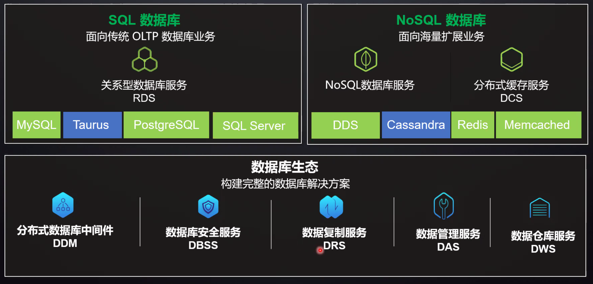
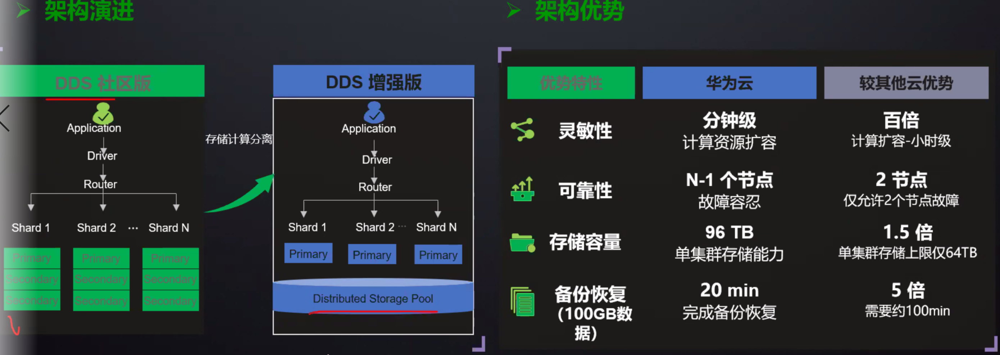
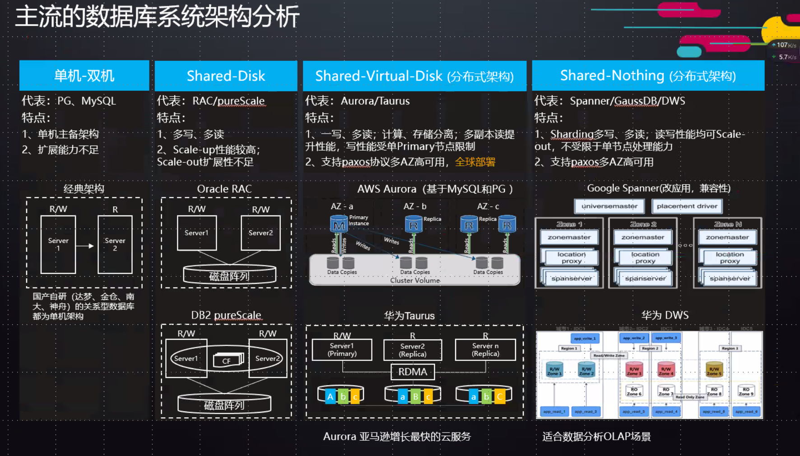

# 数据库中间件

业界基于数据库中间件衍生的云服务



关键服务简介：
- 分布式数据库中间件（Distributed Database Middleware，简称DDM），专注于解决数据库分布式扩展问题，突破了传统数据库的容量和性能瓶颈，实现**海量数据高并发访问**。
- 数据库安全服务（Database Security Service）是一个智能的数据库安全防护服务，基于反向代理及机器学习机制，提供敏感数据发现、数据脱敏、数据库审计和防注入攻击等功能，保障云上数据库的安全。(主要能力：监控，安全扫描，通过机器学习识别常见数据库攻击手段；生成合规的安全报告等等)。
- 数据复制服务（Data Replication Service，简称为DRS）是一种易用、稳定、高效，用于**数据库在线迁移和数据库实时同步**的云服务。DRS围绕云数据库，降低了数据库之间数据流通的复杂性，有效地帮助您减少数据传输的成本。
- 数据管理服务（Data Admin Service，简称DAS），是一种提供可视化的管理数据库的服务，包括执行SQL、高级数据库管理、智能化运维等功能，旨在帮助云用户易用、安全、智能的管理数据库
- 数据仓库服务 DWS, 实时、简单、安全可信的企业级融合数据仓库，可借助DWS Express将查询分析扩展至数据湖。
- 文档数据库服务（Document Database Service）完全兼容MongoDB协议，提供安全、高可用、高可靠、弹性伸缩和易用的数据库服务，同时提供一键部署、弹性扩容、容灾、备份、恢复、监控和告警等功能。


业界常见中间件
- MySQL
- Taurus
- PostgreSQL
- SQL Server
- DDS
- Cassandra
- Redis
- Memcached

文档数据库服务的常见交付形式



主流数据库系统架构分析




# SQL与NOSQL

## 1. 关系型数据库
### 1.1 什么是关系型数据库

关系数据库（Relational database），是创建在关系模型基础上的数据库，借助于集合代数等数学概念和方法来处理数据库中的数据。现实世界中的各种实体以及实体之间的各种联系均用关系模型来表示。

- 数据库：包括一个或多个表
- 表（关系 Relation）：是以列和行的形式组织起来的数据的集合
- 列（属性 Attribute）：在数据库中经常被称为字段
- 行（值组 Tuple）：在数据库中经常被称为记录

我们可以理解为：关系型数据库，是指采用了关系模型来组织数据的数据库。

例如，可能有一个有关作者信息的名为 authors 的表（关系 Relation）。每列（值组 Tuple）都包含特定类型的信息，如作者的姓氏。每行（属性 Attribute）都包含有关特定作者的所有信息：姓、名、住址等等。

在关系型数据库当中一个表就是一个关系，一个关系数据库可以包含多个表。

关系型数据库的主要代表：SQL Server，Oracle，MySQL，PostgreSQL。

### 1.2 关系型数据库优点

- 事务一致性：通过事务处理保持数据的一致性
- 复杂查询：支持SQL，可以进行 JOIN 等复杂查询
- 容易理解：二维表结构是非常贴近逻辑世界的一个概念，关系模型相对网状、层次等其他模型来说更容易理解
- 使用方便：通用的 SQL 语言使得操作关系型数据库非常方便
- 易于维护：丰富的完整性(实体完整性、参照完整性和用户定义的完整性)大大减低了数据冗余和数据不一致的概率

### 1.3 关系型数据库缺点

- 读写性能：在数据量达到一定规模时，由于关系型数据库的系统逻辑非常复杂，为了维护一致性，使得其非常容易发生死锁等的并发问题，所以导致其读写速度下滑非常严重
- 表结构更新：表结构可以在被定义之后更新，但是如果有比较大的结构变更的话就会变得比较复杂
- 高并发：网站的用户并发性非常高，往往达到每秒上万次读写请求，对于传统关系型数据库来说，硬盘I/O是一个很大的瓶颈
- 海量数据：对于关系型数据库来说，在一张包含海量数据的表中查询，效率是非常低的

## 2. 非关系型数据库
### 2.1 什么是非关系型数据库

非关系型数据库（NoSQL）是对不同于传统的关系数据库的数据库管理系统的统称。

当代典型的关系数据库在一些数据敏感的应用中表现了糟糕的性能，例如为巨量文档创建索引、高流量网站的网页服务，以及发送流式媒体。关系型数据库的典型实现主要被调整用于执行规模小而读写频繁，或者大批量极少写访问的事务。

NoSQL 的结构通常提供弱一致性的保证，如最终一致性，或交易仅限于单个的数据项。

NoSQL 提出另一种理念，例如，以键值对存储，且结构不固定，每一个元组可以有不一样的字段，每个元组可以根据需要增加一些自己的键值对，这样就不会局限于固定的结构，可以减少一些时间和空间的开销。

NoSQL 与 SQL 存在许多显著的不同点，其中最重要的是 NoSQL 不使用 SQL 作为查询语言。其数据存储可以不需要固定的表格模式，也经常会避免使用 SQL 的 JOIN 操作，一般有水平可扩展性的特征。

非关系型数据库包括：

- 临时性键值存储：memcached、Redis=
- 永久性键值存储：ROMA、Redis
- 面向文档的数据库：MongoDB、CouchDB
- 面向列的数据库：Cassandra、HBase

主要代表：MongoDB，Redis，CouchDB

## 2.2 非关系型数据库分类

由于非关系型数据库本身天然的多样性，以及出现的时间较短，相比关系型数据库，非关系型数据库非常多，并且大部分都是开源的。

- 非关系型数据库严格上不是一种数据库，应该是一种数据结构化存储方法的集合。依据结构化方法以及应用场合的不同，主要分为以下几类：

- 面向高性能并发读写的 key-value 数据库：key-value数据库的主要特点即使具有极高的并发读写性能，Redis，Tokyo Cabinet，Flare 就是这类的代表
- 面向海量数据访问的面向文档数据库：这类数据库的特点是，可以在海量的数据中快速的查询数据，典型代表为 MongoDB 以及 CouchDB
- 面向可扩展性的分布式数据库：这类数据库想解决的问题就是传统数据库存在可扩展性上的缺陷，这类数据库可以适应数据量的增加以及数据结构的变化
### 2.3 非关系型数据库优点

非关系型数据库的出现，多是源于关系型数据库的性能不足，故非关系型数据库的优点也很明显：

- 读写性能：无需经过 SQL 层的解析，读写性能很高。主要例子有Redis，由于其逻辑简单，而且纯内存操作，使得其性能非常出色，单节点每秒可以处理超过10万次读写操作；
- 简单的扩展：基于键值对，数据没有耦合性，容易扩展。典型例子是 Cassandra，由于其架构是类似于经典的 P2P，所以能通过轻松地添加新的节点来扩展这个集群；
- 存储格式多：支持key-value形式、文档形式、图片形式，而关系型数据库则只支持基础类型；
- 低廉的成本：这是大多数分布式数据库共有的特点，因为主要都是开源软件，没有昂贵的License成本；

### 2.4 非关系型数据库缺点

- 不提供对 SQL 的支持：如果不支持 SQL 这样的工业标准，将会对用户产生一定的学习和应用迁移成本
- 支持的特性不够丰富：现有产品所提供的功能都比较有限，大多数 NoSQL 数据库都不支持事务，也不像 MS SQL Server 和 Oracle 那样能提供各种附加功能，比如 BI 和报表等
- 现有产品的不够成熟：大多数产品都还处于初创期，和关系型数据库几十年的完善不可同日而语

## 3. 关系型数据库与 NoSQL
### 3.1 NoSQL 使用场景

并不是任何场景，NoSQL 都要优于关系型数据库。NoSQL 使用场景常见如下：

- 数据库表 schema 经常变化<br>
比如在线商城，维护产品的属性经常要增加字段，这就意味着 ORMapping 层的代码和配置要改，如果该表的数据量过百万，新增字段会带来额外开销（重建索引等）。
- 数据库表字段是复杂数据类型<br>
对于复杂数据类型，比如 SQL Sever 提供了可扩展性的支持，像 xml 类型的字段。DB 层对 xml 字段很难建高效索引，应用层又要做从字符流到 dom 的解析转换。NoSQL 以 json 方式存储，提供了原生态的支持，在效率方便远远高于传统关系型数据库。
- 高并发数据库请求<br>
此类应用常见于 web2.0 的网站，很多应用对于数据一致性要求很低，而关系型数据库的事务以及大表 JOIN 反而成了”性能杀手”。
- 海量数据的分布式存储<br>
海量数据的存储如果选用大型商用数据，如 Oracle，那么整个解决方案的成本是非常高的，要花很多钱在软硬件上。NoSQL 分布式存储，可以部署在廉价的硬件上，是一个性价比非常高的解决方案。

### 3.2 NoSQL 和关系数据库结合

一般把 NoSQL 和关系数据库进行结合使用，各取所长，需要使用关系特性的时候我们使用关系数据库，需要使用 NoSQL 特性的时候我们使用 NoSQL 数据库，各得其所。NoSQL 数据库是关系数据库在某些方面（性能，扩展）的一个弥补。

举个简单的例子吧，比如用户评论的存储，评论大概有主键 id、评论的对象 aid、评论内容 content、用户 uid 等字段。我们能确定的是评论内容 content 肯定不会在数据库中用 where content=’’ 查询，评论内容也是一个大文本字段。那么我们可以把主键 id、评论对象 aid、用户 id 存储在数据库，评论内容存储在 NoSQL，这样数据库就节省了存储 content 占用的磁盘空间，从而节省大量 IO，对 content 也更容易做 Cache。

另外，可使用 NoSQL 作为缓存服务器。MySQL + Memcached 的架构中，Memcached 这类内存缓存服务器缓存的数据大小受限于内存大小，如果用 NoSQL 来代替 Memcached 来缓存数据库的话，就可以不再受限于内存大小。虽然可能有少量的磁盘IO读写，可能比 Memcached 慢一点，但是完全可以用来缓存数据库的查询操作。


## 4. 参考

- 维基百科-SQL
- 维基百科-NoSQL
- 为什么使用 NoSQL：NoSQL 与 SQL 的区别
- 关系型数据库和非关系型数据库的特性以及各自的优缺点
- 关系型数据库和非关系型数据库区别、oracle与mysql的区别


## 结束语：

本节主要针对关系型数据库和非关系型数据库的特性和区别，由于在数据库相关的经验还有些缺乏，对于数据库的理解，还有后台存储的设计，以及在不同场景下的方案使用，或许还差的有些远呢。


# 数据库中间件详解

本文详细介绍了中间件，主要从数据库拆分过程及挑战、主流数据库中间件设计方案、读写分离核心要点、分库分表核心要点展开说明。


## 1. 数据库拆分过程及挑战
互联网当下的数据库拆分过程基本遵循的顺序是：垂直拆分、读写分离、分库分表(水平拆分)。每个拆分过程都能解决业务上的一些问题，但同时也面临了一些挑战。

### 1.1 垂直拆分
对于一个刚上线的互联网项目来说，由于前期活跃用户数量并不多，并发量也相对较小，所以此时企业一般都会选择将所有数据存放在一个数据库 中进行访问操作。举例来说，对于一个电商系统，其用户模块和产品模块的表刚开始都是位于一个库中。


其中：user、useraccount表属于用户模块，productcategory、product表属于产品模块。

刚开始，可能公司的技术团队规模比较小，所有的数据都位于一个库中。随着公司业务的发展，技术团队人员也得到了扩张，划分为不同的技术小组，不同的小组负责不同的业务模块。例如A小组负责用户模块，B小组负责产品模块。此时数据库也迎来了第一次拆分：垂直拆分。

这里的垂直拆分，指的是将一个包含了很多表的数据库，根据表的功能的不同，拆分为多个小的数据库，每个库包含部分表。下图演示将上面提到的db_eshop库，拆分为db_user库和db_product库。


通常来说，垂直拆分，都是**根据业务来对一个库中的表进行拆分的**。关于垂直拆分，还有另一种说法，**将一个包含了很多字段的大表拆分为多个小表，每个表包含部分字段**，这种情况在实际开发中基本很少遇到。

垂直拆分的另一个典型应用场景是**服务化(SOA)改造**。在服务化的背景下，除了业务上需要进行拆分，底层的存储也需要进行隔离。 垂直拆分会使得单个用户请求的响应时间变长，原因在于，在单体应用的场景下，所有的业务都可以在一个节点内部完成，而**垂直拆分之后，通常会需要进行RPC调用。然后虽然单个请求的响应时间增加了，但是整个服务的吞吐量确会大大的增加。**

### 1.2 读写分离
随着业务的不断发展，用户数量和并发量不断上升。这时如果仅靠单个数据库实例来支撑所有访问压力,几乎是在 自寻死路 。以产品库为例，可能库中包含了几万种商品，并且每天新增几十种，而产品库每天的访问了可能有几亿甚至几十亿次。数据库读的压力太大，单台mysql实例扛不住，此时大部分 Mysql DBA 就会将数据库设置成 读写分离状态 。也就是一个 Master 节点(主库)对应多个 Salve 节点(从库)。可以将slave节点的数据理解为master节点数据的全量备份。


master节点接收用户的写请求，并写入到本地二进制文件(binary log)中。slave通过一个I/O线程与Master建立连接，发送binlog dump指令。Master会将binlog数据推送给slave，slave将接收到的binlog保存到本地的中继日志(relay log)中，最后，slave通过另一个线程SQL thread应用本地的relay log，将数据同步到slave库中。

关于mysql主从复制，内部包含很多细节。例如binlog 格式分为statement、row和mixed，binlog同步方式又可以划分为：异步、半同步和同步。复制可以基于binlogFile+position，也可以基于GTID。通常，这些都是DBA负责维护的，业务RD无感知。

在DBA将mysql配置成主从复制集群的背景下，开发同学所需要做的工作是：**当更新数据时，应用将数据写入master主库，主库将数据同步给多个slave从库。当查询数据时，应用选择某个slave节点读取数据。**


#### 1.2.1 读写分离的优点
这样通过配置多个slave节点，可以有效的避免过大的访问量对单个库造成的压力。

#### 1.2.1 读写分离的挑战
- 对于DBA而言，多了很多集群运维工作

例如集群搭建、主从切换、从库扩容、缩容等。例如master配置了多个slave节点，如果其中某个slave节点挂了，那么之后的读请求，我们应用将其转发到正常工作的slave节点上。另外，如果新增了slave节点，应用也应该感知到，可以将读请求转发到新的slave节点上。

- 对于开发人员而言

**基本读写分离功能：** 对sql类型进行判断，如果是select等读请求，就走从库，如果是insert、update、delete等写请求，就走主库。

**主从数据同步延迟问题：** 因为数据是从master节点通过网络同步给多个slave节点，因此必然存在延迟。因此有可能出现我们在master节点中已经插入了数据，但是从slave节点却读取不到的问题。**对于一些强一致性的业务场景，要求插入后必须能读取到，因此对于这种情况，我们需要提供一种方式，让读请求也可以走主库，而主库上的数据必然是最新的。**

**事务问题：** 如果一个事务中同时包含了读请求(如select)和写请求(如insert)，如果读请求走从库，写请求走主库，由于跨了多个库，那么本地事务已经无法控制，属于分布式事务的范畴。而分布式事务非常复杂且效率较低。因此对于读写分离，目前主流的做法是，事务中的所有sql统一都走主库，由于只涉及到一个库，本地事务就可以搞定。

**感知集群信息变更：** 如果访问的数据库集群信息变更了，例如主从切换了，写流量就要到新的主库上；又例如增加了从库数量，流量需要可以打到新的从库上；又或者某个从库延迟或者失败率比较高，应该将这个从库进行隔离，读流量尽量打到正常的从库上

### 1.3 分库分表

经过垂直分区后的 Master/Salve 模式完全可以承受住难以想象的高并发访问操作，但是否可以永远 高枕无忧 了？答案是否定的，一旦业务表中的数据量大了，从维护和性能角度来看，无论是任何的 CRUD 操作，对于数据库而言都是一件极其耗费资源的事情。即便设置了索引， 仍然无法掩盖因为数据量过大从而导致的数据库性能下降的事实 ，因此这个时候 Mysql DBA 或许就该对数据库进行 水平分区 （sharding，即分库分表 ）。经过水平分区设置后的业务表，必然能够将原本一张表维护的海量数据分配给 N 个子表进行存储和维护。

水平分表从具体实现上又可以分为3种：只分表、只分库、分库分表，下图展示了这三种情况：


只分表：

将db库中的user表拆分为2个分表，user_0和user_1，这两个表还位于同一个库中。适用场景：如果库中的多个表中只有某张表或者少数表数据量过大，那么只需要针对这些表进行拆分，其他表保持不变。

只分库：

将db库拆分为db_0和db_1两个库，同时在db_0和db_1库中各自新建一个user表，db_0.user表和db_1.user表中各自只存原来的db.user表中的部分数据。

分库分表：

将db库拆分为db_0和db_1两个库，db_0中包含user_0、user_1两个分表，db_1中包含user_2、user_3两个分表。下图演示了在分库分表的情况下，数据是如何拆分的：假设db库的user表中原来有4000W条数据，现在将db库拆分为2个分库db_0和db_1，user表拆分为user_0、user_1、user_2、user_3四个分表，每个分表存储1000W条数据。


#### 1.3.1 分库分表的好处

如果说读写分离实现了数据库读能力的水平扩展，那么分库分表就是实现了写能力的水平扩展。

- 存储能力的水平扩展

在读写分离的情况下，每个集群中的master和slave基本上数据是完全一致的，从存储能力来说，在存在海量数据的情况下，可能由于磁盘空间的限制，无法存储所有的数据。而在分库分表的情况下，我们可以搭建多个mysql主从复制集群，每个集群只存储部分分片的数据，实现存储能力的水平扩展。

- 写能力的水平扩展

在读写分离的情况下，由于每个集群只有一个master，所有的写操作压力都集中在这一个节点上，在写入并发非常高的情况下，这里会成为整个系统的瓶颈。

而在分库分表的情况下，每个分片所属的集群都有一个master节点，都可以执行写入操作，实现写能力的水平扩展。此外减小建立索引开销，降低写操作的锁操作耗时等，都会带来很多显然的好处。

#### 1.3.2 分库分表的挑战

分库分表的挑战主要体现在4个方面：基本的数据库增删改功能，分布式id，分布式事务，动态扩容，下面逐一进行讲述。

- 挑战1：基本的数据库增删改功能

对于开发人员而言，虽然分库分表的，但是其还是希望能和单库单表那样的去操作数据库。例如我们要批量插入四条用户记录，并且希望根据用户的id字段，确定这条记录插入哪个库的哪张表。例如1号记录插入user1表，2号记录插入user2表，3号记录插入user3表，4号记录插入user0表，以此类推。sql如下所示：

这样的sql明显是无法执行的，因为我们已经对库和表进行了拆分,这种sql语法只能操作mysql的单个库和单个表。所以必须将sql改成4条如下所示，然后分别到每个库上去执行。
具体流程可以用下图进行描述：


解释如下：

sql解析：首先对sql进行解析，得到需要插入的四条记录的id字段的值分别为1,2,3,4

sql路由：sql路由包括库路由和表路由。库路由用于确定这条记录应该插入哪个库，表路由用于确定这条记录应该插入哪个表。

sql改写：因为一条记录只能插入到一个库中，而上述批量插入的语法将会在 每个库中都插入四条记录，明显是不合适的，因此需要对sql进行改写，每个库只插入一条记录。

sql执行：一条sql经过改写后变成了多条sql，为了提升效率应该并发的到不同的库上去执行，而不是按照顺序逐一执行

结果集合并：每个sql执行之后，都会有一个执行结果，我们需要对分库分表的结果集进行合并，从而得到一个完整的结果。

- 挑战2：分布式id

在分库分表后，我们不能再使用mysql的自增主键。因为在插入记录的时候，不同的库生成的记录的自增id可能会出现冲突。因此需要有一个全局的id生成器。目前分布式id有很多中方案，其中一个比较轻量级的方案是twitter的snowflake算法。

- 挑战3：分布式事务

分布式事务是分库分表绕不过去的一个坎，因为涉及到了同时更新多个分片数据。例如上面的批量插入记录到四个不同的库，如何保证要么同时成功，要么同时失败。关于分布式事务，mysql支持XA事务，但是效率较低。柔性事务是目前比较主流的方案，柔性事务包括：最大努力通知型、可靠消息最终一致性方案以及TCC两阶段提交。但是无论XA事务还是柔性事务，实现起来都是非常复杂的。

- 挑战4：动态扩容

动态扩容指的是增加分库分表的数量。例如原来的user表拆分到2个库的四张表上。现在我们希望将分库的数量变为4个，分表的数量变为8个。这种情况下一般要伴随着数据迁移。例如在4张表的情况下，id为7的记录，7%4=3，因此这条记录位于user3这张表上。但是现在分表的数量变为了8个，而7%8=0，而user0这张表上根本就没有id=7的这条记录，因此如果不进行数据迁移的话，就会出现记录找不到的情况。本教程后面将会介绍一种在动态扩容时不需要进行数据迁移的方案。

### 1.4 小结

在上面我们已经看到了，读写分离和分库分表带来的好处，但是也面临了极大的挑战。如果由业务开发人员来完成这些工作，难度比较大。因此就有一些公司专门来做一些数据库中间件，对业务开发人员屏蔽底层的繁琐细节，开发人员使用了这些中间件后，不论是读写分离还是分库分表，都可以像操作单库单表那样去操作。

下面，我们将介绍 主流的数据库中间件设计方案和实现。

## 2 主流数据库中间件设计方案

数据库中间件的主要作用是向应用程序开发人员屏蔽读写分离和分库分表面临的挑战，并隐藏底层实现细节，使得开发人员可以像操作单库单表那样去操作数据。在介绍分库分表的主流设计方案前，我们首先回顾一下在单个库的情况下，应用的架构，可以用下图进行描述：


可以看到在操作单库单表的情况下，我们是直接在应用中通过数据连接池(connection pool)与数据库建立连接，进行读写操作。而对于读写分离和分库分表，应用都要操作多个数据库实例，在这种情况下，我们就需要使用到数据库中间件。

### 2.1 设计方案

典型的数据库中间件设计方案有2种：proxy、smart-client。下图演示了这两种方案的架构：


可以看到不论是proxy还是smart-client，底层都操作了多个数据库实例。不论是分库分表，还是读写分离，都是在数据库中间件层面对业务开发同学进行屏蔽。

#### 2.1.1 proxy模式

我们独立部署一个代理服务，这个代理服务背后管理多个数据库实例。而在应用中，我们通过一个普通的数据源(c3p0、druid、dbcp等)与代理服务器建立连接，所有的sql操作语句都是发送给这个代理，由这个代理去操作底层数据库，得到结果并返回给应用。在这种方案下，分库分表和读写分离的逻辑对开发人员是完全透明的。

优点：

1. 多语言支持。也就是说，不论你用的php、java或是其他语言，都可以支持。以mysql数据库为例，如果proxy本身实现了mysql的通信协议，那么你可以就将其看成一个mysql 服务器。mysql官方团队为不同语言提供了不同的客户端却动，如java语言的mysql-connector-java，python语言的mysql-connector-python等等。因此不同语言的开发者都可以使用mysql官方提供的对应的驱动来与这个代理服务器建通信。

2. 对业务开发同学透明。由于可以把proxy当成mysql服务器，理论上业务同学不需要进行太多代码改造，既可以完成接入。

缺点：

1. 实现复杂。因为proxy需要实现被代理的数据库server端的通信协议，实现难度较大。通常我们看到一些proxy模式的数据库中间件，实际上只能代理某一种数据库，如mysql。几乎没有数据库中间件，可以同时代理多种数据库(sqlserver、PostgreSQL、Oracle)。

2. proxy本身需要保证高可用。由于应用本来是直接访问数据库，现在改成了访问proxy，意味着proxy必须保证高可用。否则，数据库没有宕机，proxy挂了，导致数据库无法正常访问，就尴尬了。

3. 租户隔离。可能有多个应用访问proxy代理的底层数据库，必然会对proxy自身的内存、网络、cpu等产生资源竞争，proxy需要需要具备隔离的能力。

#### 2.1.2 smart-client模式

业务代码需要进行一些改造，引入支持读写分离或者分库分表的功能的sdk，这个就是我们的smart-client。通常smart-client是在连接池或者driver的基础上进行了一层封装，smart-client内部与不同的库建立连接。应用程序产生的sql交给smart-client进行处理，其内部对sql进行必要的操作，例如在读写分离情况下，选择走从库还是主库；在分库分表的情况下，进行sql解析、sql改写等操作，然后路由到不同的分库，将得到的结果进行合并，返回给应用。

优点：

1. 实现简单。proxy需要实现数据库的服务端协议，但是smart-client不需要实现客户端通信协议。原因在于，大多数据数据库厂商已经针对不同的语言提供了相应的数据库驱动driver，例如mysql针对java语言提供了mysql-connector-java驱动，针对python提供了mysql-connector-python驱动，客户端的通信协议已经在driver层面做过了。因此smart-client模式的中间件，通常只需要在此基础上进行封装即可。

2. 天然去中心化。smart-client的方式，由于本身以sdk的方式，被应用直接引入，随着应用部署到不同的节点上，且直连数据库，中间不需要有代理层。因此相较于proxy而言，除了网络资源之外，基本上不存在任何其他资源的竞争，也不需要考虑高可用的问题。只要应用的节点没有全部宕机，就可以访问数据库。(这里的高可用是相比proxy而言，数据库本身的高可用还是需要保证的)

缺点：

1. 通常仅支持某一种语言。例如tddl、zebra、sharding-jdbc都是使用java语言开发，因此对于使用其他语言的用户，就无法使用这些中间件。如果其他语言要使用，那么就要开发多语言客户端。

2. 版本升级困难。因为应用使用数据源代理就是引入一个jar包的依赖，在有多个应用都对某个版本的jar包产生依赖时，一旦这个版本有bug，所有的应用都需要升级。而数据库代理升级则相对容易，因为服务是单独部署的，只要升级这个代理服务器，所有连接到这个代理的应用自然也就相当于都升级了。

### 2.2 业界产品

无论是proxy，还是smart-client，二者的作用都是类似的。以下列出了这两种方案目前已有的实现以及各自的优缺点：


proxy实现

目前的已有的实现方案有：
- 阿里巴巴开源的cobar
- 阿里云上的drds
- mycat团队在cobar基础上开发的mycat
- mysql官方提供的mysql-proxy
- 奇虎360在mysql-proxy基础开发的atlas(只支持分表，不支持分库)
- 当当网开源的sharing-sphere

目前除了mycat、sharing-sphere，其他几个开源项目基本已经没有维护，sharing-sphere前一段时间已经进去了Apache 软件基金会孵化器。

smart-client实现

目前的实现方案有：

- 阿里巴巴开源的tddl，已很久没维护
- 大众点评开源的zebra，大众点评的zebra开源版本代码已经很久没有更新，不过最近美团上市，重新开源大量内部新的功能特性，并计划长期维持。
- 当当网开源的sharding-jdbc，目前算是做的比较好的，文档资料比较全。和sharding-sphere一起进入了Apache孵化器。
- 蚂蚁金服的zal
- 等等

## 3 读写分离核心要点

### 3.1 基本路由功能

基本路由路功能主要是解决，在读写分离的情况下，如何实现一些基本的路由功能，这个过程通常可以通过下图进行描述：


#### 3.1.1 sql类型判断

主要是判断出来sql是读还是写sql，将读sql到从库上去执行，写sql去主库上执行

write语句：insert、update、delete、create、alter、truncate…

query语句：select、show、desc、explain…

#### 3.1.2 强制走主库

有的时候，对于一些强一致性的场景，需要写入后，必须能读取到数据。由于主从同步存在延迟，可能会出现主库写入，而从库查不到的情况。这次时候，我们需要使用强制走主库的功能。具体实现上有2种方案：hint 或API

hint，就是开发人员在sql上做一些特殊的标记，数据库中间件识别到这个标记，就知道这个sql需要走主库，如：
```
/*master*/select * from table_xx
```
这里的/\*master\*/就是一个hint，表示需要走主库。不同的数据库中间件强制走主库的hint可能不同，例如zebra的hint为/\*zebra:w+\*/，hint到底是什么样是无所谓的，其作用仅仅就是一个标记而已。之所以将hint写在/\*…\*/中，是因为这是标准的sql注释语法。即使数据库中间件未能识别这个hint，也不会导致sql语法错误。

api：主要是通过代码的方式来添加sql走主库的标识，hint通常只能加在某个sql上。如果我们希望多个sql同时都走主库，也不希望加hint，则可以通过api的方式，其内部主要利用语言的thread local线程上下文特性，如：
```
ForceMasterHelper.forceMaster()    //…执行多条
sqlForceMasterHelper.clear()
```
在api标识范围内执行的sql，都会走主库。具体API到底应该是什么样，如何使用，也是由相应的数据库中间件来决定的。

特别的，对于一些特殊的sql，例如 select last_insert_id；或者select @@identity等，这类sql总是需要走主库。这些sql是要获得最后一个插入记录的id，插入操作只可能发生在主库上。

### 3.2 从库路由策略

通常在一个集群中，只会有一个master，但是有多个slave。当判断是一个读请求时，如何判断选择哪个slave呢？

一些简单的选择策略包括：

- 随机选择(random)
- 按照权重进行选择(weight)
- 或者轮训(round-robin)
- 等

特别的，对于一些跨IDC(数据中心)部署的数据库集群，通常需要有就近路由的策略，如下图：


图中，在IDC2部署了一个master，在IDC1和IDC2各部署了一个slave，应用app部署在IDC1。显然当app接收到一个查询请求时，应该优先查询与其位于同一个数据中心的slave1，而不是跨数据中心去查询slave2，这就是就近路由的概念。

当然一个数据中心内，可能会部署多个slave，也需要进行选择，因此就近路由通常和一些基本的路由策略结合使用。另外，对于就近路由，通常也会有一个层级，例如同机房、同中心、同区域、跨区域等。

### 3.3 HA、Scalable相关

数据库中间件除了需要具备上述提到的读写分离功能来访问底层的数据库集群。也需要一套支持高可用、动态扩展的体系：

- 从HA的角度来说，例如主库宕机了，那么应该从从库选择一个作为新的主库。开源的MHA可以帮助我们完成这个事；然而，MHA只能在主库宕机的情况下，完成主从切换，对于仅仅是一个从库宕机的情况下，MHA通常是无能为力的。因此，通常都会在MHA进行改造，使其支持更多的HA能力要求。
- 从Scalable角度来说，例如读qps实在太高，需要加一些从库，来分担读流量。

事实上，无论是HA，还是Scalable，对于数据库中间件(不论是proxy或者smart-client)来说，只是配置信息发生了变更。

因此，通常我们会将所有的配置变更信息写到一个配置中心，然后配置心中监听这个配置的变更，例如主从切换，只需要把最新的主从信息设置到配置中心；增加从库，把新从库ip、port等信息放到配置中心。数据库中间件通过对这些配置信息变更进行监听，当配置发生变更时，实时的应用最新的配置信息即可。

因此，一个简化的数据库中间件的高可用架构通常如下所示：


监控服务对集群进行监控，当发生变更时，将变更的信息push到配置中心中，数据库中间件(proxy或smart-client)接收到配置变更，应用最新的配置。而整个过程，对于业务代码基本是无感知的。

对于配置中心的选择，有很多，例如百度的disconf、阿里的diamond、点评开源的lion、携程开源的apollo等，也可以使用etcd、consul。通常如果没有历史包袱的话，建议使用携程开源的apollo。

特别需要注意的一点是，通常监控服务监控到集群信息变更，推送到配置中心，再到数据库中间件，必然存在一些延迟。对于一些场景，例如主从切换，没有办法做到彻底的业务无感知。当然，对于多个从库中，某个从库宕机的情况下，是可以做到业务无感知的。例如，某个从库失败，数据库中间件，自动从其他正常的从库进行重试。

另外，上图中的HA方案强依赖于配置中心，如果某个数据库集群上建立了很多库，这个集群发生变更时，将会存在大量的配置信息需要推送。又或者，如果数据库集群是多机房部署的，在某个机房整体宕机的情况下(例如光纤被挖断了，或者机房宕机演练)，也会存在大量的配置信息需要推送。如果配置中心，推送有延迟，业务会有非常明显的感知。

因此，通常我们会在客户端进行一些轻量级的HA保障。例如，根据数据库返回异常的sqlstate和vendor code，判断异常的严重级别，确定数据库实例能否正常提供服务，如果不能正常提供服务，则自动将其进行隔离，并启动异步线程进行检测数据库实例是否恢复。

最后，很多数据库中间件，也会提供一些限流和降级的功能，计算sql的唯一标识(有些称之为sql指纹)，对于一些烂sql，导致数据库压力变大的情况，可以实时的进行拦截，直接抛出异常，不让这些sql打到后端数据库上去。

## 4 分库分表核心要点

从业务开发的角度来说，其不关心底层是否是分库分表了，其还是希望想操作单个数据库实例那样编写sql，那么数据库中间件就需要对其屏蔽所有底层的复杂逻辑。

下图演示了一个数据库表(user表)在分库分表情况下，数据库中间件内部是如何执行一个批量插入sql的：


数据库中间件主要对应用屏蔽了以下过程：

- sql解析：首先对sql进行解析，得到抽象语法树，从语法树中得到一些关键sql信息
- sql路由：sql路由包括库路由和表路由。库路由用于确定这条记录应该操作哪个分库，表路由用于确定这条记录应该操作哪个分表。
- sql改写：将sql改写成正确的执行方式。例如，对于一个批量插入sql，同时插入4条记录。但实际上用户希望4个记录分表存储到一个分表中，那么就要对sql进行改写成4条sql，每个sql都只能插入1条记录。
- sql执行：一条sql经过改写后可能变成了多条sql，为了提升效率应该并发的去执行，而不是按照顺序逐一执行
- 结果集合并：每个sql执行之后，都会有一个执行结果，我们需要对分库分表的结果集进行合并，从而得到一个完整的结果。
### 4.1 SQL解析

用户执行只是一条sql，并传入相关参数。数据库中间件内部需要通过sql解析器，对sql进行解析。可以将sql解析，类比为xml解析，xml解析的最终结果是得到一个document对象，而sql解析最终得到一个抽象语法树(AST)。通过这个语法树，我们可以很简单的获取到sql的一些执行，例如当前执行的sql类型，查询了那些字段，数据库表名，where条件，sql的参数等一系列信息。

通常来说，对于sql解析，内部需要经过词法(lex)解析和语法(Syntax)解析两个阶段，最终得到一个语法树。


SQL解析器的内部实现原理对业务同学是屏蔽的，业务同学也感知不到。一些数据库中间件采用了第三方开源的sql解析器，也有一些自研sql解析器。例如mycat、zebra采用的都是druid解析器，shard-jdbc一开始也用的是druid解析器，后面自研了解析器。目前较为流行的sql解析器包括：

- FoundationDB SQL Parser
- Jsqlparser
- Druid SQL Parser

其中，其中Fdbparser和jsqlparser都是基于javacc实现的。

mycat团队曾经做过一个性能测试，druid解析器的解析性能通常能达到基于javacc生成的sql解析器10~20倍。本人也进行过类似的测试，得出的结论基本一致。

如何对比不同的sql解析器的好坏呢？主要是考虑以下两点：

1. 解析性能：druid最好。

druid采用的是预测分析法，它只需要从字符的第一个到最后一个遍历一遍，就同时完成了词法解析和语法解析，语法树也已经构造完成。

2. 数据库方言：druid支持的最多。

SQL-92、SQL-99等都是标准SQL，mysql/oracle/pg/sqlserver/odps等都是方言，sql-parser需要针对不同的方言进行特别处理。Druid的sql parser是目前支持各种数据语法最完备的SQL Parser。

注：这里说的仅仅是基于Java实现的SQL解析器，druid是比较好的。大部分同学可能知道druid是一个为监控而生的连接池，事实上，druid另一大特性，就是它的SQL解析器。很多开源的数据库中间件，例如zebra、sharding-jdbc等，都使用了druid解析器。(sharding-jdbc后来自研了解析器)。虽然SQL解析是druid的一大亮点，不过github上也因为SQL解析的bug，收到了不少issue。

### 4.2 SQL路由

路由规则是分库分表的基础，其规定了数据应该按照怎样的规则路由到不同的分库分表中。对于一个数据库中间件来说，通常是支持用户自定义任何路由规则的。路由规则本质上是一个脚本表达式，数据库中间件通过内置的脚本引擎对表达式进行计算，确定最终要操作哪些分库、分表。常见的路由规则包括哈希取模，按照日期等。

下图展示了user表进行分库分表后(2个分库，每个分库2个分表)，并如何根据id进行路由的规则：


路由分则分为：

- 库规则：用于确定到哪一个分库
- 表规则：用于确定到哪一个分表

在上例中，我们使用id来作为计算分表、分表，因此把id字段就称之为路由字段，或者分区字段。

需要注意的是，不管执行的是INSERT、UPDATE、DELETE、SELECT语句，SQL中都应该包含这个路由字段。否则，对于插入语句来说，就不知道插入到哪个分库或者分表；对于UPDATE、DELETE、SELECT语句而言，则更为严重，因为不知道操作哪个分库分表，意味着必须要对所有分表都进行操作。SELECT聚合所有分表的内容，极容易内存溢出，UPDATE、DELETE更新、删除所有的记录，非常容易误更新、删除数据。因此，一些数据库中间件，对于SQL可能有一些限制，例如UPDATE、DELETE必须要带上分区字段，或者指定过滤条件。

### 4.3 SQL改写

前面已经介绍过，如一个批量插入语句，如果记录要插入到不同的分库分表中，那么就需要对SQL进行改写。 例如，将以下SQL
```
insert into user(id,name) values (1,”tianshouzhi”),(2,”huhuamin”), (3,”wanghanao”),(4,”luyang”)
```
改写为：
```
insert into user_1(id,name) values (1,”tianshouzhi”)insert into user_2(id,name) values (2,”huhuamin”)insert into user_3(id,name) values (3,”wanghanao”)insert into user_0(id,name) values  (4,”luyang”)
```
这里只是一个简单的案例，通常对于INSERT、UPDATE、DELETE等，改写相对简单。比较复杂的是SELECT语句的改写，对于一些复杂的SELECT语句，改写过程中会进行一些优化，例如将子查询改成JOIN，过滤条件下推等。因为SQL改写很复杂，所以很多数据库中间件并不支持复杂的SQL(通常有一个支持的SQL)，只能支持一些简单的OLTP场景。

当然也有一些数据库中间件，不满足于只支持OLTP，在迈向OLAP的方向上进行了更多的努力。例如阿里的TDDL、蚂蚁的Zdal、大众点评的zebra，都引入了apache calcite，尝试对复杂的查询SQL(例如嵌套子查询，join等)进行支持，通过过滤条件下推，流式读取，并结合RBO(基于规则的优化)、CBO(基于代价的优化)来对一些简单的OLAP场景进行支持。

### 4.4 SQL执行

当经过SQL改写阶段后，会产生多个SQL，需要到不同的分片上去执行，通常我们会使用一个线程池，将每个SQL包装成一个任务，提交到线程池里面并发的去执行，以提升效率。


这些执行的SQL中，如果有一个失败，则整体失败，返回异常给业务代码。

### 4.5 结果集合并

结果集合并，是数据库中间件的一大难点，需要case by case的分析，主要是考虑实现的复杂度，以及执行的效率问题，对于一些复杂的SQL，可能并不支持。例如：

- 对于查询条件：大部分中间件都支持=、IN作为查询条件，且可以作为分区字段。但是对于NIT IN、BETWEEN…AND、LIKE,NOT LIKE等，只能作为普通的查询条件，因为根据这些条件，无法记录到底是在哪个分库或者分表，只能全表扫描。

- 聚合函数：大部分中间件都支持MAX、MIN、COUNT、SUM，但是对于AVG可能只是部分支持。另外，如果是函数嵌套、分组(GROUP BY)聚合，可能也有一些数据库中间件不支持。

- 子查询：分为FROM部分的子查询和WHERE部分的子查询。大部分中对于子查询的支持都是非常有限，例如语法上兼容，但是无法识别子查询中的分区字段，或者要求子查询的表名必须与外部查询表名相同，又或者只能支持一级嵌套子查询。

- JOIN：对于JOIN的支持通常很复杂，如果做不到过滤条件下推和流式读取，在中间件层面，基本无法对JOIN进行支持，因为不可能把两个表的所有分表，全部拿到内存中来进行JOIN，内存早就崩了。当然也有一些取巧的办法，一个是Binding Table，另外一个是小表广播(见后文)。

- 分页排序：通常中间件都是支持ORDER BY和LIMIT的。但是在分库分表的情况下，分页的效率较低。例如对于limit 100，10 ORDER BY id。表示按照id排序，从第100个位置开始取10条记录。那么，大部分数据库中间件实际上是要从每个分表都查询110(100+10)条记录，拿到内存中进行重新排序，然后取出10条。假设有10个分表，那么实际上要查询1100条记录，而最终只过滤出了10记录。因此，在分页的情况下，通常建议使用"where id > ? limit 10”的方式来进行查询，应用记住每次查询的最大的记录id。之后查询时，每个分表只需要从这个id之后，取10条记录即可，而不是取offset + rows条记录。

关于JOIN的特属说明：

Binding Table：

适用于两个表之间存在关联关系，路由规则相同。例如，有user表和user_account表，由于user_account与user表强关联，我们可以将这两个表的路由规则设置为完全一样，那么对于某个特定用户的信息，其所在的user分表和user_account分表必然唯一同一个分库下，后缀名相同的分表中。在join时，某一个分库内的join，就可以拿到这个用户以及账号的完整信息，而不需要进行跨库join，这样就不需要把用户的数据库拿到内存中来进行join。


小表广播：

小表广播通常是某一个表的数据量比较少， 例如部门表department。另外一个表数据量比较大，例如user。此时user需要进行分库分表，但是department不需要进行分库分表。为了达到JOIN的目的，我们可以将 department表在每个分库内都实时同步一份完整的数据。这样，在JOIN的时候，数据库中间件只需要将分库JOIN的结果进行简单合并即可。

下图演示了小表广播的流程，用户在更新department表时，总是更新分库db0的department表，同步组件将变更信息同步到其他分库中。


注：图中的同步组件指的是一般是伪装成数据库的从库，解析源库binlog，插入目标库。有一些开源的组件，如canal、puma可以实现这个功能，当然这些组件的应用场景非常广泛，不仅限于此。笔者曾写过一个系列的canal源码解析文章，目前完成了大部分。

### 4.6 二级索引

通常情况下，分库分表的时候，分区字段只有一个。例如对于用户表user，按照user_id字段进行分区，那么之后查询某个用户的信息，只能根据user_id作为分区字段。使用其他字段，则需要扫描所有分表，效率很低。但是又有根据其他字段查询某个用户信息的需求，例如根据手机号phone_id。

此时，我们可以将按照user_id插入的数据，进行一份全量拷贝。通过同步组件，重新按照phone_id插入到另一个分库分表集群中，这个集群就成为二级索引，或者叫辅维度同步。此后，对于根据user_id的操作，就在原来的分库分表集群中进行操作；根据phone_id的操作，就到二级索引集群中去进行操作。

需要注意的是，对于更新操作，只能操作原集群，二级索引集群只能执行查询操作。原集群的增量数据变更信息，实时的通过同步组件，同步到二级索引集群中。


注：这是一个很常见的面试题。阿里的一些面试官，比较喜欢问。一些面试者，可能自己想到了这个方案，因为考虑到这样比较浪费资源，就自行排除了。事实上，这点资源相对于满足业务需求来说，都不是事。

### 4.7 分布式id生成器

在分库分表的情况下，数据库的自增主键已经无法使用。所以要使用一个分布式的id生成器。分布式事务id生成器要满足以下条件：唯一、趋势递增(减少落库时的索引开销)、高性能、高可用。

目前主流的分布式id生成方案都有第三方组件依赖，如：

- 基于zk
- 基于mysql
- 基于缓存

twitter的snowflake算法是一个完全去中心化的分布式id算法，但是限制workid最多能有1024，也就是说，应用规模不能超过1024。虽然可以进行细微的调整，但是总是有数量的限制。

另外，美团之前在github开源了一个leaf组件，是用于生成分布式id的，感兴趣的读者可以研究一下。

这里提出一种支持动态扩容的去中心化分布式id生成方案，此方案的优势，除了保证唯一、趋势递增，没有第三方依赖，支持存储的动态扩容之外，还具有以下优势：

- 支持按照时间范围查询，或者 时间范围+ip查询，可以直接走主键索引；
- 每秒的最大序列id就是某个ip的qps等
```
12位日期+10位IP+6位序列ID+4位数据库扩展位
```
其中：

- 12位日期：格式为yyMMddHHmmss，意味着本方案的id生成策略可以使用到2099年，把时间部分前置，从而保证趋势递增。

- 10位ip：利用ip to decimal算法将12位的ip转为10进制数字。通过ip地址，来保证全局唯一。如果ip地址被回收重复利用了，也不用担心id的唯一性，因为日期部分还在变化。

- 6位序列id：意味着每秒最多支持生成100百万个id(0~999999)。不足6位前置补0，如000123。

- 4位数据库扩展位：为了实现不迁移数据的情况下，实现动态扩容，其中2位表示DB，2位表示TB，最多可扩容到10000张表。假设每张表存储1000万数据，则总共可以支持存储1000亿条数据。

关于数据库扩展位实现动态扩容图解：


首先明确一点，路由策略始终根据数据库最后四位，确定某一条记录要到哪个分库的哪个分表中。例如xxxx0001，意味着这条记录肯定是在00分库的01分表上。

接着，就要在id的生成策略上做文章。

假设初始状态为两个分库db_00,db_01，每个分库里面有10张分表，tb_00~tb_09。此时，业务要保证生成id的时候，始终保证db的两位在00~01之间，tb的两位始终在00~09之间。路由策略根据这些id，可以找到正确的分库分表。

现在需要扩容到10个分库，每个分表10个分表。那么DBA首先将新增的分库：db_02~db_09创建好，每个分库里面再创建10个分表：tb_01~tb_09。业务同学在此基础上，将id生成策略改成：db的两位在00~09之间，tb的两位规则维持不变(只是分库数变了，每个分库的分表数没变)。而由于路由从策略是根据最后四位确定到哪个分库，哪个分表，当这些新的分库分表扩展位id出现时，自然可以插入到新的分库分表中。也就实现了动态扩容，而无需迁移数据。

当然，新的分库分表中，一开始数据是没有数据的，所以数据是不均匀的，可以调整id扩展位中db和tb生成某个值的概率，使得落到新的分库分表中的概率相对大一点点(不宜太大)，等到数据均匀后，再重新调整成完全随机。

此方案的核心思想是，预分配未来的可能使用到的最大资源数量。通常，100个分库，每个分库100张分表，能满足绝大部分应用的数据存储。如果100个分库都在不同的mysql实例上，假设每个mysql实例都是4T的磁盘，那么可以存储400T的数据，基本上可以满足绝大部分业务的需求。

当然，这个方案不完美。如果超过这个值，这种方案可能就不可行了。然而，通常一个技术方案，可以保证在5~10年之间不需要在架构上做变动，应该就算的上一个好方案了。如果你追求的是完美的方案，可能类似于TIDB这种可以实现自动扩容的数据库产品更适合，不过目前来说，TIDB等类似产品还是无法取代传统的关系型数据库的。说不定等到5~10年后，这些产品更成熟了，你再迁移过去也不迟。

### 4.7 分布式事务

在分库分表的情况下，由于操作多个分库，此时就涉及到分布式事务。例如执行一个批量插入SQL，如果记录要插入到不同的分库中，就无法保证一致性。因此，通常情况下，数据库中间件，只会保证单个分库的事务，也就是说，业务方在创建一个事务的时候，必须要保证事务中的所有操作，必须最终都在一个分库中执行。

事实上，在微服务的架构下，事务的问题更加复杂，如下图


Service A在执行某个操作时，需要操作数据库，同时调用Service B和Service C，Service B底层操作的数据库是分库分表的，Service C也要操作数据库。

这种场景下，保证事务的一致性就非常麻烦。一些常用的一致性算法如：paxios协议、raft协议也无法解决这个问题，因为这些协议都是资源层面的一致性。在微服务架构下，已经将事务的一致性上升到了业务的层面。

如果仅仅考虑分库分表，一些同学可能会想到XA，但是性能很差，对数据库的版本也有要求，例如必须使用mysql 5.7，官方还建议将事务隔离级别设置为串行化，这是无法容忍的。

由于分布式事务的应用场景，并不是仅仅分库分表，因此通常都是会有一个专门的团队来做分布式事务，并不一定是数据库中间件团队来做。例如，sharding-jdbc就使用了华为开源的一套微服务架构解决方案service comb中的saga组件，来实现分布式事务最终一致性。阿里也有类似的组件，在内部叫TXC，在阿里云上叫GTS，最近开源到了GitHub上叫fescar（Fast & Easy Commit And Rollback)。蚂蚁金服也有类似的组件，叫DTX，支持FMT模式和TCC模式。其中FMT模式就类似于TXC。

总体来说，实际上TCC更能满足业务的需求，虽然接入更加复杂。关于fescar，最近比较火，这是java写的，具体可以参考：https://github.com/alibaba/fescar。

# 主流NOSQ

MongoDB、ElasitcSearch、Redis、HBase是现今最火的四款NoSQL数据库产品。在实际的开发中，这四种数据库有什么区别？我到底该选哪个？想必这是很多互联网开发都遇到过的难题。下面就给大家总结下这四种数据库产品的特点和应用场景，希望能够帮助你更深刻的理解这四种数据库的特点，好帮助你作出正确的数据库选择。

## 一、Redis


Redis的优点：

- 读写性能优异；
- 支持数据持久化，支持AOF和RDB两种持久化方式；
- 支持主从复制，主机会自动将数据同步到从机，可以进行读写分；
- 数据结构丰富：除了支持string类型的value外还支持string、hash、set、sortedset、list等数据结构。

Redis的局限性：

- Redis只能使用单线程，性能受限于CPU性能，故单实例CPU最高才可能达到5-6wQPS每秒（取决于数据结构，数据大小以及服务器硬件性能，日常环境中QPS高峰大约在1-2w左右）。
- 支持简单的事务需求，但业界使用场景很少，并不成熟，既是优点也是缺点。
- Redis在String类型上会消耗较多内存，可以使用dict（hash表）压缩存储以降低内存耗用。

## 二、MongoDB


MongoDB的优点：

- 无模式；
- 查询与索引方式灵活，是最像SQL的Nosql；
- 支持复制集、主备、互为主备、自动分片等特性。

Mongodb的缺点:

- 在集群分片中的数据分布不均匀；
- 单机可靠性比较差；
- 大数据量持续插入，写入性能有较大波动；
- 磁盘空间占用比较大。
## 三、HBase


HBase 优点：

- 存储容量大，一个表可以容纳上亿行，上百万列；
- 可通过版本进行检索，能搜到所需的历史版本数据；
- 负载高时，可通过简单的添加机器来实现水平切分扩展，跟Hadoop的无缝集成保障了其数据可靠性（HDFS）和海量数据分析的高性能（MapReduce分布式计算系统）；
- 可有效避免单点故障的发生。
HBase 缺点：

- 基于Java语言实现及Hadoop架构意味着其API更适用于Java项目；
- node开发环境下所需依赖项较多、配置麻烦（或不知如何配置，如持久化配置），缺乏文档；
- 占用内存很大，且鉴于建立在为批量分析而优化的HDFS上，导致读取性能不高；
- API相比其它 NoSql 的相对笨拙。
## 四、ElasticSearch


ElasticSearch的优点：

- 横向可扩展性: 作为大型分布式集群，很容易就能扩展新的服务器到ES集群中；也可运行在单机上作为轻量级搜索引擎使用。
更丰富的功能:与传统关系型数据库相比，ES提供了全文检索、同义词处理、相关度排名、复杂数据分析、海量数据的近实时处理等功能。
- 分片机制提供更好地分布性: 同一个索引被分为多个分片(Shard)，利用分而治之的思想提升处理效率。
- 高可用: 提供副本(Replica)机制，一个分片可以设置多个副本，即使在某些服务器宕机后，集群仍能正常工作。
- 开箱即用: 提供简单易用的 API，服务的搭建、部署和使用都很容易操作。

ElasticSearch 的缺点：

- 最明显的就是字段类型无法修改、在需要添加新数据与新字段的时候，如果elasticSearch进行搜索是可能需要重新修改格式。之前的数据需要重新同步，对数据的管理有很多困难。
- 写入性能较低和高硬件资源消耗

总结：

MongoDB、ElasticSearch、Redis、HBase，以上四种数据库是当今NoSQL中最火爆的几款，掌握了它们，你基本就能HOLD住互联网开发中的绝大多数数据存储需求。这里还想强调的一点是，如同买衣服一样，没有最好的数据库，只有最适合你的应用场景的数据库，因此选用一款数据库前一定要想清楚自己的应用场景是否合适。再给大家总结下这些数据库的适用场景：

- 如果你对数据的读写要求极高，并且你的数据规模不大，也不需要长期存储，选redis；
- 如果你的数据规模较大，对数据的读性能要求很高，数据表的结构需要经常变，有时还需要做一些聚合查询，选MongoDB；
- 如果你需要构造一个搜索引擎或者你想搞一个看着高大上的数据可视化平台，并且你的数据有一定的分析价值或者你的老板是土豪，选ElasticSearch；
- 如果你需要存储海量数据，连你自己都不知道你的数据规模将来会增长多么大，比如大型电商（京东、天猫）的历史订单，每天都产生千万级量，那么就选HBase。

四种NOSQL对比图如下所示：


