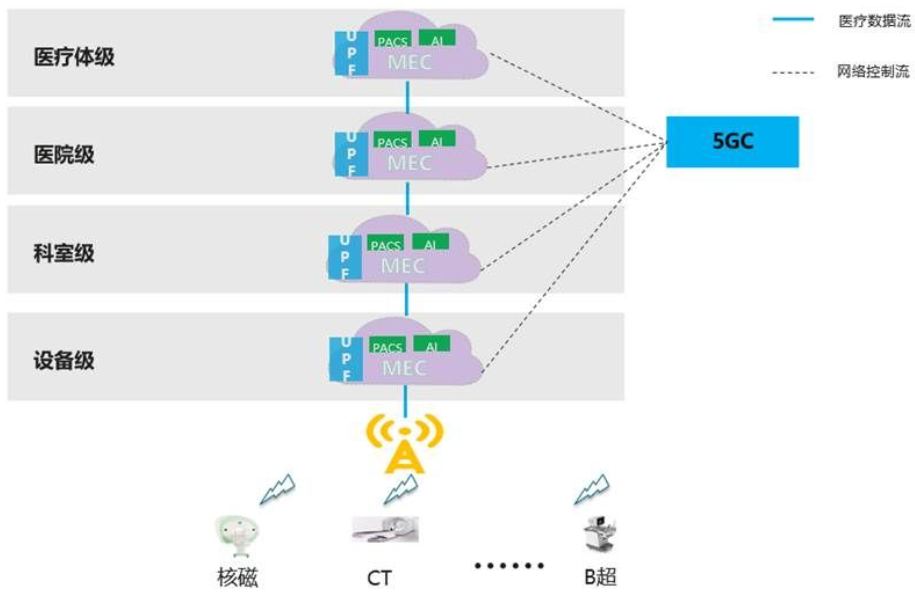

# 1. 5G医疗命题调研

## 1.1 机器人、AI、大数据等技术的进步降低了降低了医生的门槛，5G也将改变医疗的方式

1. 一个故事引发的思考

曾经听过这样一个故事，北京一个很有名的眼科大夫大拇指骨折了，因为眼科大夫的拇指对于做眼科手术很关键，因此请了五位顶尖医疗专家来给他会诊，这五位专家都是中央保健团的成员，医学造诣很深，三位外科专家，两位内科专家。会诊的结果是两位专家说不需要手术，三位专家说需要手术，又请了一位专家会诊，这下子说需要手术的人数正好和说不需要手术的人数相同，搞得人不知道咋办才好。

医学很难称得上是一门真正的科学，不像其它的学科一样，给一个输出能有一个明确的输出，医生的治疗方案更多的是一个概率学和不断小步试错的过程。医生会根据一个患者的检查结果，比如**心电图、血样检测、B超、影像数据**等，他可能得出一个初步的判断，最可能的原因是什么，概率是什么，其次的原因是什么，概率是什么，然后会给患者根据最可能的原因出具一个诊疗方案，如果一段时间后病情有好转那说明病因找对了，否则再考虑其次的原因。这些说明，要培养一个好的医生需要很长的时间，需要研究大量的病例，还需要亲自实践一定数量的病例，以前的医疗专家年纪相对较大，我们可以知道，满足身体条件的又有丰富医疗经验的医生数量会很少，好不容易把这个医生培养合格了，这个医生的黄金年龄就那么几年，年纪再大会导致做手术时体力跟不上。

但随着新技术在医疗的应用，医生的门槛逐渐降低。以达芬奇机器人举例，以前一个难度高的外科手术可能需要一个十几二十年的医生才能做，它对医生的要求，除了具备丰富的异常情况处理经验外，还要手灵巧，相应的需要医生手指修长，做手术时手要稳，有了达芬奇机器人就好办多了，只需要一个几年经验的医生就能操控机器人，机器人做手术既稳定，做的手术创口又小，更有利于病人手术后的恢复。还有比如**AI辅诊**，全国注册的医师有400多万，其中
- 放射科的医生占比在10%左右，他们需要专业看片的技能，
- 其它的临床医生比如内科、外科等他们也会自己看自己关心的部分片，
- 具备放射科专业技能的AI阅片能帮助其它科室的医生看得很清楚。

现在我们可以看到年轻医生越来越多了。

2. 现在的医疗变化

我们在和很多医院、ISV厂家、医疗设备厂家交流的过程中，反复问他们，医疗到底有什么场景必须要用到5G，或者试用5G更好？这些医疗行业的专家无法回答到底哪些场景应该要用到5G，因为医疗涉及的都是人命关天的大事，他们会比较保守。但是医院给我们讲了一个很简单的医院查房的故事，十几年前医生查房要到护士站抱着十几本病历本一个个去对照检查，有的医院科室主任要求医生提前一天要把患者的主要指标记在脑子里，第二天再去查房；

而现在是怎么样的呢？那是简单的多了，**医生拿着一个Pad，通过无线接入去调阅电子病历就行了，而查房时重点关注医嘱就行了**。那么5G来了之后会给医疗行业带来什么样的改变呢？行业内的专家们都认为5G的移动性、大带宽、低时延、安全必将给医疗提供随时、随地、可信、可达的通信服务，提升医疗效率，进一步降低医疗门槛。要做到这一点，需要通信业和医疗业通力合作，通信专家能把通信的语言让医生、医疗软硬件厂家听得懂，医疗专家能把医疗的语音翻译成通俗的话，网络需要更懂医疗的应用需求，5G和医疗真正地能融合。

## 1.2 5G+MEC医疗聚焦院内医疗网和远程会诊，院内医疗网聚焦医疗影像和AI，而远程手术和5G急救车是伪命题

从医疗信息化角度可以分为医疗服务信息化、医疗支付信息化和医药流通信息化，支付和医药流通的信息化与5G关系不大，我们将重点关注医疗服务的信息化，即**以医院、患者、医疗设备软硬件厂家等组成的产业链圈子**，尤其以医院为中心。**根据一个患者治病的流程，我们可以将整个流程分为三个部分：院前急救、院内诊治和院间会诊**，相应地5G医疗网可以分为院前医疗网、院内医疗网和院间医疗网。
- 院前医疗网主要是针对急救车，对应的网络就是运营商建设的公网，让急救车与医院做到互通；
- 院内医疗网部署在一个医院内，有两种建设方式，一个是医疗专网，一个是通过切片的方式使用运营商的建设的公网的虚拟专网；
- 院间医疗网通过VPN的方式，仍然使用运营商建设的公网做到医院间网络互通。

第一， 我们讨论院前急救的急救车，急救车最重要的功能是把患者尽快地搬运到医院进行治疗，北京、上海、广州和深圳这样的一线城市的医疗车约两万多俩，在城市里急救车搬运患者的时间在10分钟左右，如果患者在农村这个时间就不好说。

在急救车到医院的这段时间，主要是涉及**心电图、脑电图这些小数据的传输**，涉及到急救车和医院之间的通信，使用4G的数据和语音就足够了。我们曾经有人给医院提过VR/AR急救的解决方案，就是让医生戴上VR眼镜身临其境地远程现场抢救患者，和我们交流的医院主任笑着说，这么做会被患者家属骂的，因为家属等你戴上VR眼镜，再和医院交互，他早就急眼了，他们就希望早一点到医院，并且有经验的医生也不会跟随急救车过来的。之前曾经有一种想法把急救车变成一座移动的医院，把足够多的医疗设备搬到车上，医生通过5G给患者在急救车上提前开始诊治，这种思路不现实，同时**商业模式也不成立**。

第二， 我们讨论院内医疗网，**医院内的终端类型很多，有采集数据的X光机、核磁机、CT机、B超机、心电设备等，也有用来阅片的Pad、手机，还有医疗车**等；三甲医院中有七八十种，其中在医院内各科室交互的数据中，**影像的数据量最大**，也最有价值.

据医院统计有**30%\~40%的门诊病人有影像需求**，他们会被要求拍各种片子，而在医院要存储的数据中**70%是影像数据**，因此对**影像数据的采集、传输、保存和计算**将至关重要。这里有一个数据，全国有6000多家医院，包括基层医院，包括**软硬件的PACS系统（即医学影像系统）** 每三年一建，每次软硬件投资分别是50万人民币，软件比较少地变化，主要是硬件的扩容。做信息化的厂家比三甲医院很多，因为**每家医院都有自己独立的系统，接口、规范都不一致，导致医院这块市场比较碎片化，但是影像的标准化程度是最高的**，因此我们做5G使能医疗行业应聚焦影像这个场景。医疗影像最早是采用胶片的方式，为了医生的肉眼识别，没有计算机系统中BIT的概念，后来在胶片电子化的过程中，发现人眼对于影像灰阶的分辨率只能到9~10bit，因此把设备、PACS系统和AI之间接口DICOM显示标准定义为10bit，后续所有的传输、显示都按照10bit的标准来的，一般普通显示器只有8bit，而实际CT的数字采集器完全可以做到14bit甚至更高，因此采集14bit->PACS影像系统10bit->显示8bit的过程中数据是有是真的，只是靠人的肉眼感知不出来，但是有了AI后就不同，如果把未失真的14bit数据都提供给AI，AI的处理就能更准确，甚至比有丰富经验的放射科专家“看得”更好。实时性对于医院的大部分场景来讲不是最重要的，更重要的是各科室之间的协作，带来的就是**数据的传输和共享**。

当然有的场景对实时性也有要求，比如对于危重病人，病情越严重、越紧急，要交互的数据量就越大，实时性要求就越高。在近五年的院内医疗网中，最重要的不是连接的增强，而计算能力更重要，通过强大的计算能力，能极大地提升医疗的效率，5G是提供移动性、大带宽和低时延的工具，承载在5G管道之上的是人工智能。人工智能越靠近终端越靠近用户约好，人工智能前置能大大提升医疗的效率。

这个很重要：

举个例子，假如给一个患者拍X光片子，通过近端的AI判断给患者拍的片子部位对不对，如果拍得不对可以立即重拍，避免片子到了医生手里发现拍得不好又得重拍，还有每次拍片子会拍几百张，通过AI能快速挑出最重要的片子，只需要把最重要的片子传输到临床医生的手里就行了，避免每次几百M甚至几G的片子传输，因此边缘计算有利于这种场景。前面也讲了，对于危重病人的场景中数据对传输的时延要求高数据量大。

那么综合前面的分析，我们的5G+MEC+AI的解决方案在院内医疗网中是有需求的，MEC除了提供低时延的连接能力外，还给AI提供计算平台。除此之外，医院对于安全可靠是非常重视的，数据的使用和读取在医院内部必须经过授权的，并且一事一批，除了正常的工作流程中医院一定要把数据抱在手里以外，医院还要防止黑客的非法攻击，因此医院的数据安全是一个立体的问题，不仅仅是网络的问题，因此MEC有助于替代现有的院内局域网，让关键的患者隐私数据和医院的核心资产不出医院。

这里还有一个问题，假如医院的数据都在MEC平台上，MEC能否有合适的解决方案通过技术手段和管理手段将数据管理起来，既要实现数据的安全保护，又要通过分权分域的方式做到需要的数据在各各科室之间的共享？我们可以拿客车来比喻，发动机、底盘、驾驶员和座位就是MEC平台，而乘客就是医院内的各个系统，哪些乘客上车，车上的座位够不够，是否满足每个乘客的需求，相当于我们把医院内的一个一个系统逐步放到MEC平台的过程，我们今年可以聚焦医疗影像+AI，这块数据多价值最大，把这个场景当成突破口，相对应的我们也要把把车设计好，MEC平台能否满足医疗影像和AI的存储和计算的要求，以及其它的要求？

第三，我们再讨论院间医疗网，**院间医疗的场景中涉及到远程示教、远程实时会诊、远程专家诊断和远程手术等**。远程示教是医院资深的专家通过现场直播，或者讲解案例的形式给基层医生培训；远程实时会诊是通过在线的方式，基层医院将数据及时传送到远端的专家手中一起会诊，具备一定的实时性要求，和院内医疗的场景一样，病情约危机，数据量越大，实时性要求也越高；远程专家诊断是基层医院将数据上传到云端，远端的专家下载数据后给出专家意见，实时性要求不高。当前医联体架构中，一般是一个三甲医院带几个下级基层医院。和我们通信行业有行标企标以及设备进运营商的网络要入网一样，一门新技术的使用需要卫健委发布标准规范，而一套新软硬件系统进医院需要卫健委的许可证。院间医疗首先涉及到一个责任定界的法律法规问题，远程示教仅是培训不涉及到患者，没有医疗责任的问题；远程实时会诊和远程专家诊断，主要责任由现场的基层医生负责，远端的专家负次要责任；远程手术的责任由在远端操作的专家负责，远程做手术，手术刀多下去一点那可是人命关天的大事，出了问题到底是医生的责任，还是网络的责任，或者是现场机器人的责任？因此远程手术当前仅作为实验性质，未来我也不看好远程手术，现在一些远程手术的新闻仅仅是噱头，真要落地那还有很长的一段路要走。因此院间医疗网我们应聚焦远程示教、远程实时会诊和远程专家诊断等这些场景，这些场景对于我们的MEC和切片存在着需求。2018年国务院办公厅印发《关于推进分级诊疗制度建设的指导意见》，部署加快推进分级诊疗制度建设，这个指导意见对于建设院间医疗网起到很好的利好作用。

综上所述，5G+AICDE对于医疗行业有一定的市场空间。5G医疗应聚焦于院内医疗网的医疗影像和AI场景，以及院间医疗网的远程示教、远程实时会诊和远程专家诊断的场景。全国有6000+多家医院，假如我们每家医院都部署一套MEC，按照每套MEC一百万人民币计算，核心网的市场空间就有60亿人民币，这块市场空间还是不少的。

## 1.3 MEC在医院内可分为设备级、科室级、医院级和医疗体级四层，当前应聚焦于科室级

我们前文说过，人工智能越靠近用户越靠近终端越好，设备采集到数据需要及时计算处理，设备级需要MEC平台；每个科室有多套设备，也都有自己的核心数据，比如最典型的放射科的影像数据最多，因此放射科主任希望影像数据要掌握在自己的手里，而只有部分数据才会共享给其它需要的科室，比如内外、外科等，科室这级需要MEC平台；因为有科室之间的数据共享，同时医院这一层面也希望掌握自己的数据，数据不能随意出医院，因此医院级需要MEC；同样的道理，由于在有实力的三甲医院和几家下级基层医院组成的医联体这一级，也需要在这几家医院之间的数据共享，同时在医联体内外要做数据的保护，因此医联体这一级级需要MEC。相应地组网架构如下：

医院的设备型号很多，比如有上海联影的，有西门子的，也有其它厂家的，如果每一个设备都部署一套MEC，那成本太高了，部署设备级MEC不现实，医疗设备本身也会有适当的AI能力，但医疗设备要兼顾效率和成本的平衡。从节奏上看，部署MEC的顺序按照科室级MEC->医院级MEC->医联体MEC的顺序来考虑，科室级当前应聚焦于放射科MEC，后续再逐步根据业务的需要再在其它科室部署MEC。

四、展望：为了医疗行业的2H市场的空间是否很大？

中国人口的老龄化程度正在加速加深，预计到2020年，老年人口达到2.48亿，老龄化水平达到17.17%，其中80岁以上老年人口将达到3067万人；到2025年，60岁以上人口将达到3亿，成为超老年型国家。老年人在家里的疾病预防和术后的恢复检测这两个场景将会很重要，而可穿戴设备+机器人+A的解决方案能否成为一个刚需？而为了降低可穿戴设备和机器人的成本，算力是否上移到边侧或云端，未来能否成为区县大规模建设MEC的驱动力？如果这一块的空间很大，是运营商的菜吗？对此我持悲观态度，我认为家庭的智慧医疗市场空间很大，但是公有云厂家的优势，不是运营商的菜。
