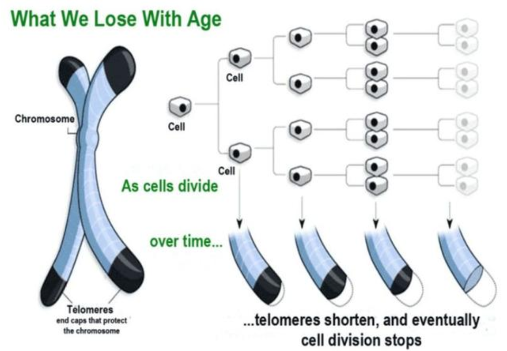
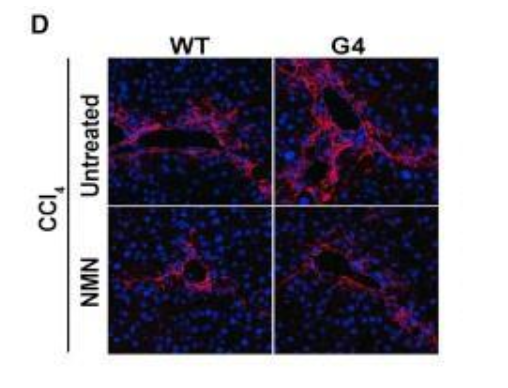
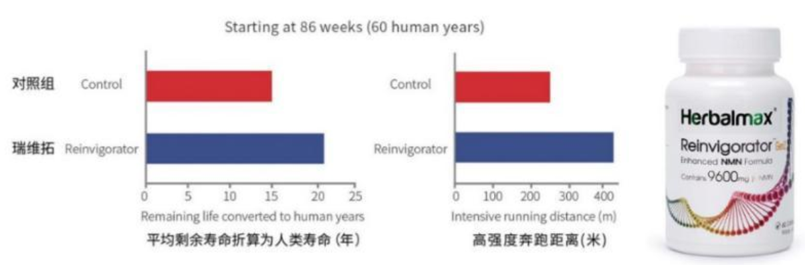
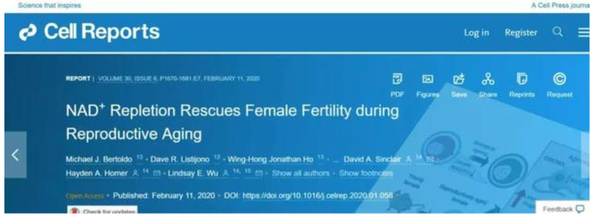

# 美国科学家将114岁老人细胞调回到0岁，人类寿命极限正在被改写

日前，美国科学家第一次对一名114岁女性的**淋巴母细胞**进行了重新编程，相当于将超级百岁老人的细胞生物钟从114岁调回到0岁，这一研究成果证实：人工干预下，衰老可以成功逆转，"返老还童"可能并不是神话。

美国桑福德伯纳姆普雷比医学研究所的研究团队调查发现：在全世界范围内，只有28人被证实年龄超过110岁，他们被称为"超级百岁老人"，之所以称之为"超级"，不是因为他们的高寿，而是他们不仅衰老速度较慢，而且非常健康，对阿尔茨海默、帕金森等与年龄有关的退行性症状表现出惊人的免疫力。

研究团队发现：通过生命技术干预，超级百岁老人的细胞随着年龄的增长而萎缩的端粒长度可以被重置回到年轻时最初的端粒长度，甚至接近胚胎时的水平，相当于把细胞从114岁调回到0岁。

**端粒长度被认为是人类生物学年龄的标志**，随着年龄增长、细胞不断分裂，端粒逐渐缩短，最终端粒无法再缩短，细胞亦无法再行分裂，人类便会迎来衰老、死亡。同龄人相较，端粒较短的人罹患阿尔茨海默、癌症等疾病的风险增加，寿命也会较短。2009年，因为"发现端粒护染色体"的生物学机制，伊丽莎白·布莱克本等3位美国科学家获得了当年的诺贝尔生理学或医学奖。

传统理论认为：人体衰老、端粒变短是一个不可逆的自然现象。但是随着生命技术的不断精进，科学家逐渐认识到：衰老不再是每个人必须承受的结局，衰老是一种可以治疗的疾病，在前沿生命技术的干预下，人类可以变得更健康、更长寿。

2019年3月28日，美国贝勒医学院在发表于《细胞·代谢》的实验研究成果中证实：**补充β-烟酰胺单核苷酸(NMN，富人圈疯抢的"续命神药"的瑞维拓关键成分)可改善端粒长度并降低端粒紊乱的损伤**，这也是瑞维拓等β-烟酰胺单核苷酸产品的核心机制之一。在对比试验中，连续服用β-烟酰胺单核苷酸 8周的小鼠端粒长度显著长于对照组。

服用β-烟酰胺单核苷酸的早衰G4小鼠端粒长度高于对照组WT小鼠

而此前，哈佛大学、麻省理工学院、耶鲁大学、华盛顿大学、日本庆应大学等国际知名研究机构陆续在《科学》《自然》《细胞》等顶级学术期刊发表的上百篇研究成果、确凿的实验数据证实：**口服补充β-烟酰胺单核苷酸可以使与人类相近的哺乳动物寿命延长了30%以上**，并能使平均剩余寿命仅剩2个月的暮年小鼠剩余寿命整整延长到2.3倍。一时间，**β-烟酰胺单核苷酸成为目前已知唯一经严谨科学验证可以逆转衰老、延长寿命的人体物质**。

在日美推出瑞维拓等实用产品之前，β-烟酰胺单核苷酸早已经成为渴求长寿的富商巨贾、硅谷技术精英孜孜以求的对象，他们闻风而动通过各种私人渠道从实验室里获取少量试验品供自己服用。"华人首富"李嘉诚通过特殊渠道获取瑞维拓上一代产品，连续服用5个月后直言"感觉年轻了20岁"，随即重砸2亿港币入股该生物科技企业；微软创始人比尔·盖茨也暗示：周围很多富豪朋友都在服用类似瑞维拓等β-烟酰胺单核苷酸产品"人为的延长自己的寿命"，并称自己也可能服用。

自己口服之外，首富、巨头、资本大鳄们还纷纷涌入赛道，一掷千金、重金投资抗衰老技术领域。不久前，比尔·盖茨突然宣布辞掉微软董事职位，对外宣称他将会把更多的时间、100亿美元花在人类健康长寿和慈善方面，并非微软公司；谷歌两位创始人拉里·佩奇、谢尔盖·布林2019年也双双离职，全心投入两人钟爱的"永生"计划，在全球招募顶级生物专家，以期延长寿命、"治愈死亡"；世界首富、亚马逊创始人杰夫·贝索斯领投硅谷一家治疗衰老创业公司，用于推进该项目进入人体试验阶段；2019年7月，"股神"巴菲特旗下全球供应链巨头麦克莱恩(McLane)公司宣布与**美国Herbalmax公司**达成战略合作， **Herbalmax正是瑞维拓的品牌拥有者，一向对技术领域保持距离"股神"加入了对长寿技术的争夺战**。

由日美政府背景支持的临床试验也在紧锣密鼓地进行：2019年初，纳入日本国家预算支持的β-烟酰胺单核苷酸人体临床试验第一阶段研究成果公布，确认了口服与瑞维拓剂量相近的β-烟酰胺单核苷酸的安全性，反馈呈积极，且没有明显副作用，后续进一步试验也将在数年内完成；而在美国，针对延缓衰老技术产品的临床试验也已获得FDA批准。

在瑞维拓等产品问世前，由于人均高达约156万人民币的年服用成本，β-烟酰胺单核苷酸度一度成为极少数富豪和研究人员独享的"长寿福利"。β-烟酰胺单核苷酸量产化由日本、美国技术企业率先实现：2016年，日本新兴和公司首个量产化，但其定价依然高达2万元以上；2018年，美国Herbalmax公司采用先进的酶催化法将其价格大幅度削减95%以上（**京东、天猫等平台定价不到2000元**），全球首款平价成熟型β-烟酰胺单核苷酸产品Reinvigorator（瑞维拓）才得以问世。

在瑞维拓等美日产品上市后，学术界对β-烟酰胺单核苷酸的研究更趋火爆：2月11日，澳大利亚昆士兰大学证实：使用β-烟酰胺单核苷酸干预可以恢复暮年哺乳动物（相当于人类60岁）已经衰老的卵细胞的生育能力；两天后（13日），美国俄克拉荷马大学发表的一项最新研究表明，通过补充β-烟酰胺单核苷酸使线粒体功能恢复，可促进衰老哺乳动物的神经血管再生，达到抑制衰老的效果。

日前，一直被学术界、产业界奉为风向标的麻省理工年度"十大突破性技术（TR10）"评选出笼：抗衰老技术同数字货币、微型人工智能、量子技术等10大技术入选2020年的榜单。

评委判断：抗衰老技术将和目前已经大行其道的语音搜索、癌症基因疗法、深度学习等热门技术一样，改变生命的极限，让人类活得更长寿、更健康。

