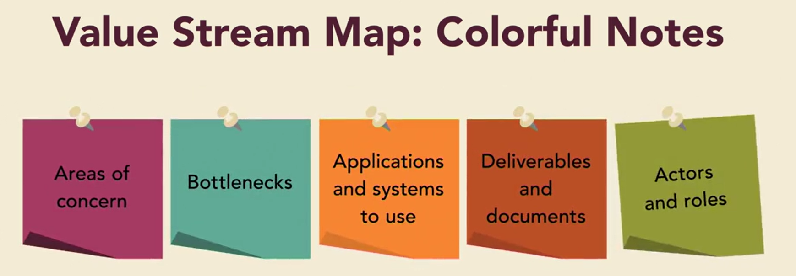

# 企业Agile简介

很多公司都在采用agile思想来构建软件，因为
- Agile的团队构建软件更频繁，质量更高

由于这些好处，更多的企业高管，希望应用agile方法到企业级的产品开发

企业级的产品涉及到很多组织，部门的协作；

从在团队层面工作很好的agile实践，升级到跨组织的多个团队，这个涉及到企业文化的变革
- Control culture
- Collaboration culture
- Cultivation culture
- Competence culture

从哪里开始呢？

- 理解你的组织的文化
- 制定计划来支持变化

企业级的agile涉及到整个企业文化，影响到的人包括
- 管理人员
- 业务分析人员
- 软件开发工程师
- 产品经理
- scrum master
每个组织和人员都要清晰的角色定义，并且深入人心。企业去使用在团队里面运行的agile方法，首先要设定切实可行的目标（goal），并且要例举出关键agile目标（objective）

企业agile并不一定是每个人都要做同样的事情，遵守同样的规则。 企业Agile的不会打乱各个组织的默契配合以及之前的关系，企业Agile的目标使各个组织之间的关系更加协调，默契和自动化。

Enterprise Agile
-------------------------------
Teams that work together, applying an agile mindset to their products

企业agile重要的是组织的思维理念，组织内各个不同团队如何运作并不重要。就像一个建筑工地，有人搬砖
，有人砌墙，有人运水泥，有人送饭，送水，有人负责安全监控警告，有人负责搞娱乐播报等等。

企业的不同团队可能采用的工具不一样，比如

每个企业都有不同的企业文化

所以在搞企业agile之前，一定要大家充分分享对agile的看法观点，分享各个team的实践；分享对agile的深度理解也应该成为公司文化的一部分。

团队Agile和企业Agile的区别

Agile Teams： focus on being self-organized, predictive, and driven to deliver

Agile Enterprise： focus on identifying organizational culture and making a widespread change.

举例来说，一个组织里面大概有5到6个agile团队，这些团队平常通过Scrum，极限编程，Kanban， Lean Starup等等方式运转，每个团队都运作的很成功，团队成员也很满意，这对于高质量的软件产品提供帮助。 

当企业的组织扩大后，更多不同角色，任务的团队想要采用agile，如何确保成功呢？ 

可能是20,30个agile团队，甚至上百个agile团队呢？这个时候首先要明确一些基本的常识：
- 通常每个Agile团队成员数最好低于9个人，实际上大多数人可能希望人数更少，比如说5到7个人。

这样面临的挑战就是，要把在很小的团队运作好的实践，应用到成千上百的人。这样就很容易理解，企业Agile的运作一定会大有不同，简单的无缝的进行移植肯定是行不通的。

一个普遍的事实是，Agile从来就没有针对一个大规模的组织量身定做过针对性的设计。2001年，Agile的方法首先应用于软件开发，主要是帮助研发团队怎么开发更好的软件。 自此之后agile方法兴起，人们开始思考怎么把这种方法应用到现代企业。 agile从帮助开发软件，到企业文化的agile转化，从而促进其工作。

  

为了适应这种发展趋势，一系列的工具，方法论诞生了。

 

企业agile意味着组织变化

# 企业Agile框架

很多组织认为企业Agile就是一个框架，因此在他们完全了解企业Agile的挑战之前，就快速引入了很多解决方案。这就好像制药公司对药物的命名通常和他们要治愈的疾病几乎相同。这就是为什么很多企业组织认为企业Agile的挑战可能只是扩展问题，或者是治理的改善，或者就是让团队Agile运作的更有纪律性等等。

有的人认为选择一个新的framework就可以把企业agile搞定

而实际上他们的会发现很多问题

有四种流行的企业Agile框架： 

“Agile frameworks are designed to create radical change”

IBM专家认为，上述框架引入后对组织可能不会产生任何伤害，但是也不会带来显著的提升；他们认为如果企业本身，企业员工在思想高度上没有形成对企业Agile的理解和认同，先框架的引入反而成为一种新工具流程的负担。

企业Agile的引入，最重要就是就是想清楚，你的企业的文化，（带有目的性的）评估你的企业的文化。而评估企业文化通常是很难的，大多数人和组织都是被动的接受他们企业的文化，他们实际上并没有从不同的侧面来思考他们和其他企业真正的不同。一个比较好的方法是做一次全公司的调研（an organizational survey),另外一个方法就是去倾听不同类型的文化，从而试着去猜想哪一种可以更恰当的描述你的企业。

一旦识别和评估的你的企业问题，以及可能面临的挑战，后面你可能就要去思考如何组作一次全组织的变革流程。你可能会去制定一个战略来改变企业文化来拥抱一些基本的变化。

只要这样认真思考了，你才会找出最适合的能解决企业问题的框架。

# 理解变化

在企业Agile的模式下，企业的不同团队采用不同的运作方式，统一的Agile思维，来开发企业级的产品。

这里最终的关键词是“transformation”

tranformation意味着变化，你需要彻底的采用不同的方法来思考工作。transformation也是很多企业最容易遇到的第一个麻烦，他们都很喜欢企业Agile这个方法，但是他们又会在一个大的变化面前停滞不前。

比如说一下常见的问题，“我们都很喜欢agile，但是我们不能把Quality Assurance团队和开发团队合并,因为他们想不同的管理者汇报。”， “我们想试下Agile，但是我们需要按照一个里程碑来规划进程，这样就会有很多时间来做测试，之后就会有一些积极的变化”。

这两种情况都不会引发真正的（True）transformation

后续的几个关键讨论主题：
- 企业组织的文化：包括企业文化的简介，控制，竞争力，协作，识别，培育等
- 实施变化，包括组织变化介绍，Kotter方法，勇敢无畏克服恐惧；
- 如何避免常见的陷阱，包括聚焦在文化建设，常见的挑战；

# 附加阅读

## DEVOPS基础

### 为什么要在企业层面推广DevOps

1. 企业devops的对象：

自动化的单元测试是其中的一个topic。在整个企业范围内推广的话，每个事情都变得更加困难。“At Enterprise 传统的scale, everything becomes more difficult.”

企业文化非常重要

企业文化变化推荐的首要技巧：

企业文化管理模型（Laloux：模型）

Slowly progress through each level until reaching the teal level;

建议：

2. 在企业层面运转devops的三个维度（技术，人员及流程，生态）

- 技术 (Technology)
  - 测试自动化
   
  >建议1：
   

业务部署要实现Reliable， Quickly validated， Reversible
  - 云技术 
  DevOps成功的关键：cloud Enabled， Automated， Expressed in code
  - 分解应用架构 
- 人员及流程 (People and Process)
- 生态 (Ecosystem) 
生态维度要管理好：
  - Technology vendors
  - Service providers
 
技巧：Use a KPI(Key Performance Indicators) to evaluate progress,  
  - Mean time to recover
  - Deployment cycle time
  - DEployment failure rate

3. 演进是一个持续的过程

演进的两个永久主题： as-is， to-be；演进就是从as-is到To-Be，通过agile的方法来尽快效率；

持续提升(Continuous Improvement)，判断好坏的依据：是否有效提升了业务；

Deming Cycle：

 

两个关键点：
- Identify, 识别提升和进步
- Track，跟踪当前的问题和限制

Plan部分要定义好步骤, Define the measures，有助于后续对每个步骤的有效性，局限性进行评估。

Act部分要定义好原则和要求，并给与一定的自由灵活度

建议： Rethink your process to decrease defects.

### 如何开始

1. 分析应用组合

 

需要问自己的一个问题：“How do you invest your time and money wisely in such complex environment?”

建议的做法，不要去想什么模型，框架，专注于特定的应用（Focus on Specific Applications）

组合分析的四个维度；

 

 

Change Frequency (变化的频率)

变化的越快，要求的能力越高，产品能力提升越快。

Criticality

Technology Stack

 

2. Find a minimum vable cluster (MVC)

建议：遵循80/20规则

Disclaimers：
- Adding and removing applicaitons is not exact.
- Cluster can become unwieldy.

3. use the MVC to uplift capabilities

 发现更多问题，快速改进提升

 DevOps能力的几个方面：
 - Configuration management 
 The capability that allow us to know what is exactly in every environment.

 DevOps的自动化能力也和这个息息相关，包含了
  - 应用的版本
  - 服务器的配置

 - Deployment and release 
 The proecss of deploying and releasing your software. 部署和发布的目标是：
  - 最小化手工步骤 (Minimal manual steps)
  - Alignment
  - reliability
  - consistency

 - Testing 
 Fast, reliable accessment.引入自动化回归测试套件来覆盖： progression testing，performance testing， Security tesing， Usability tesing.

 - Environment management  
 生产环境的一些额外要求：
  - Monitoring
  - Fault identification
  - Self-healing
  - Graceful degradation
 - Opertion

### Value stream Map

1. 什么是VSM？

VSM有两大任务：
- Idenify relevant applications and systems
- Visualize end-to-end delivery process

端到端的发布流程是从一个初始的idea到最终产品化的过程。主要分为四个过程：
- IDEA
- BUSINESS CASE
- DEVELOPEMENT
- QA(Testing)

 

做VSM的色调贴 (Colorful Notes):

 

时间线规划设计：

 

2. 创建VSM

关于VSM的最佳实践的两个约定：
- All participants in the same room
- Large whiteboards

建议：
- Be Sure to invite people early

取决于讨论的问题复杂度，时长通常是一个小时，或者略长。

VSM的下一步要做好几个工作：
- Cycle times
- Concerns
- Tooling

3. 使用VSM

对于即时贴上面的问题进行打分，可以投标用星号标识，星号多的优先级高。

星号的标准

 

评估的工具方法(Measurement Tools)
- Cycle time
- Failure rate
- Number of defects

搞一个得分卡来做：

 

小结：
1. Creating a value stream map (VSM) usually consists of overlaying the actual process steps, additional contextual information, and _____.

Answer： timeline

2. In terms of scheduling an IT process mapping session, which statement is false?

A: The session will be most effective when interacting as a group.

B: The session scope can also cover suggestions for improvement.

C：Remote participation is as effective as being there in person.

D：Participants can be called out to clarify parts of the process.

Answer： C

3. What will the dot voting step fail to capture for a suggested improvement?

A: significance

B: priority

C: impact

D: cost

Answer： D

### Tooling at the Enterprise level

1. 比较常见的工具叫做SCM（Source Control or Software）

 

2. 数据库自动化工具

 

3. 持续集成的工具

 

4. 测试工具

 

5. 配置自动化

 

6. 部署工具

 

7. 监控工具

 

8. 安全检查工具（静态，动态）

 
 

9. 团队协作工具

 

工具全景图：

 

如何选择正确的工具？

建议：
- Store tool configuration as code
- Open-source Enterprise license agreements are ideal
  - 提醒： Aim for something that doesn't hider adoption
- Consider the technical skill of your team

Central vs federated approches

"To err is human, but for a catastrophe, you require automation."

建议：
- Use a standard set of corporate tools.

 
 

一些通用标准：

 

问题：
1. A department in your organization wants to deploy a DevOps tool outside the corporate tool set. Which factor is less important in deciding whether to approve this request or not?

A: the maintainability of this new tool

B: the cost of this new tool

C: the security of this new tool

D: the benefits of this new tool

Answer： B

2. Which DevOps tool orchestrates the application building steps?

A: Software Configuration Management

B: Container Management

C： Continuous Integration

D: Configuration Automation

Answer: C

3. When choosing a DevOps tool, which tool capability is a red flag?

A: Tool configuration is readable by humans.

B: Tool configuration is stored in condensed binary format.

C: Tool configuration can be copied between different instances.

D: Tool configuration can be stored in a configuration management system.

Answer:  B

### Vendor管理

1. 在DevOps过程中引入供应商

- 功能外包 (Functional Outsourcing) 
Outsource individual functions to different vendors.

建议：
  - If you outsouce, use a complete end-to-end partner
"It is important to consider your partners in IT not just as vendors who provide a service but really as partners."

2. Contract and incentives

比如说有一个合同，要求“the contract reduced the average daily rate per person”。 下图可以用于分析：

 

越高级的工作需要的技能要求越高，费用越高；越底层的工作，技能要求低，自动化可能性高。

评估的时候需要关注：
- First-time resolution
- Average resolution time

准备两个得分卡：
Delivery scorecard

 
Operational scorecard

 

3. 实施工程标准

这些标准要写进合同里面去“Set engineering standard in contract”

设置标准的高低也需要考虑：

 

一些建议：

 

问题：

1. You consider outsourcing a testing function to an external vendor. Which vendor would you prefer?

A: a vendor that is paid by the number of defects found

B: a vendor that runs an international operation

C: a vendor that can integrate into your organizational culture

D: a vendor that has a robust tool set

Answer: C

2. When evaluating a DevOps partner, what will you measure in the delivery scorecard?

A: The project follows predictable milestones.

B: The project is of high quality.

C: The project follows correct SDLC cycle times.

D: The project uses proper automation.

Answer: A

3. Which technical goal is less important as an engineering standard?

A: self-healing

B: Code quality

C: build automation

D: agile practices

Answer: D

### 坚持严谨（Steering the Transformation）

1. Using Deming Cycle

“Each improvement is an experiment that we hope will positively influence our capabilities, but it doesn't always work out in our favor”

 

建议：
- Align backlog structure to the Deming Cycle.

搞一个模板：

 

举个例子：

 

2. Transaction Costs and Batch size

 

 

模型图：

 

3. 一个演进的得分卡

两个维度的平衡：

 
 
 
 

TEAM和环境 ：
 

问题：
1. Which stage in the Deming cycle handles the process refinement?

A: do

B: act

C: plan

D: check

Answer: C

2. What is considered a holding cost in an IT delivery context?

A: regression testing

B: validation of functionality

C: user acceptance

D: undeployed functionality

Answer: D

### 组织架构

1. DevOps的组织模型

DEVOPS之前的组织架构

 

DEVOPS之后，需要的是多个端到端负责的组织。

 

SRE TEAM的职责

 

建议：
- Provide capabilities as self-service.

2. Using a central team

举个例子，假设客户有这么一个Agile的功能团队；

 

他们还有一个Operation的团队

 

建议：
- Avoid the need for tickets whenever possible
- Team focus on：
  - Automation
  - Self-service
  - priorities updates
  - Resilience
  - Clarity

DevOps的团队：

 

需要一个通用的标准，所以建议构建一个Central DevOps platform.

DevOps团队成功的关键：
- See devops as extension of Team
- plan together
- Self-service availability

3. 如何让一个devops团队为你工作

 
 
 
 
 
 

举个例子：62

 

问题：

1. Which DevOps organizational model is the most popular?

A: DevOps responsibility as part of the Infrastructure team

B: DevOps responsibility fulfilled as a standalone team

C: DevOps responsibility as part of the Development team

D: DevOps responsibility as part of the Operations team

Answer： B

2. What should the DevOps Platform team focus on?

A: building technical architecture

B: running automated product tests

C: handling user tickets

D: using level 3 product support

Answer： A
