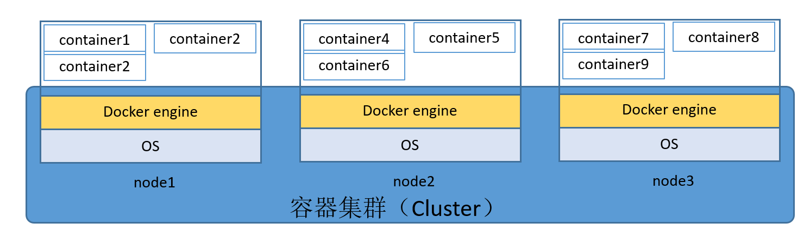

# 0. Docker中的Overlay网络

Docker中的overlay驱动可以在多个docker主机之间创建分布式的网络，该网络位于主机的网络之上（Overlay）的特定网络，从而允许与其连接的容器（包括群集服务容器）进行安全通信。 Docker处理不同主机上的容器之间的路由。

当初始化一个swarm或者docker主机加入新的swarm，docker主机上会创建两个网络：

- 一个叫ingress的overlay网络，处理swarm服务相关的控制和数据流量。创建swarm服务的时候，不要连用户自定义的overlay网络，它会默认接入到ingress网络。
- 一个叫docker_gwbridge的桥接（bridge）网络，用来把swarm中的docker主机连接在一起。

当然也可以使用命令*docker network create*创建用户定义的overlay网络，同样的方法创建用户定义的桥接网络（bridge network）。容器和服务可以同时接入到不止一个网络。服务或容器只能在它们各自连接的网络之间进行通信。

## 0.1 Overlay网络的常见操作

### 0.1.1 创建overlay网络

>前提条件：<br>
- Docker使用overlay网络的防火墙规则
  - 集群管理的TCP端口： 2377
  - 节点通信的TCP和UDP端口： 7946
  - Overlay网络流量的UDP端口：4789
- 创建overlay网络的时候需要初始化swarm manager，使用*docker swarm init*  ， 或者加入一个swarm，使用*docker swarm join*。

使用swarm服务创建一个overlay网络来用，下面的命令：
```bash
$ docker network create -d overlay my-overlay
```

为Swarm或者独立运行容器创建一个overlay网络，与运行在其他docker主机上的独立容器进行通信，可以添加标签(flag) *--attachable*
```bash
$ docker network create -d overlay --attachable my-attachable-overlay
```
在创建的时候可以指定IP地址的范围，子网，网关等其它内容，可以查看帮助
```bash
docker network create --help
```

### 0.1.2 overlay网络的加密

### 0.1.3 定制overlay网络

在特定场景，可以把ingress网络删除，然后重新创建，用来解决IP地址冲突之类的问题。

1. 检查时候有服务和容器在老的ingress网络上运行,把相关的服务和容器停掉。
```bash
docker network inspect ingress
```

2. 删除ingress网络
```bash
$ docker network rm ingress
WARNING! Before removing the routing-mesh network, make sure all the nodes
in your swarm run the same docker engine version. Otherwise, removal may not
be effective and functionality of newly created ingress networks will be
impaired.
Are you sure you want to continue? [y/N]
```
3. 重新创建ingress网络
```bash
$ docker network create \
  --driver overlay \
  --ingress \
  --subnet=10.11.0.0/16 \
  --gateway=10.11.0.2 \
  --opt com.docker.network.driver.mtu=1200 \
  my-ingress
```

## 总结：

1. docker overlay网络是需要和swarm绑定的；
2. 其原理就是网桥，所以在不考虑swarm的情况下，可以采用桥接网络来打通不同docker主机上容器的通信问题；
3. 其他待补充
4. 但是目前dockder通过SWARM提供内置的集群能力，业界比较普遍的是K8S技术，如果需要自己构建集群，在需要部署引擎解决节点的安全认证，网络互联；
5. 所以这是个必须要解决的问题，后续架构设计上要考虑如何搞。

网上教程可以参考：
https://hostadvice.com/how-to/how-to-setup-docker-swarm-cluster-on-centos-7/
https://ahmermansoor.blogspot.com/2019/03/configure-docker-swarm-cluster-centos-7.html

## 0.2 Openstack容器网络

### 0.2.1 创建桥接网络作为openstack管理面网络
主要处理两方面的问题：
1. 用户服务API调用，服务管理，控制台访问网络
2. 虚拟机业务面网络是否走host模式（继续调研）

步骤：
1. 创建桥接网络
2. 创建容器到桥接网络，包含hostname指定，IP地址指定（这里涉及到hostname，IP网络设计，请参考网络设计部分）


