# 1. Instroduction to FusionSphere Virtualization Suite

## 1.1. Virtualization - The Conerstone of Cloud Software

- 底层虚拟化层， Virtualization
- 基于底层虚拟化华为开发了自己的云平台服务
  - Huawei Cloud， 华为公有云
  - Huawei Cloud Stack，华为私有云
  - NFVI，电信云平台
  - Desktop Cloud，桌面云
## 1.2. FusionSphere Virtualization Suite Features

口号： Simplified Management and Superior Performance

定位： The Leading Virtualization Solution

主要功能：
- 简化管理(Simplified Management)
  - Unified Management 
  256 sites can be managed and maintained at the same time
  - Heterogenous management of VMware devices 
  Inventory VMWare resources can be managed to preserve customers' existing investments.
  - Robust reliability 
  Supports geo-redundant DCs, metropolitan active-active DR, and cross-region DR, ensuring service continuity. Agentless antivirus ensures ecosystem security.
  - Cloud evolution 
  Supports migration physical machines and third-party platform.
  Supports evolution from FusionSphere Virtualization to HUAWEI Cloud STack hybrid cloud.
- 超强性能(Superior Performance)
  - High-specification VM 
  255U/4T, meeting the requirements of high-specification VMs
  - High-performance Virtualization 
  KVM engine, delivering industry leading enterprise-class performance in SPECvirt test
  - GPU-enhanced 
  Supports multiple GPU passthrough and Virtualization technologies, and adapts to deep learning, graphics, rendering, and complex computing scenarios
  - High-performance network 
  OVS+DPDK network optimization(>20 Gbit/s) and 10GB video transmission in 4s

## 1.3. Components of the FusionSphere Virtualization Suite

FusionSphere virtualizes hardware resources using the virtualization, software deployed on physical servers so that one physical server can function as multiple virtual server. This solution maximize resource utilization by centralizing existing VMs workloads on some servers, thereby more servers to carry new applicaiton and solutions. In addition, FusionSphere can provide virtual data center technologies for enterprises and carriers and support cross-site DR capabilities.

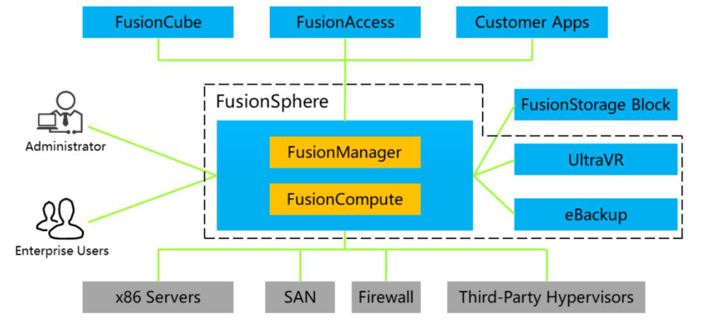

## 1.4. FusionSphere Server Virtualization Arichitecture

The FusionSphere virtualization solution consists of the server virtualization product(FusionCompute), virtualization management software (FusionManager), backup software (eBackup), and DR software(UltraVR). This suite virtualizes hardware resources into virtual resources and centrally manages the virtual resources. It provides the following capabilities basic backup and DR; lightweight operations; cloud infrastructure services; and performance management.
- **FusionCompute**: virtualizes x86 physical servers and storage area network(SAN) devices and supports software-defined networking.
- **FusionManager**: exercises FusionCompute capabilities and integrates the automatic management capabilities of firewalls and load balancers to provide a virtual data center management solution for enterprises and carriers.
- **UltraVR**: supports cross-site DR.
- **eBackup**: provides the VM backup capability.

| Component | Descriptin |
| --- | --- |
| FusionCompute | Mandatory  FusionCompute is a cloud OS. It virtualizes hardware resources and centrally manages virtual resources, service resources, and user resources. It virtualizes compute, storage, and network resources using the virtual computing, virtual storage, and virtual network technologies. It centrally schedules and manages virtual resources over unified interfaces. FusionCompute provides high system security and reliabilityand reduces the OPEX, helping carriers and enterprises build secure, green, and energy-efficient data centers |
| FusionManager | Optional  FusionManager is a cloud management software product. It monitors and manages hardware and software on the cloud platform. For example, it manages both homogeneous and Heterogenous(VMWare Hypervisor) cloud resource pools, and reports alarms for both hardware and software devices. FusionManager also offers a web user interface(UI) through which administrators can perform O&M operations on the resources. |
| eBackup | Optional  eBackup is backup software for virtualization. It utilizes the FusionCompute snapshot function and the Changed Block Tracking(CBT) function to back up VM data. |
| UltraVR | Optional  UltraVR is DR management software. Using the asynchronous remote replication feature of the underlying SAN system, UltraVR provides DR protectionfor critical VM data. |

## 1.5. FusionSphere Arichitecture Features

- On-demand resource allocation for applicaiton
- Virtual resource SLA
- centralized VDC Management
- Automated resource scheduling
- Comprehensive O&M Management
- Cloud security
- Intelligent applicaiton management
- Comprehensive right management

## 1.6. FusionSphere applicaiton scenarios

- Single-Hypervisor scenario
  - An enterprise uses FusionCompute as its sole unified operations, maintenance, and management platform to operate and maintain the entire system.
- Multi-Hypervisor scenatio
  - An enterprise has multiple virtualization environments which need to be centrally managed.
    - Unified management and maintenance of resources and services are provided by both the Huawei FusionCompute and VMWare vCenter Hypervisors added to the system.
    - Unified alarm monitoring, reporting, and management is provided for Hypervisors and physical devices added to the system.
- Prviate cloud scenario
  - multiple tenants share a VPC
  - multiple tenants use their dedicated VPCs.

# 2. Instroduction to FusionCompute

## 2.1. FusionCompute的定位

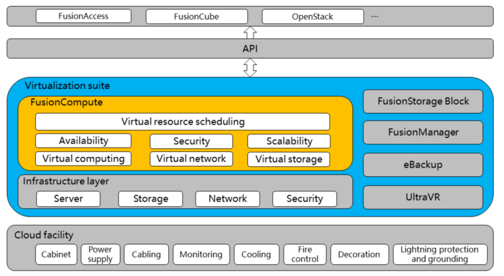

FusionCompute is a cloud OS. It virtualizes hardware resources and centrally manages virtual resources, and user resources. It virtualizes compute, storage, and network resources using the virtual computing, virtual stroage, and virtual network technologies. It centrally schedules and manages virtual resources over unified interfaces. FusionCompute provides high system security and reliability and reduces OPEX, helping carriers and enterprises build secure, green, and energy-efficient data centers.

## 2.2. FusionCompute Arichitecture

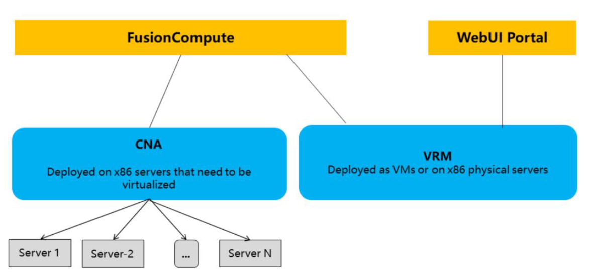

- CNA is short for Compute Node Agent. It is deployed on servers that need to be virtualized.
- VRM is short for Virtualization Resource Management. A ARM can be deployed a VM or a physical server. A VRM provides management and maintenance personal for web operating page.

| Module | Function |
| --- | --- |
| CNA | 1. provides the virtual computing function.  2. manages the VMs running on compute nodes.   3. manages compute, storage, and network resources on compute nodes. |
| VRM | 1. manages block stroage resources in a cluster   2. manages network resourcessuch as the IP addresses and virtual local area network (VLAN) IDs in a cluster and allocates IP addresses to VMs.   3. manages the lifecycle of VMs in a cluster and distributes and migrates VMs across compute nodes.   4. Dynamically adjusts resourcesand user data and provides elastic computing, storage, and IP address services.   5. implements centralized management of virtual resources and user data and provides elastic computing, storage, and IP addresses services.   Allows O&M personel to remotely access FusionCompute through a unified web UI to implement resource monitoring, resource management, resource report query, and other O&M tasks on the entire system. |

## 2.3. FusionCompute Functions - Virtual computing

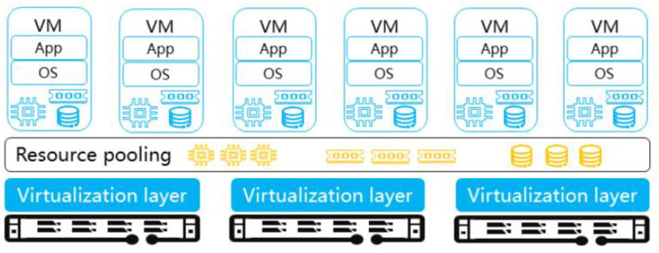

- FusionCompute virtualizes an x86 server into multiple VMs. End users can then install software, attach disks, modify configurations, and adjust networks on the VMs.
- For end users, VMs can be more rapidly provisioned than physical machines, and their configurations and networking can be more easily modified. From the point of view of O&M, the maintenance cost of VMs is significantly reduced, because hardware is reused by VMs and the cloud platform supports automatic maintenance. System administrators can directly monitor resource utilization trends.

## 2.4. FusionCompute Functions - Virtual Stoage

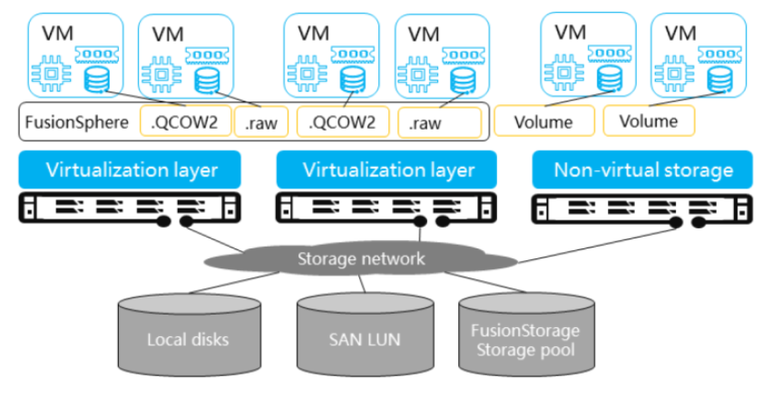

FusionCompute centrally manges the virtual storage resources provided by SAN devices, FusionStorage, and local storage of computing nodes and allocates the storage resoruces to VMs as virtual disks.

- storage device performance varies, and various different protocols may be used by storage device interface. To address these issue, storage virtualization is used to aggregate resoruces from different storage devices and provide data stores to manage the resoruces with the simplicity of a single storage device. Data stores can be used to store **VM disk** data, **VM configuration information**, and **snapshots**. As a result, users can exercises homogeneous management on their storage resources.
- VM disks and snapshots are stored as files on data stores. All service-related operations can be converted to operations on files, which enables visibility and agility.
- Based on storage virtualization technology, Huawei provides multiple services to improve storage utilization, reliability, maintainability, and user experience.
- Huawei provides host-based storage virtualization, **hiding the complexity of storage device types and avoiding performance bottlenecks**. Storage virtualization abstracts the logical stroage resources from the physical devices, thereby providing Comprehensive and unified storage service. Virtualization renders the differences between physical devices irrelevant and provides unified storage functions.
- End users can use these virtual disks on VMs just as they would use local disks on x86 servers. For example, they can format these virtual disks, read data from or write data to them, install file systems, and install operating systems(OSs). Moreover, virtual storage supports the snapshot function and resizing, neither of which can be implemented on physical hard disks.
- administrators only need to manage the SAN device, rather than managing spefific disks. Because SAN devices are reliable, the workloads for replacing had disks are significantly descreased for administrators. In addition, virtual storage supports various features that are not supported by physical disks, such as thin provisioning, Qos, and migration. Therefore, virtual storage has distinct cost advantages over physical disks.

## 2.5. FusionCompute Functions - Virtual Network

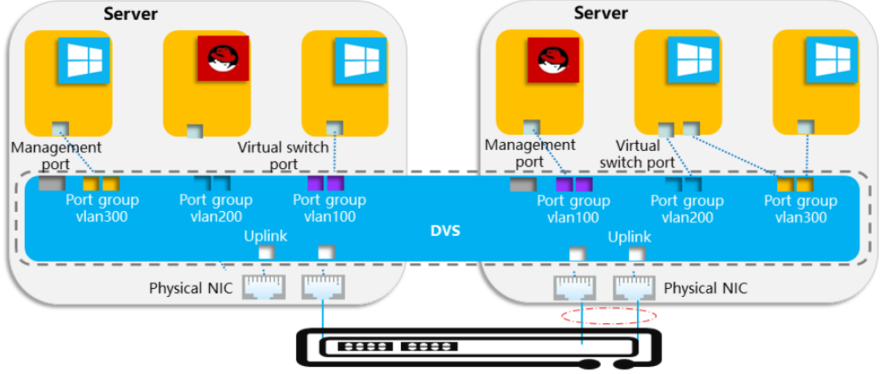

FusionCompute works with distributed virtual switches (DVSs) and provides independent network plane for VMs. different network planes are isolated by VLANs, just as they would be if physical switches were used.

## 2.6. Benefits of FusionCompute

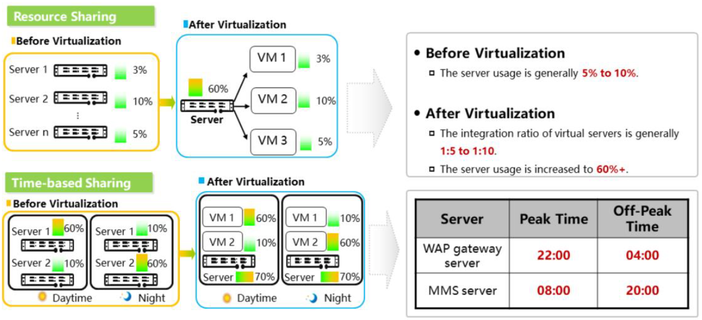

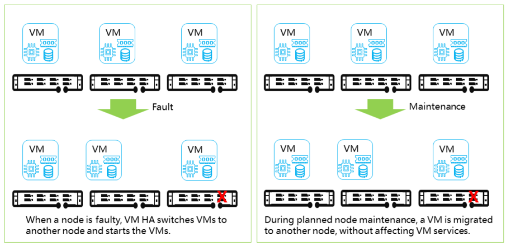

# 3. FusionCompute Planning and Deployment

## 3.1. Installation Preparations

- Installing a PC or labtop
  - Memory: 2GB or more
  - Excluding the partition for the OS, at least on partition must have more than 15GB of free space.
  - 32-bit and 64-bit operating systems of Windows 7, Windows 10, Windows Server 2008, Windows Server 2012, and later are supported
- Server (CNA)
  - The CPU supports hardware virtualization technologies, such as Intel VT-x, and the BIOS systems must have the CPU virtualization function enabled
  - Memory: 8GB or more
  - Hard disk: 70GB or more (minimum disk size at least 140GB for VRM)
  - You are advised to use hard disks 1 and 2 to form RAID 1 for installing the host OS to improve storage reliability.
- Precautions
  - Do not change the local PC IP address during the Installation process.
  - Disable the firewall on the local PC before installing FusionCompute.
  - Ensure that the file path does not exceed 256 characters.
  - Do not restart the host if not required during the Installation process.

## 3.2. Network Planning

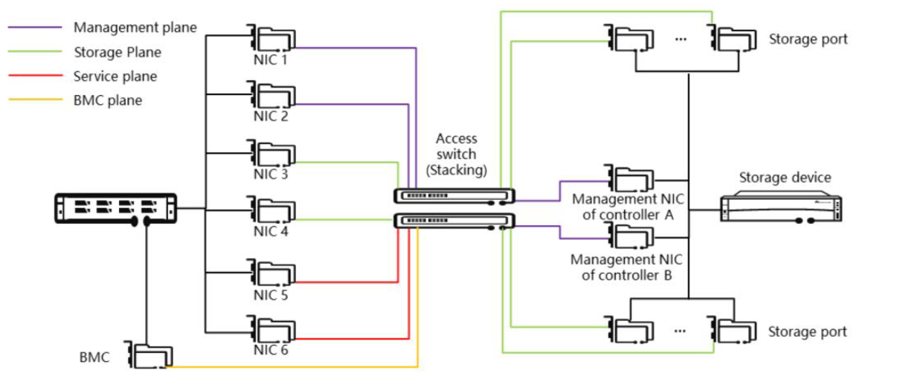

- BMC plane
  - Plance used by the BMC network port on the host. The BMC plane can be used to remotely access the BMC system of the server.
- Management plane
  - This plane enables the management system to manage all nodes in a unified manner and implements communication between these nodes, The following IP addresses must be configured:
    - IP addresses of the management network ports on all hosts
    - IP addresses of VMs on which management nodes are deployed
    - IP addresses of the storage device controller
- Storage plane
  - This plance is used for communication between hosts and the storage device. The following IP addresses are provided by the storage plane:
    - IP addresses of the storage network ports on all hosts
    - Storage IP address of a storage device
- Service plance
  - This plane is used by the service data of user VMs.

## 3.3. FusionCompute Installation Procedure

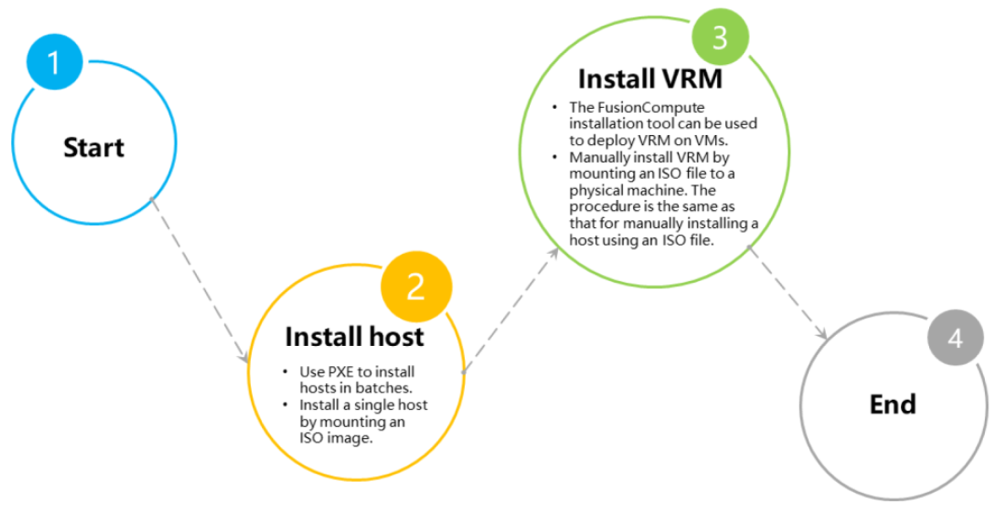

>备注： 
VRM: virtual resource manager 类似于vmware的vcenter。

## 3.4. Logical View of VRM Deployed on VMs

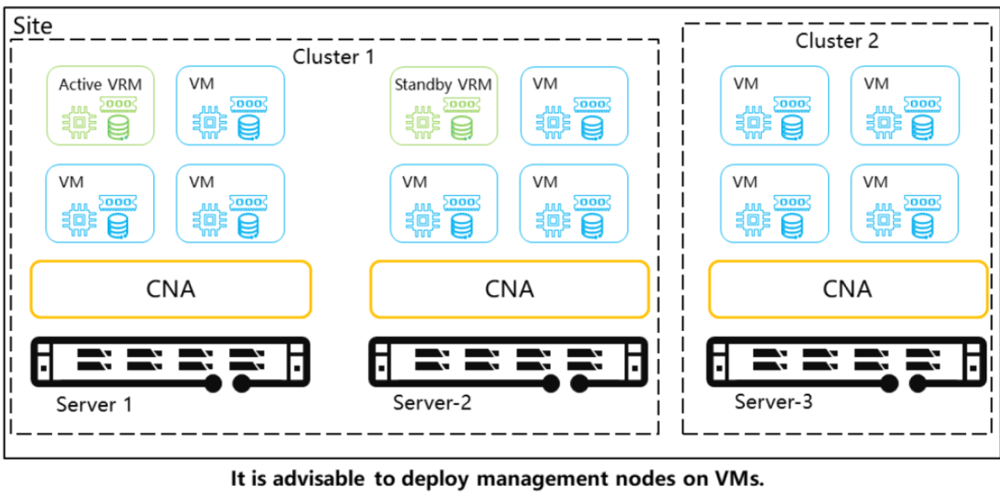

## 3.5. Logical View of VRM Deployed on physical servers

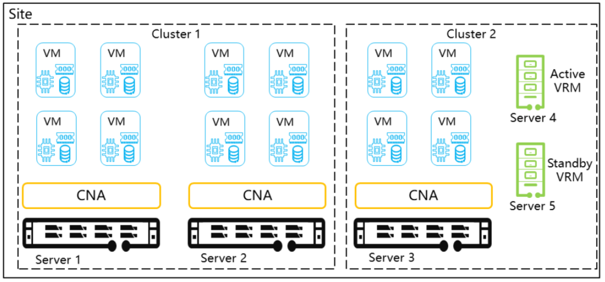
