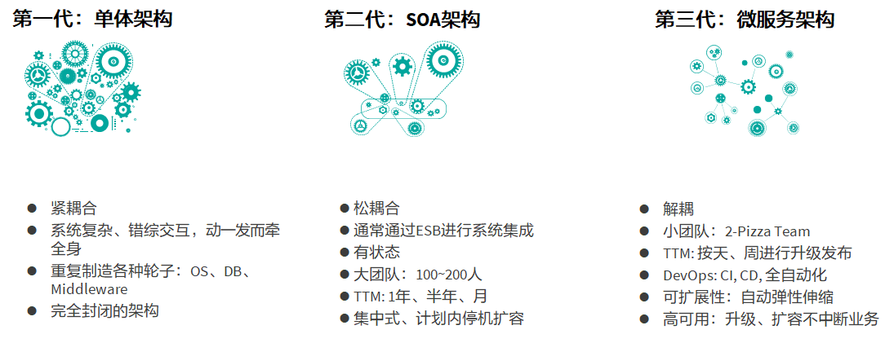
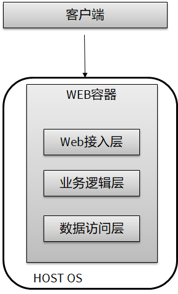

# 1. 企业IT演进趋势

## 1.1. IT发展趋势

1. 什么是IT？

Wikipedia的定义：
- IT：信息技术，Information Technology，是主要用于**管理和处理信息**所采用的各种技术总称，主要是应用计算机科学和通信技术来设计、开发、安装和实施信息系统及应用软件，也称ICT。

ITAA（美国信息技术协会， Information Technology/Association of America）的定义：
- 以计算机为基础之信息系统的研究、设计、开发、应用、实现、维护。

| 层次 | 传统模式     | 智能IT模式  |
| :------------- | :------------- | :------------- |
| 服务       | 买断，外包，**订阅**，... | XaaS：everything as a service |
| 软件  | 操作系统，中间件，数据库，... | SDx: 软件定义一切。分布式，走向开源 |
| 介质  | 硬盘，内存，SSD，... | 介质演进，硅进铁退， 光进铜退，SSD取代硬盘 |
| 芯片 | x86, ARM, 智能芯片，... | 打破x86垄断，GPU，ARM， AI崛起 |

2. 芯片，构筑强大算力，退工计算演进

- 计算1.0， 专用计算，大型机，小型机时代
- 计算2.0， 通用计算，数据中心，x86架构
- 计算3.0， 智能计算，全栈全场景

华为芯片家族
- 算： ARM处理器芯片， Kunpeng 920
- 管： 智能管理芯片，Hi1710
- AI： 人工智能芯片， Ascend 310/910
- 存： 智能SSD控制芯片， Hi1812
- 传： 智能融合网络芯片，Hi1822

3. CPU - 网管上的明珠

- x86统治了服务器，pc机
- 生态，算力，复杂指令集
- ARM通知了移动领域： 手机
- 功耗， RISC，开发
- 而知都在试图打破自己的边界
- 新领域的竞争： NPU，GPU，TPU
- 更开放的架构：RISC-V，开源，免费，简单，稳定
- MIPS： 衰落表明，要开放，吸引更多人参与，融合新的需求（如GPI）
- 华为的布局：麒麟（手机），鲲鹏（服务器），昇腾（AI）

>补充阅读：
1. RISC-V 基金会于 2019年 11 月 25 日正式宣布，总部注册地将从美国迁往中立国家瑞士，只待瑞士监管机构的最终审核，预计将于 11 月底得到批准。基金会首席执行官 Calista Redmond 表示，这项决定的初衷是确保美国以外的大学、政府和公司能够继续协助开发 RISC-V 开源芯片架构技术.
2. 为了秉承科研精神，打破指令集市场的垄断，RISC-V 自 2013 年诞生起就成为了开源项目，使用 BSD（Berkeley Software Distribution）开源协议。这意味着几乎任何人都可以使用 RISC-V 指令集进行芯片设计和开发，商品化之后也不需要支付授权费用。

3. 介质 - 闪存化，硅进铁退

|      | IOPS     | 带宽 | 时延 | 失效率 | 能耗 | 工作温度 | 抗震 |
| :------------- | :------------- | :------------- | :------------- | :------------- | :------------- | :------------- | :------------- |
| 机械硬盘       | 平均100       | 读： 100MB/s,  写: 50~70MB/s | 3ms以上 | 2~10% | 6 ~ 15 瓦 | 5~55摄氏度 | 对震荡、碰撞非常敏感，易损 |
| 移动硬盘（SSD）       | 平均10000       | 读： 500MB/s以上,  写: 500MB/s以上 | 0.1ms以下 | 低于0.5% | 低于2 ~ 5 瓦 | 10~70摄氏度 | 不怕碰撞、冲击、振动 |

4. 介质 - 存储架构的演进

介质的变化，推动相应的协议跟进

HDD：3500us  -> SSD：150us

5. 软件： 软件定义一切，开源成为主流，软件上云

- 开源化，社区化： openstack kubernetes， docker
- 软件定义一切， 软硬件分离
- 云，虚拟化： AWS， AZure， Ali， Huawei，GCP

6. 软件架构 - 量变到质变，软件走向分布式

以数据库为例，看看数据库是怎么走向分布式的:

数据库产业趋势：Multi-model、 HTAP、云数据库、新硬件（GPU，In-memory）、 AI in B

7. 操作系统：

- Windows：闭源；出现拥抱linux的趋势。
- Unix：开源，收费
- Linux：开源，免费
- Android，苹果IOS
- 华为自研：难在生态，解决办法：开源、开放
  - 欧拉：服务器操作系统
  - 鸿蒙：打通了手机、电脑、平板、电视、汽车、智能穿戴，统一成一个操作系统，同时- 还兼容全部安卓应用和所有Web应用。
- 未来的融合操作系统：Google的Fuchsia：全平台(Mobile、Desktop、Web、Embedded)。先智能音响和其他智能家具设备，然后再转移到笔记本电脑等更大的设备上，最终取代Android。
- 云平台：Openstack，各家自研系统。

8. 生态 - 丰富的生态是成功的关键

- 生态：各种应用软件，中间件，数据库。
- 要保证基于你选的芯片+os有丰富的生态。
- 中间件: paas。容器，微服务，Devops
- 数据库：
  - 高斯
  - Oracle
  - Mysql
  - 线上数据库：aurora
- 应用：

9. 开源，开放，芯片和操作系统的终极走向：

- 开源开放是大势所趋
- 生态构筑是芯片和操作系统的难点，而开源开放通过利益共享凝聚众人之力，是其它厂家对付垄断寡头的最有效武器；
- 利用新领域培育新的芯片和操作系统，反哺传统领域：
  - 如AMD硬撼Intel多年未成功，而ARM通过移动领域逆袭Intel成功，反过来进入服务器和平板电脑领域，与x86平分秋色。
  - Windows统治个人电脑多年，苹果始终未能反超，但Google利用安卓进入移动领域，与微软平分天下。
  - 物联网，安全可控，美国封锁可能有助于我们培育鸿蒙系统、欧拉系统；AI的兴起，移动领域的强大有助于我们培育麒麟芯片，鲲鹏，昇腾等芯片，并反过来占领CPU领域。
- 融合，统一这些众多领域者也许是最终的赢家

10. 服务 - 云改变商业模式XaaS

11. 企业上云

Why？企业为什么要xAAS - 上云

- 加速企业IT设施发展 
企业上云有利于更好地促进各类信息技术在企业中的普及应用，从而加速企业IT基础设施更新发展。
- 提升系统稳定性 
应用系统不需要关注底层基础设施运维，云平台提供专业的运维能力。
- 提升应用开发部署敏捷性 
云平台能促进软件架构复用，架构和开发技术栈统一，提高研发效率，加快应用部署，缩短业务开发周期。
- 降低IT成本 
企业无需投入购买大量硬件和软件费用，减少人员成本，降低运维费用。
- 以云平台为基础 
云平台有助于实现数据集中，企业可以存储更多数据，方便数据共享，让沉积的数据产生价值。
- 技术创新 
利用公有云厂家提供的先进云服务，加速企业创新业务的落地。

What：企业上云分类

简而言之，『企业上云』就是把企业的一切迁到云上，其主要内容包括四大类。
- 数据
- 应用
- 平台
- 基础设施

How： 企业上云流程
- 规划
  - 信息收集
  - 状态评估
  - 需求评估
  - 风险分析
  - 策略制定
- 设计
  - 迁移方案
  - 实施方案
  - 风险方案
  - 条件准备
  - 分工协作
- 实施
  - 数据备份
  - 资源准备
  - 应用迁移
  - 存储迁移
  - 数据库迁移
- 验证
  - 功能测试
  - 性能测试
  - 系统测试
  - 模拟切换
  - 系统优化
- 交付
  - 系统移交
  - 文档移交
  - 场景培训
  - 技术支持
  - 按需迭代

## 1.2. 应用架构类型

1. 应用变迁

强调： 应用向CloudNative演进，微服务是CloudNative的事实标准

单体架构(Monolith)
- 经典的软件三层架构
- 逻辑上分为三层
- 多用于传统J2EE项目

SOA架构

企业服务总线 （Enterprise Service Bus)

ESB的主要功能是:
- 监控与路由各个服务之间消息通信
- 解决各个服务组件之间通讯故障
- 控制服务版本与部署
- 完成任务如事件处理,数据转换与映射,消息与事件查询与排序,安全或异常处理,协议转环,保证服务通讯的质量. 

微服务架构

微服务架构举例 - Netflix

2. 云原生应用

云原生 VS 传统企业应用

| 云原生应用 | 传统企业应用  |
| :------------- | :------------- |
| 可预见云原生应用遵循“弹性”框架，比较有名的是“12-factors（12要素）”运用   | 不可预见每个企业有自己的一套做法，“弹性不足”   |
|  OS 抽象化容器和serverless 趋势，API化，越来越不依赖OS  | OS依赖性 |
| 正好的容量云天生就意味着容量弹性伸缩   | 过多的容量由于交付部署滞后，往往要安排资源冗余   |
| DevOps快速迭代 快速交付新需求，以天甚至小时记  | 瀑布式开发 开发、交付团队分离；周期性新版本发布，通常以月记  |
| 模块解耦 微服务架构将功能分为松耦合、以API互相调用的模块  | 紧耦合 单体架构，牵一发动全身 |
| CICD 云端持续集成、持续部署，基础设施即代码   | 软硬件集成部署费时费力 |
| 快速恢复 容器化颠覆灾备容灾概念，秒级服务恢复 | 慢恢复 传统HA架构，异地容灾，服务恢复时间长 |

## 1.3. 华为云通用云服务介绍

- 私有云（Private cloud）：云计算的基础设施由单一的组织拥有，并且仅仅为那个组织运营。
- 公有云（Public cloud）：云服务运营商拥有云基础设施，并且为公众或者企业用户提供云服务。云计算基础设施由一个组织拥有并且向公众或者大型的工业团体销售云计算服务。
- 混合云（Hybrid cloud）：云计算基础设施由两种或者多种云组成，对外仍然表现为一个整体。 通过标准的或者专有的协议绑定在以实现数据或者应用的可携带性。

云服务分类
- IaaS ： Infrastructure as a Service
- PaaS ： Platform as a Service
- SaaS ： Software as a Service

### 1.3.1. 通用云服务 - 计算类

- 虚拟机
  - 弹性云服务器 ECS
  - GPU加速云服务器 GACS
  - FPGA加速云服务器
  - 专属主机 DeH
  - 云手机 CPH  
- 物理服务器
  - x86架构类裸金属服务器
  - ARM架构类裸金属服务器
-  容器类
  -  云容器引擎 CCE
  -  云容器实例 CCI
  -  容器镜像服务 SWR
- 增值类
  - 弹性伸缩服务 AS
  - 镜像服务 IMS
- 无服务器类
  - 函数工作流 FunctionGraph

1. 容器VS虚拟机

### 1.3.2 通用云服务 - 存储类

- 存储资源
  - 云硬盘 EVS
  - 弹性文件服务 SFS
  - 对象存储服务 OBS
  - 专属分布式存储服务 DSS
  - 专属企业存储服务 DESS
- 数据灾备
  - 云硬盘备份 VBS
  - 云服务器备份 CSBS
  - 云备份 CBR
  - 存储容灾服务 SDRS
- 数据加速
  - 内容分发网络 CDN
  - 数据快递服务 DES

1. 存储类型

| 块存储 | 文件存储 | 对象存储 |
| :------------- | :------------- | :------------- |
| 块存储主要是将裸磁盘空间整个映射给主机/VM使用，用户可以根据需要随意将存储格式化成文件系统来使用。 | 对于用户来说，文件存储好比是一个共享文件夹，文件系统已经存在，用户可以直接将自己的数据存放在文件存储上，比如Windows远程目录共享。 | 每个数据对应着一个唯一的id，在面向对象存储中，不再有类似文件系统的目录层级结构，完全扁平化存储，即可以根据对象的id直接定位到数据的位置。 |
|  |  |  |

### 1.3.3. 通用云服务 - 网络类

- 云上云下互联
  - 虚拟专用网络 VPN
  - 云专线 DC
- 云上网络
  - 虚拟私有云 VPC
  - 弹性负载均衡 ELB
  - NAT网关
  - 弹性公网IP
  - VPC终端节点 VPCEP
- 云间网络
  - 云连接CC

### 1.3.4. 通用云服务 - 管理类
- 鉴权类服务
  - 统一身份认证服务 IAM
- 监控服务
  - 云监控服务 CES
- 审计类服务
  - 云审计服务 CTS
- 日志类服务
  - 云日志服务 LTS

## 1.4. 华为云实践   

### 1.4.1. 传统网站云上架构

参考：

方案解读：

| 需求 | 公有云方案 | 服务 |
| :------------- | :------------- | :------------- |
| 将数据节点与业务节点分开部署 | 配置特性：购买N弹性云主机代替传统服务器，作为网站的基础业务节点。购买RDS实例，作为网站的数据节点。由虚拟私有云为云主机提供网络资源。 | 弹性云主机  虚拟私有云  关系型数据库服务RDS |
| 针对不同业务量动态调整服务器个数 | 配置特性：根据业务需求和策略采用弹性伸缩服务，使用基础业务节点的镜像动态地调整作为业务节点的弹性云主机实例个数，保证业务平稳健康运行。 | 弹性伸缩服务 |
| 自动将流量分发到多台服务器 | 配置特性：使用负载均衡服务将访问流量自动分发到多台业务节点弹性云主机，扩展应用系统对外的服务能力，实现更高水平的应用程序容错性能。| 弹性负载均衡服务 |

实验流程：

