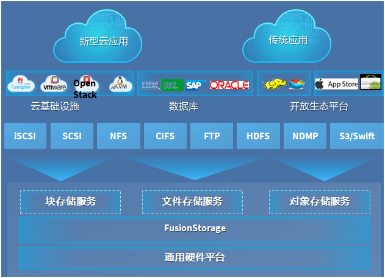
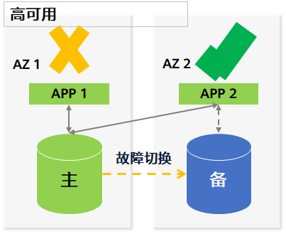
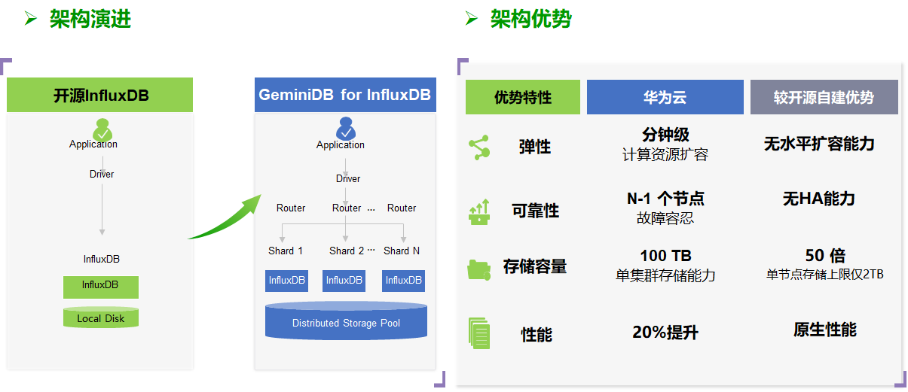
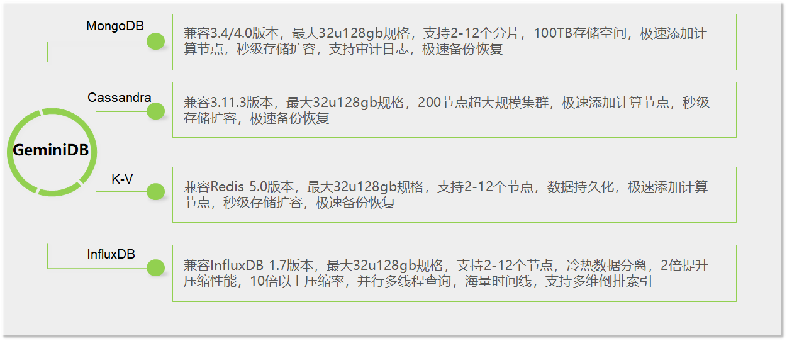
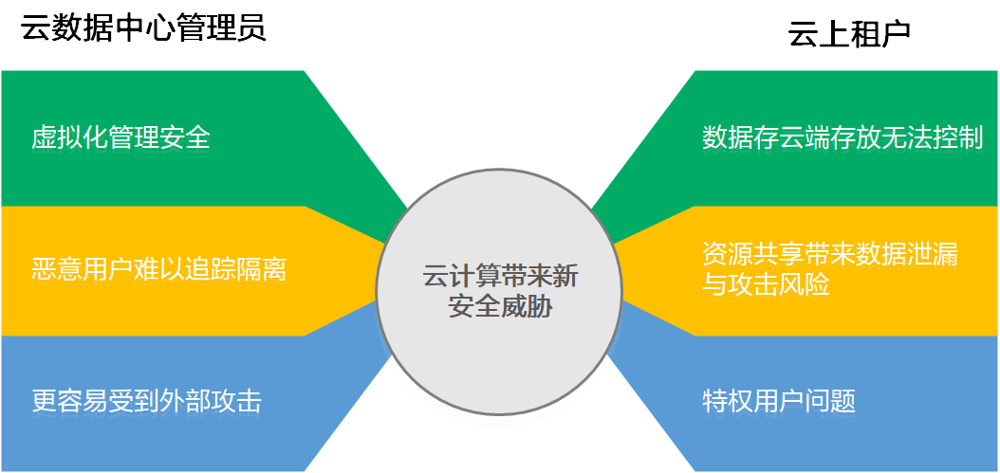
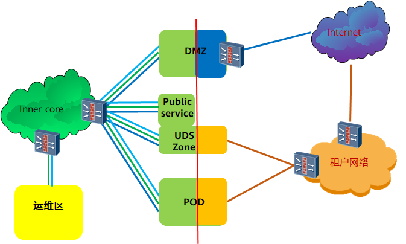
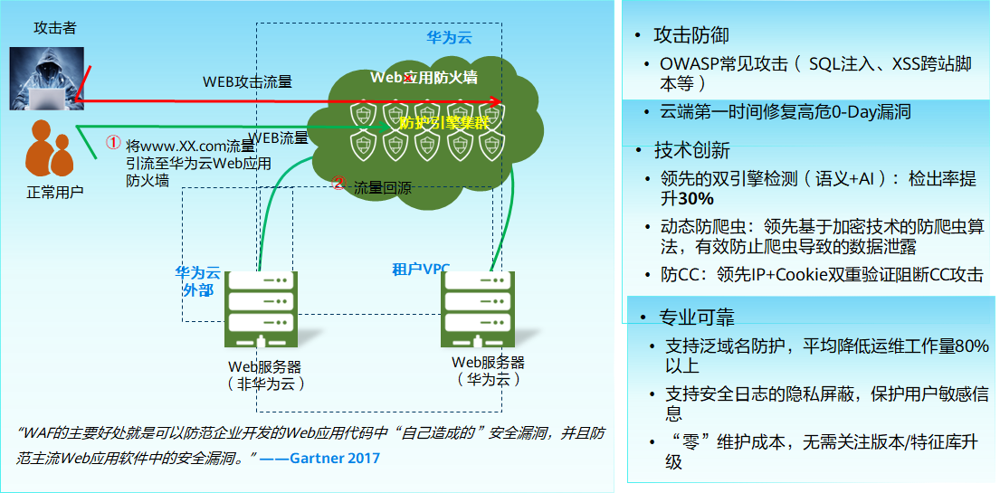

# 1. 传统应用云上架构分析

## 1.1 典型线下场景分析

### 1.1.1 云下IT运维场景整体分析

场景
- 整体运维包括机房、设备、平台及应用运维等
- 需要各领域的运维人员
- 维护工作包括了设备健康检查、固件升级、设备扩容、平台升级、版本维护等
- 平台要考虑冗余设计，支撑业务的高可用
- 应用需要考虑底层的适配，包括镜像、运行环境等的适配和支持
需购买专业的运维工具或者采用开源的运维工具

痛点
- 初始化投入高
- 专业运维人员难找，人力成本高
- 维护升级工作繁琐，容易出现误操作导致业务故障
- 运维团队与业务团队容易出现分工界面协商不好，从而扯皮，影响业务界面
- 专业的运维工具以及流程建设，需要投入大量的人力物力

1. 传统同城双活 / 主备数据中心面临挑战

场景
- 基于网络层、虚拟化层、数据库层和存储设备层构建同城双活/主备容灾方案

挑战
- 涉及多套商用设备和软件，成本非常高
- 数据中心间需要构建裸光纤互联，建设成本高，周期长

2. 传统数据中心两地三中心面临挑战

场景
- 容灾中心需要选择专业的机房，并且需与生产中心类似配套的网络安全等设备
- 生产中心与容灾中心需要建立高速带宽，例如波分设备+裸光纤
- 异地容灾中心与同城容灾中心间需要跟进容灾的数据量进行带宽规划，一般情况都需要引入专线
- 容灾中心需要做好容量规划和提前的资源投入，否则无法支撑良好的业务连续性
- 容灾需要配套完整的工具支撑，并定期做容灾切换演练
挑战
- 容灾中心初始投资成本非常高，不亚于生成中心的建设成本，并且短期之后无法看到回报
- 为了保证容灾数据的实效性，数据中心间互联互通网络建设成本高，
- 灾备容量无法精确预测，要么导致容灾不够用或者提前投入过多
- 容灾的流程建设专业性高，引入相关的流程、工具和人才势必增加成本

### 1.1.2 云下安全场景整体分析

场景
- 完整的安全需要从网络安全和信息安全两方面着手
- 边界安全、业务分区隔离、统一配置管理、安全管控中心等需要大量的设备和软件投入
- 需要定期进行安全评测
- 特定场景要求取得专业的安全认证，例如PCI-DSS，可信云等
痛点
- 安全建设资金和人力投入大，需要有专业的团队、专业设备以及安全管控系统
- 定期的测评，需要从网络安全、主机安全、审计日志等维度，需要有配套的设备、软件及安全制度，投入大
- 安全认证投入成本高

1. 传统数据中心和私有云面临的安全挑战

传统数据中心：
- 租户资源物理独立
- 租户网络边界清晰
- 新增业务耗时

外部威胁：
- DDOS攻击
- 网络扫描、监听
- 木马、蠕虫、病毒入侵
- 挂马、SQL注入
- 非授权访问

内部威胁
- 越权访问&操作
- 内网IP、ARP欺骗
- 病毒二次扩散
- 非法终端接入
- 关键信息泄密

私有云：
- 虚拟化平台
- 共享弹性资源
- 租户传统网络边界消失
- 业务自动化

新增外部威胁
- 接入终端更多样，各种移动终端、VDI终端；
- 新的针对Hypervisor漏洞攻击；
新增内部威胁
- VM存在相互攻击、流量不可视，取证困难；
- VM动态迁移需要安全策略保持一致性；
- 存储数据物理位置不可知，用户担心数据隐私泄露；
- 私有云的管理集中带来管理员的权限滥用风险；

### 1.1.3. 云下面临挑战总结

运维复杂
- 运维初始化成本高
- 运维流程复杂，业务上线慢
- 运维人才难招聘
- 运维定位问题困难

容灾难
- 容灾数据中心建设周期长
- 专业容灾软件和设备成本高
- 容灾裸光纤和专线建设和租赁成本居高不下
- 容灾规模无法精确预估，容易导致提前过度投资

存在安全隐患
- 内外部威胁多，需要投入大量的软硬设备，成本高
- 需要专业的人才维护安全体系和认证

## 1.2 华为云方案简介

### 1.2.1 公有云架构

六大基础模块：云运营portal、云服务、云平台、BSS（运营支撑系统）、OSS（运维支撑系统）、云安全。

1. 顶层资源模型

公有云可以从租户和DC管理员两个不同层次的视角进行划分，一些实体只有管理员能看到。

2. 底层资源模型关系

DC和AZ的关系：
- DC只是物理上“在一起”的概念，我们认为风火水电土在一起的多个机房都是一个DC。理论上允许AZ跨DC，但是DC间必须高速网络互联。

POD与AZ的关系：
- 一个AZ可以由多个POD组成。但是一个POD只能归属到一个AZ。

AZ与Cluster的关系：
- 一个AZ可以跨同一个POD的多个Cluster。不同的Cluster可以按照硬件不同形成不同的SLA资源池。所以允许AZ内提供不同的服务等级。

3. 计算资源池

4. 服务器虚拟化本质

5. 存储资源池

优势：
- 集中存储
- 高密虚拟化
- 分级存储
- 数据容灾

OceanStor存储系列

6. 网络服务

网络服务： 云上提供VPC、EIP、ELB、VPN/专线、NAT等网络服务

- 所有网络服务均需支持双AZ冗余部署（双活或跨AZ主备）
- EIP业务支持双AZ双活
- ELB业务支持双AZ双活
- 专线业务支持双AZ双活
- VPN业务支持双AZ主备
- NAT要支持虚机粒度，并支持双AZ主备

同时我们提供了多种公网出口类型；

总结：
- 完成业务面双活方案交付，保证单AZ故障场景下，AZ2业务正常运行
- 并完成托管区与专线双活接入方案，业务端到端冗余

7. 管理资源

8. 华为云的八大优势

长期承诺，战略投入公有云
- 技术创新，持续研发
- 能力开放
- 安全可靠
- 灵活服务方式
- 全球一张网，就近服务
- 地面部队，本地服务
- 开放互通
- 丰富生态，共享共赢

## 1.3 云上架构设计原则

### 1.3.1 企业上云架构设计诉求

企业上云架构既需要满足企业 IT 中高可靠、高安全、一致性、合规性要求，有需要满足创新 IT 所需要的灵活、快速、伸缩的挑战。

企业上云架构设计诉求
1. 性能 (Performance) 
企业需要更快的应用和分析，以更快的速度获取所需的信息。
2. 成本 (Cost) 
能够优化运维人力的调度，降低 IT 维护项目的人力投入，进而可将更多的资源放在促进业务需求和 IT 技术的结合，帮助企业创新。
3. 安全性 (Security) 
部署完整的安全防护，安全控制将围绕着数据中心（物理基础设施）、访问安全、网络安全、存储安全、数据安全等多个方面展开。
4. 可用性 (Availability) 
应能保证当灾难发生且一个数据中心出现问题时，另一个数据中心够实时运行，最大限度地确保企业业务的连续性。

### 1.3.2 云上架构设计考虑因素

1. 云上客户的安全诉求

云安全联盟 Top 威胁
- 数据泄露
- 身份、凭证和访问管理不足
- 不安全的接口和应用程序编程接口
- 系统漏洞
- 账户劫持
- 恶意的内部人员
- 高级持续性威胁
- 数据丢失
- 尽职调查不足
- 滥用和恶意使用云服务
- 拒绝服务（DoS）
- 共享的技术漏洞

上云的关键安全诉求
- 业务连续不中断:
- 防网络攻击
- 防黑客入侵
- 法律遵从、合规
运维全程可管控：
- 配置安全策略
- 风险识别和处置
- 操作可审计、追溯
数据保密不扩散：
- 防外部窃取
- 内部非授权员工不可见
- 云服务商不可见

### 1.3.3 云上系统安全性设计原则

以数据安全为中心，构建企业应用云上安全

### 1.3.4 云上系统安全架构设计建议 - 八种基础防护方案

### 1.3.5 华为云客户云上系统安全架构设计建议说明

| 序号 | 类别     | 具体描述 |
| :------------- | :------------- | :------------- |
| 1 | 云系统安全优秀实践原则 | 1、公网IP使用最小化： 1）业务入口使用ELB 2）主动互联网访问使用NAT网关 3）公网IP(EIP)，仅限绑定到堡垒机 2、三个防护核心(抗Dos、WAF、HSS)： 1）采用云化的抗D和Web应用防火墙方案防护核心业务 2）虚拟机部署主机安全防护(HSS) 3、一个运维中心(堡垒机)： 1）内部人员操作可审计 2）配合公网IP最小化使用实践，彻底杜绝主机账户爆破风险  |
| 2 | AAD高防&Anti-DDoS | 随着DDoS攻击产业化，攻击成本及门槛降低，因竞争、仇视等原因，DDoS攻击已经成为最常遇到的攻击。华为新BGP高仿IP，免费防御常见的反射型攻击和SYN大包攻击（约占攻击类型的80%左右），部署在外网访问出入口。 |
| 3 | WAF | 部署在外网访问出入口，防护用户网站被恶意入侵，针对常见web攻击进行防护，如：SQL注入、XSS等OWASP攻击；CC攻击；恶意网络篡改等  |
| 4 | VPC+SG(安全组)+子网ACL | VPC虚拟私有云提供租户之间网络逻辑隔离;安全组，约定各云服务器之间的访问规则;不同子网之间配置ACL防火墙，制定子网之间的访问控制策略，保证不同业务区域的基础隔离，以及主机层面的基础访问控制，可以根据客户业务需求进行区域以及策略制定  |
| 5 | HSS | 主机是攻击者的主要目标，攻破主机，就可以为所欲为。攻击者一般会利用系统漏洞、暴力破解、不安全配置等攻入主机，然后安装恶意程序，从而进行如挖矿、木马等恶意行为。HSS主机安全服务提供：资产管理、漏洞管理、入侵检测、基线检查、网页防篡改功能  |
| 6 | DBSS | 数据库易遭受，来自内部的非授权访问，来自内外的拖库行为，来自内部的有意无意的高危操作等；有时还要面对合规方向的动态脱敏要求；此外数据库操作的事件审计与回溯也是必要选择。DBSS提供数据库防火墙、动态脱敏、数据库审计功能，  |
| 7 | 云专线或VPN | 保证通道安全性，具体选用服务根据客户实际业务场景决定  |
| 8 | 云堡垒机 | 运维人员权限过大，易出现有意无意的高危操作；多人同一账号对主机的操作，导致安全事件不易于审计回溯和定责。堡垒机4大业务价值：资产管理、数据保护、运维审计、安全合规。通过堡垒机便于对所有运维人员进行集中管控，以及事件的安全审计、溯源、取证 |

### 1.3.6 高可用 - 容灾基本概念

1. 基本概念

高可用性HA（High Availability）指的是通过尽量缩短因日常维护操作（计划）和突发的系统崩溃（非计划）所导致的停机时间，以提高系统和应用的可用性。HA系统是目前企业防止核心计算机系统因故障停机的最有效手段。高可用性(HA)技术能自动检测服务器节点和服务进程错误、失效，并且当发生这种情况时能够自动适当地重新配置系统，使得集群中的其他节点能够自动承担这些服务，以实现服务不中断。模式主要为主备、双活。

| 类别 | HA Active/Passive(主备) | HA Active/Active（双活） |
| :------------- | :------------- | :------------- |
| 概念 | 集群只包括两个节点简称主备。在这种配置下，系统采用主和备用机器来提供服务，系统只在主设备上提供服务。 | 集群只包括两个节点时简称双活，包括多节点时成为多主（Multi-master） |
| 切换 | 在主设备故障时，备设备上的服务被启动来替代主设备提供的服务。 | 多主设备，任一单点设备故障，不需切换即可连续对外提供服务 |

灾难（Disaster）是由于人为或自然的原因，造成一个或多个数据中心内的信息系统运行严重故障或瘫痪，使信息系统支持的业务功能停顿或服务水平不可接受、达到特定的时间的突发性事件，通常导致信息系统需要切换到备用场地运行。

灾难恢复（Disaster Recovery）是指当灾难破坏生产中心时在不同地点（本地或异地）的数据中心内恢复数据、应用或者业务的能力。

容灾是指，除了生产站点以外，用户另外建立的冗余站点，当灾难发生，生产站点受到破坏时，冗余站点可以接管用户正常的业务，达到业务不间断的目的。为了达到更高的可用性，许多用户甚至建立多个冗余站点。

2. 云上系统高可用性设计原则

业务可用性
- 业务应用层的高可用 
业务应用层自身的可靠性，健壮性（业务重试与隔离、优雅失败）等能力
- 系统架构设计高可用 
无单点、HA集群、DR容灾（又分为跨AZ和跨Region容灾部署）、数据备份、云上安全、规范运维等
- 云服务高可用 
可靠的基础设施以及环境修复后业务自动恢复等能力

重要关键点：
- 系统可用性
- 数据可用性
- 运维可用性
- 演练可用性

3. 云上系统高可用设计解决方案

4. 华为云客户云上可用性设计建议 - AZ内高可用

系统可用性(业务架构设计)
- 业务模块高可用 
1、可解耦部署 
2、可高可用部署 
3、可分层部署 
4、可弹性伸缩 
- 云服务高可用(网络接入层) 
1、VPN或专线采取双活or主备的模式部署;  
2、ELB后端运行多个ECS 实例 
3、采用NAT网关，避免将过多ECS暴露在外网。 
- 云服务高可用(ECS) 
1、反亲和性+HA。 
2、数据备份： 1）开启数据盘备份。 2）创建系统盘备份。

运维可用性
- 监视告警和诊断 
1、有完善的应用系统监控能力，以帮助客户尽快发现异常并诊断恢复，降低业务中断时长。 
2、定制自动化恢复措施。
- 运维规范管理 
1、云客户可通过堡垒机对所有运维人员进行集中管控，以及事件的安全审计、溯源、取证

数据可用性
- 有数据可靠性备份恢复解决方案。
- 定期验证数据备份恢复可靠性、应急演练方案等机制

5. 华为云客户云上可用性设计建议 - 双AZ部署

系统可用性(业务架构设计)
- 业务模块 
可集群部署的业务，资源分别部署到2个AZ内，并通过ELB实现双AZ的负载均衡。
- 使用ECS云服务高可用 
单点的ECS，可通过存储容灾服务SDRS实现RPO=0的虚拟机级容灾保护。
- 使用RDS、DCS云服务高可用 
主备节点分别双AZ部署

6. 华为云客户云上可用性设计建议 - 两地三中心

系统可用性(业务架构设计)
2.1 接入层：通过DNS切换实现灾难时业务流流向灾备Region； 
2.2 应用层：提前在灾备Region部署一定规格的计算服务资源 
2.3 数据层：提前在灾备Region部署相应规格的数据库服务资源 
2.4 业务数据容灾： 
1）数据可实现跨Region容灾 
2）数据无法通过自身服务来容灾，通过OBS跨Region复制技术(CRR）实现容灾。 
3）灾难时，通过OBS里的备份数据恢复业务。 

### 1.3.7 影响云上应用的性能因素

延时、吞吐量、IOPS、并发能力是与云上应用性能相关的几个重要因素

### 1.3.8 性能效率设计四个方面

1. 方案选择
- 根据不同场景选择不同的解决方法，并且会结合多种方法。这样可以更容易地找到一种与符合需求的方法
- 不断迭代的方法，使用数据驱动来优化资源类型和配置选项的选择
2. 性能度量
- 设置性能度量和监控指标，以捕获关键性能指标
- 作为部署过程的一部分，在快速运行的测试成功通过后自动触发性能测试
- 使用可视化技术，明确出现性能问题、热点、等待状态或利用率低的地方
3. 性能监测
- 确定监控范围、度量和阈值
- 从多个维度创建完整视图
4. 方案权衡
- 在架构中进行折衷以提高性能，例如使用压缩或缓存

### 1.3.9 华为云性能提升服务使用参考

| 领域 | 子类 | 详细描述 | 对应云服务 |
| :------------- | :------------- | :------------- | :------------- |
| 计算 | 实例 | 虚拟服务器实例有不同的系列和大小。它们提供多种功能，包括固态驱动器（ssd）和图形处理单元（gpu）。启动EC2实例时，指定的实例类型确定用于实例的主机的硬件 | EC2， GPU加速，FPGA加速 |
| 计算 | 容器 | 通过使用应用程序自动伸缩，您可以为服务定义基于度量的自动伸缩，以便支持服务的容器数量随着服务需求的增长而增长 | CCE，AS，ELB |
| 计算 | 函数 | 选择所需的内存量。然后按比例分配CPU功率和其他资源 | FunctionGraph， APIG |
| 存储 | 块 | 数据只被一个实例访问，应该使用块存储。 SSD备份存储（性能主要取决于IOPS）、吞吐量密集型工作负载（如MapReduce和日志处理）的HDD备份存储 | EVS |
| 存储 | 文件 | 每个文件操作都有很小的延迟开销，因此应该在多个实例需要访问 | SFS |
| 存储 | 对象 | 可以减少延迟并提高吞吐量，不同地理区域的低延迟数据访问 | OBS， CDN |
| 网络 | 增强网络 | 比传统的虚拟化网络接口提供更高的I/O性能和更低的CPU利用率。增强的网络提供了更高的带宽、更高的每秒数据包（PPS）性能，以及持续降低的实例间延迟。 | VPC |
| 网络 | 网络功能 | 使用网络功能来减少网络距离或抖动  | DNS/CDN/ELB/VPN |

### 1.3.10 可扩展性设计原则

可扩展性是系统或应用程序的属性，用于处理大量的工作更易轻松扩展，用于响应对网络，任务处理，数据库访问或文件系统资源需求的增加。通常有两种扩展架构的方法：水平扩展和垂直扩展。

- 水平可扩展性 
也称为横向扩展, 指能够连接多个软硬件的特性，这样可以将多个服务器从逻辑上看成一个实体
- 垂直可扩展性 
当一个现有IT资源被具有更大或更小容量的资源所代替，则为垂直扩展.
也就是对当前服务器的CPU性能等进行原地的扩大和缩小

### 1.3.11 云上架构的成本优化设计原则

# 2. 云上弹性计算方案设计

## 2.1 计算产品全景图

华为云计算家族产品总共可以分为7大类34小类，每个大类中，又分别包含了传统的x86架构系列以及华为自研的鲲鹏架构犀系列，这里我们分别对这7大类进行讲解。
- 第一大类通用计算型是最常见的类型，也是使用范围最广的类别，这类产品提供了最通用的cpu、内存资源，可以满足企业官网、办公环境、轻量级数据库及缓存服务器等场景。同时，通用计算型中也可以分为2大类，即通用计算型产品，以及通用计算增强型产品，这两类产品的核心区别在于是否是CPU独享，通用计算型中的产品是CPU共享的，价格较为便宜，但是性能稳定性不够好，而通用计算增强型中的产品则是独享CPU的，价格也同样稍贵。
- 第二大类是内存密集型，这类产品的主要特点是内存都比较大，这个系列中的产品，cpu内存比均为1：8以上，适合高性能数据库、内存数据库、大数据分析和挖掘等对内存要求比较高的场景。
- 第三大类为存储密集型，这类产品的主要特点是均带有本地存储，本地存储有2大特点：1是由于是本地IO，不通过网络协议，因此存储性能相对较高。2是直接将本地存储给云服务器使用，没有提供三副本的保障，因此存储成本相对较低。当然，使用本地存储还有一个限制，就是无法迁移主机，也无法变配。存储密集型产品适用于MapReduce和Hadoop分布式计算、数据密集处理等对存储要求较高，且自身有可靠性保障机制的业务。
- 第四类为计算密集型产品，这类产品的最大特点是CPU主频比较高，单核能力强悍，适合机器学习、基因工程、金融分析、图形工作站、大数据搜索等对CPU性能要求较高的业务。
- 第五类产品为计算加速性产品，这类产品的最大特点是提供了除了CPU之外的异构计算资源，如GPU、FPGA以及华为自研的昇腾芯片等，这类产品适用于生物制药、游戏动画、视频编码、高性能、科学和工程应用等对特殊算力有需求的场景。
- 第六类产品为裸金属服务器，这类产品是直接将整台物理机暴露给客户使用，适合核心数据库、高性能计算、大数据、人工智能、容器等场景。
- 第七类产品则为华为云提供的云手机场景，可以让您直接在云商拥有一台手机，适用于云手机等ARM Native应用

## 2.2 计算云服务介绍及选型

### 2.2.1 弹性云服务器 ECS
弹性云服务器（ Elastic Cloud Server ）是一种可随时自助获取、可弹性伸缩的云服务器，帮助用户打造可靠、安全、灵活、高效的应用环境，确保服务持久稳定运行，提升运营效率。

弹性云服务产品有如下优势：
- 高可靠：故障自动恢复、数据多副本、支持备份恢复
- 高安全：支持VPC、WAF、漏洞扫描、Anti-DDoS
- 高弹性：支持横向纵向弹性、灵活自动伸缩策略
- 易用：提供统一管理控制台、API、SDK，简化运维管理
- 类型丰富：通用型、计算密集型、内存密集型、存储密集型、计算加速型
- 大规格支持：CPU最大64核，内存最大4T （更大规格后续推出）
- 镜像类型全：Windows、各种Linux
- 差异化云硬盘：普通IO、高IO、超高IO、本地SAS盘、NVME SSD

弹性云服务器的适应场景如图所示，前面在介绍家族全景图时已经提及到，这里就不多做赘述了。

| 典型应用场景 | 场景描述 |
| :------------- | :------------- |
| 通用型 | 初创网站、企业官网、企业开发测试环境；
视频网站、媒体编解码应用、媒体内容回传应用等 |
| 计算密集型 | 生物制药计算、基因工程计算、游戏动画、视频渲染 |
| 内存密集型 | 关系数据库、NoSQL 数据库、内存数据分析 |
| 存储密集型 | 大数据或数据库应用所需要的高带宽、高IO场景 |
| 计算加速型 | 高清视频、图形渲染、高性能计算、AI |

1. 通用计算型 - 通用计算增强型C6

- 典型实例：通用计算增强型C6。
- 他可以称得上是性能之王，高负载场景应用首选
- 它搭载Intel® XEON® Cascade Lake全新一代CPU和华为自研高性能智能网卡，性能全面领先业界同类产品，价格相比上一代C3实例不升反降，最大降幅可达5%，满足对业务稳定性及计算性能要求较高的企业级应用诉求。
- C6产品优势如下：
  - 性能全面领先
  - 新一代C6通用计算增强型实例继续锁定性能路线。
  - 计算方面：3.0GHz CPU基频和2933MHZ内存频率业界最高，高负载场景下，计算稳定性更优；
  - 网络方面：最大1000万PPS网络包转发，领先业界同类产品70%；40Gbps最大内网带宽，领先业界同类产品60%；
  - 存储方面：可搭载超高IO型云硬盘，性能最高可达33000 IOPS、350MB/s吞吐量，满足客户更高读写速率以及更大存储带宽需求。
  - 高而不贵，科技普惠
  - 相比上一代C3云服务器，性能大幅提升，价格不升反降，最大降幅5%。

应用场景：

对计算与网络有更高性能要求的网站和Web应用、通用数据库及缓存服务器、中重载企业应用等。

| 特性 | 描述     |
| :------------- | :------------- |
| 物理配置	| 服务器：2288H V5   CPU：Intel® XEON® Cascade Lake 3.0GHz |
| 高计算能力	| CPU基频3.0GHz，综合性能稳定性提升|
| 大内存	| DDR4内存，单VM内存可达256GB |
| 高网络带宽	| 最大内网带宽40Gbps |
| 高网络转发能力	| 最大网络包转发1000万PPS |
| 增强的ECS特性	| 集群模式、高可靠性、系统级备份、自动化模板部署 |
| 丰富的规格支持 | 2/4/8/12/16/24/32/64vCPU、4~256GB内存 |

2. 通用计算型 - 鲲鹏通用计算增强型KC1

基于华为云自研鲲鹏芯片开发的通用计算型产品-鲲鹏通用计算增强型KC1
KC1实例既有C系列实例的强劲性能，同时又具备S系列的超高性价比，性能满足主流应用的同时，价格相比业界最新一代主流架构同规格实例价格低20%左右。面向如互联网等行业可提供稳定的性能和超高的性价比，同时基于全栈自研特点，在政企、金融等安全要求较高的场景中也更具优势。

KC1产品有如下优势：
- 自研芯片，高性价比，高安全
- 自研鲲鹏芯片，相比业界最新一代主流架构同规格实例，价格低20%；同时，高负载场景下，计算稳定性更优；
- 自研高性能智能网卡，配套eVS3.0网络加速引擎，单实例最大网络包转发性能400万，最大内网带宽30Gbps；
- 业界最大规格Arm实例，最大提供48U192G规格；
- 结合云平台智能调度机制以及40余项虚拟化层技术优化（如基于ARM v8.1的高级特性、指令适配（PLE/VHE/GICv4等）），整机性能基本持平同等主流算力平台，满足99.99%SLA标准；
- 生态兼容，支持CentOS7.4/7.5/7.6, Ubuntu server18.04, SLES12SP4/15, EulerOS2.8, 中标麒麟neokylin-server7等20+款主流OS，支持100+以上的各类应用，支持范围持续扩充中。

应用场景

适用于网站/电商，游戏，视频，HPC基因测序、大数据分析等多种应用场景。

| 特性 | 描述     |
| :------------- | :------------- |
| 物理配置	| 服务器：TaiShan 200 CPU：Huawei® Kunpeng 920 2.6GHz|
| 高计算能力	| CPU基频2.6GHz，综合性能稳定性提升|
| 大内存	| 32*DDR4内存，单VM内存可达192GB|
| 高网络带宽	| 最大内网带宽30Gbps|
| 高网络转发能力	| 最大网络包转发400万PPS|
| 增强的ECS特性	| 集群模式、高可靠性、系统级备份、自动化模板部署|
| 丰富的规格支持	| 2/4/8/12/16/24/32/48vCPU、4~192GB内存|

3. 通用计算型 - 通用计算型S6

共享性的计算实例：通用计算基础型S6
- 它可以称得上是性价比之王，中小企业上云首选
- 它搭载Intel® XEON® Cascade Lake全新一代CPU和华为自研高性能智能网卡，性能相比上一代大幅提升，领先业界同类产品，可提供较高网络带宽和PPS收发包能力，价格相比上一代S3实例保持不变，满足对业务稳定性及计算性能无特殊要求的企业级应用诉求，提供更高的性价比。

S6产品优势如下：
- 性能全面升级
- 新一代S6通用计算基础型实例继续锁定性价比路线。
- 计算方面：与上一代S3实例相比，CPU主频从2.2GHz升级到2.6GHz，最高计算性能提升15%以上。内存频率全新升级至2933MHZ，进一步提升业务处理性能。
- 网络方面：得益于华为云自研智能网卡黑科技，S6实例的网络性能得到跨越式提升，相比上一代S3同规格实例，网络包转发性能最大提升150%，内网带宽最大提升80%以上。
- 加量不加价，进一步降低云上成本
- S6实例相比上一代S3实例性能大幅提升，达到业界同类产品中性能最高，同时价格保持不变，加量不加价。满足企业更高的计算需求，进一步帮助客户降低云上成本，可作为各类中轻量级业务上云的首选。

应用场景：

对网络收发包性能有较高要求的网站和Web应用、轻量级数据库及缓存服务器、中轻载企业应用。

| 特性 | 描述     |
| :------------- | :------------- |
| 物理配置	| 服务器：2288H V5  CPU:  Intel® XEON® Cascade Lake 2.6GHz |
| 高计算能力	| CPU基频2.6GHz，综合性能稳定性提升|
| 高网络带宽	| 最大内网带宽3Gbps（对应8U32GB）|
| 高网络转发能力	| 最大网络包转发50万PPS（对应8U32GB）|
| 增强的ECS特性	| 集群模式、高可靠性、系统级备份、自动化模板部署|
| 丰富的规格支持 | 1/2/4/8vCPU、1~32GB内存 |

4. 内存密集型 - 超大内存型E3

搭载最新Intel® Skylake处理器，相比较普通ECS实例，最大支持近4TB的内存，计算性能强劲稳定，配套华为自研25GE智能高速网卡，提供超高网络带宽和PPS收发包能力，为用户提供大内存数据分析及高性能计算能力的虚拟机。

应用场景：

主要针对OLTP、OLAP场景，如内存数据库（如SAP HANA SoH/S4H、BWoH/B4H）、高性能数据库以及分布式内存、大数据处理引擎以及数据挖掘等应用。

| 特性 | 描述     |
| :------------- | :------------- |
| 物理配置	| 服务器：2488H V5  CPU:  Intel® Skylake CPU
| 高计算能力	| 最大主频3.4G，最大208 VCPU|
| 大内存	| 内存可达到4096GB|
| 高网络带宽	| 最大内网带宽40Gbps|
| 增强的ECS特性	| 集群模式、高可靠性、系统级备份、自动化模板部署|
| 丰富的规格支持	| 28/56/104/208 vCPU、348~4096GB内存|

5. 存储密集型 - 磁盘增强型D3

存储密集型-产品-磁盘增强型D2/D3
- 它使用高存储带宽和IOPS的SAS本地盘的ECS云服务器，提供高存储IOPS以及读写带宽。
- 它主要应用于大规模并行处理 (MPP) 数据仓库、MapReduce 和 Hadoop 分布式计算、分布式文件系统、网络文件系统、日志或数据处理应用。

| 特性 | 描述     |
| :------------- | :------------- |
| 物理配置	| D2:  服务器：2288H V3 CPU:  Intel® Xeon （2.6GHz）  	D3:  服务器：2288H V5 CPU:  Intel® Xeon skylake （3.0GHz）|
| 高存储带宽	| D2 支持2/4/8/12/16/24块1.8T SAS本地盘 D3 支持2/4/8/12/16/24/28块1.8T SAS本地盘 |
| 高计算能力	| 搭载V5 高性能CPU |
| 存储吞吐	| 1.8T SAS本地盘，读写时延低，整机带宽5000MB/S |
| 高网络带宽	| D2: 最大13Gbps网络带宽和90万PPS D3: 最大40Gbps网络带宽和500万PPS |

6. 计算密集型 - 高性能型H3

- 它搭载Intel® Xeon Skylake (3.0/3.4 GHZ)全新一代高主频CPU，配套高性能网络，提供更稳定、高性能的计算能力。
- 适用于 高性能前端集群、Web 服务器、高性能科学和工程应用、广告服务、MMO 游戏、视频编码和分布式分析。

典型组网：

| 特性 | 描述     |
| :------------- | :------------- |
| 物理配置	| 服务器：2288H V5 CPU:  Intel® Xeon Skylake (3.0/3.4 GHZ) |
| 高计算能力	| 使用Gold 6151  高性能CPU，同时CPU不复用;可以支持到32个vCPU |
| 高网络带宽	| 配套DPDK网络，支持最高20Gbps网络带宽 |
| 继承普通ECS实例特性	| 高计算实例继承原有的普通ECS实例特性|
| 丰富的内存规格支持	| 高计算实例支持1:2、1:4的CPU/内存比 |

7. ECS高级特性 - 竞价计费

- 什么是竞价计费？ 
竞价计费是一种计费模式，它是后付费模式，相对于按需计费模式，以更低的折扣按实际使用时长计费。华为云根据市场成交价格或供需资源变化释放竞价实例。
- 竞价计费的特点 
  - 价格低：竞价计费的价格远低于市场按需价格，您也可以自己设定愿意支付的价格。
  - 可能被释放：当实例的市场价格高于您愿意支付的价格后，您的云服务器会被释放。
- 竞价计费适用的场景
  - 竞价实例适合被用于运行可以随时启动，随时停止，且运行期间必然产生价值的任务上。譬如离线数据处理等。

8. ECS高级特性 - 云服务器组

- 什么是云服务器组？
  - 云服务器组提供了对云服务器的物理分布进行编排的一种手段。
  - 通过云服务器组，您可以指定一组云服务器的物理分布。
  - 当前云服务器组支持的分布模式为物理机级别反亲和，即可保证同一组内的云服务器必然分布在不同的物理主机上。
- 云服务器组有什么作用？
  - 云服务器组主要用于业务的高可靠保证。
  - 您可以将您业务的主备节点，或者集群中的节点放到一个云服务器组中，从而避免因为单台物理机故障而导致您的业务受到影响（华为云高可靠可以保证您的云服务器在物理机故障后可以快速恢复到其他物理主机上，但是这期间您的云服务器处于关机状态）
- 怎么配置云服务器组？
- 您可以在购买云服务器时，在高级配置页面中，勾选高级选项后面的复选框，即可选择要将这台云服务器加入到哪个云服务器组中。
- 您也可以在云服务器运行过程中，在云服务器组页面，将您的云服务器添加到指定组中。

### 2.2.2 专属主机 DeH
1. DeH服务简介:

专属主机（Dedicated Host ）是指其上创建云服务器的所有资源完全供您专用的物理服务器，满足您对计算的隔离和性能的要求，并**支持自带软件许可**功能。

用户可以查看主机资源的使用情况，对主机上虚拟机的分布可以动态调整

2. DEH服务主要有以下几个优势：
- 独享物理机资源： 
专属主机在主机级别资源独享，主机资源可见，其上无其它租户的云服务器竞争主机资源
- 主机资源灵活可控： 
专属主机上可灵活规划云服务器，多台专属主机，更可通过业务需求规划云服务器，提高业务可靠性
- 主机资源安全合规:  
计算资源在主机级别物理隔离，满足企业特殊的合规性要求
- 节约成本： 
专属主机帮助您利用现有的按套接字、核心、虚拟机的软件许可，从而降低成本，节省开支

3. DEH核心主要是下面几个应用场景：
- 商用license场景：  
当前一些商用软件和系统是按照物理核来收费的，如果用户需要自带许可（byol）来业务上云，只有专属主机场景能满足诉求，节约用户成本。例如Microsoft Windows Server、Microsoft SQL Server数据库系统
- 资源隔离场景：  
客户对资源隔离和计算性能稳定性有诉求，不接受业务实例和其他用户资源公用物理机，可以通过专属主机来满足用户。例如web应用，政企平台
- 资源自主规划：  
客户对业务部署有明确的规划，对可靠性有很高的要求，要求系统中不同的模块分开部署，或者垮az独立部署，这些场景可以用专属主机满足用户诉求。例如：金融证券，保险，政企

4. 基于DeH实现多套Oracle数据库跨AZ容灾

如上图，用户在双AZ部署数据库应用实现跨az容灾备份的场景，体现了DEH服务作为业务部署中的优势。

专属主机在业务场景中不仅提供高的性能和可靠性，同时资源物理独享，自主管控，满足客户合规诉求了，同时配合高可靠的存储备份以及网络能力，为客户业务上云提供强有力的保障。

优势总结：
- 灵活部署，超高性价比
- 资源独享：专属主机物理机独占，虚机资源独享，使用情况可见
- 成本节约：按套接字、核心、虚拟机注册软件许可，从而降低成本
- 安全合规：计算资源独享，满足客户特殊合规要求
- 性能强劲：共享超高IO磁盘，单盘性能30000+ IOPS
- 高可靠：超高IO云硬盘3副本冗余，99.9999999%的数据持久性，OBS支持跨AZ存储，数据持久性11个9

### 2.2.3 裸金属服务器 BMS

1. BMS服务整体介绍

- 什么是裸金属服务？
  -  是物理服务器资源池化、服务化的线上云产品类型。是基于华为云在服务器硬件和云平台长期积累，满足企业重载业务上云、IDC业务迁移上云、云原生类业务上云关键诉求。
- 裸金属服务与线下物理服务器核心差异是什么？
  - 服务特征： 敏捷发放；公有云存储、网络、安全、备份云能力支持；租用模式
- 裸金属服务与IDC托管核心差异？

服务特点：
- 高敏捷性：自助申请，一键式console操作，最快5分钟发放
- 云硬盘：共享存储按需申请，支持共享卷，支持集群应用
- 灵活网络配置：对接VPC、安全组，实现ECS与裸机、裸机与裸机之间通信
- 高可靠性：云硬盘自动备份，裸机故障恢复
- 易维护：提供远端console访问以及裸机带内监控能力
- 灵活付费：包年、包月付费；

弹性裸金属服务对比Hosting的差异点:

|  | 弹性裸金属服务器(BMS) |	服务器托管 |
| :------------- | :------------- |  :------------- |
| 稳定性	基于华为擎天架构的裸金属服务器，采用云磁盘作为数据持久化，支持服务器重建，整体可用性、可靠性高于传统服务器。	| 传统物理服务器，受限于物理硬件可靠性 |
| 上线效率	| 分钟级自动发放	| 工单，小时级甚至按周交付|
| 运维复杂度	| 自主式运维体验+专属服务保障	| 没有管理界面，无法远程管理，  需联系 IDC 驻场实施 |
| 灵活性	| 弹性伸缩、自定义raid	| 运维手工配置 |
| 扩展性	| 与虚拟机、容器等计算资源互联互通；  灵活使用对象存储、文件存储、块存储持久化数据； 按需选择负载均衡、VPN、专线、安全组等网络服务	| 不支持，需另外搭建 |
| 安全 | 免费提供DDoS防护、木马查杀、防暴力破解等服务，可轻松实现多用户对多服务器的访问控制	| 自建 |
| 成本 | 包年包月，灵活购买	 | 按年购买 |
| 成本 | 公有云定制硬件红利	| 不支持定制硬件销售 |
| 全球化资源布局	| 资源服务遍布全球，助力企业业务全球扩展	| 具有地域局限性 |

裸金属服务是有托管业务衍生而来；从对外提供产品看，都是物理服务器；那么裸金属服务与传统Host有哪些差异和优势；
- 保持传统物理服务器在性能、隔离性优势；同时裸金属与公有云服务支持互联互通提供灵活性、扩展性云服务体验；从稳定性、上线运维效率成本等角度远远优于传统服务器；
- 简言之，裸金属服务提供的是服务器+服务器管理+服务器运维+公有云全栈服务集成+公有云全球性+公有云规模硬件红利+租用模式；

3. 裸金属支持关键场景

裸金属支持关键场景： 数据库、大数据、容器、虚拟化、HPC、AI、云手机。

为什么这些场景会成为裸金属服务的关键业务场景：
- 内在业务特征： 极致性能；安全隔离；
- 客户诉求：不可改造，无缝迁移；

裸金属服务面向细分场景突破优势： 服务器在业界的积累和优势+一致的云平台和服务化能力+面向场景解决方案持续创新！

4. 裸金属服务器全系列产品实例介绍

裸金属服务是华为硬件服务为基础；基于长期的业务理解和洞察，提供面向场景的裸金属机型系列和产品；适应传统企业+互联网企业；适应重载核心业务+成本敏感创新业务；适应计算、存储、网络密集型业务；是真正意义的全栈全场景裸金属服务产品；

| 场景分类 | 实例系列 | 简介 |
| :------------- | :------------- | :------------- |
| 数据库、ERP等	| S系列(通用型)	| 基于华为SDI技术，支持共享存储，主打核心数据库Oracle RAC、ERP系统等 |
| 大数据	| D系列（本地型）	| 本地存储机型，满足大数据业务对数据存储诉求 |
| 高性能本地数据库	| IO系列（IO优化型）	| 采用本地SSD盘，提供数据持久化能力。满足核心业务对磁盘高IOPS、低时延极致诉求。基于raid能力提供可靠性|
| HPC	| H系列（计算优化型）	| CPU主频更高，IB网络。满足高性能计算业务对算力、带宽的极限诉求|
| 图形图像	| G系列（GPU图形加速型）	| 基于NVIDIA数据中心级图形加速卡，满足客户业务对图形图像渲染算力诉求。典型业务如云电脑 |
| AI	| P系列（GPU计算加速型）	| 基于华为Atlas服务器，NVIDIA数据中心级加速卡满足AI训练、推理极限算力诉求|
| 云游戏、云仿真	| K系列	| 云游戏、云手机仿真场景，原生Arm架构支持 |
| SAP HANA	| M系列（内存优化型）	| 基于华为昆仑服务器，满足客户业务内存容量和稳定性极致诉求，典型业务SAP HANA内存数据库 |

5. BMS + IB满足HPC高性能计算场景

客户需求：
- 重载业务需求企业需要提供非虚拟、基于原始裸机的高性能计算基础设施、避免虚拟化损耗，提高单节点性能；如车企CAE、流体动力学等。
- 重载业务需求：高计算性能、高网络带宽、低延时诉求

针对该需求，我们推荐使用BMS+IB的搭配，该搭配有如下优势：
- BMS方式部署，并支持与ECS混合组网， 满足不同场景需求
- 高性能异构计算服务GPU 8*V100
- 我司独家使用100G IB网络，延时<2us
- 支持lustre并行文件系统， 带宽可达100GB/s

### 2.2.4 异构服务

华为异构计算家族：

这里对异构计算的实例家族进行介绍，具体这里对异构计算的实例家族进行介绍，具体如图所示：
- 异构计算分为GPU，AI推理的实例和FPGA的实例。
- GPU实例中，Pi2和G5是当前的主推实例
- AI加速型实例中，Ai1是当前主推机型

截止到2020年初：Kunpeng Ascend 310、Kunpeng Ascend 910和Xilinx VU9P * 8丰富的IPCore待发布。

1. 华为云GPU弹性云服务器 - 计算加速实例II型 (P2V)

- Tesla T4 GPU推理上有2560个CUDA核心，集成320个Tensor Core核心，混合精度推理INT8算力130TOPS
- Tesla T4 GPU配合英伟达GRID技术可以支持图形加速业务。

| 实例名称 | GPU数量(V100 SMX2) | GPU互联 | GPU显存(GB) | CPU核数 | 内存(GB) | 网络带宽 |
| --- | --- | --- | --- |--- |--- |--- |
| p2v.2xlarge.8	| 1	| -	| 16	| 8 |	64 | 4 Gb/s |
| p2v.4xlarge.8	| 2	| NVLink	| 32	| 16	| 128	| 8 Gb/s |
| p2v.8xlarge.8	| 4	| NVLink	| 64	| 32	| 256	| 15 Gb/s |
| p2v.16xlarge.8	| 8	| NVLink	| 128	| 64	| 512	| 30 Gb/s |

2. 华为云GPU弹性云服务器 - 图形加速增强型 (G5)

G5实例适合大型的图形工作站的业务，比如图像渲染，重载图形设计等等。
- G5实例单卡V100配备32 vCPU，对于CPU要求较高的推理业务也有很好的表现。

| 实例名称	| GPU显存(GB)	| CPU核数	| 内存(GB)	| 网络带宽(max/min) |
| --- | --- | --- | --- |--- |
| g5.8xlarge.4	| 16	| 32	| 128	| 25/15 Gb/s |

3. 华为云AI加速型云服务器 - AI推理加速实例 (Ai1)

Ai1实例是华为自研的推理加速实例，对于互联网视频，智慧园区，智能零售，泛金融认证以及智慧医疗领域，都有较高的性价比
- 公测期间POC客户，在多个场景都有最高2倍以上的性价比提升
- 昇腾AI加速云服务器主力机型为Ai1.2xlarge.4

实例介绍：

AI加速型实例Ai1是以华为自研AI芯片Ascend 310为加速核心的弹性云服务器，支持INT8、FP16运算。

支持场景：

基于Ascend 310芯片低功耗、高算力特性，实现了能效比的大幅提升，助力AI推理业务的快速普及。华为云Ai加速型实例可用于机器视觉、语音识别、自然语言处理通用技术，支撑智能零售、智能园区、机器人云大脑、平安城市等场景。

实例配置

| 推荐配置	| 配置型号	| Ascend 310数量 |
| --- | --- | --- |
| 2核8G	| Ai1.large.4	| 1 |
| 4核16G	| Ai1.xlarge.4	| 2 |
| 8核32G	| Ai1.2xlarge.4	| 4 |
| 16核64G	| Ai1.4xlarge.4	| 8 |
| 32核128G	| Ai1.8xlarge.4	| 16 |

- 单实例最大支持16个Ascend 310芯片 
单实例半精度FP16计算高达128 TeraFLOPS，整型INT8计算高达256 TeraOPS
- 提供Mind Studio编排开发平台，可自定义编排人工智能业务流, 统一管理推理业务应用模型、数据集，部署更快捷，管理更简单
- 支持Caffe、Tensorflow等常见框架的推理模型

4. GPU主打行业分析 - AI深度学习业务            

AI深度学习业务的特点
- 海量数据
- 高内存带宽
- 多线程并行处理
- 高性能浮点运算能力

GPU提供丰富的矩阵乘法资源，对于AI算法的加速，相对于GPU，如图所示，有300倍的加速效果。也就是如果使用CPU训练一个模型需要两周，那么使用GPU，1小时即可完成。

4. GPU主打行业分析 - 大数据AI业务

传统大数据模式：
- 线下物理机
- 数据本地化
-HDFS使用本地盘

大数据发展方向：
- 裸机、虚拟机、容器
- 计算存储分析
- 共享存储

由此可见：
- 大数据需要通过AI训练，提供预测性分析的能力
- 痛点：对于小中型公司，构建大规模训练/推理系统会非常昂贵
- 公有云优势：使用公有云可以将大数据业务和AI模型训练高效结合，大幅降低运行成本，提升效率。

资源弹性最适合大数据实时在线分析

大数据处理中的流计算需要以实时方式处理来自大量端侧的输入数据流

- 痛点：
  - 1）传入数据速率波动很大，数据流处理程序必须给予低延迟响应；
  - 2）传统数据中心本地流计算资源有限；
- 公有云优势：弹性的使用公有云资源可以有效降低80％成本，同时保持低延迟的响应。

互联网，金融，政务三行业大数据业务分析：
- 目前大数据技术成熟度比较高
- 占据前三位的市场规模
- 对基础设施的需求也最大。
- 对新技术的认知度高，潜在市场比较大
- 典型场景：“个性化推荐”，“秒批秒贷”，“公安大脑”

 云计算作为大数据的基础，大幅降低企业的IT硬件成本，将有超过50%的IT预算投入到大数据、AI等应用。AI促使大数据从辅助决策向替代决策进化，使大数据厂商突破工具软件天花板，发展空间放大10倍。

5. GPU主打行业分析 - 渲染行业

- 渲染行业是GPU的传统业务，对于3D动画，剧集的渲染存在大量的需求，2017年，国产动画大电影40部，动画剧集产量8.35万分钟
- 影视/广告的特效，也有50亿的市场空间
- 另外对于建筑家居的展示，也存在较大的需求
- GPU由于其强大的图形处理能力，以及丰富的计算单元，在该行业存在统治地位

6. GPU主打行业分析 - 工业制造

在工业制造场景，制造业的客户如汽车行业，从汽车的外形设计，到整车的碰撞，流体仿真等环节，都存在大量的计算诉求

- 降低大规模集群建设与成本，成本节省约30%
- 提升高级产品设计效率
- 缩短产品计算仿真时间周期，速度提升3~5倍

业务方案：

7. GPU主打行业分析 - 科学计算行业

- 在科学计算行业，GPU的使用也有较大的规模
- 主要场景：
  - 化学实验：科学实验（科学计算）
  - 流体分析：汽车仿真（工业制造）
  - 生物科学：制药仿真（工业制造）
  - 建筑仿真：城市街道（大数据）
  - 气象计算：气象计算（气候气象）
  - 可视化仿真：CAD设计（工业制造）

## 2.3 构建可扩展的弹性计算服务

### 2.3.1 北京介绍
- 客户背景
  - 全国领先的游戏厂商
  - 超1亿玩家用户
- 客户痛点
  - 游戏走公共网络，状况波动较大
  - 游戏产生大量小包，网络转发能力成为瓶颈
  - 游戏语音服务对性能稳定性要求较高，任何波动均可能导致体验变差
  - 游戏视频渲染需要提供GPU算力，使用CPU效率太低
  - 游戏波峰周期不可控，需要提供动态伸缩能力。
### 2.3.1 服务整体架构

这里以该客户游戏服务器为案例，介绍如何使用华为云计算产品构建可伸缩的服务。

1. 使用ECS产品搭建WEB服务器

游戏服务器的特点：
- 高并发
- 大流量
- 可弹性扩展

关键诉求：

- 目前较为热门的游戏普遍带有竞技、组团、海外等属性。对延迟、掉线一类问题非常敏感，游戏加速需求非常强烈。
- 玩家高频率操作会产生大量网络小包，对游戏加速服务的包转发性能要求更高，甚至达到千万级以上。

2. 使用GPU加速产品G5进行图形渲染：

什么是渲染
- 使用渲染器（渲染算法）把模型转换成图片的过程
- 模型则包含了几何、视点、纹理、照明和阴影等信息
- 渲染算法的复杂度很高，**渲染是计算密集型任务**
GPU 渲染
- GPU渲染加速，需要设计专门的适合GPU的渲染器
- 目前支持GPU加速的渲染器的技术成熟度以及市场成熟度都有较大的差异
- 渲染器渲染过程和设计过程并不解耦，所以一般动画设计之初就已经选定了渲染器

常见的渲染场景
- 3D动画
  - 电影特效以及各种特效宣传片的制作使用GPU加速器市场最成熟，一般占据渲染农场50%的收入
- 平面广告特效渲染
  - 展台&家居&建筑设计渲染普遍使用CPU渲染，GPU渲染加速器技术成熟度越来越高，是潜在的GPU加速市场

GPU 硬件选型
- 目前市场上**最成熟的GPU渲染器Redshift**需要使用CUDA，所以只能选择NVIDIA显卡。
消费级显卡目前被NVIDIA禁用在数据中心

3. 使用DeH搭建语音服务器

优势：
- 自主规划：用户按照业务合理规划虚拟机位置，提供更稳定的服务
- 资源隔离：虚拟机和其他租户隔离，业务性能有保障
- 性能好：同一个DeH上虚拟机之间的访问更稳定
- 高可用：集群业务可用分散部署到多台DeH，避免单点故障
- 弹性：弹性ECS模式来解决业务高峰场景， DeH与ECS同VPC

4. 使用BMS搭建Oracle RAC数据库

客户痛点：
- 1、企业传统应用上云的关键是数据库，但是如果没有共享卷就跑不了Oracle RAC和SAP HANA。
- 2、关键数据库业务不能部署在虚拟机上，必须通过资源专享、网络隔离、性能有保障的物理服务器承载。

华为BMS能为客户创造的价值：
- 客户提供物理服务器的极致性能，同时拥有与虚拟机发放一样的便捷体验，实现企业业务无需变更，一键式迁移快速上云。
- 秉承一贯承诺：“靠技术和服务变现，不靠用户数据变现”和“上不碰应用，下不碰数据”，华为云BMS裸金属服务提供企业级的高安全能力，做每一位用户放心的高质量产品。

产品优势：

裸金属服务器：
- 基于SDI实现自动化部署，5分钟极致发放
- 支持Oracle RAC、SAP HANA等关键数据库
- 支持与ECS混合组网、支持VPC、支持弹性IP
- 自服务：创建、删除、启动、关机、重启等

云硬盘EVS
- 基于SDI实现自动化部署，5分钟极致发放
- 支持Oracle RAC、SAP HANA等关键数据库
- 支持与ECS混合组网、支持VPC、支持弹性IP
- 自服务：创建、删除、启动、关机、重启等

5. 使用弹性伸缩服务实现动态扩展

弹性伸缩（Auto Scaling）可根据用户的业务需求和预设策略，自动调整计算资源或弹性IP资源，使云服务器数量或弹性IP带宽自动随业务负载增长而增加，随业务负载降低而减少，节省云上业务资费，保证业务平稳健康运行。

弹性伸缩架构：

弹性伸缩服务优势

- 丰富的伸缩对象：ECS实例及弹性IP带宽 
用户可根据业务访问量的变化，配置伸缩策略，通过弹性伸缩服务控制伸缩组中云服务器的数量或弹性IP带宽，进行扩容和减容操作，从而保证服务正常运行。
- 丰富的监控告警伸缩策略 
对于具有随机性的访问量波动的业务，可通过华为云云监控服务，对CPU/MEM/Network等指标进行监控，触发伸缩活动；
- 定时周期伸缩策略 
对于有规律可预期的访问量波动，可通过配置定时调度策略，实现定时/周期性伸缩。
- 灵活的伸缩活动管理功能 
支持多种伸缩过程管理，包括生命周期挂钩，实例保护，实例备用，满足个性化管理。

具体场景
- 企业网站、电商、移动应用等
业务特点
- 业务请求有突发式暴增或者访问量起伏不定
常用部署
- 使用弹性伸缩服务，在需要时才向应用程序添加新实例，并在不需要时终止。对于预期内的营销活动或者未知的业务高峰，无需提前准备大量云服务器，从而降低了系统稳定运行的成本

优势分析：
- 通过ECS产品提供的超高的网络并发能力和网络转发包能力，满足了游戏客户高并发的需求。
- 通过DeH产品提供独享的整机资源，确保了性能稳定性，使得语音服务不受性能波动影响。
- 通过GPU加速产品提供强大的渲染能力，确保了游戏动画的高质量。
- 通过弹性伸缩服务提供的动态扩展能力，确保了游戏波峰波谷时候，均有相应的算力支持， 保证了最高的性价比。

# 3. 云上高可用存储方案设计

## 3.1 华为云存储服务概览

### 3.1.1 华为云存储全景图

- 华为云围绕虚拟块存储提供了EVS云硬盘服务，DSS专属分布式存储服务，备份云硬盘的CBR云备份服务，为云硬盘做数据跨AZ同步的容灾服务SDRS
- 华为云提供了对象存储服务，用以存储非结构化数据如文档、图片、影音视频等
- 华为云提供用以做文件共享的SFS/SFS Turbo文件共享服务。

1. 华为云存储服务使用场景

### 3.1.2 块存储服务介绍及选型

1. 云硬盘EVS - 提供块存储服务

云硬盘（Elastic Volume Service）是一种为ECS、BMS等计算服务提供**持久性块存储的服务**，通过数据冗余和缓存加速等多项技术，提供高可用性和持久性，以及稳定的低时延性能。您可以对云硬盘做格式化、创建文件系统等操作，并对数据做持久化存储

产品功能：
- 规格丰富：EVS提供多种规格的云硬盘，满足不同业务场景需求
- 弹性扩展：单盘最大可扩容到32TB，最小1GB步长扩容，支持在线扩容
- 安全可靠：系统盘和数据盘均支持数据加密，保护数据安全。云硬盘支持备份、快照等数据备份保护功能，多副本保持，保障数据高可靠
- 实时监控：配合Cloud Eye服务，帮助您随时掌握云硬盘健康状态，了解云硬盘运行状况
- 数据共享：共享云硬盘，满足多个云服务器并发读写访问的数据，应用于集群、HA能力的关键企业场景

EVS的企业增值特性，重新定义企业级云上存储

2. 极速型SSD云硬盘，100µs极致时延

应用场景：

读写密集型应用场景，如大型OLTP数据库 、NoSQL数据库、流处理和日志处理等，需要超高性能、百微秒级稳定时延以及高可靠

客户痛点：
- 本地SSD性能可靠性差，弹性扩容能力不足
- 普通SSD云硬盘时延性能无法满足要求
- 企业关键应用需要备份及容灾能力

竞争力特性：
- 极致性能：1000000 IOPS，4GB/s带宽，100μs时延
- 高可靠：云盘的可靠性和企业特性

技术架构：

- 全新Flash-Native引擎
  - Append数据布局
  - 智能全局FTL
  - 多核免锁并发框架
  - 极简扁平网络
- 全栈架构架构创新
  - 全栈自研芯片，芯片重构数据读写
  - Flex EC算法
  - 数据差量压缩
  - 大规模RDMA网络拥塞控制算法
- AI加持
  - 动态自适应QoS
  - AI性能趋势预测
  - AI故障预测

3. 共享云硬盘 - 兼容主流集群应用

共享云硬盘是一种支持多个云服务器并发读写访问的数据块级存储设备，具备多挂载点、高性能、高可靠、应用场景广泛等特点。

场景描述：

- Oracle RAC、 SQL Server等企业数据库集群应用需要高性能的共享存储
- 一般做法WSFC、VCS、RHCS等主机集群应用上云要做额外配置，性能SLA无法保证

技术架构：

4. 云硬盘加密 - 256位AES加密，用户管理密钥

EVS采用通用安全的加密算法，对用户的云硬盘、快照以及备份进行数据加密，且应用无感知，密钥由用户管理，便捷地保证数据安全性以及私密性。

应用场景：
- 企业在云上保存生产、运营需要的信息与数据，可能涉及商业机密
- 互联网企业保存了大量的用户数据，用户不希望敏感信息泄露
- HPC场景下，涉及工业制造参数、模拟结果、个人基因信息等机密
- 国有、金融企业对数据安全有极为严苛的要求，必须要用行之有效的手段保护云上数据的安全性和私密性

功能简述：
- EVS卷加密：EVS卷作为系统盘或数据盘挂载到云主机上，用户可在KMS上申请密钥，对卷上的数据进行加密，从而保护虚拟机的数据安全；
- VBS卷备份加密：用户对加密卷创建备份，该备份默认是加密的，可确保卷备份在对象存储中的数据安全。
- IMS镜像加密：用户对系统盘为加密卷的云主机创建镜像，该镜像默认是加密的，可确保镜像文件在对象存储中的数据安全。

竞争力：
- 自助加密：租户通过KMS完全控制密钥，KMS使用第三方通过国密局以及FIPS 140-2 level 3安全认证的SafeNet的HSM硬件安全模块生成并保护密钥
- 简单易用：鼠标点击几下即可创建加密云硬盘，且无需自行构建、维护密钥管理基础设施
- 应用透明：上层应用不感知，无需额外配置

技术架构：

5. 云硬盘扩容 - 按需购买，在线扩容，业务不中断

用户可以随时扩展云硬盘容量而无需中断业务；原先5步操作现仅需1键，且扩容后性能线性增长，无需调优。

客户痛点分析：
- 原本的“停业务、卸卷、扩容、挂卷、启VM”流程长，并且会造成业务中断；
- 扩容后业务量上升，如果需要对应用性能调优，则会增加繁琐的额外工作量。

产品竞争力：
- 按需购买：10GB小容量起配，最小1GB步长扩容；
- 在线扩容：业务无需中断，随时可扩容；
- 无需调优：扩容后性能线性增长，省去应用调优的工作。

技术架构：

- 业务起步：配合卷10GB小容量起配，用户可按需购买云硬盘，在业务增长时灵活扩容，不必担心资源闲置的浪费以及业务扩张后存储资源不够用，配置更加高效、灵活；
- 业务在线扩容：用户可以随时对卷进行扩容，不必关闭虚拟机，确保业务连续。比如金融、电商等行业，能够在业务不中断的情况下完成对业务的升级扩容，满足其对业务高连续性的要求。
- 扩容过程：
  - 用户从EVS Console下发扩容命令，经由Driver和块客户端下发到KV Pool，底层卷完成扩容；
  - 由Hypervisor通知虚拟机刷新卷大小。
  - 用户在OS里面完成分区和文件系统的创建
- 规格：
  - 当前EVS卷最大容量为32T。

6. 云硬盘快照 - 轻量灵活备份，故障秒级恢复

快照功能提供轻量快捷的基于时间点的数据备份和恢复，具有创建和恢复速度快(秒级)，占用空间少，备份过程磁盘IO和性能影响小，业务无需中断等特点。

场景描述：
- 部署业务环境、应对黑客攻击等场景，需要反复、快速地创建和使用备份，否则会导致流程过于缓慢、业务中断等问题；
- 高危操作前需要有手段先对数据备份，否则可能造成不可逆的损失；
- 快速以某个云硬盘为模板创建新云硬盘，支持多项业务。

技术架构

关键技术：
- 应用缓存数据一致性保证：通过代理通知应用悬挂IO，将缓存中的数据刷盘后，再打快照（需要存储提供代理，暂未实现）多挂载点一致性快照：悬挂多个挂载点的IO后，再打快照
- 秒级快照和恢复：快照实现采用基于索引的ROW(Redirect-On-Write, 写时重定向)机制, 创建快照时刻和通过快照恢复都不涉及数据复制

规格：
- 一个卷最多创建128个快照（公测中，目前对外开放了7个）；
- 一个快照最多创建128个卷。

云硬盘提供多种规格 - 合理灵活配置

| 类型 | 最大IOPS | IOPS/GB | 最大吞吐量 | 时延 | 业务场景 |
| --- | --- | --- | --- | --- | --- |
| 高IO云硬盘 | 5000	| 6	| 150 MB/s	| 1-3ms	| 适用于通用的高性能、高可靠应用场景，例如中小型开发测试、Web服务器日志等 |
| 通用型SSD云硬盘	| 20000	| 6	| 250 MB/s	| 1ms			| 适用于各种主流的高性能、低延迟交互应用场景，例如典型的企业办公、IO密集型应用、大型开发测试、高性能系统盘等|
| 超高IO云硬盘	| 33000	| 50	| 350 MB/s	| 1ms			| 适用于超高IO，超大带宽的读写密集型应用场景，例如高性能计算应用场景，用来部署分布式文件系统，或者I/O密集型应用场景，用来部署各类NoSQL/关系型数据库|
| 极速型SSD云硬盘	| 1000000	| 50	| 4GB/s	| 100μs		| 	适用于超高性能、超低时延场景，例如大型OLTP数据库，NoSQL数据库，流处理和日志处理，以及kafka中间件等|

所有云硬盘服务局支持9个9的可用性，和最大32TB支持；

7. 专属分布式存储

- 专属分布式存储服务（DSS）为用户提供独享的物理存储资源，存储池资源物理隔离，数据持久性高达99.9999999%，可同时对接ECS、BMS以及DCC等多种不同类型的计算服务；提供高安全、高性能、灵活的专属存储服务
- 为行业客户提供3+1（安全、可靠、极速+功能丰富）专属存储服务，功能上与EVS一致（支持快照、备份、虚拟机快速发放、加密、共享卷等)
- 10年+的技术积累，EB级成熟商用规模，涉及金融、政府、医疗、IoT、HPC各大行业

磁盘类型
1. 高IO， 起步规格 13.6TB，扩容步长13.6TB,最大435TB支持, 性能规格： 1500IOPS/TB
2. 超高IO，起步规格7.225TB，扩容步长7.225TB，最大298TB，性能规格：8000 最大IOPS/TB

专属分布式存储 (DSS) 的关键特性:

| 特性 | 特性描述 |
| :------------- | :------------- |
| 规格丰富	| 提供高IO/超高IO 2种规格的专属分布式存储，满足不同业务场景需求 |
| 在线扩容	| 专属分布式存储支持在线扩容，且性能线性增长，满足业务需求 |
| 数据备份	| 支持通过CBR服务做数据备份，支持增量备份、备份创建新卷、备份回滚 |
| 云硬盘在线扩容	| 支持在线扩容，无需关机，业务无中断 |
| 加密	| 支持数据加密 |
| 云硬盘共享	| 支持共享云硬盘，支持主流集群应用VCS、MSCS、RHCS、SAP HANA、Oracle RAC等的部署|
| 支持ECS	| 支持作为弹性云服务器ECS的后端块存储，作为ECS的系统盘或数据盘|
| 支持BMS	| 支持作为裸金属服务BMS的后端块存储，作为BMS的系统盘或数据盘|
| 支持DeH	| 支持作为专属主机服务DeH的后端块存储，作为DeH的系统盘或数据盘|
| 支持DCC	| 支持作为专属计算集群服务DCC的后端块存储，作为DCC的系统盘或数据盘|

8. 云备份服务介绍

云备份（Cloud Backup and Recovery）为云内的云服务器、裸金属服务器、云硬盘、云下VMware虚拟化环境，提供简单易用的备份服务，针对病毒入侵、人为误删除、软硬件故障等场景，可将数据恢复到任意备份点。

场景：
- I.云内备份： 
针对云内部署的企业关键应用如ERP、CRM、文档服务器等，提供应用一致性备份；同时支持备份跨Region复制，满足大企业、金融、医疗等行业的异地备份需求
- II.混合云备份： 
采用公有云作为异地灾备站点，把云下数据中心的VMware虚拟机备份上云，支持云下恢复和云上灾难恢复
- III.业务迁移&批量部署： 
通过整机备份创建镜像，发放云服务器，可以快速复制相同配置的云服务器，发放时间可缩短到分钟级；支持跨Region复制后，在异地发放，满足业务迁移需求

优势特性：
- 云服务器、裸金属服务器基于多卷一致性快照的整机备份/整机恢复/创建新机，缩短RTO，阿里云不支持
- 提供数据库服务器备份，满足数据库备份场景对可靠性的要求，AWS、阿里云不支持
- 支持备份数据跨Region复制，满足数据异地备份要求，阿里云不支持

| 特性 | 特性描述 |
| :------------- | :------------- |
| 云服务器备份	| 基于快照技术的备份，为云服务器包含的多个云硬盘的数据创建备份|
| 裸金属服务器备份	| 基于快照技术的备份，为裸金属服务器包含的多个云硬盘的数据创建备份（仅支持BMS只使用EVS云硬盘/DSS专属存储的场景）|
| 数据库服务器备份	| 云服务器备份时，先冻结部署在云服务器中的数据库、并刷新内存脏数据，再进行云服务器数据的备份，保证备份时数据库的数据处于一致状态|
| 云硬盘备份	| 为单个云硬盘的数据创建备份|
| VMware虚拟机备份	| 调用VMware VADP接口，基于CBT技术，为VMware虚拟机创建块级增量备份|
| 周期性自动备份 	| 创建备份存储库，存储库容量必须大于等于要备份的云服务器或者云硬盘的分配空间   创建备份策略，包括备份策略名称、描述，备份的启动时间，周期及保留的备份副本数等 将云服务器或者云硬盘和备份存储库、备份策略关联，按照备份策略自动为云服务器和云硬盘进行备份|
| 备份数据恢复原云硬盘	| 将原云硬盘的数据恢复到指定备份点的状态|
| 备份数据恢复原云服务器	| 将原云云服务器的数据恢复到指定备份点的状态|
| 备份数据恢复VMware虚拟机	| 将原VMware虚拟机的数据恢复到指定备份点的状态|
| 备份数据创建新云硬盘	| 使用云硬盘备份数据创建新的云硬盘|
| 备份数据创建镜像	| 使用云服务器备份的备份数据创建镜像，再使用镜像发放新的云服务器|
| VMware虚拟机云上恢复	| 使用VMware虚拟机的备份，恢复到指定的云服务器|
| 备份数据跨Region复制	| 将一个region产生的云服务器备份数据，复制到另一个region，在另一个region使用备份创建镜像，并发放新云服务器|
| 备份共享	| 将云服务器备份共享给一个指定租户|
| 备份数据加密 	| 加密卷的备份，自动加密|

9. SDRS存储容灾服务

-  SDRS存储容灾服务：提供RPO=0的云上跨AZ容灾
- 存储容灾服务（Storage Disaster Recovery Service）是一种为弹性云服务器、云硬盘和专属分布式存储等服务提供容灾的服务。通过存储复制、数据冗余和缓存加速等多项技术，提供给用户高级别的数据可靠性以及业务连续性，简称存储容灾。
- 便捷的业务恢复方案存储容灾服务提供集中的控制台，您可以通过管理控制台配置和管理服务器复制，执行切换和故障切换等操作。
- 服务器复制您可以创建从生产站点至容灾站点的复制。
- 按需复制您可以将服务器按需复制至另一个可用区，免除您维护另一个数据中心的成本和复杂度。
- 不感知应用运行在服务器上的任何应用都支持被复制。
- RTO与RPO目标恢复时间目标（RTO）为从生产站点发起切换或故障切换操作起，至容灾站点的服务器开始运行为止的一段时间，不包括手动操作DNS配置、安全组配置或执行客户脚本等任何时间，RTO小于30分钟。
- 存储容灾服务为服务器提供持续且同步的复制，保证恢复点目标（RPO）为0。
- 保持崩溃一致性基于存储的实时同步，保证您的数据在两个可用区中时刻处于崩溃一致性（容灾切换时，保障磁盘数据的一致性。但应用有可能HA失败）。
- 在不中断的情况下执行容灾演练可轻松地运行容灾演练，不会影响正在进行的复制。
- 灵活的故障切换可针对生产站点预期会出现的中断执行切换操作，确保不丢失任何数据；或者针对意外灾难执行故障切换操作，尽快恢复业务。
- 高效的网络切换简化切换过程中程序资源的管理，具体包括：保留IP地址、保留Mac地址、从而实现高效的网络切换。
- 高性价比业务正常情况下，容灾站点的服务器处于关机状态，不产生计算资源消耗，可大幅降低容灾TCO。
- 部署简单服务器无需安装容灾Agent插件，部署简单快捷。

关键特性：

| 特性 | 特性描述 |
| :------------- | :------------- |
| RPO=0	| 基于自研存储层同步复制技术，保障数据零丢失|
| 容灾切换 | 	支持一键式容灾切换，切换后，原生产端虚拟机处于关机状态，新的生产端需手动开机|
| 容灾切回 | 	支持从容灾站点切回原生产站点，且数据支持反向同步|
| 容灾演练 | 	支持在线容灾演练，演练基于容灾站点的云硬盘快照发放出新的云主机，不影响生产业务，也不中断数据同步|
| 批量容灾 | 	对于业务内包含多个云主机的场景，支持将多个云主机放在保护组中同时做容灾保护
| 网络切换	| 容灾切换后，云主机的网络（虚拟IP/弹性公网EIP）不变|
| 专属分布式存储DSS容灾 | 	支持对使用专属分布式存储DSS的云主机做容灾保护，容灾站点既可以选择EVS云硬盘也可以使用DSS做存储|
| 专属主机容灾	| 支持对使用的是专属主机服务DeH的云主机做容灾保护，容灾站点计算资源支持选择ECS或者DeH|
| 专属云HCSO	| 支持全栈专属云HCSO下双AZ场景容灾|

### 3.1.3 对象存储服务介绍及选型

1. OBS - 高效，稳定、易用、安全的智能云存储

对象存储服务（Object Storage Service）是一款稳定、安全、高效、易用的云存储服务，具备标准Restful API接口，可存储任意数量和形式的非结构化数据。

- 高效：千亿对象，千万并发，无限容量 
为用户提供千亿对象，千万级并发、超高带宽、稳定低时延的数据访问体验.
支持近乎无限的存储空间
- 稳定：数据稳定，业务可靠 
OBS基于先进的DFV分布式存储架构，稳定可靠。通过AZ内设备和数据多冗余+AZ之间数据容灾保障数据持久性高达99.9999999999%，业务连续性高达99.995%，远高于传统架构
- 易用：简单易用，便于管理 
OBS支持标准REST API、多版本SDK和数据迁移工具，让业务快速上云。无需事先规划存储容量 ，存储资源可线性无限扩展，不用担心存储资源扩容、减容问题。
全新的POSIX语言系统，应用接入更简便
- 安全：多重防护，授权管理 
OBS通过可信云认证，让数据存储安全放心。并支持多版本、服务端加密、防盗链、VPC网络隔离、访问日志审计以及细粒度的权限控制，保障数据安全可信

关键特性：

| 功能名称 | 功能描述 |
| :------------- | :------------- |
| 桶管理	| 桶是OBS中存储对象的容器。OBS提供创建、列举、搜索、查看、删除等基本功能，帮助您便捷的进行桶管理。|
| 对象管理	| 对象是OBS中数据存储的基本单位。提供上传、下载、列举、搜索、分享、断点续传等基本功能，满足您各个场景的对象管理需求。|
| 权限管理	| OBS通过IAM策略、桶/对象策略和ACL三种方式配合进行权限管理。您可以对不同的账号和用户授予不同的访问权限，也可以对桶和对象设置不同的策略及ACL来控制桶和对象的读写权限。|
| 服务端加密	| 您可以将数据加密后存储到OBS中，提高数据的安全性。OBS提供SSE-KMS和SSE-C两种服务端加密方式。|
| 生命周期管理	| 您可以通过生命周期规则来管理对象的生命周期，例如定期将桶中的对象删除或者转换对象的存储类别。|
| 静态网站托管	| 您可以将静态网站文件上传至OBS桶中，并对这些文件赋予匿名用户可读权限，然后将该桶配置成静态网站托管模式，以实现在OBS上托管静态网站。|
| 跨域资源共享	| 跨域资源共享（CORS）是由W3C标准化组织提出的一种网络浏览器的规范机制，定义了一个域中加载的客户端Web应用程序与另一个域中的资源交互的方式。而在通常的网页请求中，由于同源安全策略（Same Origin Policy，SOP）的存在，不同域之间的网站脚本和内容是无法进行交互的。OBS支持CORS规范，允许跨域请求访问OBS中的资源。|
| 防盗链	| 为了防止用户在OBS的数据被其他人盗链，OBS支持基于HTTP Header中表头字段Referer的防盗链方法，同时支持访问白名单和访问黑名单的设置。|
| 跨区域复制	| 您可以创建跨区域复制规则，将您账号下一个桶（源桶）中的数据自动、异步地复制到不同区域的另外一个桶（目标桶）中。跨区域复制能够为用户提供跨区域数据容灾的能力，满足用户数据复制到异地进行备份的需求。|
| 事件通知	| 您可以设置在桶中发生某些特定事件时收到消息通知服务（SMN）发送的通知，以便及时掌握桶中数据的最新动态。|
| 标签	| 标签用于标识OBS中的桶，以此来达到对OBS中的桶进行分类的目的。当为桶添加标签时，该桶上所有请求产生的计费话单里都会带上这些标签，从而可以针对话单报表做分类筛选，进行更详细的成本分析。|
| 自定义域名绑定	| 您可以将自定义域名绑定到OBS桶，然后使用自定义域名访问桶中的数据。例如，您需要将网站中的文件迁移到OBS，并且不想修改网页的代码，即保持网站的链接不变，此时可以使用自定义域名绑定功能。|
| 图片处理	| 您可以使用图片处理功能对存放在OBS中的图片进行瘦身、剪切、缩放、增加水印、转换格式等操作，并且可以快速获取到处理后的图片。|
| 桶清单	| 你可以配置一个清单规则，定期扫描桶中指定的对象或拥有相同前缀的对象，生成这些对象的元数据内容，如对象大小、修改时间、存储类别等，并以CSV格式保存到指定的桶中。|
| 并行文件系统	| 并行文件系统（Parallel File System）是OBS提供的一种经过优化的高性能文件系统，提供毫秒级别访问时延，以及TB/s 级别带宽和百万级别的IOPS，能够快速处理高性能计算（HPC）工作负载。您可以按照标准的OBS接口读取并行文件系统中的数据，也可以利用obsfs工具将创建的并行文件系统挂载到云端Linux服务器上，并能像操作本地文件系统一样对并行文件系统内的文件和目录进行在线处理。|
| 日志管理	| 您可以通过日志管理功能获取桶的访问数据。开启日志管理功能后，桶的每次操作将会产生一条日志，并将多条日志打包成一个日志文件保存在目标桶中，您可以基于日志文件进行请求分析或日志审计。|
| 多版本控制	| 您可以在一个桶中保留多个版本的对象，使您更方便地检索和还原各个版本，在意外操作或应用程序故障时快速恢复数据。|
| 监控	| 您可以通过OBS控制台或者云监控服务（Cloud Eye）控制台监控桶的流量统计和请求次数等指标，方便您及时了解目前资源的使用状况、并合理规划使用计划。| |
| 审计	| 可以通过云审计服务（CTS）对OBS中桶和对象的各类事件操作记录进行收集、存储和查询，用于安全分析、合规审计、资源跟踪等。|
| 工具	| OBS提供OBS Browser、obsutil、obsfs、OBSFTP等多种实用工具，满足不同场景下数据迁移和数据管理需求。|
| API	| OBS提供了REST（Representational State Transfer）风格API，支持您通过HTTP/HTTPS请求调用，实现创建、修改、删除桶，上传、下载、删除对象等操作。|
| SDK	| OBS提供多种开发语言的SDK，帮助您轻松实现二次开发。目前支持：Java、Python、C、Go、BrowserJS、.NET、IOS、PHP、Node.js。|

2. OBS服务选型

|  |  | 标准存储 | 低频访问存储 | 归档存储 |
| :------------- | :------------- | :------------- | :------------- | :------------- |
| 描述 |       | 高性能、高可靠、高可用的对象存储服务。适用于有大量热点文件或小文件（<1MB），且需要频繁访问数据的业务场景 | 高可靠、较低成本的实时访问存储服务。适用于不频繁访问但在需要时也要求快速访问数据的业务场景 | 适用于很少访问数据的业务场景，存储单价更优惠 |
| 特点 | 访问频率 | 频繁访问 （如一个月需要被访问多次）| 不频繁访问   （如平均一年少于12次）| 很少访问   （如平均几年访问一次）|
| | 设计持久性 （多AZ）| 99.9999999999% | 99.9999999999% | - |
| | 设计持久性 （单AZ）| 99.999999999% | 99.99% | - |
| | 设计可用性 （单AZ）| 99.99% | 99.9999999999% | - |
| 成本对比 | 存储成本 | 高 | 中 | 低 |
| | 取回成本 | --- | 低 | 高 |
|使用场景 | | 大数据、移动应用、热点视频、社交图片、内容分享、数据分享、等场景 | 文件同步/共享、企业备份、活跃归档、监控数据等场景 | 档案数据 、 医疗影像、视频素材 、 带库替代等场景 |

### 3.1.4 文件存储服务介绍及选型

1. 弹性文件服务 (SFS) - 云内网络文件系统
- SFS 面向HPC、媒资场景，提供大容量、高带宽的文件服务
- SFS Turbo 面向AI训练、 网站、代码库场景，提供高IOPS、低时延的文件服务

特性：
- 主流协议支持
  - NFS V3（SFS & SFS Turbo）
  - SMB2.0/2.1/3.0（SFS）
- 高性能
  - 最大带宽 20GB/s （SFS）
  - 最高IOPS 100K （SFS Turbo）
- 大容量
  - 最大容量 4PB （SFS）
  - 最大容量 320TB （SFS Turbo）
  - 支持弹性扩展，无需扩容 （SFS）
- 安全稳定
  - 支持VPC（虚拟私有云）隔离数据（SFS & SFS Turbo）

2. HPC场景 - 文件语义的HPC大文件大IO处理

场景：
- HPC计算集群通过AutoScaling进行扩展
- 业务客户端向HPC计算集群提交待处理任务
- 计算集群从SFS文件服务中读取数据，写入中间过程产生的临时数据

竞争力：
- 文件接口兼容：无缝对接POSIX文件接口
- 高性能：提供最高达20GB/s读带宽能力

3. 媒资场景 - 媒体粗编 / 快编处理

需求场景：

视频粗编/快编VM读取SFS文件系统中的原始视频，进行编辑操作，将编辑索引信息写入RDS。合成VM从RDS中读取编辑索引信息，从SFS文件系统中读取原始视频，完成合成后将成品视频写入SFS文件系统中

竞争力：
- 高性能：提供最高达**20GB/s**读带宽能力
- 大容量：支持文件系统容量最高达**4PB**

附加阅读， NFS支持的系统容量说明：

2006年，NetApp推出專為高效能運算(HPC)設計的Data ONTAP GX儲存管理作業系統，最高可連結24個節點的儲存系統，容量最大至6PB(6000TB)，以達到多系統間有效率的儲存協同管理目的。

4. AI训练场景：为大规模AI训练集群提供高性能共享存储

为AI训练中海量样本文件（包括语音，图片，视频等），提供高性能共享文件存储，加速AI训练过程

主要竞争力:
- 容量弹性伸缩：存储容量可弹性伸缩，最高可达320TB
- 高可靠性：数据可靠性9个9
- 支持跨AZ可用区的共享

5. 高性能网站 - 日志、软件运行文件存储

文件服务可用于各种企业OA应用，为网站、在线发行、存档等各种应用存储数据及提供信息。

主要竞争力:
- 高性能：最高100K IOPS，时延1~2ms，满足小文件读写要求
- 高可靠性：支持文件系统备份/恢复，满足可靠性要求

6. 软件开发 - 在线编码、软件发布、代码库存储

软件开发场景，使用云上资源承载完整的软件开发流程：代码编辑、代码检查、编译构建、集成测试、版本构建、代码归档等业务

主要竞争力：
- 高性能：最高100K IOPS，时延1~2ms，满足小文件读写要求
- 高可靠性：支持文件系统备份/恢复，满足可靠性要求

## 3.2 华为云存储通用解决方案

### 3.2.1 存储专属解决方案

对于块、文件、对象三种存储类型，华为云均提供资源专属场景，允许底层资源由租户独占使用，使得资源在物理上隔离。通过资源独占提高性能和可靠性。在政企、金融、保险等行业使用较多。

- DSS提供块的资源专属，其他特性与EVS类似
- SFS Turbo提供文件资源专属，其他特性与SFS Turbo类似
- OBS提供对象资源专属，即存储用户对象数据的底座存储服务器专属于某个租户，其他特性与OBS服务类似
- 三大服务均可为华为云计算服务提供存储数据能力

### 3.2.2 存储AZ级高可靠解决方案

1. 云上跨AZ灾备方案

- 容灾主要针对火灾、地震等重大自然灾害；备份主要针对人为误操作、病毒感染、逻辑错误等因素，用于业务系统的数据恢复，数据备份一般是在同一数据中心进行。
- 容灾系统不仅保护数据，更重要的目的在于保证业务的连续性；而数据备份系统只保护不同时间点版本数据的可恢复。一般首次备份为全量备份，所需的备份时间会比较长，而后续增量备份则在较短时间内就可完成。
- 容灾的最高等级可实现RPO=0；备份可设置一天最多24个不同时间点的自动备份策略，后续可将数据恢复至不同的备份点。
- 故障情况下（例如地震、火灾），容灾系统的切换时间可降低至几分钟；而备份系统的恢复时间可能几小时到几十小时。
- 对于云上跨AZ灾备解决方案，块存储分别提供SDRS服务做跨AZ容灾，CBR服务跨AZ备份，文件服务通过底层的数据同步技术实现了数据跨AZ同步。
- SDRS跨AZ容灾达到RPO=0, CBR服务RPO>=1小时
- 文件跨AZ同步提供RPO=0的文件容灾能力

2. OBS 3AZ高可靠方案

- 双活性能与容量线性扩展，可扩展至单集群1000节点
- 高性能：单流2.4Gbps
- 高可靠：RPO=0，RTO≈0
- 设计持久性：99.9999999999%
- 设计可用性：99.995%

### 3.2.3 存储Region级高可靠解决方案

1. Region级高可靠存储解决方案

- CBR备份服务，可以提供Region内跨AZ容灾，region间跨Region异地备份的灾备方案。
- 通过制定备份策略，可将备份周期性的复制到另一个Region。
- CBR跨Region恢复方式：在灾备Region，通过备份创建镜像，再通过镜像发放处ECS云主机完成业务的恢复
- OBS支持region级可靠性。跨区域复制能够为用户提供跨区域数据容灾的能力，满足用户数据复制到异地进行备份的需求。应对地震、洪水、战争等极端场景下的数据保障
- 满足特定行业数据异地备份的合规性要求
- 高效性能：小对象秒级复制完成，大对象分钟级复制完成

2. SDRS + CBR 构建云上两地三中心灾备解决方案

2地3中心，是常见的数据中心灾备架构，应用华为云SDRS容灾服务和CBR备份服务，可以提供Region内跨AZ容灾，region间跨Region异地备份的灾备方案。

CBR为云内的业务系统（云服务器、裸金属服务器、云硬盘等）提供统一的数据保护。用户可以自定义备份策略、复制策略，进行region内自动备份，以及跨Region自动复制。针对上市公司、大企业，满足等保3级要求，在区域性网络故障或者自然灾害发生时，可以在异地恢复，保证数据不丢失。

采用云上两地三中心适用于关键应用或者需要过等保的场景：

解决方案：

- 生产数据中心和容灾中心分别部署在华为云2个不同Region。
- 生产中心采用双AZ部署，同城双AZ，应用层可以基于SDRS做跨AZ RPO=0的主备容灾，容灾中心单AZ。
- 在生产和容灾中心分别部署RDS数据库实例，数据库同城跨AZ使用RDS主备模式，- - 跨Region使用DRS服务实现RDS数据库复制。
- 生产和容灾中心产生的应用配置、日志、备份等，通过CBR实现跨区复制。
- 生产站点某个AZ故障时，通过SDRS将应用切换到另一个AZ，数据库主备切换。
- Region1故障时，切换数据库的主备状态，然后将DNS授权修改为生产站点0%，容灾站点为100%。
- 生产Region1修复后，数据库切换回主库，DNS切换回主站点。

推荐服务：ECS、DNS解析、ELB、AS、RDS、SDRS、CBR

- 对于有状态的应用：如本地存储重要配置文件、数据等应用采用SDRS 存储容灾服务实现RPO=0的容灾，同时做本地的备份，且备份通过
- CBR 服务做跨Region的备份复制，备份周期>=1小时。
- 对于数据库，采用云上RDS服务做跨AZ主备容灾，且通过DRS服务做跨Region的备份

### 3.2.4 存储混合云高可靠解决方案

1. 混合云备份 - VMware备份上云方案

按照法规要求，上市公司/政府部门/金融机构都必须构建异地灾备系统，使用公有云作为异地灾备站点，具有按需付费、弹性扩展的特性，可以降低TCO。华为CBR云备份服务，支持将用户云下数据中心的VMware 虚拟机备份上云，云下或者云上恢复，实现灾备上云。

- 背景：按照国家《网络安全等级保护基本要求》的规定，上市公司/政府部门/金融机构都必须构建异地灾备系统。
- 用户需求：VMware是全球虚拟化市场占比最大的虚拟化平台， 政府、上市公司、金融机构等通常都部署了VMware虚拟化平台。 为满足等保3级以上要求，需要为数据进行异地备份。而通常自建灾备中心的方案，需要自建或者租赁机房/机柜，涉及软硬件采购、安装、调测，整体建设周期3~6个月，初始投资大，建设周期长。

场景：

用户选择公有云作为异地灾备站点，将线下的VMware虚拟机备份上公有云，本地出现人为误操作、软件升级失败、病毒入侵等场景，可以进行本地恢复；如果区域性网络故障或者自然灾害，可以在云上恢复用户数据

关键竞争力：
- 通过数据快递服务（DES）完成离线全备，备份带宽减少90%
- 广域网传输加速，满足网络条件较差环境数据备份上云
- VMware备份上云、云上恢复（AWS不支持）

2. VMware混合云备份方案 - 报价和配置

- 计费模式：计费方式包括按需和包周期2种；计费因子包括备份存储库、公网流量2个：存储库起始购买容量为要备份的VMware虚拟机的分配空间总和，单价为0.35元/GB/月；公网流量为恢复本地IDC VMware数据时产生的流量费用，可以按照要备份的VMware虚拟机的分配空间总和10%预估，按照传输时间闲忙不同，单价不同，闲时0.25元/GB，忙时0.5元/GB，2019年底之前，限时免费。
- 配置流程，分为5个步骤：
- 在CBR 控制台下载CBR Proxy的镜像，并在本地IDC VMware环境导入镜像部署 CBR Proxy虚拟机
- 登录CBR Proxy，配置VMware vCenter对接信息，包括vCenter IP或者域名，登录用户名/口令
- 登录CBR Proxy，配置自动备份策略，包括备份对象、备份时间、备份周期、保留份数等
- 配置完成后，CBR Proxy会按照策略执行自动备份
- 出现人为误删除、软件升级失败、病毒入侵等场景，可通过备份恢复本地IDC中的VMware虚拟机数据；也可以使用备份注册镜像，在云上发放云主机来恢复

3. VMware混合云备份方案 - 关键技术

基于VMware VADP（The vSphere Storage APIs for Data Protection）接口，以及CBT（Changed Block Tracking ）技术，实现针对VMware虚拟机的块级永久增量备份。备份时仅备份变化的数据块，缩短备份时间窗口80%~90%（增量备份相比全量备份）；数据恢复时，仅恢复变化的数据块，缩短恢复时间80%~90%（增量恢复相比全量恢复）

竞争力：
- 备份时间短：只发送变更数据，从而降低对备份带宽的要求，缩短备份时间窗口
- 恢复时间短：恢复到原虚拟机时，仅恢复自目标备份点以来发生变更的数据块，显著减少恢复时间

4. 混合云备份 - 满足数据安全

- 混合云备份 - 企业备份/归档方案，全生态集成，超高可靠性满足数据安全
- 数据可以通过多种途径迁移到华为云，可以通过CDN、备份软件、云存储网关和DES等方式（可参考参考：https://support.huaweicloud.com/bestpractice-obs/obs_05_0110.html）
- 优劣势：
  - 同步客户端：单数据库/程序，手工备份，成本最低
  - 备份软件：多应用、多主机，自动备份，强兼容性
  - 云存储网关：无缝嵌入本地已有备份系统
  - 离线数据上云：海量数据归档，离线邮递上云
- 对象存储有标准存储、低频存储和归档存储3种存储类型。用户可以通过配置生命周期策略来管理数据的流动，以节约成本。

## 3.3 华为云存储行业解决方案

1. BigData Pro - 最具创新性的大数据解决方案

2. BigData Pro - 存算分离+鲲鹏+容器，最具创新性的大数据解决方案
- 场景：
- 适用于广泛的互联网大数据批处理分析（日志分析、用户画像、推荐、报表）场景、适用于资源卫星数据分析（遥感、农业预测、国土监测）场景、适用于自动驾驶的开发平台（路况分析，驾驶模式分析）、车联网（点查）场景
- 基础设施层：以鲲鹏多核高效算力为底座，围绕以OBS为统一存储数据湖，通过OBS提供HDFS、POSIX、S3等数据多协议支持，直接对接多种类型的大数据计算引擎。打造全新的计算存储分离大数据解决方案。
- 大数据平台：OBS与华为云EI大数据服务进行深度融合及调优，提供性能能够媲美业界主流大数据平台的大数据解决方案。同时，兼容第三方商业大数据平台和开源hadoop、spark等。同时，提供基于容器的大数据服务，实现容器秒级发放、以及最优算力调度。结合鲲鹏算力的高并发性能，硬件效能提升30%。
- OBS能够支持X86、鲲鹏、GPU、昇腾等多种异构计算芯片。

传统方案：
- 计算集群按照峰值规模构建，平均资源利用率不足50%
- 本地盘通过写三副本保证数据可靠性，存储资源利用率不足33%

BigData Pro：
- 容器按需构建集群规模，根据设置水位，智能调度集群扩容缩容，资源秒级发放。计算资源利用率提升30%
- OBS高效实现EC纠错码算法，存储资源利用率最高可达80%
- 鲲鹏多核算力优势，同成本下，相比X86性能提升20%

3. BigData Pro - 提供更高的性能，更低的TCO

4. BigData Pro - 大数据容器，提升分析性价比

5. BigData Pro主打场景 – IDC / 友商云迁移

6. BigData Pro支持多协议互通 - 提升数据分析效率

7. 视频直播 / 点播解决方案 - 无需单独部署流媒体服务

8. BMS + EVS For Oracle上云

9. SFS Turbo For AI

- 痛点：AI训练业务场景，存在海量的文件，超过亿级，在亿级规模下，业界主流文件系统都存在严重的性能瓶颈，包括：
  - 单目录支持文件有限，并发小文件读写慢
  - 目录du，find，ls，cp慢
  - 文件系统是个黑盒子，无法管理
  - 多租户共享一套文件系统，数据可靠性安全性存在风险
- 解决方案，华为云SFS Turbo：
  - 专为海量文件优化，支持无限数量的文件，支持单个目录无限文件
  - 提供API支持目录容量和目录文件数量查询，方便管理
  - 通过CES实现元数据，数据操作的性能监控
  - 通过高性能的SSD资源池，支撑高性能海量的文件访问
  - 租户独享文件系统实例，支持数据备份，容灾，专属等能力
- 价值：
  - 分布式AI训练必备组件
  - 通过高并发的数据共享，支撑海量高性能的AI训练任务，当前已经支持消费者AI业务1000节点的AI训练
  - 通过使用SFS Turbo，存储I/O性能相对友商同类产品提升100%，加速AI训练性能，节省GPU费用
  - 可视化的性能呈现，方便管理员分析文件系统数据

# 4. 云上高性能网络方案设计

## 4.1 云网络服务概览

### 4.1.1 云网络服务 - 全景图

着重讲解各个服务在网络中的位置，网络分层按云接入网络，云上网络，混合云网络三部分
- 虚拟私有云（Virtual Private Cloud） 
  用户通过创建VPC获得华为云上隔离的，私有的虚拟网络环境。用户可以完全控制VPC：创建子网，自定义配置IP地址范围，路由表和网关。
- 弹性公网IP（Elastic IP） 
   提供独立的公网IP资源，包括公网IP地址与公网出口带宽服务。可以与弹性云服务器、裸金属服务器、虚拟IP、弹性负载均衡、NAT网关等资源灵活地绑定及解绑。
- NAT网关（NAT Gateway） 
  能够为VPC内的弹性云服务器提供SNAT和DNAT功能，通过灵活简易的配置，即可轻松构建VPC的公网出入口
- 云解析服务（Domain Name Service） 
提供高可用，高扩展的权威DNS服务和DNS管理服务，把人们常用的域名或应用资源转换成用于计算机连接的IP地址，从而将最终用户路由到相应的应用资源上
- 终端节点（VPC Endpoint） 
在VPC内提供便捷、安全、私密的通道与终端节点服务（华为云服务、用户私有服务）进行连接，该服务使用华为云内部网络，无需弹性公网IP，为您提供性能更加强大、更加灵活的网络
- 弹性负载均衡（ Elastic Load Balance） 
将访问流量自动分发到多台云服务器，扩展应用系统对外的服务能力，实现更高水平的应用容错

混合云网络主要涉及VPN服务和专线服务。公有云上通常都是用这两种方式跟云下数据中心进行通信

## 4.2 构建高性能云上网络

### 4.2.1 VPC网络规划

1. VPC 介绍

VPC：虚拟私有云（Virtual Private Cloud）： 
为云服务器、云容器、云数据库等资源构建隔离的、用户自主配置和管理的虚拟网络环境，提升用户云上资源的安全性，简化用户的网络部署。

每个虚拟私有云VPC由一个私网网段、路由表和至少一个子网组成。

- 用户可以在VPC中定义安全组、VPN、IP地址段、带宽等网络特性，方便地管理、配置内部网络，进行安全、快捷的网络变更。
- 同时，用户可以自定义安全组内与组间弹性云服务器的访问规则，加强弹性云服务器的安全保护。
- 私网网段：用户在创建虚拟私有云VPC时，需要指定虚拟私有云VPC使用的私网网段。当前虚拟私有云VPC支持的网段有10.0.0.0/8~24、172.16.0.0/12~24和192.168.0.0/16~24。
- 子网：云资源（例如云服务器、云数据库等）必须部署在子网内。所以，虚拟私有云VPC创建完成后，您需要为虚拟私有云VPC划分一个或多个子网，子网网段必须在私网网段内。
- 路由表：在创建虚拟私有云VPC时，系统会自动生成默认路由表，默认路由表的作用是保证了同一个虚拟私有云VPC下的所有子网互通。当默认路由表中的路由策略无法满足应用（比如未绑定弹性公网IP的云服务器需要访问外网）时，您可以通过创建自定义路由表来解决。

2. VPC网络规划

- VPC/子网和业务的对应关系： 
需要几个VPC？每个VPC对应一种业务，还是每个子网对应一个？

考虑因素包括：
- VPC的网络容量
- 权限控制
- 业务模块间的隔离性和连通性

VPC网络虽然是虚拟网络，配置比物理网络更加灵活，但还是要遵守TCP/IP等网络协议。与物理网络相同，IP冲突无法通信，修改网络拓扑会影响业务的连续性。如何规划VPC至关重要。
- VPC的网络容量：每个VPC内实际使用的IP地址建议不超过5000个。超过需要考虑使用多VPC来承载业务
- 权限控制：VPC是网络资源账号权限控制的最小单元，VPC内部资源无法隶属不同账号
- VPC间是隔离性大于连通性：VPC间默认隔离，但可以通过对等连接实现点对点互通
子网间是连通性大于隔离性：子网间默认互通，但可以通过访问权限控制实现隔离

- 建议1： 
简单组网的系统可以全部放到一个VPC，不同子网对应不同功能或安全区域

比如：用户简单搭建一个web网站，无需和其他网络互通。
- 因为业务的连通性高于隔离性，所有服务器全部放到1个VPC内。
- 业务子网分为web/APP/DB三个区域，分别放置Web业务经典三层架构的对应服务器
运维和接入区子网用于部署堡垒机或管理鉴权设备，方便客户远程接入部署业务和运维
- 方便后续通过子网ACL的访问权限控制能力实现各个功能区域间的隔离和放通

- 建议2： 
复杂组网的系统一个VPC对应一个相对独立的业务应用系统或部门网络。

比如：一家大型车企业务上云后，不同业务要求相互独立，相互隔离。另外，所有业务共享同1根专线连接线下数据中心
- 不同业务或部门分别承载在不同的VPC
- 不同VPC分别通过对等连接连接到整个系统的公共VPC
- 公共VPC上搭建与数据中心之间的专线，其他VPC可共享该专线连接到数据中心网络。
- 对等连接：是一个Region内多VPC互通的实现方式

VPC网络的性能如何评估？
- VPC网络自身没有限速
- 网络性能主要取决于云服务器的网络性能 参考云服务器购买页面

### 4.2.2 云上网络安全

1. 不同的网络区域有不同的安全控制访问诉求，在虚拟网络上如何控制？

- 虚拟网络主要提供了两种访问控制策略：安全组和网络ACL

2. 安全组和网络ACL的原理是怎样？有什么区别？

两者的原理是一样的：
- 通过IP报文内容匹配目标流量，针对匹配流量设置对应策略
- 分布式，无集中控制点，在所有涉及VM的宿主机中控制
- 有状态，无需进出两个方向都配置规则，只需要流量起始方向匹配一次即可

Btw：可匹配的IP报文内容包括：目的IP，目的端口，协议、源端口、源IP

3. 安全组和网络ACL的区别:

| 对比项 | 安全组 | 网络ACL |
| :------------- | :------------- | :------------- |
| 防护对象	| 绑定的弹性云服务器网卡	| 绑定的子网内所有弹性云服务器网卡|
| 配置策略	| 仅支持允许策略。	| 支持允许、拒绝策略。|
| 优先级	| 无优先级，任意一条满足就允许	| 有优先级，从高到低顺序匹配|
| 报文组	| 仅支持报文三元组（即协议、端口和对端地址）过滤。	| 支持报文五元组（即协议、源端口、目的端口、源地址和目的地址）过滤。|
| 应用操作	| 创建弹性云服务器默认必须选择安全组，默认安全组自动应用到弹性云服务器。	| 创建子网没有网络ACL选项，必须创建网络ACL、添加关联子网、添加出入规则，并启用网络ACL，才可应用到关联子网及子网下的弹性云服务器。|

4. 举例：某企业希望在云上部署业务网站，业务与安全诉求如下：

- 生产子网的Web服务器通过绑定EIP，对外提供web服务（80端口）
- 生产子网的Web服务需要访问App服务器的业务端口（8080）
- 生产/测试子网的App服务器需要访问DB服务器的数据库端口（1433）
- 生产和测试环境相互不允许访问

安全组设计：

安全组1

| 方向 | 协议和端口 | 源地址 | 描述 |
| :------------- | :------------- | :------------- | :------------- |
| 入方向	| 全部	| 安全组1	| 如果后续扩容，允许web服务器互通 |
| 入方向	| TCP：80	| 0.0.0.0/0	| 允许公网任意地址访问web网站 |
| 出方向	| 全部	| 0.0.0.0/0	| 出方向不做限制 |

安全组2

| 方向 | 协议和端口 | 源地址 | 描述 |
| :------------- | :------------- | :------------- | :------------- |
| 入方向	| 全部	| 安全组2	| 如果后续扩容，允许App服务器互通 |
| 入方向	| TCP：8080	| 安全组1	| 允许Web服务器访问App服务器 |
| 出方向	| 全部	| 0.0.0.0/0	| 出方向不做限制 |

安全组3

| 方向 | 协议和端口 | 源地址 | 描述 |
| :------------- | :------------- | :------------- | :------------- |
| 入方向	| 全部	| 安全组3	| 如果后续扩容，允许DB服务器互通 |
| 入方向	| TCP：1433	| 安全组2	| 允许APP服务器访问DB服务器 |
| 出方向	| 全部	| 0.0.0.0/0	| 出方向不做限制 |

网络ACL1

| 方向 | 优先级 | 策略 | 协议 | 源地址 | 源端口 | 目的地址 | 目的端口 | 描述 |
| --- | --- | --- | --- | --- | --- | --- | --- | --- |
| 入方向	| 1	| 拒绝	| 全部	| 192.168.2.0/24	| 全部	| 192.168.1.0/24	| 全部	| 禁止测试子网访问 |
| 入方向	| 2	| 允许	| 全部	| 0.0.0.0/0	| 全部	| 192.168.1.0/24	| 全部	| 允许除了以上规则以外的访问 |
| 出方向	| 1	| 允许	| 全部	| 192.168.1.0/24	| 全部	| 0.0.0.0/0	| 全部	| 出方向不做约束 |

>ACL可配置默认策略，这里默认策略为出方向全允许，入方向对源地址做校验。

网络ACL2

| 方向 | 优先级 | 策略 | 协议 | 源地址 | 源端口 | 目的地址 | 目的端口 | 描述 |
| --- | --- | --- | --- | --- | --- | --- | --- | --- |
| 入方向	| 1	| 拒绝	| 全部	| 192.168.1.0/24	| 全部	| 192.168.2.0/24	| 全部	| 禁止生产子网访问 |
| 入方向	| 2	| 允许	| 全部	| 0.0.0.0/0	| 全部	| 192.168.2.0/24	| 全部	| 允许除了以上规则以外的访问|
| 出方向	| 1	| 允许	| 全部	| 192.168.2.0/24	| 全部	| 0.0.0.0/0	| 全部	| 出方向不做约束 |

### 4.2.3 高可用云上组网

1. 高可用云上组网 - 负载均衡

单个服务节点一旦故障，就会影响服务的可用性。在云上虚拟网络，如何提供高可用的服务呢？
- 客户考虑将业务部署在华为云上。为应对访问流量高峰，想要在华为云上实现访问流量自动分发到多台服务器，使得服务器资源能够弹性伸缩，以满足高峰期访问需求。
- 可以采用云上ELB来实现。
- 在实际的业务部署中，客户往往会通过集群的方式对外提供服务，以保证业务的连续性。在云上虚拟网络，负载均衡服务即可提供此类业务功能。用户可以采用负载均衡的方式对外提供访问入口，同时，结合云上资源弹性伸缩的优势，水平扩展负载均衡器后端的服务节点，满足服务性能规模逐步提升的要求。

2. 负载均衡方案
- 在VPC/子网内创建弹性负载均衡实例作为服务接口对外提供服务
- 实例内创建监听业务端口的监听器，配置监听器的后端服务器组，以及流量分发策略
- 将负责业务处理的服务器加入到对应的后端服务器组中

3. 配置流程:
- 首先，在创建弹性负载均衡实例时，需要指定VPC、子网，自动或手动分配私网地址，ELB便是通过该私网地址接受来自客户端的传入流量。如需提供公网访问，可再为实例绑定弹性公网IP。
- 然后，在弹性负载均衡器添加一个或多个监听器。监听器使用配置的协议和端口检查来自客户端的连接请求，并根据定义的转发策略将请求转发到一个后端服务器组里的后端服务器。
- 最后，将负责业务处理的服务器加入到对应的后端服务器组，由前端接受到的流量，就会按指定的算法分配到后端的处理服务器集群上。
- 注意：弹性负载均衡实例是一个逻辑实例，并非使用VPC/子网IP的虚拟机。服务是由后台的服务器集群提供的，通过ELB的黑白名单功能进行访问权限控制

4. 基于什么样的协议进行负载均衡？
- 可以支持4层TCP、UDP，7层HTTP、HTTPS协议报文。实际部署业务时，需要为ELB选择合适的协议类型。
- 4层协议只能基于IP地址等4层协议能感知的报文特征，将报文转发到后端的服务器
- 7层协议还可以根据HTTP业务的报文特征，比如访问的url转发给不同的后端服务器组

>注意：不同域名的网站，可以使用同样的公网IP地址，就是因为elb http/https协议的监听器可以根据域名和url转发到不同的应用服务器上

| 协议类型 | 适用场景 |
| :------------- | :------------- |
| TCP	| 适用于注重可靠性，对数据准确性要求高的场景，如文件传输、发送或接收邮件、远程登录。对性能和并发规模有要求的Web应用。|
| UDP	| 适用于关注实时性而相对不注重可靠性的场景，如视频聊天、游戏、金融实时行情推送。|
| HTTP	| 需要对数据内容进行识别的应用，如Web应用、移动游戏等|
| HTTPS	| 需要加密传输的应用| |

5. 基于什么样的策略做业务分发？
总结：
- 轮询适合短连接、最少连接适合长连接
- 权重适合后端服务器组内服务器性能不一致的场景

| 调度算法 | 权重 | 算法策略 |
| :------------- | :------------- | :------------- |
| 轮询	| 支持	| 根据后端服务器的权重，按顺序依次将请求分发给不同的服务器。它用相应的权重表示服务器的处理性能，按照权重的高低以及轮询方式将请求分配给各服务器，相同权重的服务器处理相同数目的连接数。常用于短连接服务，例如HTTP等服务。|
| 最少连接	| 支持	| 最少连接是通过当前活跃的连接数来估计服务器负载情况的一种动态调度算法。加权最少连接就是在最少连接数的基础上，根据服务器的不同处理能力，给每个服务器分配不同的权重，使其能够接受相应权值数的服务请求。常用于长连接服务，例如数据库连接等服务。|
| 源IP	| 只支持0权重	| 将请求的源IP地址进行Hash运算，得到一个具体的数值，同时对后端服务器进行编号，按照运算结果将请求分发到对应编号的服务器上。这可以使得对不同源IP的访问进行负载分发，同时使得同一个客户端IP的请求始终被派发至某特定的服务器。该方式适合负载均衡无cookie功能的TCP协议|

同一个业务会话的请求可能是有状态的，依赖于前期请求数据，如何解决？
- 打开会话保持，让同一个业务会话的请求都到同一个后端服务器处理
- 4层协议的会话保持使用源IP判断，7层协议通过HTTP cookie和应用程序 cookie

华为云负载均衡服务提供会话保持功能，用户可在ELB实例中打开会话保持功能，
- 4层协议的会话保持使用源IP判断，最长会话保持时间为1小时。
- 7层协议则通过HTTP cookie和应用程序cookie判断，最长会话保持时间为24小时。

| 会话保持算法 | 算法策略 |
| :------------- | :------------- |
| 源IP	| 来自同一IP地址的访问请求会转发到同一台后端服务器上进行处理
| HTTP cookie	| 负载均衡器会根据客户端第一个请求生成一个cookie，后续所有包含这个cookie值的请求都会由同一个后端服务器处理|
| 应用程序cookie	| 该选项依赖于后端应用。后端应用生成一个cookie值，后续所有包含这个cookie值的请求都会由同一个后端服务器处理|

6. 不调整业务IPv4架构，ELB是否可以提供IPv6接入能力？

- 随着5G时代的到来，越来越多的设备智能化需要联网，而IPv4地址可分配数量越来越少。IPv6战略也在政策层面不断推进。企业业务IPv6改造，常见需求是在不调整业务IPv4架构的基础上，短平快的支持IPv6的接入能力。
- 华为云支持NAT64功能，即IPv6地址转换服务，可以将客户对外提供服务的IPv4弹性公网地址，映射到一个IPv6的地址上，以此对外提供IPv6的接入。若客户的业务是在线下，未迁移上云，通过专线加NAT网关的方式，也可以支持IPv6访问线下业务IPv4的功能。

7. 负载均衡性能

华为云负载均衡器提供资源独享、性能保障型实例，支持弹性扩缩容，以及最大亿级HTTP并发连接，性能优异。

### 4.2.4 云间互联

1. 云连接服务

- 为用户提供一种能够快速构建跨区域VPC之间以及云上多VPC与云下多数据中心之间的高速、优质、稳定的网络能力
- 适用跨区域VPC私网互通、多数据中心与多区域VPC互通

截止2019.11.30 已上线区域
- 中国大陆：华北-北京一、华北-北京四、华东-上海一、华东-上海二、华南-广州、华南-深圳、西南-贵阳一。
- 亚太：香港、新加坡、曼谷。
- 非洲：约翰内斯堡。
- 欧洲：巴黎。

适用约束
- 在同一个云连接实例里，所有网络实例的CIDR不能重叠，Subnet子网CIDR不能冲突，否则可能会引起互通问题。
- 在云连接实例里加载VPC网络实例，并通过高级配置引入子网CIDR时，不能引入回环地址，组播地址或广播地址。
- 在同一个云连接实例里加载的所有VPC网络实例里，如果该VPC里同时创建了NAT网关，则只能同时在该VPC网络实例里通过高级配置自定义子网的方式引入0.0.0.0/0默认路由。

>注意：对等连接是点对点，云连接是多点互联

- 云连接服务可以实现不同region内的多个VPC互通。
  - 云连接通过加载VPC实例，实现不同region的VPC互通
  - 云连接可以实现不同账户下的VPC互通
  - VPC的子网不能冲突
- 图中华东、香港、华南站点的VPC通过云连接打通，配置域间带宽后，可以实现多站点VPC之间的互联互通。

- 需要注意的是，与对等连接类似，云连接也可以实现不同账户下的VPC互通。但是互联VPC间的子网不能冲突。

- 云连接服务可以实现多数据中心与多区域VPC互通
  - 云连接通过加载VGW实例，实现多数据中心与多区域VPC互通
  - 云连接可以实现不同账户下的VPC互通
  - VPC的子网不能冲突
- 图中华东、香港、巴黎、华南站点的VPC通过云连接打通后，华南和香港站点的VPC再专线对接到本地的数据中心。

- 可以达成的效果是，华东VPC可以访问到香港、华南的数据中心网络，方便客户进行低时延的业务管理。

- 云连接服务搭配负载均衡可以实现多区域就近接入，网络加速

- 配置要点：
  - 在需要加速的region上，部署ELB+前端虚拟机。
  - Region间，是前端虚拟机与香港ELB通信，均是内网地址
>注意事项：
>- 此处可将加速region的ELB+web server，替换为网络代理虚拟机。
>- Web server与APP系统时延要求不敏感。
>- 需要考虑加速region的ELB性能是否满足

云连接服务使用流程简介
- 创建云连接：先创建云连接实例。
- 加载网络实例：将需要实现互通的网络实例（VPC/虚拟网关）加载到云连接。
- 购买带宽包：为了实现跨区域网络实例之间互通，需要购买相应的带宽包。
- 配置域间带宽：购买完成带宽包后，您需要基于该带宽包，配置相应的域间带宽实现跨区域互通。

云连接性能实测

- 云连接带来了巨大的网络性能蜕变，经过实测，某海外公网访问国内站点的客户业务，网络时延降低50%以上，从原来的396ms缩短到158ms。
- 网络的质量也大幅提升，丢包率从原本2.53%，降低到几乎趋近于0

## 4.3 构建高性能公网接入

### 4.3 接入方式
 1. 公网接入

- 华为云提供的统一的公网接入方案是弹性IP（EIP）服务
  - 它包括公网IP地址与公网带宽两种资源。
  - 包括弹性云服务器和裸金属服务器网卡IP、弹性负载均衡实例、NAT网关实例等资源都是通过和EIP绑定，从而具备接入公网的能力。
  - 绑定时，系统会下发一条路由到VPC的路由器中（自定义路由表不可见）。同时，EIP服务也会维护一条公网IP和对应VPC的私网IP的映射关系。
- ECS1要访问公网，通过EIP服务申请公网IP：129.100.111.30，使用绑定功能将其与ECS网卡的私有IP：192.168.2.10绑定。

- EIP服务的公网接入方式分为动态BGP和静态BGP两种，是华为云从运营商接入IP线路的路由方式。
- 用户可以根据业务对连续性的敏感程度，选择合适的公网接入方式。

| 应用场景 | 使用推荐 | 原理介绍 |
| :------------- | :------------- | :------------- |
| 上层应用具备容灾切换能力，或对公网中断容忍度较大的场景	| 静态BGP	| 线路不会自动判别最好的路由，也就是说，当静态BGP中的网络结构发生变化，运营商是无法在第一时间自动调整网络设置以保障用户的体验度 |
| 对网络质量和可靠性要求更高的场景	| 动态BGP	| 根据设定的寻路协议第一时间自动优化网络结构，以保持客户使用的网络持续稳定、高效。|

> 用户可以根据业务对连续性的敏感程度，选择合适的公网接入方式。

2. 接入方式建议

公网IP资源有限，多台服务器如何同时访问公网？

建议1：  
使用NAT网关服务，通过创建NAT网关实例，配置SNAT规则来解决遇到的问题

- NAT网关通过绑定EIP并在服务器内实现源地址转换（SNAT）功能，提供其他服务器共享代理服务器的EIP访问公网的方案。
- 方案依赖于VPC路由表中显式配置一条目标地址0.0.0.0的下一跳指向NAT网关实例私网IP地址的路由完成引流
- NAT网关实例是一个业务逻辑对象，并非如服务器一般的业务实体。

- SNAT只能支持云内服务器主动访问公网的场景。
- 公网主动访问云内的场景需要配置DNAT规则。

- DNAT规则不仅支持配置公网IP和私网IP的所有端口映射（类似EIP），还支持单个端口级别的映射。比如配置公网IP的22端口和服务器1私有IP的22端口映射，当从公网访问公网IP的22端口时，流量就会转入到服务器私有IP的22端口，实现从公网对服务器的登录，下载文件等访问操作。
- 注意：DNAT不支持配置ELB服务的私有IP地址

- 数据中心专线打通到云上后，可以使用云上灵活的公网资源出入公网
  - 专线配合SNAT，支持数据中心的服务器主动访问公网
  - 专线配合DNAT，支持公网主动访问数据中心的服务器

- NAT网关支持专线模式，即数据中心专线打通到云上后，可以使用云上灵活的公网资源出入公网。因为公有云的公网接入不仅是多线，还支持BGP，带宽也可以动态调整。一般比客户自己数据中心的公网接入要好。

- 实例规格按照支持同时访问公网的并发连接数（五元组会话）进行区分
- 常见的业务模型及规格选择：
  - 上传、下载、上网等访问目的地址不多、连接数较少的场景，小/中型
  - 爬虫、客户端推送等访问目的地址或端口较多，连接数较多的场景，大/超大型
- 为避免因连接数超过NAT网关规格最大值，从而影响业务的情况，建议在云监控中设置NAT网关监控指标，并为SNAT连接数合理设置告警。
- DNAT规则与NAT网关的规格无关，NAT网关支持最多添加200条DNAT规则。

| 规格 | SNAT最大连接数    |
| :------------- | :------------- |
| 小型       | 10000   |
| 中型       | 50000   |
| 大型       | 200000   |
| 超大型     | 1000000   |

### 4.3 成本优化

- 公网带宽使用量：根据业务公网带宽使用量的多少，选择合理的计费模式。
- 主要支持如下几种计费模式：
  - 带宽计费：按购买带宽大小和使用时长进行收费；
  - 流量计费：按实际使用流量收费；可以搭配共享流量包使用，更加优惠
  - 增强型95计费：只需预先支付少量保底带宽费用，并在月底按多次去除带宽峰值后的带宽值和实际使用时长收费。详细计算方式见官网。
- 华为云的公网线路接入了各大骨干运营商的优质线路，不同的地址会选择不同的接入线路来达到最优的访问效果。
  - 接入的可靠性：根据业务对连续性的敏感程度，选择合适的公网接入方式
- EIP服务的公网接入方式分为动态BGP和静态BGP两种，是华为云从运营商接入IP线路的路由方式。
  - 带宽的独占性：根据业务对带宽的不同诉求，选择不同的带宽类型
  - 预付费可支持：按带宽计费、共享带宽、共享流量包、带宽加油包
  - 后付费可支持：按带宽计费、按95计费、按流量计费、共享带宽

## 4.4 构建高性能混合云网络

1. 混合云网络 - 专线服务

云专线支持单专线、双专线两种模式。
- 双专线模式：客户通过多线路（不同运营商），不同POP节点，接入公有云不同Transit区域，实现多链路互备，保障高可靠性；如果有特殊要求只能选择同一运营商，需确保不同物理路由；
- 单专线：客户通过单条专线接入公有云；(单专线不承诺SLA，业界都不针对单专线承诺)

实施步骤

| 步骤 | 描述 | 说明 |
| :------------- | :------------- | :------------- |
| 接入点	| 1.确定客户IDC地点，和就近华为云接入点地址，华为region所在城市有华为AZ接入点可用，其他城市可选择伙伴接入点就近接入。  2.原则上要求选用不同供应商双线接到不同接入点，以提供高可靠的接入方案。	| 在每个地域可能有多个接入点，不同机房也有运营商接入限制，在选择完接入点后，请与合作伙伴或其他线路运营商确认接入方案限制。|
| 线路带宽	| 1.确定客户需求带宽，并向运营商提交同样带宽要求的线路部署，  2.交付后要求提供带宽压力测试报告。| 1.支持最大10G带宽，超过10G带宽请与当地网络工程师提前确认。  2.线路厂商提供压力测试报告要求符合RFC。|
| 接入端口	| 1.专线接入占用的物理端口类型，  2.多专线接入一般需申请对应数量的端口	| 华为云提供1G光口,10G光口。|
| 网络配置	| 1.提交端口订单，与各区域网络工程师确认需配置的网络地址信息。  2.客户线下私网网段和客户线上VPC网络三层互通。	| 1.客户IDC子网信息，VPC的网段信息，路由互联接口IP，如有对接有VLAN要求，需提供对接VLAN；  2.如使用BGP对接，提供对端AS号等。  3.100.64.0.0/10网段属于保留网段，如果访问网络或者被访问网段涉及该网段，请更改。|

- 终端节点（VPC Endpoint）可以在VPC内提供便捷、安全、私密的通道与终端节点服务（华为云服务、用户私有服务）进行连接
- 云专线打通IDC与云上网络互联后，可通过VPC endpoint实现线下快速访问云上服务，如DNS, OBS等

配置要点：
- 专线打通IDC和华为云region，IDC专线对端可配置OBS公网网段或对应100.125网段。
- 云上申请VPC endpoint

注意事项：
- 被访问服务需要对接endpoint
- 客户需要承担VPC endpoint的费用

2. 混合云网络 - VPN服务

VPN连接的网络拓扑：

VPN服务是基于标准的IPSEC VPN协议。理论上和所有支持IPSec VPN的设备都可以互联，应用非常广泛。

基础配置解读：

>注意：VPN目前无法使用EIP服务的公网IP地址，需要单独购买。

VPN连接中需要注意几个参数：
- 本端子网，它指定了远端到云上的网段路由。除了必须包括VPN对应的VPC网段，还可以添加其他非VPC网络，经常用于多个VPC共享VPN连接时。
- 远端子网，它指定了VPC网络环境指向远端的网段路由

配置参数说明表：

IKE模式：

| 项目 | Option1 | Option2 | Option3 | Option4 |
| --- | --- | --- | --- | --- |
| 认证算法	| sha1(默认)	| md5	| sha2-256/sha2-384/sha2-512|  | 	
| 加密算法	| aes-128(默认)	| aes-192	| aes-256	| 3des |
| DH算法	| group5(默认)	| group2	| group14	 |  |
| 版本	| v1(默认)	| v2		|  |  |  |
| 协商模式	| main(默认)	| aggressive		 |  |  |  |
| 生命周期（秒）| 	86400(默认)		 |  |  |  |  | 	

IPSec模式

| 项目 | Option1 | Option2 | Option3 | Option4 |
| --- | --- | --- | --- | --- |
| 认证算法	| sha1(默认)	| md5	| sha2-256/sha2-384/sha2-512|  | 	
| 加密算法	| aes-128(默认)	| aes-192	| aes-256	| 3des |
| DH算法	| group5(默认)	| group2	| group14	 |  |
| 传输协议	| esp	| ah		| ah-esp |  |
| 传输模式	| tunnel	|  |  |  |
| 生命周期（秒）| 	3600(默认)		 |  |  |  |

# 5. 云上数据库设计

## 5.1 华为云数据库服务概述

### 5.1.1 华为云数据库服务全景图

### 5.1.2 数据库生态

#### 5.1.2.1 DDM

1. 一个现象

- 某知名购票网站上线第一天就瘫痪
- 某著名歌手演唱会售票系统瘫痪
- 某小学兴趣班“抢课”时瘫痪
- 某公益网站，捐赠系统卡顿

这背后到底是什么？ 因为他们往往采用的是单实例数据库架构。

**单实例数据库架构三宗罪**

何为单实例数据库架构？
- 即仅采用单实例数据库支撑业务系统的架构，简单、上手快
- 只能支撑中小规模的业务系统

存储扩展难：
- 存储容量受限于SSD或云盘大小，1~2T，极限是4T
- 同理，磁盘带宽（IOPS）也有天花板，该限制更加突出
计算扩展难：
- 运行在单机上，CPU/内存/网络 处理能力受限于机器配置
- 大表的频繁操作，会导致数据库性能急剧下降，影响业务
可靠性差：
- 鸡蛋放在一个篮子里，数据库故障影响面100%
- RDS主备模式可以部分缓解问题

2. 数据库架构演进

**Scale Up垂直扩展**

- 买高端硬件对于不差钱的客户，也是一条出路
- 但随着业务规模逐渐增大，这条路越来越走不通了
- 阻碍业务创新

**Scale Out 水平扩展**

- 一双筷子容易折，十双筷子就难断
- 水平扩展，使用普通硬件，构建数据库集群
- 化整为零，分而治之，按需扩展
- 是当今业界非常成熟的分布式数据库实践

3. **DDM是什么**

分布式数据库中间件DDM(Distributed Database Middleware)，与RDS结合，把当今成熟的水平扩展分布式数据库能力，以单机数据库的体验，带给普通客户。

核心优势：
- 数据库SQL运算、事务能力
- 提供数据库水平扩展能力
- 存储层、计算层几乎无限扩展
- 具备单机MySQL的用户体验

4. DDM是怎么做的
- 垂直拆分
- 水平拆分
- 读写分离
- 平滑扩容
- 分布式事务
- 强强联合

**垂直拆分**

Why？
- 核心业务数据快速增长
- 按子系统拆分成不同的数据库
- DDM可以做到让业务系统对拆库无感知

客户价值：
- 客户价值:可支撑业务持续增长

**水平拆分**

why？
- 水平拆分一般发生在垂直拆分后
- 因地制宜，根据容量确定拆分方法
- 分散风险，影响面 1/N

客户价值:
- 可支撑业务爆发性增长

水平拆分的方法：

**读写分离**

Why？
- 一个好汉三个帮
- 当水平拆分后，依然存在较大查询压力，则可开启读写分离能力
- 业务系统不需要改造
- 不足:可能无法读到最新数据，只适用于时效性不敏感的查询场景

客户价值:
- 适用于读多写少的业务

**平滑扩容**
- 用于水平拆分后业务规模快速增长期
- 让客户在业务初期减少成本

**分布式事务**
- 转账：要么全部成功，要么全部失败
- 就跟单机数据库一样
- 通过TPC-C测试

**强强联合 DDM + TaurusDB**

- 针对高端场景，把RDS换成TaurusDB

>补充阅读：

5. 总结
- 由一个故事引发对单机数据库架构的反思
- 引申出业界较常见的两种解法，其中水平扩展是互联网界最常使用的方法
- DDM把互联网界最成熟的实践，以云产品最易用的形式提供给广大用户
- 介绍了DDM核心优势--六脉神剑
- 垂直拆分、水平拆分、读写分离、平滑扩容、分布式事务、强强联合
- 关键词：透明，弹性

#### 5.1.2.2 DRS

1. DRS简介

- 数据复制服务（Data Replication Service，简称DRS）是一种易用、稳定、高效、用于数据库在线迁移和数据库实时同步的云服务。
  - 数据复制服务围绕云数据库，降低了数据库之间数据流通的复杂性，有效地帮助您减少数据传输的成本。
  - 您可通过数据复制服务快速解决多场景下，数据库之间的数据流通问题，以满足数据传输业务需求。
  - 数据复制服务提供了在线迁移、备份迁移、数据同步、数据订阅和多活灾备等多种功能。

2. DRS定位以及上云迁移整体介绍

- 典型的数据上云迁移涉及评估、主机、数据库、存储几方面的迁移
- 数据库迁移技术门槛高，通常客户完全依赖云厂商能力

| 产品（工具） | 华为 | 说明 |
| :------------- | :------------- | :------------- |
| 迁移Hub	| NA	| 迁移集成控制台，将其他迁移服务任务集中在一个监控平台|
| 迁移评估	| RDA（Resource Discover Advisor）	| 扫描用户本地机房/它云资源情况，对上云做一个大体评估与推荐|
| 应用迁移	| SMS（Server Migration Service）	| 主机迁移，也就是常常说的应用程序的迁移|
| 数据库迁移	| DRS（Data Replication Service）	| 数据库在线迁移 |
| 大数据集成	| CDM（Cloud Data Migration）	| 数据集成到数仓、大数据（Hive、Hbase等）|
| 对象存储迁移	| OMS（Object Storage Migration Service）  DES（Data Express Service）	| 文件、存储迁移至OBS、针对数据量不同采用不同的迁移服务，以OMS线上迁移为主 |

- 华为云DRS产品定位---数据流通的通道，当前主打数据库在线迁移

- 数据库迁移，业务不中断/微中断是绝大部分企业的刚需，项目拓展非常重要.

支持各种数据来源：
- 友商云（三A云，T云）
- 本地IDC
- 云内ECS自建数据库
- 云内RDS

支持各种数据库：
- MySQL
- SQL Server
- PostgreSQL
- MongoDB
- Oracle

支持各种网路方式
- 公网
- VPN
- 专线
- 云内VPC

- 除了在线迁移，DRS还可以解决客户更多数据传输的场景：实时同步、异地灾备、数据订阅、云上备份（规划）
- 每种场景的诉求是不一样的，核心差异如下，DRS与之对应也会有特性上的差异

**DRS实施数据库迁移最佳实践**
- 按部就班，严格执行
- 迁移是个系统工程、特别是数据库迁移，前期的测试和迁移演练是一定要做的2个关键步骤

咨询阶段，可以做三种推荐：

1. 对DRS完全没有概念，想了解DRS的介绍，原理是什么，操作上DRS是如何一站式迁移的？
可以推荐客户去DRS官网，上面有图文并茂的介绍，非常清晰直观
2. 还未具体迁移，仅想了解DRS迁移的当期具备的能力、具体的要求与约束是什么？
我们可以推荐客户参考DRS当前能力矩阵： 
https://support.huaweicloud.com/productdesc-drs/drs_01_0301.html
参考当前DRS对迁移的环境要求：表1环境要求： 
https://support.huaweicloud.com/productdesc-drs/drs_01_0301.html

计划实施阶段，做好规避推荐:

迁移作为一个特殊时期，业务配合、人为配合是最关键的，部分操作一定要规避：

比如说常见的：
- 不能将源数据库日志强制清理掉
- 不能将用于连接源数据库的用户密码修改掉、或者删除掉
- 不能将表长时间锁定，导致外部都无法查询该表

为了保证迁移平稳运行，完整的规避手册统一参考：  
https://support.huaweicloud.com/usermanual-drs/drs_15_0007.html

部署阶段，遵循最佳实践:

《最佳实践》提供全流程详细的图文说明：
- 组网示意图
- 迁移建议
- 迁移须知
- 迁移准备
- 迁移步骤
- 割接流程

统一参考网址： 
https://support.huaweicloud.com/bestpractice-drs/drs_01_0002.html

3. DRS的独特设计和使用场景

DRS是通过任务，按照流程指引来完成迁移的，一旦启动即自动完成迁移。 可以观看官网视频、用户指南、最佳实践了解具体界面和操作

**独特设计1：迁移限速，根据限定时间段设置迁移速度上限**

应用场景：
- 有些流量型app，比如游戏厂商等客户，迁移时源数据库的公网、VPN不能打满。
- 打满将影响其对外业务，或者影响共用VPN带宽。
- 有些业务负载较重，或着客户无法接受业务时间应用程序因为迁移带来额外负载

**独特设计2：用户迁移（权限、密码、definer），完整继承源权限体系**

应用场景：
- 市面上的迁移产品均不支持用户的迁移，也就是说如果用户没有注意，或者不懂用户迁移，那么迁移后业务必然报错，DRS提供了全套的用户权限继承设计，可以将权限、密码、definer保留迁移至目标数据库，确保迁移后权限安全、业务稳定，可以让不熟悉数据库的客户迁移时，仍然可以完成一场精细的、高质量的数据库迁移。

**独特设计3：参数对比，迁移后业务稳定**

应用场景：
- 市面上的迁移产品均不支持参数的迁移，而数据库参数不一样，这将直接导致业务程序运行报错（举个简单例子session数迁移后变小了），DRS选定了业务和性能强相关关键的参数，避免了这些参数后续因为没有继承源环境设置，而导致业务报错或性能下降，可以让不熟悉数据库的客户迁移时，仍然可以完成一场精细的、高质量的数据库迁移。

**独特设计4：数据校对平台，割接好帮手**

应用场景：
- 市面上的迁移产品均不支持数据的对比，校对工作留给用户测，DRS提供了丰富的对比功能：
- 对象对比
- 数据级对比
- 对比可定时，可取消 
利用对比定时任务，可以选择凌晨等业务低峰期进行数据一致性对比，第二天可以查看数据对比结果，对于迁移情况做到完全掌握。 
可以让不熟悉数据库的客户迁移时，仍然可以完成一场精细的、高质量的数据库迁移。

**独特设计5：触发器、事件的迁移**
应用场景：
- 市面上的迁移产品均不支持触发器、事件的迁移，精通迁移的用户关注这些细节，因为触发器和事件也是数据库的一部分，触发器和事件存在关键的业务逻辑，这些对象不支持迁移，业务必然报错，甚至造成不可挽回的损失。
- 可以让不熟悉数据库的客户迁移时，仍然可以完成一场精细的、高质量的数据库迁移。

#### 5.1.2.3 数据管理服务DAS
1. 简介

数据管理服务（Data Admin Service，简称DAS），用来登录和操作数据库的Web服务，提供数据库运维开发功能以及 DevOPS服务，方便用户使用和运维华为云RDS，同时面向大企业提供云数据库DevOPS平台。

DAS提供了控制台，标准版，企业版分别：
- 控制台，面向 DBA & 运维： 
从基本的主机和实例性能数据，到慢SQL和全量SQL分析，从实时的性能分析诊断，到历史运行数据的综合分析，能够快速定位出数据库运行中的每一个问题、提前发现潜在风险点。
- 标准版，面向 开发人员： 
最好用的数据库客户端：无需安装本地客户端，所见即所得的可视化操作体验，提供数据和表结构的同步、在线编辑，SQL输入的智能提示等丰富的数据库开发功能。
- 企业版，企业 DevOPS平台 
基于权限最小化控制和审批流程机制，提供数据保护、变更审核、操作审计、研发自助化等数据库DevOPS平台，帮助企业实现大规模数据库下的标准化、规范化、高效率、超安全的管理手段。

2. DAS超越传统数据库管理软件的优势
- 随时随地 
Web版，无需安装本地客户端，随时随地可用
- 来自华为云RDS的内核源码优化 
围绕运维痛点，对内核进行优化和加强，提供了诸如连接被打满时的数据库紧急运维能力、全量SQL语句的记录和分析能力等
- 特性丰富 
更多高级特性，如：基于binlog解析的数据追踪与回滚、SQL语句诊断、SQL任务定时执行、10G容量的数据导入导出、跨实例的数据库表结构同步，支持MySQL 、SQLServer 、PostgreSQL、DDS、GaussDB等多种数据库类型
- 专业的数据库运维平台 
DAS提供了专业化的数据库运维平台，具备全量SQL、慢SQL、每日巡检、异常诊断、实时分析、性能趋势、紧急Kill会话等多角度的运维能力
- 操作安全保障
内置了安全保护措施，有效保障数据库的稳定运行，让用户操作起来更安心；比如：用户执行一个慢SQL时，DAS会自动设置超时机制，防止因慢SQL执行时间过久而导致的数据库性能抖动
- 为大企业开发的DevOPS平台 
企业版DAS服务，帮助企业实现大规模数据库下的标准化、规范化、高效率、超安全的管理手段，满足企业多样化的DevOPS数据管理需求

3. DAS控制台:专业的RDS数据库运维平台

**专注做好DBA的好帮手**
- 数据 收集，分析，诊断 均实现自动化，帮助DBA轻松搞定数据运维工作

- 每天例行检查，提前识别问题
  - 实例日常巡检：每天上下班，对当前实例的状态进行检查，消除日常隐患
  - 前一天24小时的运行状态分析：每天凌晨自动执行，对过去24小时的实例运行数据，进行全面的分析和异常检测，并给出风险点及优化建议
- 问题发生时的快速定位，快速恢复
  - 实时分析：快速找出当前实例的异常情况
  - 性能图表：观察当前实例的性能走向
  - 紧急Kill会话：实例“卡死”也不怕，依然可以对实例进行干预，保留最后一根救命稻草，有效降低故障时间
- 故障复盘，找出每一次故障的根本原因
  - 历史性能指标数据：对故障发生时的实例运行状态，提供数据镜像
  - SQL分析：全量SQL和慢SQL的分析，是大多数实例故障的根本原因
  - 自动异常检测：指定时间区间，DAS自动结合时间段数据，进行自动分析，给出故障可能的原因、建议的优化手段

4. DAS标准版，最好用的客户端

**会用电脑，就会用DAS做数据库开发**

5. DAS企业版，数据库DevOPS平台
- 数据是企业的核心资产，如何控制敏感数据访问权限、实现数据库变更安全、操作可回溯审计、降低DBA人力成本，
- 是数据库实例数量上一定规模时，企业的重要诉求。

**基于权限和流程的数据库DevOPS平台**

## 5.2 云上关系型数据库方案设计

### 5.2.1 MySQL
MySQL 是全球最受欢迎的开源数据库之一，性能卓越，搭配 LAMP，成为 WEB 开发的高效解决方案。 云数据库 MySQL 拥有即开即用、稳定可靠、安全运行、弹性伸缩、轻松管理、经济实用等特点，让您更加专注业务发展。

1. MySQL支持的版本和实例类型

- 单机版： 
单个数据库节点，实现超高性价比，适用于个人学习，小企业网站，企业非核心数据库，开发测试环境等应用场景
- 主备版： 
主备经典高可用架构，两副本，支持异步，半同步两种复制模式，故障秒级切换，适合打中企业的生产环境，互联网，传统企业上云最常用的数据库架构选择
- 金融版： 
三节点架构，采用MGR组复制技术，通过paxos协议保证数据强一致性，适用于各种金融场景，如证券，银行，保险等行业，同时也适用于对数据一致性要求很高的大型企业核心数据库

2. MySQL产品特性

关键功能特性及说明
- SLA：99.95%，服务中断时间不超过5分钟/月，1小时/年
- 安全：多种安全策略保护数据库和用户隐私，例如：VPC、子网、安全组、SSL；搭配数据库安全服务DBSS提供事前、中、后安全防护，数据脱敏及审计服务
- 数据迁移：提供从自建库或者其它云离线和在线迁移能力
- 高可用：主备双机热备，一旦主数据库实例发生故障导致不可用，即可在很短时间内切换到备用数据库实例上
- 监控：实时监控数据库实例及引擎的关键性能指标，包括计算/内存/存储容量使用率、I/O 活动、数据库连接数、QPS/TPS、缓冲池、读/写活动等
- 弹性伸缩：
水平伸缩：增删只读实例+Proxy 读写分离地址，
- 备份与恢复：
  - 备份：支持自动备份（长达732天）、手动数据备份
  - 恢复：支持PITR恢复，表级对象恢复
- 日志管理：查询数据库错误日志和慢 SQL 日志及 binlog 日志下载
- 参数配置：管理页面在线修改生效配置参数和参数组配置管理功能

3. 全系列的服务高可用

- 支持可靠性优先和可用性优先两种选择
- AZ 内/跨 AZ 高可用，自动故障切换
- 手动主备切换，模拟故障发生
- 只读实例自动挂到新主
- 切换秒级完成

- 备库不承担流量，保证 RTO
- 自研 HA Monitor 模块
- VIP 切换，应用透明
- 可多次主备倒换
- 自动故障检测

4. 全系列的安全能力

5. 数据可靠性-分布式云存储

6. 数据可靠性 – 备份恢复

归档存储(OBS)代替磁带库，任意时间点恢复

7. 极致性能的超高性能型实例

MCS实例结合华为容器和本地盘+云盘混合存储技术, 数据页在云盘中,确保了数据高可靠、高扩展。日志 Redo Log和Binlog落在本地盘中，大幅提升IO性能。

适用场景：
- 对性能和IO延时有高要求的客户，如在线游戏，实时交易系统等。

- RDS最近发布了超高性能型实例，提供比普通通用增强型实例更高的性能，超高性能型实例结合华为容器和本地盘+云盘混合存储技术, 数据页在云盘中,确保了数据高可靠、高扩展。日志 Redo Log和Binlog落在本地盘中，大幅提升IO性能。
- 同时如果日志产生过快，本地盘空间不足，日志会在线切换到云盘上。非常适合对IO延时有要求的客户。

8. 三节点金融版 - 提供金融级数据一致性

主要特点：
- 1.一主两备三节点架构，可跨 AZ 部署
- 2.解决数据库分布式环境下数据一致性的问题
- 3.内置脑裂保护机制
- 4.采用 Paxos 协议，保证数据0丢失

应用场景：
- 保险，金融，证券，银行

- MySQL金融版采用MGR技术，基于Paxos协议，采用一主两备三节点架构，解决数据库分布式环境下数据一致性的问题，提供金融级的数据可靠性。华为云数据库内核团队对MGR做了深度优化，相同环境下， MGR组复制相比传统复制，QPS 可提高达30%， latency可降低一半，有着出色的性能和数据强一致性保证，是对数据库高可用，高安全，数据一致性有强烈要求客户的最佳选择。

9. MySQL选型注意事项
- 版本  
RDS for MySQL当前支持5.6 5.7 8.0三个版本，建议用户迁移上云在选择MySQL版本的时候考虑相同版本或者高版本，建议不要降版本，避免兼容性问题。
- 部署架构 
如果对业务的高可用性要求高，不建议选择单机版本，而应该选择主备版来保障业务的高可用，如果业务的读请求很频繁，需要考虑添加只读实例来分担读流量。
- 规格 
在选择实例规格需要重点关注QPS/TPS指标，实例的性能主要取决于QPS/TPS 的大小，同时IOPS也是数据库读写能力重要体现，IOPS的大小和用户购买的存储空间有关，存档空间越大，IOPS越大。
IOPS的计算公式：IOPS=min{3500 + （实例的存储空间-40）\*50， 33000} 

### 5.2.2 Taurus

1.  云上数据库的技术走向

- 当前云环境下，计算存储天然分离，它们之间通过网络互通，以支持多租户数据库实例以及更好的横向扩展。而过去30年里不断发展、日趋成熟的传统数据库架构，已经不适用于云的这一特点。
- 例如，传统数据库提供只读节点，通过复制binlog或者redo以增加可用性和可靠性，但是在云环境下，存储层本身就提供了类似的副本/复制技术以保障数据的高可用和高可靠，所以理论上来说，传统数据库存在很大的资源浪费，完全可以共享存储。
- 为了解决这些问题，结合云上的多租户共享存储技术，计算与存储分离架构的云原生数据库应运而生。这种数据需要具备三个关键要素：计算与存储分离，多租户共享存储和软硬件的垂直整合。
- 提升性能的同时，还能够提供计算的弹性扩展，存储的自动扩充等能力

Gartner报告：截止2019年，90%的云数据库采用计算与存储分离架构, 其余10%，会被市场逐步淘汰。why ?

2. 给客户提供更好的数据库
- 2017年华为首次发布数据库服务，截止目前支持云数据库服务：MySQL、Postgresql、MongoDB和SQL Server。MySQL是其中最受欢迎的服务，95%以上的云数据库实例使用了mysql innodb引擎。
- 华为优化版MySQL等数据可以满足需求，同时我们希望给客户提供更好的数据库方案——TaurusDB
  - 更强劲的性能
  - 更低的主备复制时延
  - 进一步提升存储的利用率
  - 缩短备份的时间
  - 存储更多的数据
  - 更强的扩展性
  - 完全兼容MySQL

Taurus 应“云”而生：华为Cloud Native分布式金融级数据库

#### 5.2.2.1 应用场景 - 金融行业

**金融行业高安全要求**

金融行业对于数据安全和可靠性有非常严格的要求，RPO=0和RTO≈0的诉求一直以来都是商业数据库的领地。TaurusDB既拥有商业数据库的稳定可靠性，又拥有开源数据库的灵活性和低成本

**Taurus 优势**
- 100%兼容MySQL 
     完全兼容MySQL，应用无需改造，平滑上云
- RPO=0 
     最新一代计算与存储分离架构、分布式共享存储，数据强一致性，保证数据不丢失
- RTO≈0 
     故障实时转移，秒级切换
- 海量数据存储 
     Taurus支持高达128TB的海量数据存储

#### 5.2.2.2 应用场景 - 游戏行业
游戏行业

游戏行业的发展经常呈爆发性增长，在线人数往往不可预测，弹性扩展能力至关重要。TaurusDB凭借其强大的弹性能力使得它特别契合这一行业特点。

**Taurus 优势**
- 横向扩容只读节点 
    支持1写15读，分钟级添加只读实例，满足性能水平扩展
- 在线升级规格 
    可在线对节点进行规格变更，满足性能垂直扩展
- 海量数据存储 
    容量按需使用，最大128TB

#### 5.2.2.3 关键特性：
- 计算能力 
新一代V6 CPU和华为鲲鹏处理器，超强计算能力
- 安全防护 
采用共享分布式存储，故障秒级恢复，数据0丢失； 采用VPC、安全组、SSL连接和数据加密等严格控制安全访问
- 海量存储 
**基于华为自研DFV分布式存储，容量高达128TB**，支持Serverless根据数据容量自动伸缩；存储自动分片，无需分库分表
- 高效备份 
采用Log Stream技术，分钟级快速备份和恢复TB级数据，最大支持**732天备份保存**，支持备份保留期限内任意时间点恢复数据
- 弹性扩展 
在线对CPU、内存进行规格变更，业务几乎无影响； 支持横向扩容，分钟级添加只读节点
- 完全兼容MySQL 
100%兼容原生MySQL，云下数据库平滑迁移上云

#### 5.2.2.4 系统架构，设计原则
Taurus 作为典型的计算存储分离分布式数据库，它的设计原则如下：
- 依赖云存储服务（DFV）提供快速、可靠、共享的数据库存储
- 1个数据库集群只有一份数据拷贝
- 日志即数据，再无其他的页面存储方式
- 计算层通过网络写到存储层的数据只有数据库日志
- 数据库基于一定的分片规则进行跨DFV存储节点的分区，以支持海量存储。

**架构概览**

- 主节点
  - 处理所有的写
  - 写WAL日志（Redo）
- 只读实例(<=15)
  - 处理只读请求
  - 快速升主
  - 快速增/删
- 数据分片
- 数据库存储即服务

如图所示，Taurus 是一个分布式集群架构设计，采用计算与存储分离的设计理念，满足公有云计算环境下用户业务弹性扩展的刚性需求。

三层架构： 计算层（SQL Nodes）,  存储抽象层(SAL)， 存储层(Storage Nodes)

计算层处理所有的客户连接，并通过抽象层SAL与存储层进行读写交互，把REDO写入存储层，并在缓存失效时从存储层读取页面，计算层与存储层之间通过RDMA高速网络互连，存储层以分片为单位存储数据和实现数据副本。

存储本身就是一个共享、高可靠、高扩展的云服务。

#### 5.2.2.5 TaurusDB比传统架构的数据库更有优势
传统数据库：

- 存储空间浪费：多一个从节点就要多3份数据拷贝
- 网络资源开销大：每个节点都要写日志、页面
- 故障恢复时间久：要等待数据同步，一般分钟级别
- 计算扩展：要恢复数据，数据量越大，速度越慢，小时级别
- 存储扩展：最大10TB（一般不推荐），手动扩容

TaurusDB：

- 存储空间利用高：无论多少个从节点，都是3份数据拷贝
- 网络资源开销小：比传统减少86%
- 故障恢复时间短：10秒内
- 计算扩展：数据量无关，6分钟左右
- 存储扩展：最大128TB，自动扩容

我们来与云上已有的mysql服务HWSQL进行一个对比：
- HWSQL需要写入到存储层的数据有页面、Double Write的页面、REDO、binlog，并且每个备机都单独存储一份，而本身存储本身又是多副本的，严重的写放大，对集群的扩展性和性能具有致命的影响。
- 而Taurus的架构:
  - 大大减少了计算、存储、网络资源的浪费
  - 主备切换的时间快
  - 备机时延小
  - 添加备机的速度快
  - 存储自动扩容，按需存储，最大支持128TB。
  - 共享存储的方式可以最大程度的利用资源，节省云厂商的成本
  - 存储和网络按需收费，用户只需要对使用的部分付钱，不会有用户侧的资源浪费。

#### 5.2.2.6 系统架构
1. SQL层无状态，随时随地主备倒换

- SQL Nodes：1 Master + n Replicas(n <=15)组成集群，1个集群只能属于1个云租户。
- SQL节点负责处理客户请求，解析SQL语句, 生成查询计划并执行查询，处理事务的隔离级别。完全兼容开源mysql。主节点可以处理所有读写请求，只读节点只能接受只读操作。主节点写到存储层的只有redo log，不会flush buffer pool中的页面到存储层。
- 主节点不直接管理文件系统的表空间，而是调用SAL层的API与存储层交互。
主备之间仅通信少量数据，用以DDL失效、页面失效、活跃事务信息更新、读取redo log等。
- 除了mysql配置文件以及临时表之外，SQL节点不存储其他数据，所以只读节点可以通过fail over或者switch over迅速切换为主节点。
- SQL节点100%兼容原生mysql的语法。

2. 日志即数据，分片存储，跨AZ部署

TaurusDB 架构

Taurus:
- SQL层只写日志，不写页面
- 数据库与存储整合(SAL层)，页面由SAL管理(分片)，存储层存储
- 可以跨可用区部署，性能影响小，可靠性更高

- 计算向存储写入的数据只有REDO log，REDO log代表的就是数据本身。当计算层需要页面时，存储层对REDO log回放生成页面返回。
- 存储抽象层是逻辑层，它的主要作用是隔离数据存储和SQL前端、事务、查询执待操作，简化计算和存储之间关于REDO log和页面的交互。
- 它负责按照特定的规则将数据页映射到存储节点的分片上，映射关系建立之后，SQL层就能把数据页的修改日志（REDO）下发到正确的分片上，读取数据页时也就知道从哪个分片上读取。
- 未来如果要支持其他数据库引擎的计算存储分离分布式数据库，SAL层可以复用。

业界同类产品：
- 基于分布式存储系统改造，仍然写入页面，写放大严重，网络通信量是Taurus的1倍以上
- 无法跨可用区部署：跨可用区写页面是瓶颈，性能损耗严重

3.  IO密集型负载下推存储节点完成

存储即服务，快速、可靠、共享的云存储服务，是Taurus设计的基础。
- 存储层不仅仅是持久化REDO log，它还承担了很多IO密集型计算工作，主要是日志的缓存和回放、回收，页面的生成和缓存，Checkpoint, Crash recovery和日志副本。
- 不同于传统数据库，只在crash recovery时进行日志回放生成页面，存储节点会缓存REDO log在内存中，当收到读取页面请求之后，立即回放日志生成请求中指定的版本返回，并缓存生成的页面在自己的buffer pool中。
- 存储层后台线程按照一定的频率进行checkpoint，把页面以full page的形式append only地持久化到存储介质上，后续再根据checkpoint点进行日志回收和crash recovery。
- 相比较于传统数据库，存储层的crash recovery要快的多，因为crash recovery的工作是由存储层多个slice server并发完成的，秒级恢复。
- 存储层以多副本的方式存储REDO日志，来提供高可靠。不同的副本之间会异步通信以进行数据的同步，所以计算层并不需要等待所有的副本写入完成，以保证更高的性能。
- 系统当前的设计支持每个数据库集群存储128T，真正实现了海量存储。

>注意：
Taurus只支持innodb引擎，其他引擎会默认转换为innodb引擎

### 5.2.3 PostgreSQL

是从加州大学伯克利分校写的POSTGRES软件包发展而来的。经过三十多年的发展，PostgreSQL已经是世界上可以获得的功能最强大的开源数据库。已在可靠性、稳定性、数据一致性等获得了业内极高的声誉，已成为许多企业的首选开源关系数据库，业界简称PG。

插件支持是其最大的能力亮点。

什么场景推荐使用PG？

PostgreSQL使用案例

PostgreSQL特点:
- 多样化的数据类型 
除了支持传统的数据类型外，还支持数组、空间数据类型，网络数据类型、JSON、XML等；此外还支持自定义类型。这个特性是一些出色的商业数据库产品才具有的特性。
- PostgreSQL的存储过程开发可以使用众多的程序语言， 
包括Java、Perl、Python、Ruby、Tcl、C/C++和自带的PL/pgSQL，其中的PL/pgSQL与Oracle的PL/SQL很相似，内置了数百个函数，功能从基本的算术计算和字符串处理到加密逻辑计算并与Oracle有高度兼容性。触发器和存储过程可以使用C语言开发并可以作为内部库文件加载至数据库内部，开发上的巨大灵活性扩展了数据库能力。
- 高安全性： 
支持字段加密、基于 DB / Schema / 表/列级别的权限控制
- 丰富的三方插件和开放的接口 

目前使用pg的客户，多数都使用到1款以上的插件。例如PostGIS插件，是使用最多的开源空间数据产品。此外支持异构数据库访问、机器学习、文本检索、图像、时序、多维、分词、区块链、列存、相似算法等。 
一方面用户可以基于原有插件进行二次开发，另一方面也可以根据自己的需求自定义插件。在数据库层面支持这些特性，对于开发效率和运行性能提升之大，不是应用层可以相提并论的。
- 强大的并发控制 
支持4种ANSI SQL-92标准的事务隔离等级
- 性能卓越、索引丰富 
PG具有与商业数据库媲美的查询优化器，此外支持并行计算、复杂查询优化、哈希聚合、哈希JOIN、子查询、分析查询、函数处理等，分析功能丰富。可以满足复杂的业务场景，且性能优秀。 
pg支持的索引比较多，有以下9个（B-tree/GiST/GIN/SP-GiST/Hash/Brin/rum/bloom/bitmap），这样用户可以根据不同的数据类型和业务场景，灵活地选择最优的索引。

#### 5.2.3.1 数据库选型

下面以pg和mysql选型来说明下如何正确地选型。申明一下，这里并不是否定mysql，mysql是一块非常优秀的开源关系型数据库，能在中国市场大量被使用就足以证明。
目前国内情况是mysql的使用量远多于PG，知乎数据库板块讨论了“PostgreSQL具有更多的企业级数据库的特性，为什么国内开源数据库用MySQL的更加广泛？”
对其中有代表性的讨论，总结如下：
- Web开始爆发性增长的时候，LAMP（Linux+ Apache + Mysql + PHP）组合成为标配，让MySQL成为大家必学的入门的数据库；
- 很多中国的中小型互联网公司，包括BAT等公司，在业务量发展的时候，用不起Oracle，MySQL又是LAMP的缺省套件，所以很多公司就跟随使用了MySQL。
- 随着开发人员的能力增强，JAVA等中间件的出现，B/S结构可以让数据库简单一点也可以，而MySQL正好满足了简单查询快、简单易用、中文资料丰富的需求。
- 尽管PG开源强大，但是MySQL用户基数大，所以生态选择上，很多人就选择了MySQL。这种现象在国外也存在，在日本由于推广PG较早，所以日本使用PG的公司要多于MySQL。
- 随着业务地快速增长，一些选型mysql的公司也碰到了一些问题，例如十亿记录级别的OLAP应用+复杂的多表关联查询、一些公司在技术架构的储备上远不及BAT那么完善。

说明：颜色的相近，代表符合度更高。
- 对数据库的使用程度和架构设计习惯，比如一些游戏和互联网公司，因为其独特的业务特点，对数据库仅仅是当成数据存储工具，是一种轻数据库重应用的模式，那么这种情况下，使用pg和mysql都可以，建议使用公司原有的数据库。但是如果很多功能都是依赖数据库的功能，那么推荐使用PG。
- 轻数据库+重应用、重数据库+轻应用、数据库应用均衡对于不同的行业、发公司展阶段综合考虑，没有什么对错。数据库中间件是基础软件，稳定可靠，而且开源数据库还自主可控。
- 业务上是纯粹的OLTP还是OLTP+OLAP混合的场景？前者的话，还是使用公司原有的数据库，如果是后者，推荐使用PG，第2页我们就已经讲过了，pg的olap能力也是非常优秀的。
- 存储过程使用很多的话，推荐使用PG，否则遵照公司的习惯。
- 如果有异构数据库访问的需求，则推荐使用gPG，PG提供了Foreign Data Wrapper，使得用户可以通过SQL访问存储在PG之外的数据。
- 对于复杂类型的使用，推荐使用PG，PG的数组、空间数据类型，网络数据类型、JSON、XML等都已经非常成熟，且支持自动以类型。
- 有地理信息、空间、异构数据库访问、机器学习、文本检索、图像、时序、多维、分词的需求，且不想再引入新的专门的数据库，那就推荐使用PG。mysql这方面的能力一般或者没有。

#### 5.2.3.2 RDS for PG 关键功能特性

| 关键功能特性 | 说明 |
| :------------- | :------------- |
| 数据库 | 提供支持9.4/9.5/9.6/10.0/11/12版本，PG 增强版（兼容oracle） |
| 安全 | 多种安全策略保护数据库和用户隐私，例如：VPC、子网、安全组、SSL 等 |
| 数据迁移 | 支持云上/云下以及跨云在线迁移和离线迁移 |
| 高可用 | 将主数据库实例数据复制到一个备用数据库实例中，一旦主数据库实例发生故障导致不可用，即可在很短时间内切换到备用数据库实例上 |
| 监控 | 支持监控数据库实例及数据库引擎的关键性能指标，包括计算/内存/存储容量使用率、I/O 活动、数据库连接数、QPS/TPS、缓冲池、读/写活动等 |
| 水平伸缩 | 水平伸缩：增删只读实例（每个数据库集群最多 5 个只读实例）垂直伸缩：数据库实例规格变更；一键扩容 , 不中断业务 |
| 备份与恢复 | 备份：支持自动备份、手动数据备份 恢复：支持恢复到某个备份文件点 |
| 日志管理 | 查询数据库错误日志和慢 SQL 日志，为数据库调优提供参考 |
| 参数配置 | 数据库管理员可以根据监控和日志等信息，对数据库引擎参数进行自定义设置，从而优化数据库 |

1. 服务高可用&高可靠

- 支持可靠性优先和可用性优先两种选择
- AZ 内/跨 AZ 高可用，自动故障切换
- 手动主备切换，模拟故障发生
- 只读实例自动挂到新主
- 切换秒级完成
- 备库不承担流量，保证 RTO
- 自研 HA Monitor 模块
- VIP 切换，应用透明
- 可多次主备倒换
- 自动故障检测

- 备份周期：7~732天
- 按需使用：免费赠送 EVS 同等空间存储，无容量上线；
- 数据可靠性：11个9
- 安全加密：KMS 服务加密，多重防护
- OBS 归档存储代替磁带库，任意时间点恢复

#### 5.2.3. 3 Oracle替换
1. 去O的背景：
- 天时
  - 美国的实体名单事件影响
  - 监控部门要求“自主可控”
- 地利
  - 技术日益成熟
  - 数据库人才储备增强
- 人和
  - 各方积极参与
  -客户的需求强烈

思考：为什么PG+Oracle兼容？
- 除了前面介绍的特点外，很关键一点：最接近oracle。

- 首先，2019年美国的实体名单事件的影响，直接惊醒了很多企业，以后可能面临当前数据库无法继续使用的情况。监控部门也要求关键软件做到“自主可控”。其实在2010年，监管部门就意识到这个问题，但限于技术的不成熟技术成熟，以及数据库高端人才的缺乏，因此当时提出来的指导意见也就很难落实下去。
- 其次，开源数据库的活跃，使得数据库技术积累加快，高端人才、数据库技术组织迅速增更多。
- 再次，参与方也从传统的数据库服务商扩展到国产数据库厂商、云厂商、newSQL厂商。
- 最后我们看客户的需求变化：早些年去O的主要还是互联网公司，传统的企业还处于观望，近几年已经有所行动。例如工商银行以数据库中间件为切入点、中信、招商银行跟国内大厂合作共研数据库等。虽然各家目前还均是在非核心业务上尝试，但其未来的发展非常值得期待。 

为了满足去O的需求，我们推出PG增强版。
- PG增强版是基于PostgreSQL数据库，自主研发的最大程度兼容Oracle 12c语法的数据库服务，提供接近Oracle 12c数据库的用户体验，同时完整的保留了PostgreSQL数据库的所有功能，兼容范围涵盖：SYS系统视图、PL/SQL、数据类型、高级函数、SQL语法、Null值处理等。本产品致力于全面兼容Oracle 12c，为企业客户上云降低成本，结合华为云服务的优势提供高安全、高可用、高性能的整体解决方案。

2. 增强版兼容Oracle 90%以上 , 超低成本改造业务
Oracle语法太过庞杂，目前做兼容性需求的数据库厂商基本都是选择兼容常见和主要语法，因此没有100%兼容。包括但不限于：

详见：https://support.huaweicloud.com/usermanual-rds/rds_03_0018.html
- 系统视图
- MERGE INTO
- 序列
- ROWNUM
- 内置函数
- FORALL
- 空字符串和NULL等价
- 触发器
- 数据类型
- DDL
- 外连接符
- 一维数组
- 隐式转换
- 伪表
- 一级分区
- grouping_id/group_id
- 预定义参数
- 存储过程
- 二级分区
- 分区表优化
- 宏变量
- 定时任务
- connect by
- 动态SQL
- 操作符
- 匿名块
- 虚拟列

3. 去O流程

去O是一项工程，并不是仅仅替换oracle这样一个动作。

去O项目成功能否成功的关键因素：
- 开发及测试人员积极参与，如果产品是ISV提供，还是需要ISV积极地配合。公司高管层面要给予重视，确保各方面的投入。
- 选择兼容性好的产品：目前市场上没有一个100%兼容oracle的产品，各厂家的产品均是对oracle的常见功能进行兼容。
  - 有2种方案：pg社区版+orafce vs 增强版：
  - 总体来说，社区版是存在一定的去”O“能力的，但是它的改造工作量较大，初步估计工作量会是增强版的3到5倍。
- 提前识别应用的改造点，对项目进行准确的评估，避免项目复杂度被低估。

我们成功地帮助用友、金智教育、金蝶、赛云实现了去O。

- 项目评估 
用自研专业评估工具对原Oracle数据库和应用程序进行去“O”评估，给出评估报告、从各个维度评估改造难度，并给出合理改造建议。
- 业务改造 
业务改造包括数据库改造和应用程序改造，数据库改造主要是对数据库对象的改造，例如：表、存储过程、函数的改造，应用程序改造主要是对应用中的sql进行改写。
- 迁移演练 
将原Oracle的对象以及数据迁移到目标数据库，迁移包括使用工具迁移和手动迁移。
- 业务验证 
基于目标数据库搭建改造后的应用程序，并对系统进行全面测试，发现问题后持续集成修改，最终达到所有业务正常、正确运行。
- 正式迁移 
经前四步验证后，保证业务能正常、正确运行状态下，可以在业务闲时实施正式迁移。
- 业务切换 
迁移完成后将正式业务切换到目标数据库，最终达到替换Oracle目的。

4. Not Only Oracle兼容

- 功能优化以及增强
  - Merge into功能
  - 支持interval类型做计算
  - 支持WAL与数据分盘实现
  - 支持定时任务管理功能
  - 优化日志，便于问题定位
  - 适配arm
- 安全及质量加固
  - 日志中禁止打印密码等敏感信息
  - 用户组权限管理优化：仅允许组内成员授权该用户组的权限
  - 优化pg_stat_statements统计信息查看权限控制
  - 客户端与服务端密码认证加密提供SHA256加密
  - 代码级加固，以及70万自动化用例的守护
- 运维优化
  - 修改端口不需要重启
  - 新增obs_fdw插件，简化冷数据管理
  - 优化CREATE TABLESPACE云应用场景路径管理，用户对真实路径无感知
  - 支持小版本升级
  - 优化备份速度
- 可用性及可靠性增强
  - 同步模式下，备库故障超时会自动切换为异步模式；备库恢复时会自动恢复为同步
  - 核心文件自动备份

- 举例1：支持WAL与数据分盘实现，会提升PG的写入性能；
- 举例2：对arm的适配
- 举例3：原生的PG修改端口是需要重启的，我们优化为不需要重启。

5. 第三方插件

插件的丰富性极大地方便了业务的开发，其中PostgGIS、timescaleDB、zhparser等在许多专门领域广泛使用，备受认可。 PG 已预装30多款多插件。

这张图，我们可以看到PG支持的领域是非常多，已支持的插件数量达到了几百款，通过插件可以再次衍生PG的功能，满足自定义的需求。

6. Oracle®数据库迁移到PG增强版解决方案

图的左侧是用户的机房，右侧是华为云，当用户和华为云之间的网络打通之后，我们就可以使用DRS迁移工具，实现用户数据库迁移上云。具体的操作步骤，可以点击下方的链接进行查看。

详见数据复制服务 https://support.huaweicloud.com/drs/index.html

**客户案例： 客户案例 ：用友ERP系统Oracle迁移上云**

- 业务痛点 
该ERP系统一直采用Oracle和SQL Server的商业数据库，为客户提供企业管理服务。随着传统ERP厂商逐步在公有云上进行SaaS服务化，商业数据库因为License许可的问题，限制了企业将ERP上云进行商业转型的步伐。
- 解决方案
  - 通过深入评估系统业务模型特点，调研数据库部署架构和依赖的数据库特性，最终选定华为云PostgreSQL作为理想的数据库替代方案。
  - 通过业务层面各个模块的自动化功能测试用例，识别出华为云PostgreSQL和Oracle数据库不兼容的特性进行适配和业务代码调整。通过业务层面关键场景的性能测试用例，识别出华为云PostgreSQL相对于原来采用Oracle数据库存在性能劣化的场景，进行针对性的优化。
- 客户价值 
通过从原来的Oracle数据库异构迁移到华为云PostgreSQL数据库，解决了原来商业数据库License许可证的问题，降低了企业客户使用该 ERP系统的成本，帮助企业顺利实现了ERP在华为云上面的SaaS服务化。

这有有2个关键动作，
- 通过业务层面各个模块的自动化功能测试用例，识别出华为云PostgreSQL和Oracle数据库不兼容的特性列表，PG增强版对部分合理的需求进行适配，用户也进行了少量业务代码调整。
- 通过业务层面关键场景的性能测试用例，识别出华为云PG相对于原来采用Oracle数据库存在性能劣化的场景，进行针对性的优化。

**客户案例： 赛云数据去O上云**

赛云数据致力于在万物智联领域提供移动设备智能连接的系统解决方案和运营管理服务，为虚拟运营商、物联网服务提供商等提供包括流量分发、连接管理运营平台和产品化的业务提供在内的一站式运营赋能

- 业务痛点 
公司系统部署在香港，对软件版权要求很严格，线下部署oracle价格昂贵，维护繁琐，长期花费大量人力、物力，性价比极低，在深入评估华为云数据库产品PostgreSQL增强版的去”O”能力后，决定将解决方案平台（MVNE）搬u 迁上云。
- 解决方案
  - 使用华为去“O”评估工具对oracle生产库进行评估，分析迁移对象，给出改造建议。
  - 使用DRS数据迁移服务，将oracle数据迁移至华为云PG增强版。
  - 在PG增强版上部署实际应用，进行大量系统测试，测试中不断发现问题，解决问题，最终保证全部业务正常运行。
  - 正式部署业务，迁移上线，实现去“O”目的。
- 改造工作量 
改造业务SQL 20+，均为简单改造，改造过程随时咨询华为去“O”团队；得到华为云拟合团队技术支撑2次：聚合函数支持order by语法，支持merge into语法，专业内核支撑团队大大减少了业务侧面的改造。
- 客户价值 
通过上云大大简化了系统的扩展和维护，通过分布式部署可以方便接入全球客户，实现了节约成本，整个系统成本仅为原来20%，华为云PG增强版oracle兼容度高，改造工作量小同时具备可靠性、安全性、高性能和可扩展性。

### 5.2.4 Microsoft SQL Server

#### 5.2.4.1 RDS SQL Server产品特性

RDS SQL Server差异化亮点
- 提供最全的微软商用版本：**SQL Server 2008R2、2012、2014、2016、2017、企业版、标准版、Web版**
- 提供最多的商用特性：**支持AD域控添加**、支持TDE透明加密、**支持MSDTC分布式事务、支持DB Link**、支持复制订阅（仅作为订阅端使用）、支持端口修改、支持Audit、**支持Email服务配置、支持只读实例添加（仅2017企业版）**、支持Agent Job、Agent Alerts、Agent Operators
- 提供高效灵活的备份还原能力：**支持以数据库为粒度进行手动备份；支持将一个数据库还原到当前实例、已有实例、新实例上的任意5分钟之前的时间点**；

RDS SQL Server 服务差异化的亮点：
- 基础功能跟MYSQL，PG几乎一致，提供丰富的数据库生态服务（DRS，DAS）
- 提供线上最全的SQL Server数据库版本，支持从2008R2到2017的所有历史版本，并提供企业版，标准版，Web版三个商用版本。通过判断用户场景的实际需求，选用不同的商用版本上云，成本可以下降3到10倍。
- 提供线上最多的商用特性，友商为了实现自动化运维能力，将RDS SQL Server的大部分企业级特性都屏蔽了。而华为云SQL Server为了最大化的实现商用数据库的企业级价值，保障用户线下线上开发&运维场景的一致，尽最大可能开放了SQL Server数据库服务的企业级特性。
- 提供灵活的数据库迁移能力，首家实现了以数据库为粒度的备份，还原，下载功能，让用户能够高效便捷的将线上数据库中的数据跟线下数据库服务进行交互对比。同时能够灵活的在实例与实例之间进行快捷迁移。

#### 5.2.4.2 RDS SQL Server支持的版本和实例类型

各版本特征：
- 企业版：超高性能，超高可靠
  - 最高规格 60U512G，最大存储4TB
  - 业界最高水准的高可用能力，RTO≈0，RPO=0
  - 2017 企业版采用Always On集群架构，支持1主1备5只读副本
- 标准版：价格实惠，功能齐全
  - 最高规格支持24U196G，最大存储4TB
  - 采用镜像主备切换，RTO≈30秒，RPO=0
  - 采用镜像高可用架构，仅支持1主1备
- Web版：超高性价比
  - 最高规格支持16U64G，最大存储4TB
  - 仅支持单机模式
  - 采用单机故障转移，RTO≈30分钟，RTO<=5分钟
  - 仅线上服务能够提供该版本，线下用户无途径购买，该版本是用户规避商务风险性价比最高的选择。

- 从商业角度来分析各商业版本的能力，并说明如何给用户推荐上云的合适版本：
  企业版、标准版、Web版，最大的差异点在于他们不同的高可用（RTO）&高可靠（RPO）能力，目前SQL Server 2017企业版采用微软最新Always On集群架构，支持1主1备5只读，同时它的RTO≈0，是当前业内最强的业务在线支撑能力，适用于大型企业的核心业务场景。
- 标准版全部采用微软的镜像高可用架构，仅支持1主1备跨AZ部署，在主备切换时需要30秒至60秒左右的暂停服务，适用于大中型企业的对外业务系统，保障基础的SLA服务能力。
- Web版是微软针对线上服务提供的专属版本，该版本的特点在于价格十分低廉，同时仅云上服务有售，用户是无法通过线下代理商购买的。该服务因微软的产品能力限制，仅能提供单机版，不支持SLA协议，但是华为云基于线上服务特性提供了单机故障转移能力，在用户主机故障后，我们可通过故障转移服务，将该实例在30分钟到60分钟之间进行自动拉起，同时保障该实例上的业务数据丢失小于等于5分钟以内。该服务低成本的规避微软商务风险，同时又能获得华为云提供的所有线上服务能力，是成本敏感型客户，非核心业务的好选择。

RDS SQL Server 各版本支持的型号&规格差异：

- 企业版目前仅有2017支持1主1备5只读的能力，其他版本仅支持1主1备，原因是仅有2017采用了Always On集群架构，其他企业版本采用的都是镜像架构。同时该服务支持最大规格为60U512G。
- 标准版所有的版本均采用镜像架构（因为Always On架构仅企业支持），同时2016,2017的最大规格是24U128G，原因是微软在2016版本放开了标准版的资源限制，我们考虑到商业版本的成本，为了让用户获得最大的使用价值，提供了24U192G的规格。2016以下版本仅能支持16U128G。
- Web版因微软版本能力限制，不提供高可用版本，同时最大资源上限为16U64G。

#### 5.2.4.3 RDS SQL Server 服务高可用

华为云SQL Server 服务高可用能力的主要区别：
- 目前华为云SQL Server 主要采用Always On集群架构&镜像高可用架构，其中Always On集群架构仅2017企业版开放支持，该架构支持1主1备7只读，但是我们为了后面的多场景扩容保留两个基础节点，目前支持1主1备5只读副本添加，可有效降低用户主节点的读写压力。并且该架构可以实现秒级主备切换，拥有业内最高水平的服务在线能力，同时基于该类架构，我们可以辅助用户实现跨Region只读容灾和线下只读容灾等多种金融容灾场景。
- 标准版全部采用镜像架构，主备切换一般在30秒左右，切换过程中用户的业务数据库处于不可用状态，
- 不论是Always On集群架构还是镜像高可用架构，华为云均提供7*24小时的在线监控与自动故障转移能力，保障客户的核心业务SLA达标，本地与自建服务均难以达到该水平。

推荐2017版本，能力更丰富
- 1主1备5只读 
SQL Server 2017 支持创建最多5个只读副本，有效提升主节点读写压力
- 秒级主备切换 
SQL Server 2017 采用Always On高可用架构，真正做到RTO ~ 0，保障你业内最高等级的应用在线能力
- 支持更多灵活的架构

#### 5.2.4.4 RDS SQL Server 性能超友商&自建实例

华为云RDS for SQL Server 全面遵循微软最佳实践，有效提升云上数据库综合性能，给你超强的线上体验
- 完成200多项Windows实例设置
- 完成40多项SQL SERVER服务器配置
- 完成SQL SERVER九个版本74个实例参数值最佳配比

测试场景说明：
- 性能测试采用TPCC国际标准模型，模型无任何优化调整
- 测试工具为HarmmerDB官方下载
- 测试步骤已上传华为官网帮助文档，用户可自行复现

TPM破百万

#### 5.2.4.5 RDS SQL Server主打微软生态客户
- 华为云SQL Server 主打微软生态场景，是微软生态下应用最广泛的数据库，同时SQL Server也是当前世界三大关系型数据库之一，几乎所有的行业和业内大中型公司均有业务基于SQL Server数据库进行部署。
- ISV：华为云从2017年至今，已经先后和国内三大ISV供应商进行了基于RDS SQL Server的SaaS化服务改造，例如用友的U8，金蝶的星空，任我行的管家婆云，在软件供应商行业内，业务数据库部署在RDS上已经是业务趋势。
- 车企：在传统汽车行业，将原有线下业务系统服务化上云，同时将数据库迁移到RDS SQL Server上是最佳选择，其中比较代表性的场景为VOLVO将线下的240家4S店数据库服务全部迁移到华为云RDS SQL Server。对比以前每家4S店都需要购买独立的硬件服务器，出了技术问题后需要派人到本地进行运维修复，线上实例将部署&运维效率提升了100倍，一次性投入的成本下降了10倍。同时迁移后，各4S店每日数据同步到VOLVO数据中心的效率提升了5倍以上。
- 酒店：目前华为云已经成功的将锦江集团的酒店核心业务全部迁移到华为云RDS SQL Server服务上，锦江集团是目前国内最大的综合性酒店旅游集团，其线下拥有10+核心酒店品牌，涉及全国门店5万+，日接待客户百万以上。华为云SQL Server 提供在线数据库迁移能力，成功在不中断业务的情况下将所有酒店品牌的核心业务迁移到华为云SQL Server 2017企业版上，同时华为云保障锦江集团所有的线下开发功能与运维脚本能够在云上100%兼容运行，保障了线上线下业务的一致性。
- 华为云SQL Server作为当前最流行的关系型数据库之一，所有行业凡涉及微软应用的场景均有用武之地，包括不限于：金融，保险，车企，医药，政府，电商，零售，物流，学校，酒店等。在云2.0时代，快捷简单的部署，7*24小时的在线实时运维，高可靠的数据保障，是自建服务难以具备的，数据库迁移到RDS已经是大势所趋。

## 5.3 云上NoSQL数据库方案设计

### 5.3.1 DDS

1. 华为云文档数据库DDS与自建对比

华为云文档数据库DDS与本地自建、云服务器自建对比，具有如下优势：

- 云下自建：
  - 自购并安装服务器、系统、数据库等软硬件
  - 昂贵的机房托管费用
  - 昂贵的 DBA 成本
- 云服务器自建：
  - 自购并安装数据库软件
  - 云服务器租用费用
  - 昂贵的 DBA 成本
- 云服务DDS优势：
  - 无需购买和安装任何软硬件
  - 只需支付服务费用
  - 减少 DBA 投入和成本

2. 华为云文档数据库DDS服务能力

文档数据库 DDS（Document Database Service）完全兼容 MongoDB 协议，在华为云高性能、高可用、高安全、可弹性伸缩的基础上，提供了一键部署，弹性扩容，容灾，备份，恢复，监控等服务能力。目前支持分片集群（Sharding）、副本集（ReplicaSet）、单节点（Single）三种部署架构。

- 集群：文档数据库服务集群架构提供mongos、shard、config三类节点。您可以自主选择mongos和shard节点的个数。其中，mongos为单节点架构，shard和config为三节点副本集架构。
- 副本集：在文档数据库服务的副本集实例中，提供Primary，Secondary和Hidden三个节点，您可以直接操作Primary节点和Secondary节点，并提供容灾切换，高可用等特性，使用过程中对您的应用透明
- 单节点：文档数据库服务的单节点架构，适用于研发、测试以及其他非企业核心数据存储的场景。让您能够以更低的价格享受文档数据库服务一键部署、可视化运维和弹性扩容等优势。

- 100%兼容MongoDB
  - 迁移上云，无需业务改造
  - 兼容社区3.2/3.4/4.0版本
- 集群，副本集，单节点
  - 集群： nTB存储、在线扩容
  - 副本集：2TB存储，3副本
  - 单节点：高性价比
- 架构高可用，垮3AZ部署
  - 三副本架构（集群/副本集）
  - 集群&副本集支持跨3AZ部署
- 自动/手动备份，数据恢复
  - 每天自动备份，保留 732 天
  - 手动备份，永久保存
  - 备份恢复
  - 审计日志
- 高安全
  - 具备多层安全防护
  - 网络：VPC 网络隔离
  - 传输：SSL 安全连接
  - 访问：安全组出、入限制
  - 存储：EVS 磁盘加密
- 管理监控
- 可视化监控：CPU、内存、IO、网络等
  - 实例一键扩容、规格变更
  - 错误日志、慢日志管理
  - 参数组配置
  - 小版本自动升级、打补丁

建议从以下维度考虑如何创建并使用文档数据库服务：
- 区域和可用区：区域和可用区决定了文档数据库实例所在的物理位置，文档数据库实例创建成功后，将无法更换区域。您可以根据用户地理位置、产品资源价格、容灾能力和网络时延等因素，选择区域和可用区。更多信息，请参见区域和可用区。
- 网络规划：推荐您使用与您的系统部署的弹性云服务器（Elastic Cloud Server，简称ECS）相同的虚拟私有云（Virtual Private Network，简称VPC）和子网来创建文档数据库服务的实例。
- 数据安全：文档数据库服务提供了全面的安全保障。您可以通过多可用区部署、审计日志、网络隔离、安全组、加密等多手段保障数据库的数据安全。

3. DDS部署形态

- 单节点

文档数据库服务的单节点架构，适用于研发、测试以及其他非企业核心数据存储的场景。让您能够以更低的价格享受文档数据库服务一键部署、可视化运维和弹性扩容等优势。

- DDS部署形态 - 副本集

在文档数据库服务的副本集实例中，提供Primary，Secondary和Hidden三个节点，您可以直接操作Primary节点和Secondary节点，并提供容灾切换，高可用等特性，使用过程中对您的应用透明

- DDS部署形态 - 集群

文档数据库服务集群架构提供mongos、shard、config三类节点。您可以自主选择mongos和shard节点的个数。其中，mongos为单节点架构，shard和config为三节点副本集架构。

4. DDS增强版竞争力

对比社区版集群架构，增强版集群采用存储与计算分离架构，其技术优势包括：同等配置下，增强版具有更高读写性能。
- 所有的shard主节点之间互为备份关系，当某个shard主节点故障后，其所负责的数据块由其他正常的shard主节点分摊接管，最多可达N-1个故障冗余（N的取值范围：2~12）。
- 数据存储由复制集功能变更为分布式共享存储，为集群提供可靠的数据存储服务，保证数据高可靠。
- 扩容节点时间短，且扩容期间对业务造成的影响更小，达到分钟级。

5. DDS功能特性

- SLA：99.95%
- 即开即用：您可以通过控制台实时创建目标实例，配合弹性云服务器一起使用，通过弹性云服务器内网连接文档数据库，有效地降低应用响应时间、节省公网流量费用。通过本地设备访问实例时，可以为其绑定弹性公网IP，通过弹性公网IP连接文档数据库。
- 完全兼容：文档数据库服务是面向文档型的NoSQL数据库，完全兼容MongoDB协议。
可视化运维：控制台提供可视化实例管理平台，对实例重启、备份、数据恢复等高频需求实现一键式便捷操作。
- 数据安全：通过虚拟私有云、子网、安全组、存储加密、DDoS防护以及SSL安全访问等多层安全防护体系，有力地抗击各种恶意攻击，保证数据安全。
- 提供审计日志功能，审计日志最长支持保存两年。支持细粒度权限控制。
- 高可用：集群和副本集支持高可用，一旦Primary节点发生故障导致节点不可用，即可在很短时间内切换到Secondary节点上，切换过程对应用透明。
- 数据迁移：由数据复制服务提供从自建库或者其它云在线迁移的能力。
- 指标监控：实时监控数据库实例及引擎的关键性能指标，包括CPU、内存使用率，磁盘利用率，command、delete、insert语句执行频率，活跃连接数等指标。
- 备份与恢复：支持设置自动备份策略和实时手动备份。其中，自动备份保留时长最多达到732天，实时手动备份长期保留。支持通过备份文件进行数据恢复。其中，副本集支持实例级时间点恢复和库表级时间点恢复。
- 日志管理：支持查询和下载数据库错误日志和慢日志。
- 参数配置：控制台支持在线修改并生效配置参数，以及参数组配置管理功能。

6. 数据库审计日志

- RDS&DDS支持一键开启审计日志功能，并且支持设置审计日志保留天数和审计策略，通过社区开源自建没有集成这些能力
- 审计日志可以追溯数据的变更记录，开启审计后会记录用户信息，命令执行时间，执行的SQL命令，可以有效地提高数据库安全性
- 审计日志支持最长保留732天

7. 数据库实例回收站

设置回收站特性，是为了尽可能的提高客户由于欠费忘记续费、误删除和被恶意删除等情况下进行实例数据的恢复，以提高数据可靠性。

如下几种场景可以恢复：
- 按需实例删除后，可在有限期限内，将实例从回收站中恢复
- 包周期实例退订删除后，可在有限期限内，将实例从回收站中恢复
- 包周期实例冻结删除后，可在有限期限内，将实例从回收站中恢复
- 误删除实例/被恶意删除实例，可在有限期限内，将实例从回收站中恢复

>注：在实例还原过程中，恢复后的实例root密码需要租户重新设置

8. 数据库实例冻结解冻

账号冻结解冻包含多种场景，包括公安冻结、未实名认证冻结、欠费冻结和成为合作伙伴后冻结。

按照各种冻结场景，账号下的数据库实例需要收到某些限制，请参考华为云资料

9. 细粒度权限控制策略

细粒度策略多用于企业多租户的权限控制，限制某Project下的实例（资源）的某些操作只允许某一或某组用户执行，即用户权限最小化和按资源实例细分授权

权限检查逻辑如下：
- 用户访问系统，发起操作请求。
- 系统评估用户被授予的访问策略，鉴权开始。
- 在用户被授予的访问策略中，系统将优先寻找显式拒绝指令。如找到一个适用的显式拒绝，系统将返回Deny决定。
- 如果没有找到显式拒绝指令，系统将寻找适用于请求的任何Allow指令。如果找到一个显式允许指令，系统将返回Allow决定。
- 如果找不到显式允许，最终决定为Deny，鉴权结束。

数据库为了区分资源使用场景提供了如下系统默认权限设置：
- RDS Viewer、RDS DBA、RDS Admin
其中RDS Viewer对所属的资源只有只读权限，也即只能查看，不能做具体的操作；
- RDS DBA是具备除了删除实例以外的所有权限，适合数据库管理员DBA使用；
RDS Admin具备全量权限。

### 5.3.2 GeminiDB

GeminiDB—云原生多模NoSQL服务

- GeminiDB是华为云推出的多模NoSQL服务
- 与传统NoSQL系统的share nothing架构不同的是， GeminiDB基于华为独有的共享存储技术DFV(Data Function Virtualization)打造
- 具有更高的数据一致性，更强大的性能，更好的伸缩性， 数据更加可靠，性价比更高等优势
- 能广泛适应市场需求，能够满足对Redis, Cassandra, Dynamo, MongoDB, TSDB等产品或者接口的使用需求
- 能够广泛应用在电商，游戏，广告，社交， 短视频， 直播， 地理信息等场景

GeminiDB六大核心优势：

兼容Cassandra, MongoDB， Redis， influxDB接口
计算存储分离， 分钟级计算扩容，秒级存储扩容
Active-Active架构， 可容忍N-1节点故障
高性价比， 同等资源消耗， 性能数倍于社区版
海量数据存储，单套实力最大100TB数据量
高可靠，分钟级备份恢复，数据强一致性

GeminiDB架构特点：
- 计算和存储资源解耦，可分别对计算节点和存储节点进行扩缩容
- 计算节点全负荷分担， 杜绝数据倾斜，和负载不均
- 存储层内置多副本强一致，保证数据安全可靠
- 分布式共享存储引擎，扩缩容无数据迁移
- 存储层提供超低时延数据访问

GeminiDB for MongoDB销售场景

目标客户：
- 原线下或者云上自建MongoDB社区版用户
- 原阿里云/腾讯云等友商MongoDB云服务
- 原AWS的DocumentDB用户
- 原Azure CosmosDB for MongoDB API用户

GeminiDB for MongoDB：业界首款存储计算分离的文档数据库服务

GeminiDB for MongoDB技术特点及使用场景

技术特点：
- 数据模型灵活：MongoDB基于JSON文档的灵活的数据模式，满足数据模型多样或多变的业务场景，无需使用DDL语句进行表结构的修改
- OLAP友好：相比其他Key-Value数据库，对文档中的属性建立索引，还可以进行全文检索，在查询效率上更具优势

应用场景：
- 电商： 通过在用户或商品中嵌套不同用途的子文档来实现快速查询
- 游戏：直接以内嵌文档的形式存储用户信息，用户的装备、积分等，满足快速开发上线但需求变动（导致数据模型变大）比较大的场景
- 物流：存储订单信息，订单状态在运送过程中会不断更新，以JSON内嵌数组的形式来存储，一次查询就能将订单所有的变更读取出来。
- 社交：存储用户信息，以及用户发表的朋友圈信息，通过地理位置索引实现附近的人、地点等功能
- 物联网：存储设备状态及日志信息，并支持多维度的分析。灵活的模型支撑不同设备数据和日志的差异化

GeminiDB for MongoDB相比社区MongoDB优势

GeminiDB for Cassandra销售场景

目标客户：
- 原AWS MCS（Cassandra）用户
- 原AWS DynamoDB用户
- 原Azure CosmosDB for Cassandra API用户
- 原线下或者云上自建Cassandra社区版用户

案例：
- 华为消费者云：
  - 应用市场、MyCloud、运动健康、Push消息等，最大的Cassandra集群单AZ在100+的规模，数据量在200T以上。
- 茄子科技：TOP互联网APP，全球下载量排名前10，月活5亿+用户。
  - 数据量20T+，用于用户属性、push消息、feed流推送等场景
  - AWS DynamoDB迁移到华为云GeminiDB for Cassandra

GeminiDB for Cassandra：业界首款存储计算分离的Cassandra服务

GeminiDB for Cassandra技术特点及使用场景

技术特点：
- 宽列模型：支持大量属性列（1000+），快速增删字段
- 高吞吐量：100W+TPS
- 大规模分布式：支持超大容量（100+节点，100T+容量）
- 线性扩展：无缝地扩展到数百个节点，性能线性提升
- 易用性：类SQL的访问语言 CQL

应用场景
- 泛互联网：广泛应用于用户属性、社交媒体分析和推荐、电商产品数据和购物车、协作/即时消息Push等应用。提供高性能的写入和查询性能，大规模的水平扩展、以及海量存储能力。
- 工业物联网：灵活的宽列数据模型，高性能的密集写入性能使其非常适合传感器数据，支持IoT场景下管理制造，物流，医疗，能源，农业等各种行业传感器数据。

GeminiDB for Cassandra相比社区版优势

GeminiDB for KV销售场景

目标客户：
- 线下或自建的Redis用户
- 阿里云Redis用户
- 腾讯云Redis用户
- AWS Elastic Cache用户
- Azure Redis Cache用户

优势场景：
- 数据量大，原生Redis可运维性不佳，扩缩容慢，影响业务
- 数据规模超出内存容量，成为瓶颈
- 有实时持久化可靠性诉求

应用场景：
- Redis适用于实时性要求高的使用场景，如缓存、在线聊天、消息推送， 排行榜，LBS，秒杀，直播、机器学习，实时反欺诈分析  等应用场景，涉及游戏，电商，社交媒体，金融等业务场景，应用极其广泛

GeminiDB for KV：业界首款存储计算分离的Redis兼容数据库服务

GeminiDB for KV(Redis接口)技术特点及使用场景

技术特点：
- KV数据库:   支持持久化
- 数据结构丰富： string/list/hash/set/zet/stream/hyperloglog 等多种常用数据结构
- 大容量： 无内存容量限制，海量存储
- 高可靠：数据实时持久化，故障快速恢复

应用场景：
- string: 账号体系的ID映射/用户信息等
- hash: 角色信息/装备道具经验
- list: 消息队列/邮件通知/评论列表
- set: 资格/白名单/黑名单等
- sorted set: 排名相关的场景，关系链，延时队列等
- ttl: 活动礼包、访问限频等
- geo: 游戏的战绩在某区域内的排名

GeminiDB for KV(Redis接口)相比社区版优势

GeminiDB for InfluxDB销售场景

目标客户：
- 线下或自建InfluxDB或OpenTSDB用户
- 阿里云InfluxDB或TSDB用户
- AWS Timestream服务用户
- Azure Time series insights
- Azure CosmosDB for Cassandra API用户
- 线下或者云上自建Cassandra社区版用户

案例：
- ABB：ABB Ability云边协同解决方案的数字化IoT底座，支撑ABB内部各种业务，使用GeminiDB for InfluxDB管理设备事件、告警、监控。
- 华为：IoT解决方案、WeLink、运维监控（AOM）、CES运维监控
- 东方财富：金融股票交易数据

GeminiDB for InfluxDB：业界首款存储计算分离的时序数据库服务

GeminiDB for InfluxDB技术特点及使用场景

时序数据库（Time Series Database）适用于物联网设备监控和互联网业务监控场景，提供高性能读写和强聚合计算服务。

时序数据业务应用包含如下特征：
- 1.数据量大，每秒上千、上万甚至于上亿条数据；
- 2.时间特性强，以时间为单位持续产生的数值型数据
- 3.主要是写入和读取操作，没有更新操作；
- 4.大量的统计查询要求，查询一定时间范围内的计数、最大值、最小值和平均值。

使用场景：
- 运维监控：互联网和IT系统中的服务器、虚拟机、容器、服务、应用
- 物联网/车联网： 设备、机器、接入的设备、环境，汽车等传感器信息的采集
- 金融交易系统： 证券、股票、货币交易数据
- 事件应用程序： 跟踪用户、客户的交互数据
- 商业智能工具： 跟踪关键指标和业务的总体健康情况
- 自动驾驶汽车持续收集所处环境中的变化数据
- 自动交易算法持续收集市场的变化数据

GeminiDB for InfluxDB对比社区版InfluxDB/OpenTSDB优势

GeminiDB各接口规格、版本、关键特性

## 5.4 华为云数据库解决方案

1. 车联网数据库解决方案

车联网业务场景下，各类数据，如配置数据、位置数据、故障数据和告警数据的流向，解释各类数据特点，进而解释华为云数据库解决方案为什么会选择对应的数据库服务来存储和处理这些数据。

解决方案特点：
- 车联网场景下数据种类繁多，每种数据都有不同的特点。华为云数据库服务提供多种数据库引擎，满足客户多种数据的不同诉求。
- 车辆和用户数据模式固定，一致性要求高，数据量较大，建议采用DDM+RDS。
- 配置数据模式固定，一致性要求高，数据量较小，建议采用RDS。
- 位置、故障和告警数据模式多变，对数据库写入能力要求较高，建议采用DDS。
- 轨迹、电池和监控数据只有插入，都有时间属性，写入量大，建议采用时序数据库。

2. 互联网游戏数据库解决方案

互联网游戏为业务背景，介绍了在游戏领域，以不同的数据库处理不同的数据，尤其是对于游戏业务频繁变化的场景， 推出了经过验证的DDS服务来处理游戏数据。

解决方案特点：
- 针对不同的游戏类型，选择合适的数据库。根据游戏运营策略，选择对应的数据库的规格。
- 登录业务和交易业务的数据一致性要求高，模式固定，建议采用华为云MySQL。
- 日志数据记录游戏信息所有变化，模式多变，数据量较大，数据写入速度要求高，建议采用DDS集群。
- 战斗数据模式多变，写入速度要求较高，建议采用DDS副本集。

3. 互联网直播数据库解决方案

以互联网直播为业务背景，针对客户的不同业务规模，给出了不同的可弹性扩展的数据库解决方案，如以Proxy和RDS的组合以及DDM和RDS的组合；同时针对客户的业务高峰期，给出DCS+RDS+DDS的组合。

解决方案特点：
- 对于中型互联网客户业务，通过在数据库层开启读写分离的Proxy机制，动态添加只读实例，满足数据库资源处理能力弹性扩展的要求
- 对于大型互联网客户业务， 通过采用DDM分布式数据库中间件实现分库分表和读写分离，满足客户大数据量和高并发访问的要求
- 应对集中的时间段出现高于日常流量数倍的业务高峰，可以采用DCS，RDS和DDS组合

4. 华为云去 “O” 解决方案

介绍了以DRS为工具，实现从Oracle到华为云增强版PostgreSQL的迁移方案，该方案还支持SSL加密通道，来实现安全迁移。

解决方案特点：
- 常规方案（MySQL or PostgreSQL）
  - 社区版PostgreSQL和MySQL具备去“O”能力，同时DRS(数据迁移)服务能够帮助把Oracle的数据迁移上来，业务(应用)强依赖Oracle的特性则由ISV和客户一起进行改造。
  - PostgreSQL增强版服务是华为数据库服务团队，适配了Oracle的语法、数据类型、函数等，做到支持Oracle 90%以上的语法，进一步减少了改造难度、缩短了周期短、减少了投入，产品也经过了软件著作权认证，有华为专业数据库内核团队技术支撑。
- 分布式方案（Taurus）
  - 分布式数据库为未来趋势，华为的Taurus基于存储DFV，一写多读是云原生的分布式架构。华为云DRS服务支持从Oracle到Taurus的迁移。

思考题：
1. 互联网直播场景，用于应对集中的时间段出现高于日常流量数倍的业务高峰，如明星热点、火爆头条等，同时需要保存结构化数据和非结构化数据，需要使用哪些数据库服务（  ） 
A. DCS+RDS+DDS 
B. DCS 
C. RDS+DRS 
D. DRS+DDS 
(A)
2. 以下哪些产品是基于PostgreSQL衍生出来的产品? 
A. Amazon Redshift 	 
B. Greenplum	 
C. TimeScalDB	 
D. PipelineDB	 
E. EnterpriseDB 
(ADBC)
# 6. 云上安全方案设计

## 6.1 云计算面临的安全风险
1. 云上客户的安全诉求

- 近些年，云计算数据中心的建设在飞速发展，亚马逊、谷歌、微软等大型公司都投入了大量的人力和财力建设自己的云计算数据中心，为用户提供多种服务。但是这些IT巨头在应对云计算中的安全问题时也显得有些力不从心，用户在使用时也遭受一定的损失。
- 2009年3月17日，微软的云计算平台Azure停止运行约22个小时。
- 2010年明，微软爆发BPOS服中断事件。这是微软首次爆出重大的云计算数据突破事件。
- 2011年4月22日，亚马逊云数据中心服务器大面积宕机，这一事件被认为是亚马逊史上最为严重的云计算安全事件。
- 云安全联盟发布的云计算TOP威胁中可以看到云计算和传统的数据中心一样面临传统的数据泄露、数据丢失、DDos攻击、账户劫持、恶意内部人员等传统数据中心的面临的安全威胁。
- 上云用户的角度看，重点关注业务连续、运维可控和数据安全。
- 随着《网络安全法》《网络等级保护制度》的出台，法律合规层面对网络安全关注越来越高，云计算的安全合规也变得愈来愈重要。

2. 云计算环境下存在新的安全威胁

由于云计算系统的计算资源使用方式和管理方式的变化，带来了新的安全风险和威胁。
- 对管理员而言主要存在以下风险和威胁：
  - 虚拟管理层成为新的高危区域
    - 云计算系统通过虚拟化技术为大量用户提供计算资源，虚拟管理层成为新增的高危区域。
  - 恶意用户难以被追踪和隔离
    - 资源按需自助分配使得恶意用户更易于在云计算系统中发起恶意攻击，并且难以对- 恶意用户进行追踪和隔离。
  - 云计算的开放性使云计算系统更容易受到外部攻击
    - 用户通过网络接入云计算系统，开放的接口使得云计算系统更易于受到来自外部网络的攻击。
- 而对最终用户而言，使用云计算服务带来的主要风险和威胁如下：
  - 数据存放在云端无法控制的风险
    - 计算资源和数据完全由云计算服务提供商控制和管理带来的风险，包括提供商管理员非法侵入用户系统的风险；释放计算资源或存储空间后，数据能否完全销毁的风险；数据处理存在法律、法规遵从风险。
  - 资源多租户共享带来的数据泄漏与攻击风险
    - 多租户共享资源带来的风险，包括由于隔离措施不当造成的用户数据泄漏风险；遭受处在相同物理环境下的恶意用户攻击的风险。
  - 特权用户问题
    - 应用系统和资源所有权的分离，导致云平台管理员可能访问用户数据，从而对数据机密性、完整性、可用性造成破坏

## 6.2 华为云安全架构说明

1. 华为云安全架构

- 华为云安全从组织结构、业务流程、人员管理、技术能力、安全合规，生态构建等多方面综合梳理构建了华为云整体的安全架构。
- 合规安全为底座，遵从所在国家和区域的相关法律法规，通过跨行业、跨区域的云安全认证满足监管机构要求，并通过获得重点行业、重点区域所要求的安全认证，建立并巩固华为云业务的客户信赖；
- 运营安全和运维安全在责任共担的原则下，合理规划组织结构和业务流程，并通过持续的运营和安全防护响应为云上客户提供覆盖租户全生命周期的安全保障；
- 基础设施安全通过作为云安全的技术支撑，重点着力于网络边界安全防护和云平台虚拟化安全保障，开发并采用世界领先的云安全技术，为用户提供高可靠、智能化的云安全防护和自动化的云安全运维运营体系；
- 此外为了满足云上租户多样性的业务安全诉求，提供了丰富的自研安全服务并与全球领先的安全公司合作，携手共建云安全商业和技术生态体系，共同向租户提供安全保障与服务；

2. 安全合规认证
- 华为云的始终尊重和保护隐私，严格遵守全球隐私保护适用的法律法规要求，坚持以网络安全和隐私保护为最高纲领，把客户数据保护放在首位，将隐私保护充分融入到每个云产品、云服务和云生态。
- 华为云将华为多年的全球化合规治理经验以及业界优秀实践，融入管理、技术和流程中，并通过外部定期审查，为用户提供符合法律法规及业界标准要求的业务运行环境及服务。

更多合规认证信息参见：https://www.huaweicloud.com/securecenter/compliance.html

3. 责任共单模型

虽然云安全延续了传统所有安全领域，但是其风险、角色与职责的性质，以及具体的实现方式有着巨大的不同。不同组织承担实施、运维和管理不同的责任。因此安全责任由不同的组织分担，所有的参与的组织都包含其中。

通常此模型被称为共享责任模型，比较典型的的例子：
- 软件即服务：云服务厂家几乎负责所有的安全性，因为租户只能访问、管理和使用其提供的应用程序，但无法对应用程序做破坏性操作。例如：SAAS服务厂家提供安全、日志、运维、审计、应用安全性检测等，二租户只能给管理租户账户和权限。
- 平台及服务：云服务厂家负责平台的安全性，租户负责平台上部署的应用，包括所有的应用安全配置。两者职责几乎均分。例如RDS关系型数据库服务，云服务厂家提供RDS实例管理安全、RDS实例的修复和核心配置。租户对数据库账户、访问安全等负责。
- 基础设置即服务：云服务厂家负责基本的安全，而租户负责在此基础上搭建的其它安全。相比PAAS，IAAS租户承担更多的职责。

4. 网络区域及平面隔离

为阻止网络攻击在云数据中心网络的扩散，将可能受到的攻击的影响最小化，需要对网络进行安全区域划分和隔离。参考ITU E.408通信安全区域的划分原则，根据安全目标将公有云网络分割成DMZ、公共服务区、运维区、POD 区、UDS 区五个安全区域。安全区域内部的节点具有相同的安全等级和相互的信任关系。承载网可使用不同物理网络、VLAN和路由区将不同的安全区域的业务流进行安全隔离。

为保证租户业务不影响管理操作，确保设备不会脱管，我们将公有云的网络通信平面划分租户业务平面、业务控制平面、运维平面、BMC 管理面。 BMC平面与其他网络平面物理隔离，其他平面间通过VLAN逻辑隔离。在每个安全域内，根据所承载业务的隔离要求划分不同网络平面，如POD区有租户平面、运维平面、业务控制平面、BMC平面，而运维区只有运维平面和BMC平面。

- 租户数据面  
为用户提供业务通道，为虚拟机之间通信平面，对提供业务应用。
- 业务控制面  
云平台I层、P层 的API交互数据。
- 平台运维面  
云平台基础设施（网络设备、服务器、存储）的后台运维管理数据。
- BMC管理面   
云平台基础设施服务器的硬件设备后端管理平面，用于服务器的应急维护。
- 数据存储面  
存储网络平面，仅POD内计算节点与存储节点间的传输存储数据。

5. 网络边界安全防护

- 通过与上游ISP及第三方合作，在源头或上游节点封堵或清洗，防御上流的超大流量DDoS攻击；互联网边界上部署本地Anti-DDoS系统， 实现自动化DDoS防御能力；
- 网络边界上通过部署七层防火墙、IPS、WAF、VPN等安全设备为来自互联网边界及公有云内部网络的安全威胁提供防护；通道安全加密，保证数据传输安全；
- 安全设备及沙箱联动协同防御，行为模拟分析，有效识别未知的APT威胁；
- 安全管理中心集中管理安全事件，可视化呈现安全威胁态势，集中管理全网安全风险；边界可疑流量检测、联动网络及安全设备实现智能关联分析形成正反馈，进而实现安全威胁的深度检测分析和智能及时的自动处置消除；

6. 云平台安全

- 6.1 虚拟网络安全

云平台的虚拟化网络安全通过VLAN隔离、安全组及二层安全策略三个方面的技术手段实现了租户间虚拟化网络隔离和访问控制，并有效防止了二层网络攻击。
- 通过虚拟网桥实现虚拟交换功能，进行VLAN隔离，确保同一个服务器上的不同Vlan的虚拟机之间的隔离无法交换数据。
- 根据虚拟机安全需求创建安全组，每个安全组可以设定一组访问规则，通过配置安全组规则进行访问接入控制；
- 二层网络安全策略：防止VM的MAC地址仿冒，防止DHCP Server仿冒，防DoS/DDoS攻击：

- 6.2 主机安全

云平台的主机通过虚拟资源隔离、攻击入侵防御、系统加固，安全监控等技术手段提供主机安全防护。
- 虚拟资源隔离
  - 基于硬件辅助虚拟化VT-x技术实现vCPU的隔离，计算资源上保证各VM之间的隔离性；
  - 硬件实现虚拟机内存与物理内存之间的映射管理，保证每个虚拟机只能访问到分配给它的物理内存页，实现VM间的内存隔离；
  - 虚拟IO设备通过虚拟交换机根据虚拟网卡的MAC等表项进行数据交换，配合网络隔离，保证虚拟机之间无法相互访问IO设备，实现IO隔离；
- 攻击防御
  - 文件和流量识别检测病毒，并进行隔离，避免扩散；
  - 通过可疑流量、文件的的模拟运行和行为检测，识别APT，防护未知威胁攻击；
  - 暴力破解行为检测识别配合锁定和告警机制，避免主机破解入侵；
- 安全加固
  - 系统配置加固，如关闭操作系统危险服务、禁止免密SSH登陆等；
  - 对风险的进程、服务、端口进行整改和加固；
  - 对操作系统、第三方软件进行补丁升级，避免已知的系统及第三方安全漏洞引入安全风险；
- 安全监控
  - 系统进程行为监控，识别隔离恶意进程；
  - 系统状态监控，识别异常端口、监控弱口令账号及系统关键文件；
  - 系统CPU、内存、带宽、IO等关键指标监控，及时发现系统异常；

- 6.3 数据安全

云平台的数据通过数据隔离配合访问控制、传输通道加密、存储加密、安全销毁等技术手段保证了用户数据全生命周期的安全。
- 访问隔离
  - 所有数据访问均需要通过IAM统一认证授权，确保不同租户间的数据隔离；
  - 同一租户的数据存储卷中的分区通过均匀打散后分散冗余存贮，结合未写不读机制，保障租户无法看到其他租户数据；
- 传输加密
  - 传输通道端到端管理和安全传输协议，避免过渡性的明文传输引发的数据泄露，确保数据的机密完整；
  - 存储加密
  - 针对多场景的存储需求提供的的存储型服务均继承了加密功能，提供便捷的数据安全保障；
  - 加密密钥根密钥保护，根密钥专有安全硬件保存，密钥管理安全可靠；
- 安全销毁
  - 虚拟机化资源释放时对物理内存、磁盘中的数据进行安全擦除操作，彻底删除物理存储介质中的数据，避免数据清理残留导致的资源分配到新租户时，原有租户的数据泄露；
  - 加密数据批量释放时，通过秘钥销毁可以安全高性能地实现数据安全销毁；
  - 物理磁盘销毁时，需要进行小慈和弯折等物理损毁，所有的磁盘处理操作均有完整记录跟踪；

7. 运维安全

- 安全运维方面，通过部署的安全设备及模块实现对云上攻击流量及行为的检测识别及漏洞探测管理；
- 在华为云出入口部署流探针和入侵检测系统采集网络流量，同时收集DDoS、Web防火墙、主机安全等安全设备的日志到安全威胁分析系统进行多为建模关联分析，自学习建立行为画像基线实现差异化动态的安全分析检测能能力，通过态势感知呈现系统整体安全风险及趋势；
- 根据检测分析识别的安全风险进行影响评估，制定处理策略；根据安全编排对检测分析的安全威胁事件进行相应处置清理；实现对安全风险的统一管理处置；

## 6.3 华为云安全服务产品介绍

### 6.3.1 DDos高防

DDoS高防服务通过修改DNS解析引流，变更对外服务地址为高防IP，将恶意攻击流量引流到高防IP清洗，保护源站IP地址，保障重要业务不被DDos攻击中断。可服务于华为云、非华为云及IDC的互联网主机。
- 海量带宽
  - 5T以上DDoS高防总体防御能力，7大清洗节点，单IP最大T级防御；
  - 全球云清洗资源调度，端云协同，近源清洗，云清联盟全球情报共享，攻击协同防御；
- 精准防御
  - 渐进式挑战-回应/身份验证，伪造源和合法流量识别，精准防御；
  - 利用大数据威胁分析和基线流量统计分析和异常识别来防范零日攻击；
- 高可用服务
  - 业务流量采用集群分发，支持异地及多线路调度，性能高，时延低，业务稳定可靠；
  - 弹性防护
  - 通过基础带宽+弹性带宽的购买方式，DDoS防护阈值支持弹性调整，可随时升级更高级别的防护；
- 专业运营团队
  - 资深专业DDos防护经验，7*24小时运营团队及时监控响应，为业务保驾护航；

DDos高防规格介绍：

- DDos高防服务采用基础防护＋弹性防护的混合计费模式 
  - 其中基础防护为包周期固定预付费，防护周期内基础防护带宽以内的攻击流量不额外收取费用；
- 弹性防护为按天后计费，攻击流量峰值超出基础防护带宽的，按照选购的弹性防护带宽为上限，区间阶梯收费；
  - 默认业务带宽为100M，超过100M的需要外购买；
- 用户可根据业务实际情况选择适合的基础防护带宽和弹性防护带宽组合。

### 6.3.2 主机安全

- 企业主机安全服务（Host Security Service，HSS）是一个用于保障主机整体安全的安全服务。
- 企业主机安全服务通过资产管理、漏洞管理、入侵检测及基线检查功能，可全面识别并管理主机中的信息资产，实时监测主机中的风险并阻止非法入侵行为，帮助您管理主机的安全状态，使您的主机顺利通过网络安全等级保护测评。
- 在主机中安装Agent后，您的主机将受到HSS云端防护中心全方位的安全保障，在安全控制台可视化界面上，您可以统一查看并管理同一区域内所有主机的安装状态和安全风险。

主机安全服务提供**基础版、企业版和网页防篡改版**三个规格的产品；
- 其中基础版提供简单的密码复杂度配置检查和防暴力破解等基础的主机安全防护能力，可为较低重要的等级的主机提供简单的安全防护；
- 企业版提供全面的资产管理，漏洞管理入侵检测和基线检查功能，适用于绝大多数的主机防护场景；
- 网页防篡改版，在企业版的基础上提供了动态、静态和网盘文件的网页防篡改能力，适用于部署了重要Web应用站点的主机；

### 6.3.3 容器安全

容器技术是一种轻量级的操作系统虚拟化方案，可基于操作系统虚拟出更加细粒度的资源单位。容器与OS共享内核并将OS能力给上层应用，存在不安全的容器镜像引入、容器逃逸攻击等安全风险。容器安全服务（Container Guard Service，CGS）能够扫描镜像中的漏洞与配置信息，帮助企业解决传统安全软件无法感知容器环境的问题；同时提供容器进程白名单、文件只读保护和容器逃逸检测功能，有效防止容器运行时安全风险事件的发生。
- 镜像扫描容器安全服务可扫描云容器镜像服务中镜像、以及节点中正在运行的镜像，发现镜像中的漏洞，帮助用户得到一个安全的镜像。
- 安全策略管理
  - 通过配置安全策略，帮助企业制定容器进程白名单和文件保护列表，从而提高容器运行时系统和应用的安全性。
- 进程白名单
  - 容器安全服务提供的进程白名单功能，能有效阻止异常进程、提权攻击、违规操作等安全风险事件的发生。
- 文件保护
  -容器安全服务提供的文件保护，可以对容器中关键的应用目录限制为只读目录，有效阻止文件篡改等安全风险事件的发生。
- 逃逸检测
  - 扫描所有正在运行的容器，发现容器中的异常，如shocker攻击、进程提权、文件暴力破解、逃逸文件访问等。

容器安全服务目前仅提供企业版一个规格的产品，根据防护的集群节点数量进行收费。

### 6.3.4 Web应用防火墙

Web应用防火墙通过域名引流的方式名，将站点公网流量引至Web应用防火墙，对HTTP(S)请求流量进行检测，识别并阻断恶意攻击流量，并将正常流量返回给源站IP，从而确保源站安全、稳定、可用。

- 防御全面
  - 预置丰富的攻击特征签名库，可检测识别阻断SQL注入、XSS跨站脚本攻击、网页木马上传、命令/代码注入、敏感文件访问等数十类Web攻击；
- 技术领先
  v领先的语义+正则+AI（人工智能）三引擎架构，精准识别多种威胁，大幅提升威胁检出率；
- 配置灵活
  - 内置丰富的策略配置项，可根据自身业务特点灵活制定精细化防护规则，满足专业安全运维需求；
- 专业可靠
  - 多区域分散部署，异地容灾安全可靠，后台知识库动态更新，维护便捷；

Web应用防火墙服务提供专业版、企业版、旗舰版三个规格的产品，版本性能规格和功能支持项依次增加；主要差异如表中所示，更多的规格详情参见链接；

综合业务请求峰值，业务带宽域名个数等关键
- 专业版适用对业务没有特殊的安全需求的中小型网站；
- 企业版适用于关注数据安全且具有较高安全需求中型企业级网站；
- 旗舰版适用于规模较大且有特殊定制需求的的中大型企业网站，具备较大的业务规模，或是具有特殊定制的安全需求

### 6.3.5 漏洞扫描  

漏洞扫描服务（Vulnerability Scan Service，简称VSS）是针对服务器或网站进行漏洞扫描的一种安全检测服务，目前提供通用漏洞检测、漏洞生命周期管理、自定义扫描多项服务。漏洞扫描服务提供Web网站扫描和主机扫描的能力。

- Web网站扫描
  - 采用网页爬虫的方式全面深入的爬取网站url，基于多种不同能力的漏洞扫描插件，模拟用户真实浏览场景，逐个深度分析网站细节，帮助用户发现网站潜在的安全隐患。
  - 具有OWASP TOP10和WASC的漏洞检测能力，支持扫描22种类型以上的漏洞。
  - 扫描规则云端自动更新，全网生效，及时涵盖最新爆发的漏洞。
- 主机扫描
  - 漏洞扫描服务经过用户授权访问用户主机，自动发现并检测主机操作系统、中间件等版本漏洞信息和基线配置，实时同步官网更新的漏洞库匹配漏洞特征，帮助用户及时发现主机安全隐患。
  - 支持深入扫描，可连接到服务器进行OS检测，进行多维度的漏洞、配置检测。
  - 涵盖主流的的中间件，支持标准Web业务弱密码检测、Web容器、数据库等弱口令检测。
  - 支持主流Web容器、前台开发框架、后台微服务技术栈的版本漏洞和配置合规扫描。

规格详情： 
https://support.huaweicloud.com/productdesc-vss/vss_01_0132.html

### 6.3.6 数据加密

数据加密服务是一个综合的云上数据加密服务，提供专属加密、密钥管理等功能，解决了数据安全、密钥安全管理等问题。为用户核心敏感数据提供便捷可靠的加密功能，从而保护关键数据资产不会被他人窃取。

- 密钥管理
  - 密钥管理服务（KMS）使用硬件安全模块（HSM）保护密钥安全，帮助用户轻松创建和管理密钥；
  - 密钥管理服务与OBS、EVS、IMS等多种云服务集成，也可通过调用KMS API完成用户业务数据的加解密，为用户提供了便捷的数据加解密能力；
- 专属加密
  - 专属加密（Dedicated HSM）提供经国家密码管理局检测认证的加密硬件，满足监管合规要；
  - 支持用户对专属加密实例生成的密钥进行安全可靠的管理，及使用多种加密算法来对数据进行可靠的加解密运算；

规格详情：https://support.huaweicloud.com/productdesc-dew/dew_01_0001.html

### 6.3.7 数据库安全服务

数据库安全服务提供数据敏感数据发现和脱敏、数据库防火墙、数据库审计三大功能，可以全面保障云上数据库安全和资产安全。
- 数据库防火墙
  - 提供丰富的异常检测知识库、并支持户自定义配置和自动基线学习动态智能更新知识库，根据需求选择实时告警或阻断，对数据库进行安全防护。
  - 支持细粒度的帐户管理和权限控制，可以按照角色类型、表、视图对象、列等进行权限控制。
  - 内置了SQL注入特性库、基于上下文的学习模型和评分机制，对SQL注入进行综合诊断，并实时阻断，从而确保用户数据库免受SQL注入攻击。
- 敏感数据发现和脱敏
  - 内置多种合规知识库，支持自定义敏感数据的规则知识库，并通过配置发现策略来发现敏感数据，可一键自动生成脱敏规则和审计规则；
  - 支持多种脱敏规则，可对指定数据库表/列以及来自特定源IP、用户等维度进行动态脱敏，不对应用性能产生损耗，不改变数据库中原始数据；
- 数据库审计敏
  - 关联应用层和数据库层的访问操作，列表级管理活动和访问活动监控，行为/登录/访问异常监控；
  - SQL注入风险识别，数据库异常行为告警；
  - 支持多维线索和多维因素快速分析，提供行为统计分析的精细化报表以及多种数据安全标准的合规报告；
  - 提供时间、风险等级、数据用户、客户端IP等多维度的搜索，可实现快速精准溯源；

数据库安全防护：

| 版本 | 性能规格 |
| :------------- | :------------- |
| 基础版 | 支持2个数据库实例，最大并发连接数1000 |
| 专业版 | 支持4个数据库实例，最大并发连接数2500 |
| 高级版 | 支持8个数据库实例，最大并发连接数5000 |

数据库安全审计：

| 版本 | 支持的数据库实例 | 性能参数 |
| :------------- | :------------- |  :------------- |
| 基础版	| 3个	| 吞吐量峰值：3,000条/秒 入库速率：360万条/小时 4亿条在线SQL语句存储 50亿条归档SQL语句存储条/秒|
| 专业版	| 6个	| 吞吐量峰值：6,000条/秒入库速率：720万条/小时 6亿条在线SQL语句存储 100亿条归档SQL语句存储条/秒|
| 高级版	| 30个	| 吞吐量峰值：30,000条/秒 入库速率：1080万条/小时 15亿条在线SQL语句存储 600亿条归档SQL语句存储条/秒|

数据库安全服务提供的数据库防火墙、敏感数据发现和脱敏、数据库审计三大功能整合成为 数据库安全防护和数据库安全审计两个子服务；
- 其中数据库安全防护子服务包含了数据库防火墙和敏感数据发现和脱敏；
- 数据库安全防护和数据库安全审计两个子服务均提供了**基础版、专业版、高级版**三个类型的产品，功能相同，支持的数据库实例个数和性能规格依次递增，用户可根据业务的实际规模情况，选择合适的版本；

### 6.3.8 证书管理服务

SSL证书管理是一个SSL（Secure Socket Layer）证书管理平台，联合全球知名数字证书服务机构为用户提供便捷地购买SSL证书的功能，支持导入本地的外部SSL证书实现证书的统一管理。
- 购买证书
  - 用户可便捷地选择证书品牌，根据业务需求和应用场景购买不同类型的SSL证书。
- 上传证书
  - 用户可以将本地的外部证书上传到证书管理服务平台进行集中管理维护。
- 管理证书
  - 用户可以修改证书名称、编辑证书描述信息、下载和删除证书。
- 推送证书
  - 用户可以在SSL证书管理平台上一键推送证书到华为云其他云产品中，帮助您实现低成本部署数字证书。

规格详情：https://support.huaweicloud.com/productdesc-scm/scm_01_0001.html

| 证书类型 | 保护域名类型 | 说明 |
| :------------- | :------------- |  :------------- |
| OV：企业型（Organization Validation）SSL证书	| 单域名  多域名 泛域名	| 1、对申请公司单位做严格的身份审核验证； 2、提供高强度通信链路加密功能，保护内外部网络上敏感数据传输； 3、支持最多绑定100个域名；支持绑定通配符域名；|
| EV：增强型（Extended Validation）SSL证书	| 单域名 多域名	| 1、对申请者做严格的身份审核验证，信任等级高； 2、提供高强度通信链路加密功能，保护内外部网络上敏感数据传输； 3、支持最多绑定100个域名；由于EV型证书对域名审核更严格，因此EV型证书暂时没有泛域名的类型；|

证书管理服务服务上提供OV,EV类型的证书购买和管理。
OV类型支持泛域名，扩展性和普适性更好，适用于中小型企业应用、电商等服务，支持各类应用等；
EV证书适用于有较为严格安全要求的大型企业；

### 6.3.9 云堡垒机

云堡垒机是一款运维安全管理与审计平台，提供集统一资产管理、文件传输、功能于一体的运维服务。可以实现对运维资源的4A安全管控，包含用户管理、资源管理、策略、审计和工单等功能模块，支持对Windows或Linux等操作系统的云主机提供安全管控保护。
- 为企业提供安全管理
  - 资产管理：提供主机、管理员账号、运维人员账号及权限变更的管理。
  - 身份管理：提供单点登录、多因素认证、访问控制、授权管理等方式。
  - 运维管理：提供SSH、TELNET、RDP、VNC、SFTP和FTP等多种协议登录远程主机进行运维操作。
  - 操作审计：提供Linux命令审计和Windows操作录像来识别风险。
- 满足审计法规要求
  - 满足各类法令法规（如SOX、PCI、等级保护、ISO/IEC27001等）对运维审计的要求。
  - 能够细粒度地划分不同角色的权限，控制管理员对服务器的访问。同时提供大数据智能审计功能，对所有运维操作进行审计、监控、控制和历史回放可追溯。

云堡垒机服务在相同的运维功能上提供不同资产规模的初级版和增强版；主要差异如表中所示，更多的规格详情参见链接；
-  基础版适用对有一定运维能力使用经验的企业，提供了常用的安全运维管理能力；
-  增强版在基础版之上增加了专家咨询、培训等增强保障服务，适用于对集中运维需求较强烈且相关经验不多企业；

|  | 100资产基础版 | 200资产基础版 | 5000资产基础版 | 100资产增强版 | 200资产增强版 | 5000资产增强版 |
| --- | --- | --- | --- | --- | --- | --- |
| 硬件配置	| 4核CPU, 8G内存	| 4核CPU, 8G内存	| 8核CPU, 16G内存、2000G数据盘	| 4核CPU, 8G内存	| 4核CPU, 8G内存	| 8核CPU,16G内存、2000G数据盘 |
| 并发数	| 200并发	| 400并发	| 5000并发		| 200并发	| 400并发	| 5000并发|
| 基础功能	| 身份认证、权限控制、账号管理、安全审计	| 身份认证、权限控制、账号管理、安全审计| 	身份认证、权限控制、账号管理、安全审计	| 身份认证、权限控制、账号管理、安全审计	| 身份认证、权限控制、账号管理、安全审计	| 身份认证、权限控制、账号管理、安全审计|
| 增强功能	| 安全加固	| 安全加固	| 安全加固	| 安全加固、自动运维、使用APP运维、数据库操作审计	| 安全加固、自动运维、使用APP运维、数据库操作审计	| 安全加固、自动运维、使用APP运维、数据库操作审计|
| 服务支持	| 5*8小时服务	| 5*8小时服务	| 5*8小时服务	| 7*24小时服务、微信技术支持、5次培训、专家咨询服务	| 7*24小时服务、微信技术支持、5次培训、专家咨询服务	| 7*24小时服务、微信技术支持、5次培训、专家咨询服务|

### 6.3.10 态势感知

- 态势感知可视化威胁检测和分析的平台，集中呈现全局的安全威胁态势。
- 态势感知通过采集全网流量数据和安全防护设备日志信息，并利用大数据安全分析平台进行处理和分析，实现智能的深度威胁关联检测和发现，识别安全威胁事件，同时将企业主机安全、Web防火墙和DDoS流量清洗等安全服务上报的告警数据进行汇合，可视化地实时呈现完整的全网攻击态势；进而为安全事件的处置决策提供依据。
- 安全编排能力，针对已检测安全威胁，生成安全处置策略，与安全防御产品形成安全联动，可智能便携地对安全威胁事件进行处置，及时消除安全威胁造成的业务影响；

态势感知服务支持基础版和专业版两个版本。用户注册华为云账号后，仅需登录态势感知管理控制台，即可免费体验基础版功能。若需使用更多更全面的安全检测功能，需购买专业版由基础版升级为专业版。

### 6.3.11 安全专家服务

安全专家服务服务依托华为的专业安全能力积累，根据用户诉求提供针对性的安全专家服务。
- 网站安全体检
  - 覆盖SQL注入、XSS跨站、文件上传、文件下载、文件包含、敏感信息泄露、弱口令等风险的安全检测，并提供专业的网站安全评估报告；
- 主机安全体检
  - 通过日志分析、漏洞扫描等技术手段对主机进行威胁识别；
  - 检查配置基线发现主机操作系统、中间件存在的错误配置、不符合项和弱口令等风险，并提供专业的主机安全评估报告；
- 安全加固
  - 对主机服务器、中间件进行漏洞扫描、基线配置加固；
  - 分析操作系统及应用面临的安全威胁和漏洞，并提供相应的整改建议，并在用户的许可下完成相关漏洞的修复和加固；
- 安全监测
  - 提供7*24小时安全监测，安全风险实时预警；
  - 支持网页木马、恶意篡改、坏链、对外开放服务、可用性、脆弱性等六个维度对网站进行监测；
- 应急响应
  - 协助用户处置已经发生的安全入侵事件，清理威胁如病毒、木马、蠕虫等；
  - 排查处置Web系统内的可疑文件，包括Webshell、黑客工具和暗链等；
  - 提出业务快速恢复建议，协助用户快速恢复业务；
- 安全专家企业版
  - 提供一站式端到端的安全专家服务；
  - 覆盖安全咨询、安全规划设计、安全事件分析及应急响应处理、安全产品托管等，为客户提供定制化的全方位安全专家服务；

## 6.4 云上典型场景的安全解决方案

1. 思考在安全案例之前

- 安全是一项系统工程，适用木桶原则：任何一项安全短板都会降低整体的安全性。因此在安全设计规划阶段需要系统性地对网络、主机、应用、数据和运维各方面的安全风险进行规划防范。
- 规划的思路我们可以从各方面面临的安全威胁入手，进而得到需要落地的防护技术。

2. 典型案例 - 安全防护前

以一个典型的业务系统为例介绍系统的安全规划设计。

一般情况业务系统可粗粒度的分为四部分：
- 网络部分：ELB对公网提供服务接入；
  - 业务部分：ECS或者容器提供业务系统应用逻辑及运算处理；
  - 数据部分：RDS或者自建数据库提供关键应用数据的持久化储存；
  - 存储部分：EVS、OBS等存储服务提供业务资源数据的的存储；
- 对应的安全防护从网络、主机/容器、应用、数据、运维等方面进行对应的安全防护规划。

3. 典型案例 - 安全防护后

- 网络层主要防止网络攻击：
  - VPN提供安全的接入管理通道；
  - 通过ELB对公网提供服务，保障业务扩展性同时，可避免业务节点直接对公网开放，缩小攻击面；
  - 根据业务节点类型进行安全组划分，配合安全策略进行流量访问控制，有效避免横向攻击发生及扩散；
  - 通过DNS配置修改引流经过高仿及WAF检测清理确保回注业务流量安全可靠；
  - DDos高仿服务为应用系统提供DDos攻击的安全防护；
  - Web应用防火墙为Web类型的应用提供如XSS跨站、命令注入、网页木马等常见的Web攻击防护；
- 主机/容器层主要保障主机节点的安全运行：
  - 主机安全提供弱口令检测、防暴力破解、网页防篡改、漏洞管理等功能，确保业务主机安全；
  - 容器安全服务确保容器镜像、关键进程及文件的的安全；

总结：

- 云计算系统除面临传统数据中心安全风险外，存在新的安全风险和威胁；
- 华为云安全框架以安全合规为底座，通过多种技术和管理手段保证了基础设施及租户系统的安全；
- 华为云提供了丰富的安全服务，满足客户多场景的业务安全需求；
- 租户业务系统的安全规划设计需要根据业务具体场景，综合考虑确保防护全面安全，最大程度消减系统安全风险。

思考题：
1. 以下哪项不是保障云平台主机安全的技术手段？（  ） 
A.DDos攻击防护 
B.虚拟机隔离 
C.主机安全加固 
(A)
2. 以下哪些项不是保障云平台数据安全的技术手段？（  ） 
A.数据分散存储 
B.物理介质安全擦除 
C.防命令注入 
(C)

# 7. 案例研讨 - 传统应用上云

## 7.1 业务上云驱动力分析
1. 业务上云驱动力 - 云上简化运维

业务上云之后，云上的运维相对简单，无需关注底层平台的运维。云上的监控能提供从IAAS、应用层的监控指标，并配套应用性能管理和业务分析，实现业务端到端的运维。这就是关键优势。

2. 业务上云驱动力 - 云上便捷容灾

优势：
- 业务上云之后，云上的容灾非常便捷。
- 即开即用，即可完成云上业务容灾架构构建，包括网络层、数据库层和主机层
- 华为云跨数据中心提供高速的互联带宽和低时延网络，可轻松构筑同城双活架构
- 用户无需关注容灾数据中心机房建设和扩容

3. 业务上云驱动力 - 云上坚固安全

优势：
- 无需关注网络安全设备采购和部署，降低初始化投入
- 华为云Internet入口自带大流量安全清洗和防护设备，免费提供给租户使用
- 华为云有一整套安全服务，并配套安全专家服务，帮助企业快速通过安全认证
- 华为云本身取得了40+安全认证，是值得信赖的业务底座

## 7.2 项目背景分析

1. XX企业SRM / CRM上云需求背景

本项目是XX企业的SRM和CRM业务上云。SRM是他们新规划的业务系统，CRM之前放在传统数据中心，由于跟SRM有系统集成的需求，所以一并上云。

系统需求如下：
- XX企业需要新建SRM系统，包括开发测试环境和生产环境。
- XX企业SRM系统是一个典型的Web/应用层/数据层三层架构应用。
- 使用人是企业内部人员，需要在公司内网和Internet通过Http和Https访问。
- 需要与SAP系统进行集成。

相关挑战如下：
- 快速部署，生产系统快速上线。
- 系统处理能力和数据量增长难以预测。
- 减少系统的运维的人工干预和降低数据备份成本。
- 系统高可靠性。
- 系统的监控和告警自动化

评估之后发现需求及相关挑战云上都能轻松应对，客户优先考虑上云。

我们基于华为云提供云主机和自购服务，从稳定、易用、灾备、安全可靠、成本等方面做了一个综合对比，可明显发现上云的优势。
- 节约成本：无需一次性大投入，不需要一次性投入巨大，闲置浪费严重
- 弹性灵活可靠：在线使用负载均衡，轻松扩展应用，而非自购服务器的硬件负载均衡，价格昂贵，设置也非常麻烦

**不同建设模式成本分析**

| 序号 | 投资项 | 自建模式（1年） | 运营商租赁模式（1年） | XXX公有云（1年） | 华为云（1年） |
| --- | --- |  --- | --- | --- | --- |
| 1	| 生产环境服务器、开发测试环境服务器、备份存储、交换机及交换机板卡扩容	| 32XXXX	| 99XXXX	| 18XXXX	| 17XXXX |
| 2	| 安全防护（防火墙、入侵检测、DDOS、防病毒）| 	8XXXX	| 0	| 0	| 0 |
| 3	| IDC资源托管租赁、带宽及光纤租赁费用（一个42U机架，200M独享带宽，16个IP）	| 4XXXX	| 8XXXX | 	20000（CloudWatch/CloudTrail/DX/S3/专线端口/流量）	| 4944（独享静态BGP 10M带宽） |
| 4	| 服务器、存储、网络、安全实施安装服务费用（5人/天）	| 1XXXX	| 1XXXX	| 0	| 0|
| 5	| 服务器、存储、网络、安全维护工程师费用（1年）	| 14XXXX（一般是设备费用的20%-30%，算20%）| 	2XXXX（按年收费：前三年项目总额3%，第四年4%，第五年5%）| 	0	| 0|
| 6	| TCO（云服务模式相比自建模式下降70%、云服务模式相比电信租赁下降84%，华为云相比AWS下降15%）| 	5XXXXX	| 11XXXXX	| 20XXXX	| 17XXXX|

## 7.3 上云方案设计

1. SRM / CRM上云方案设计思路

方案设计思路：
- 华为云通过VPN网关与XX云上的VPN网关对接，实现SRM/CRM与SAP系统对接集成
- XX企业本地通过VPN网关连接华为云VPN网关，实现南通本地MES/PLM系统与华为云上SRM/CRM集成
- XX企业本地MES/PLM系统通过专线连接到XX企业总部，再通过XX企业总部专线到XX云专线网关，实现南通本地MES/PLM与XX云 SAP系统集成对接
- 最终用户通过公网IP或域名访问SRM/CRM系统

方案设计优点：
- VPN安全可靠、即开即用、成本低廉
- 系统对接网络路径短，通信效率高

2. SRM/CRM上云部署方案设计

设计要点：
- 部署区域： 
部署在华东上海Region，便于南通用户就近访问；
- 网络方案设计：通过VPC网络，为SRM创建1个C子网，为CRM创建1个C子网；
- 用户访问： 
SRM系统通过ELB负载均衡器对外提供服务，CRM系统通过公网弹性IP对外提供服务，通过XX企业域名解析服务配置二级域名指向SRM和CRM的公网IP地址。所有用户通过域名访问SRM和CRM系统
- 系统集成： 
SRM通过接口服务器完成对周边系统的集成与被集成；CRM提供webservice和DB link两种方式的集成，集成通VPN服务打通网络通路
- 业务部署： 
SRM采用2层架构部署，除数据库层之外的其他层级跨可用区部署；CRM采用两层架构部署，并两层对应的服务器跨可用区部署；
- 应用稳定性保障： 
通过Anti-DDoS防护、WAF构筑面向用户接入的安全防护；通过HSS、SG及网络ACL构筑面向云主机的安全防护；业务跨可用区部署，实现业务系统跨地域容灾能力；通过云硬盘备份和业务系统数据备份，增强业务系统数据保护。

## 7.4 上云配置分析
1. SRM部署至华为云配置推荐

| 资源名称 | 计费类型 | 名称 | 数量 |
| --- | --- |  --- | --- |
| 接口服务器	| 包年包月	| 规格：通用计算型  C3  4核 8G   镜像：CentOS 6.9 64bit   产品类型：高IO   磁盘容量：50GB	| 2|
| 应用服务器	| 包年包月	| 规格：通用计算型  C3  4核  8G   镜像：CentOS 6.9 64bit   产品类型：高IO   磁盘容量：50GB	| 2|
| 代理服务器	| 包年包月	| 规格：通用计算型  C3  2核 4G   镜像：CentOS 6.9 64bit   产品类型：高IO    磁盘容量：50GB	| 2|
| 生产云硬盘（数据盘）| 	包年包月| 产品类型：高IO  磁盘容量：200GB	| 4|
| 公网带宽和弹性公网IP1| 	包年包月| 共享类型：独享 规格：静态BGP   计费方式：按带宽计费   带宽：10Mbit/s   带宽购买数量:1个	| 1|
| Oralce数据库服务器	| 包年包月| 裸金属服务：RH2288H V5 2*10 Core Silver 4114，128G内存，2块2*10GE网卡	| 2|
| 数据库服务器系统盘	| 包年包月	| 产品类型：高IO   磁盘容量：300GB	| 2|
| 数据库服务器硬盘	| 包年包月	| 产品类型：超高IO  磁盘容量：2000GB	| 1|
| 云硬盘备份| 	包年包月| 	产品类型：云硬盘备份存储     容量：5TB	| 1|
| 开发测试云硬盘	| 包年包月	| 产品类型：高IO   磁盘容量：400GB	| 1|
| 开发测试服务器	| 包年包月	| 规格：通用计算型 | S3 | 4核 | 16G  镜像：Oracle Linux 6.9 64bit   产品类型：高IO  磁盘容量：50GB	| 1|
| 华为云虚拟专用网络VPN	| 按需计费| 	VPN网关：Ipesc VPN 按带宽计费 20M   VPN连接:   按需计费   VPN网关：1个   VPN连接：2个	| 1|
| 华为产品合计	 	 	 | | | |

2. CRM部署至华为云配置推荐

| 服务名称 | 计费类型 | 名称 | 数量 |
| --- | --- |  --- | --- |
| 公网带宽和弹性公网IP1	| 包年包月	| 共享类型：独享 规格：静态BGP 计费方式：按带宽计费 带宽：10Mbit/s 带宽购买数量：1个	| 1 |
| 数据库服务器	| 包年包月 | 裸金属服务：RH2288H V5 2*10 Core Silver 4114，128G内存，2块2*10GE网卡	| 1 |
| 应用服务器	| 包年包月	| 裸金属服务：RH2288H V5 2*10 Core Silver 4114，128G内存，2块2*10GE网卡	| 1 |
| 系统盘	| 包年包月	| 产品类型：高IO 磁盘容量：100GB	| 2 |
| 数据盘	| 包年包月	| 产品类型：超高IO 磁盘容量：100GB	| 2 |
| 备份盘	| 包年包月	| 产品类型：SFS弹性文件存储 容量：1000GB	| 1 |
| 华为产品合计	| | | |

## 7.5 上云优势总结

最后我们总结下SRM/CRM部署到华为云的优势：
- 可靠，包括T3+的机房、应用跨可用区、跨DC部署，轻松实现业务容灾，底层存储三副本机制，保障数据不丢，完整的数据备份机制，保障数据可恢复
- 安全：提供antiddos、WAF、漏洞扫描、企业主机安全、态势感知、安全组、虚拟防火墙等安全服务，从边界安全、内网安全、数据安全等提供全方位的保护能力；提供数据加密服务，防止数据被盗取；提供安全审计和日志记录，更方便做安全认证；华为云取得全球40+安全认证，安全有保障
- 高效部署和运维：所有云服务一站式获取；分钟级发放出实例；完整便捷的云上自动化运维平台，使能高效运维
