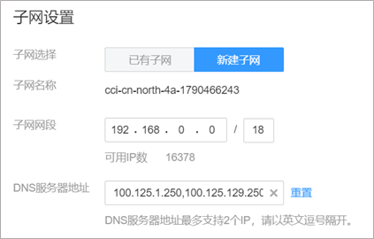
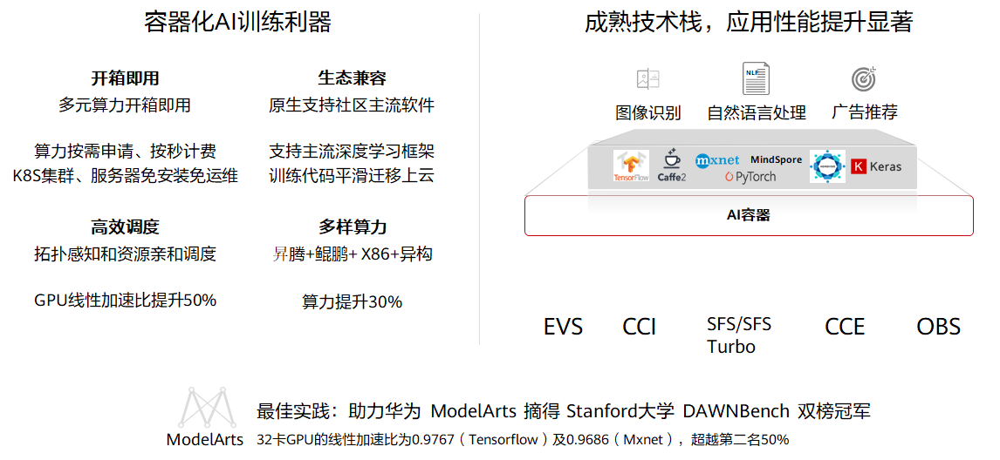
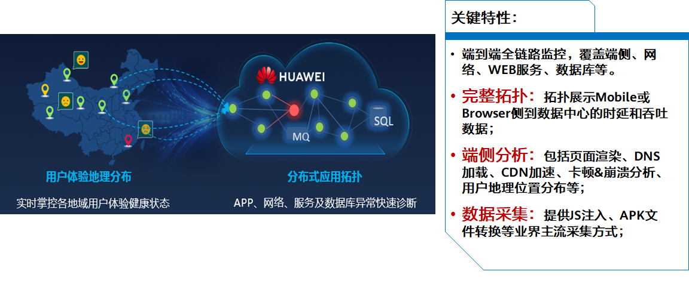
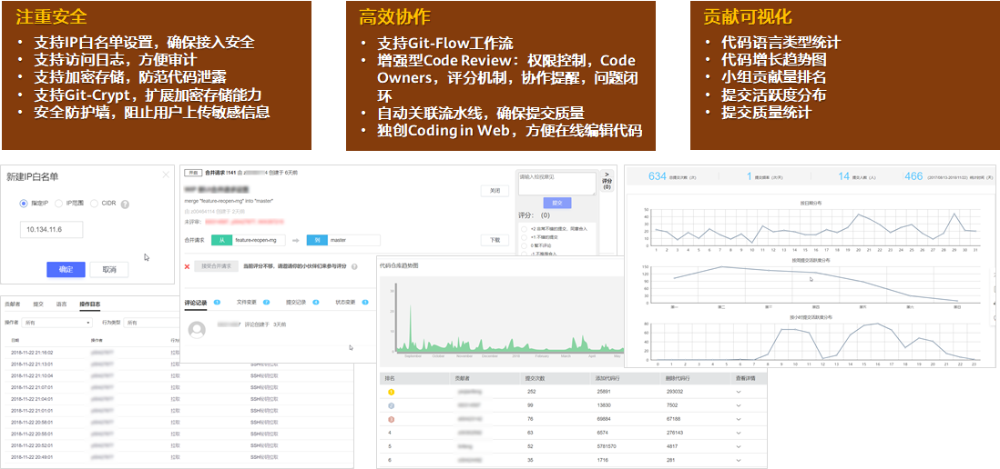
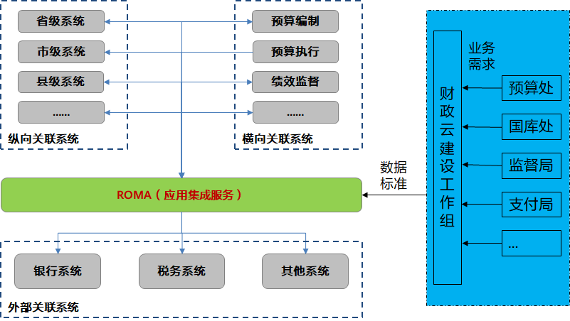

# 1. 容器与云原生

## 1.1 华为云容器服务全景图

1. 华为云容器全栈服务 - 加速行业的云原生转型


- 底层通过CCE云容器引擎、CCI云容器实例、以及CCE混合云形态CCE@HCSO提供容器的基础设施能力，CCE提供K8S原生的容器平台体验，也就是提供容器集群以及容器集群之上容器应用的管理能力
- CCI提供的是容器实例的能力，这是一种Serverless的容器能力，用户不需要购买和管理集群，像购买虚拟机一样直接购买容器。
- CCE主要适用于长期、大规模的业务场景，用户有完整的容器及资源管理能力，CCI适用于计算密集型的行业，主要用于计算任务的执行
- 在基础设施之上，提供了完整的容器运维管理配套服务，如镜像仓库SWR、应用编排AOS、服务网格ASM、容器流水线Containerops和容器运维平台AOM
- 在这个完整的全栈服务之上，我们抽象并构建了三大容器解决方案：容器多云混合云解决方案、高性能容器批量计算解决方案、容器智能边缘计算解决方案
- 整个全栈容器服务，带给客户三大优势：易使用、易运维、高性能：更贴近行业用户需求和使用习惯的解决方案，加速行业容器化；覆盖从交付到运维全流程工具，降低容器化转型及运维难度
- 依托高性能基础设施，提供更高性能、更可靠的基础服务保障

2. 华为云容器引擎CCE


- 华为云容器引擎CCE  - 高性能、高可靠的企业级Kubernetes服务
- 云容器引擎（Cloud Container Engine，简称CCE）提供高度可扩展的、高性能的企业级Kubernetes集群，支持运行Docker容器。借助云容器引擎，您可以在华为云上轻松部署、管理和扩展容器化应用程序。
- 云容器引擎深度整合华为云高性能的计算（ECS/BMS）、网络(VPC/EIP/ELB)、存储（EVS/OBS/SFS）等服务，并支持GPU、ARM、FPGA等异构计算架构，支持多可用区（Available zone，简称AZ）、多区域（Region）容灾等技术构建高可用Kubernetes集群。
- CCE团队国内最早投入Kubernetes社区的团队，是容器开源社区主要贡献者和容器生态领导者。CCE服务是全国最早的kubernetes商业产品，是全球首批通过CNCF一致性认证的产品。自2014年商用以来，已累计为5000多名用户提供容器化服务。
- CCE的主要价值在于开放和开源的生态、增强的商业化特性、灵活兼容易购基础设施

3. 容器高性能批量计算底座 - 云容器实例 (CCI)


- 容器高性能批量计算解决方案的底座为CCI服务
- CCI服务是全球首个基于K8S的Serverless容器服务
- 客户使用Serverless的使用CCI时，服务关注底层硬件及资源利用率，更专注自己的业务，同时CCI提供按需按秒计费，方便客户使用
- 整个CCI服务包括三大部分，从上到下为volcano批量计算调度平台、K8S容器编排调度和安全容器。
- Volcano：原生K8S对于批量计算业务支持较弱，volcano在批量计算领域做了两方面增强，一方面是做了高级作业管理：比如排队，优先级，驱逐，回填，防饿死等等能力，另一方面做了智能调度能力，比如有拓扑感知的亲和性调度、动态driver-executor比例调整等能力，同时也在调度上支持Gang Scheduling、PS-Worker、Ring Allreduce等调度及分布式框架
- K8S及安全容器上，华为云CCI可以做到一分钟启动1000个POD并打通网络和存储，并且提供虚拟机级别的安全，保证客户的程序和数据。
- 除了这些能力，CCI提供多种底层资源，鲲鹏-X86-昇腾-GPU，同时提供高性能的网络，比如300GBps的NV LINK以及100Gb的IB网络

4. 华为云容器镜像SWR


- 容器镜像服务（Software Repository for Container，简称SWR）是一种支持镜像全生命周期管理的服务， 提供简单易用、安全可靠的镜像管理功能，帮助您快速部署容器化服务。您可以通过界面、Docker CLI和原生API上传、下载和管理Docker镜像。
- 容器镜像服务可配合云容器引擎CCE、云容器实例CCI使用，也可单独作为容器镜像仓库使用。

5. 华为云ASM服务


华为云ASM服务 - 基于Istio的高性能、高可靠、非侵入的企业级Service Mesh服务
- 应用服务网格（Application Service Mesh，简称ASM）是华为云基于开源Istio推出的服务网格平台，它深度、无缝对接了华为云的企业级Kubernetes集群服务云容器引擎（Cloud Container Engine，简称CCE），在易用性、可靠性、可视化等方面进行了一系列增强，可为客户提供开箱即用的上手体验。
- 应用服务网格提供非侵入式的微服务治理解决方案，支持完整的生命周期管理和流量治理，兼容Kubernetes和Istio生态，其功能包括负载均衡、熔断、限流等多种治理能力。应用服务网格内置金丝雀、蓝绿、A/B Test等多种灰度发布流程，提供一站式自动化的发布管理。应用服务网格基于无侵入的监控数据采集，提供实时流量拓扑、调用链等服务性能监控和运行诊断，构建全景的服务运行视图。
- ASM的最大优势是相较于传统的微服务框架，如SpringCloud、Dubbo等，在于语言无关同时不需要修改代码，是业界公认的云原生技术所推动的第三代微服务技术

- 开源，开放，全面生态
  - 原生支持Istio生态
  - 提供Istio生态工具：Kiali、Grafana、Jaeger
  - 提供原生API，支持原生命令行istioctl
  - 提供图形化控制台，端到端完整用户体验
- 增强的商用化特性：易运维、高可靠
  - 通过图形化拓扑监控和智能化，治理提升业务运维效率
  - 通过跨AZ高可用和控制面HA提升业务可靠性
  - 升级不中断业务保障应用流量持续稳定、可用
- 高性能，低损耗
  - 低QPS损耗：相比开源性能提升30%
  - 低资源消耗：相比开源降低30%
  - 海量应用实例治理：单集群最高支持两万POD实例治理

6. 华为云容器交付流水线


华为云容器交付流水线（ContainerOps）面向容器交付全流程，提供镜像构建、镜像管理、镜像部署、灰度发布等一系列服务，是助力企业快速实施容器技术，简化容器交付、运维流程的最佳实践工具。

华为云容器交付流水线：降低容器技术门槛，节省容器,改造成本，简化容器交付流程

容器交付流水线（ContainerOps）以DevOps理念为基础，面向从源代码到生产上线全流程，提供代码编译、镜像构建、灰度发布、容器化部署等一系列服务，助力企业落地容器DevOps最佳实践。ContainerOps解决了容器化场景下从源码到镜像构建、镜像部署过程中的问题，进一步提升了研发、部署和运维效率。

该服务的产品优势包括：
- 开箱即用，内置标准化流程模板简化使用
- 海外镜像加速，解决各类行业场景问题
- 开放式架构，CI/CD工具可插拔，易于与企业已有系统集成
- 支持alpha-beta-gamma端到端敏捷交付
- 无缝对接华为软件开发服务，能力覆盖DevOps全流程

7. 华为云应用编排AOS


- 华为云应用编排AOS：以容器应用为核心的云上自动化平台
- 应用编排服务（Application Orchestration Service，简称AOS）为企业提供应用上云的自动化能力，围绕容器应用，支持编排华为云上的主流云服务，实现在华为云上一键式的应用创建及云服务资源开通，提供高效的一键式云上应用复制和迁移能力。
- 使用应用编排服务，您只需要创建一个描述自己所需的云资源和应用的模板，在模板中自行定义云资源和应用的依赖关系、引用关系等，AOS将根据模板来创建和配置这些云资源和应用。例如创建弹性云服务器（包括虚拟私有云和子网），您只需要编写模板定义弹性云服务器、虚拟私有云和子网，并定义弹性云服务器与虚拟私有云、子网的依赖关系，子网与虚拟私有云的依赖关系，然后通过AOS使用该模板创建堆栈，虚拟私有云、子网和弹性云服务器就创建成功了。
- AOS模板是一种用户可读、易于编写的文本文件。您可以直接编辑YAML或JSON格式文本，也可以使用AOS控制台提供的图形化设计器，直观便捷的编写和修改模板。AOS的模板市场中提供了海量的免费应用模板，覆盖热点应用场景，方便您直接使用或为您提供参考。
- AOS通过堆栈来统一管理云资源和应用，创建堆栈过程中，AOS会自动配置您在模板上指定的云资源和应用。您可以查看堆栈内各云资源或应用的状态和告警等，对于云资源和应用的创建、删除、复制等操作，都可以以堆栈为单位来完成。

8. 华为云应用运维AOM


- 华为云应用运维AOM：云容器原生监控，资源与应用,全景视图
- 随着容器技术的普及，越来越多的企业通过微服务框架开发应用，业务实现更多使用云上服务，运维也转向云上的运维服务。对于云上应用的运维也提出了新的挑战
- 运维人员技能要求高，配置繁杂，同时需要维护多套系统。对于分布式追踪系统，学习和使用成本高，并且稳定性差。
- 云化场景下的分布式应用问题分析困难主要表现在如何可视化微服务间的依赖关系、如何提高应用性能体验、如何将散落的日志进行关联分析、如何快速追踪问题。

## 1.2 容器基础知识与概念

### 1.2.1 什么是容器技术？

1. 容器技术玩家及标准

- 容器技术在业界的定义是以Docker为代表的容器引擎技术和以K8S为标准的容器编排技术
- Docker代表容器引擎技术是因为docker主导了容器引擎的标准OCI，很多其他容器技术都遵循或者兼容OCI标准，如Kata安全容器
- Kubernetes是业界公认的容器编排领域的事实标准，几乎所有的公有云厂商的容器技术都是基于kubernetes实现的。早期的sockerswarm和mesos已经在市场边缘化。

2. 什么是Docker？


- Docker是最主流的容器运行时，即容器引擎。containerd是容器技术标准化之后的产物，为了能够兼容OCI 标准，独立负责容器运行时和生命周期（如创建、启动、停止、中止、信号处理、删除等），从daemon中剥离，向docker engine提供运行容器的API，通过grpc通信；每创建一个容器，containerd都会创建一个shim进程，每个shim会调用runc（前身是libcontainer）进行实际的容器运行时管理，比如创建namespace的隔离
- 涉及docker的关键概念有镜像，即容器应用发布件，通过dockerfile描述，docker’会根据dockerfile构建镜像；有镜像仓库，及镜像存放的地方。容器，及容器应用运行的环境，通过容器的几个关键技术进行隔离
- Docker所应用的几个关键技术都不是docker发明的，而是linux早就成熟的技术，docker将这几个技术整合，形成了革命性的成果。
  - Namespace负责运行环境的隔离，即每个容器都是一个独立进程，通过namespace技术进行隔离，每个容器互相不可见，包括进程隔离、网络隔离、文件隔离；
  - Cgroup是负责运行资源的隔离或者说独占，可以为每个容器指定资源数量，互相不侵占；
  - Union filesystem是解决应用运行的小型化统一标准，容器镜像提供了容器运行的基础，但容器镜像并不等于容器。容器镜像是通过存储驱动技术管理的一系列分层的只读文件，而当容器镜像运行为容器时，就会在镜像的最上层添加一个可写的层，也就是容器层，所有对于运行时容器的修改其实都是对这个容器读写层的修改，所有对容器的变化，比如写新的文件，修改已有文件和删除文件，都只会作用在这个容器层之中

3. 什么是Kubernetes？


- Kubernetes 这个单词来自于希腊语，含义是舵手或领航员。Kubernetes简称k8s，因为k到s有8个字母
- Kubernetes是谷歌贡献给开源社区的，是谷歌根据自己内部容器borg（布谷鸟），在去除自己业务属性后开源的一个产品。
- K8s的标准架构中是以集群为整体的，一个集群就是一套完整的k8s产品，大多数企业会在其上封装管理面进行集群级别的管理
- 集群中会有一个主控节点master，负责管理整个容器集群，一般由于其中使用的etcd，高可用场景下master的数量至少是3个。
- 集群中会有很多的业务节点node，负责运行容器应用。Master会在每个node上安装kubelet作为其管理node的agent。
- 用户使用k8s时通过master上的apiserver，调用声明式的接口里定义所需要的应用、服务等各类资源对象，master的控制器和调度器会根据用户的定义，在node中进行创建，并且时刻监控其状态，保证一直符合用户的定义
- 在node上容器应用，通过kubeproxy提供统一访问能力

### 1.2.2 容器的技术特点和技术优势

Docker的技术特点：
- 容器镜像定义了统一的软件交付标准
- 文件挂载提供了更小资源占用的运行环境
- 共享OS内核使容器本质上只是一个进程，秒级启停

Docker的技术优势：
- 统一的交付标准可以屏蔽环境差异，使能DevOps
- 更小的资源消耗，提高资源利用率，匹配微服务架构
- 极速的弹性伸缩、故障恢复，解放运维生产力


Kubernetes的技术特点：
- 通过声明性语法直接定义应用的最终状态
- 提供开放的开放的插件机制
- 灵活的资源权限隔离机制

Kubernetes的技术优势：
- 由定义的应用状态，自动的部署、重启、迁移、伸缩
- 插件机制使K8S兼容各类基础设施（公有云、私有云）
- 灵活的隔离机制能够快速为不同团队构建运行环境

### 1.2.3 Kubernetes关键概念

1. POD


- 在Kubernetes中，Pod是能够创建、调度、和管理的最小部署单元，是一组容器实例的集合，而不是单独的应用容器。
- 同一个Pod里的容器共享同一个网络命名空间，IP地址及端口空间和卷。
- 从生命周期来说，Pod是短暂的而不是长久的应用。Pod被调度到节点，保持在这个节点上直到被销毁。

再充电：
- Kubernetes编排的最小单位并不是容器，是一个叫做POD的东西。
- POD翻译成中文就是豌豆荚的意思，我们知道在一个豌豆荚里可以有很多豌豆，这些豌豆就是一个个的容器实例。
- 那么这些容器实例之间有什么关系呢？记住两个点即可：同一个POD内的容器共享数据存储和IP地址。
- 为什么要这么设计呢？首先我们需要知道很多时候我们需要使用容器承载微服务。什么是微服务呢，简单来说就是小而单一的服务。
- 在做微服务设计的时候，我们一般推荐一个应用一个进程，如果承载体为容器的话，那就是一个容器一个进程。
- 但是现实是很多时候为了管理微服务我们需要安装相关的服务监控软件或数据读取软件。也就意味着我们需要在一个容器中安装多个软件，也就是多个进程。这样就破坏了我们刚刚说的一个容器一个进程的原则。
- 为了完成符合微服务的设计原则，谷歌设计了POD这个概念。一般一个POD中会有多个容器，一个服务容器（用于提供服务），多个辅助容器（用于完成服务容器的监控或数据的管理。）
- 打个比方我们有个POD，POD内有三个容器，分别是：web容器、监控容器和日志读取容器。
- 首先web容器中只运行web软件，对外暴露的端口为80
- 监控容器中运行web容器的监控软件，此监控软件只需要监控127.0.0.1:80即可完成web服务的监控。因为POD内的容器共享IP地址。
- 日志读取容器，只需要将相关路径下的文件读取上报给对应的日志管理平台即可。因为POD内的容器共享数据存储。
- 通过POD这个概念的设计，我们就可以很轻松的管理相关服务了。

2. Deployment


- 容器应用部署的时候根据其特点，k8s对齐进行了封装，对于无状态应用，一般使用deployment对象，k8s通过deployment控制器进行管理。
- 无状态应用的本质就是一个应用的多个实例之间完全没有区别，每个请求在不同的实例返回的结果都是一样的，k8s对他们的处理也是随机的，比如缩容
- 如果重启了无状态应用，由于其不需要对接持久化存储，应用产生的数据（、如果有）是不会保存下来的，因为k8s的重启会杀掉这个容器重新拉起一个新的容器
- 无状态应用也就是deployment在k8s的实践中是使用最多的一种对象。

3. Statefulset


- 对于有状态应用，k8s封装了statefulset来管理，也就是statefulset控制器进行管理
- 有状态应用本质是在运行过程中会保存数据或状态的工作负载称为“有状态工作负载，每个实例都是唯一的
- 一般都会需要挂载持久化存储来保证数据的持久化
- 有状态应用除了数据之外，每个实例都是一个独立的，比如mysql，会区分主从实例，那么在重启之类的操作的时候，每个实例的重启是有顺序的

4. DaemonSet


使用 DaemonSet 的一些典型用法：
- 运行集群存储 daemon，例如在每个节点上运行 glusterd、ceph。
- 在每个节点上运行日志收集 daemon，例如fluentd、logstash。
- 在每个节点上运行监控 daemon，例如 Prometheus Node Exporter、collectd、Datadog 代理、New Relic 代理，或 Ganglia gmond。

5. Service


K8s为了为了实现服务间的发现和负载均衡，Kubernetes设计了service这个概念，负责提供容器应用的访问，是通过4层协议访问，及通过端口区分

Service的类型和解释：


- Service一般有3种：ClusterIP，内部访问，走集群内私有IP；NodePort，外部访问，走节点的IP，有可靠性问题；LoadBalancer，外部访问，通过对接elb实例访问；
- 逐层包含。由内到外

6. Ingress


- 如果需要7层访问，通过http的url来区分，一般使用ingress
- Ingress一般是在集群北部提供一个7层负载均衡能力，对接到service上实现7层路由转发的能力，一般厂商提供的都是nginx。

7. Configmap

ConfigMap用于存储在kubernetes中部署的应用配置数据，它主要聚焦：
- 为已经部署的应用提供动态的、分布式的配置管理
- 封装配置管理信息，简化kubernetes的部署管理
- 为kubernetes创建一个灵活的配置管理模型
- ConfigMap的设计目标：
  - 描述一个ConfigMap资源
  - 描述ConfigMap作为环境变量的语义
  - 描述ConfigMap作为数据卷文件

```yaml
kind: ConfigMap
apiVersion: v1
metadata:
  creationTimestamp: 2016-02-18T19:14:38Z
  name: example-config
  namespace: default
data:
  example.property.1: hello
  example.property.2: world
  example.property.file: |-
    property.1=value-1
    property.2=value-2
    property.3=value-3
```

Configmap的作用是用来为容器应用配置配置文件和参数，和容器的存储类似，通过挂载卷的方式将配置文件传入容器中

8. Secret

Secret用于存储Kubernetes中部署的应用需要的敏感信息，比如密码、token、证书等，提供了一种安全和可扩展的机制：
- 用于存储少量的敏感数据（小于1MB）；
- secret以volume的方式挂载到volume上；
- secret卷后端tmpfs文件系统（ram-based），不会落在磁盘中

```yaml
apiVersion: v1
kind: Secret
metadata:
  name: mysecret
  namespace: default
type: Opaque
data:
  username: YWRtaW4=
  password: MWYyZDFlMmU2N2Rm
```

9. 命名空间 - NameSpace


- Kubernetes集群默认有三个namespace，之前我们创建的Kubernetes对象默认都是在default这个命名空间。
- 除此之外，默认还有kube-system，主要用于Kubernetes系统组件使用。
Kube-public，主要用于公共资源的使用。
- 当然除了这三个默认的命名空间，用户还可以根据项目需要自己创建相关的命名空间

### 1.2.4 CCI快速实践 - 部署一个Nginx负载

本次实验是使用CCI服务部署一个Ngnix负载，整个实验分为下边四大步骤：


1. 创建命名空间

- 在华为云页面上，根据产品-》基础服务-》容器服务-》CCI的路径找到云容器实例服务
- 进入到CCI控制台，选择创建命名空间<br>

- 填写命名空间名称。<br>

- 设置VPC，选择使用已有VPC或新建VPC，新建VPC需要填写VPC网段，建议使用网段：10.0.0.0/8\~22，172.16.0.0/12\~22，192.168.0.0/16\~22<br>

- 设置子网网段，每个可用区（AZ）下需要创建一个子网。<br>

- 点击创建

2. 创建负载

- 在左侧导航栏中选择“工作负载 > 无状态（Deployment）”，在右侧页面单击“创建无状态负载”。（大家可以回想前面章节，NGINX为什么属于无状态应用）
- 添加基本信息：<br>
负载名称：例如nginx。<br>
命名空间：选择步骤1：创建命名空间创建的命名空间。<br>
Pod数量：本例中修改Pod数量为1。<br>
Pod规格：选择通用计算型，CPU 0.5核，内存 1GB<br>

- 容器配置在Docker官方镜像中选择nginx镜像，使用默认镜像版本。<br>

- 配置负载访问信息。<br>
选择负载访问方式，有如下3种选项。不启用：负载不提供外部访问方式，适合一些计算类场景，只需计算完存储结果即可，无需与外部通信。
  - 内网访问：内网访问将为当前负载配置一个负载域名或内网域名/虚拟IP，使得当前负载能够为内网中其他负载提供服务，分为 Service 和 ELB 两种方式。
  - 公网访问：通过弹性负载均衡，从外部访问访问负载。<br>
本例中，选择配置为“公网访问”，这样可以通过负载均衡的IP和端口访问Nginx负载。<br>
配置服务名称为“nginx”，选择ELB实例，如果没创建负载均衡，可以单击“创建增强型ELB实例”创建一个。<br>
配置Ingress名称为“nginx”，ELB协议为“HTTP”、端口为“80”。<br>

- 设置负载端口为“80”（也可以选择其他端口），容器端口为“80”（容器端口必须为80，因为Docker官方Nginx镜像配置的端口为80，具体请参见https://hub.docker.com/\_/nginx/）。<br>
HTTP路由映射路径为“/”并关联到负载访问端口，这样就可以通过“ELB IP地址:端口”访问Nginx负载。<br>

- 单击“下一步”，然后单击“提交”，单击“返回无状态负载列表”。<br>
在负载列表中，待负载状态为“运行中”，负载创建成功。<br>


3. 访问负载

- 工作负载创建成功后，您可以通过浏览器访问nginx。<br>
单击负载名称，进入负载详情页面。<br>
选择“访问配置 > 公网访问”Tab页，拷贝公网访问地址。<br>


4. 清理资源

您已经完成了实验，节点和工作负载运行过程中会产生费用，建议您清除资源，避免资源浪费。
- 1、在左侧导航栏中选择“工作负载 > 无状态（Deployment）”。
- 2、选择本次nginx负载并点击删除按钮删除负载


## 1.3 容器与云原生

1. 什么是云原生与云原生基金会

云原生基金会（CNCF）对云原生的定义是：<br>
云原生技术有利于各组织在公有云、私有云和混合云等新型动态环境中，构建和运行可弹性扩展的应用。

云原生的代表技术包括容器、服务网格、微服务、不可变基础设施和声明式API。

云原生基金会（CNCF）全称是：Cloud Native Computing Foundation，由Google、华为等多家企业联合创建于 2015 年7月21日。

华为云是云原生基金会（CNCF）的亚洲唯一创始会员，国内唯一白金会员

2. 华为是容器开源社区主要贡献者和容器生态领导者


华为容器从14年开始持续贡献云原生社区，k8s很多关键特性都是华为贡献，如亲和和范钦和调度，ipvs，集群联邦等，这些贡献都已经运用到业界主流厂商的容器产品中

3. 云原生增长趋势 (2016至2018)


- 云原生基金会的调查显示云原生已经成为业界主流的选择，项目使用和CNCNF大会的参会人数快速增长
- 云原生的快速发展得力于云原生的三大优势：更短的开发周期、更灵活的弹性策略、更好的可移植性

4. 容器技术的应用已经成为全球各行业的主流趋势


根据权威咨询机构Gartner和451research调查显示，全球超过80%的企业已经开始使用容器技术

## 1.4 华为容器混合云和多云解决方案及应用场景

1. 华为容器多云和混合云 - 容器云的终极解决方案

包括CCE、SWR、ASM、MCP、Containerops、CCE@HCSO多个服务


- 华为云容器多云和混合云解决方案是以MCP多云容器平台为核心，统一管理各个云环境中的k8s集群，形成统一的容器管理平台
- 通过ASM跨云实现服务网格能力
- 兼容性广泛，不仅仅是华为云的容器服务，各大友商及用户自建的k8s集群都能接入管理
- MCP平台基于多集群与Federation联邦技术完成多个不同区域、不同云的K8S管理，实现统一的应用管理
- CCE是华为云上的容器服务能力，为用户提供高性能、高可靠的企业级Kubernetes服务
- CCE HCS Online基于华为云CCE服务，为用户提供本地IDC中与CCE能力一致的服务体验
- ASM完成多个不同区域、不同云的K8S集群上所部属应用的全局治理
- 客户可基于业务阶段选择性使用CCE、CCE HCS、ASM、MCP

2. 容器混合云业界现状


一般业界的容器多云混合云分为三个阶段：
- 阶段一的一般做法是通过一个console将k8s的接口集成上来，这样做的非常简单，但是只是提供了一个统一的界面，封装的再好每个集群还是完全独立的，一个应用的多个实例不能形成统一入口、不能形成统一调度管理
- 阶段二打通了应用的调度管理，应用可以跨云通信（容器网络），有统一的入口，但是不能跨云弹性伸缩，没有跨云服务治理
- 阶段三是终极阶段，打通了跨云的弹性伸缩和服务治理

当前大部分友商提供的容器混合云和多云方案处于阶段1或者2，华为云可以提供全阶段方案，并且可以平滑演进。

3. 容器多云和混合云方案的应用场景

场景一：业务流量分担

诉求：降低重资产基础设施成本


通过华为容器多云/混合云解决方案，业务可以同时部署在不同地域的云机房中，通过统一流量分发的机制，实现应用访问流量的地域亲和，降低业务访问时延；同时，用户可以将线下IDC中的业务在云上扩展，当业务流量激增时，快速在云上弹性扩容，将大部分的流量引导到云上实例；在流量回落后，自动缩容云上实例，流量全部回归线下IDC，用户不再需要根据流量峰值始终保持和维护大量资源，节约成本。

场景二：数据与业务分离

诉求：兼顾数据安全性和业务灵活性


对于金融、安全等行业的用户，业务数据的敏感性要求相关业务必须运行在用户的IDC中，通过华为容器多云/混合云解决方案，用户就可以将数据业务保留在本地的IDC中而将一般业务部署在云上，通过多云/混合云容器解决方案统一管理。

场景三：开发与部署分离

诉求：兼顾IP安全和基础设施成本


在CI/CD的场景中，一些用户处于IP安全的考虑，希望开发环境在本地的IDC，生产环境在云上。通过华为容器多云/混合云解决方案，就可以将开发环境的集群和生产环境的集群统一管理，实现应用线上发布的全自动流水线。

场景四：计算与业务分离

诉求：优质算力资源快速获取


对于AI、基因测序、视频处理等行业的用户，其计算任务依赖特殊的硬件，如CPU、裸金属服务器等，通过华为容器多云/混合云解决方案，用户就可以将计算业务部署在云上，弹性利用云上的特殊硬件算力，而在私有云或其他云上部署一般业务，避免了大规模使用特殊硬件带来的成本压力。

场景五：业务多活容灾

诉求：业务稳定高可用


通过华为容器多云/混合云解决方案，用户可以将自身的业务同时部署在多个云的容器服务上，在某个云出现事故时，通过统一流量分发的机制，自动的将业务流量切换到其他云上，同时通过Kubernetes的快速弹性能力，迅速在其他云上扩容应用和资源。几分钟内就自动解决了一次现网事故的危机，再也不用担心“一年一宕机”的问题了。

容器混合云和多云优势：搭建部署简单，没有重技术栈负担，可兼顾数据安全、业务灵活性，优质算力获取、资产成本等优势；应用在线上和线下迁移无门槛，可靠性和容灾能力易获得，灵活、快速满足客户多样性混合云场景；

4. 华为容器混合云和多云价值

- 避免厂商锁定


通过华为容器混合云和多云解决方案，统一管理在不同云供应商或本地IDC的集群，应用可以无依赖的部署在不同云环境的容器集群中

- 高效容灾管理


通过华为容器混合云和多云解决方案，应用部署在多云和混合云集群中，通过ASM自动切换流量；同时通过MCP可应用实例将自动弹性到其他云上，实现业务的容灾管理

- 应用地域亲和


通过华为容器混合云和多云解决方案，应用可以部署在不同地域的数据中心的集群中， 实现地域亲和的请求转发，有效降低业务时延。

通过ASM的流量治理能力，多云部署业务的场景下，ASM可已自动识别用户访问来源地域，自动就近分发流量到业务实例，降低业务访问时延

- 统一开放的管理平台


华为容器多云混合云平台是一个开放平台，提供各类高级能力，如服务网格、跨云devops、性能监控等。

通过华为容器混合云和多云解决方案，客户可以统一管理多云环境中的K8S集群及应用，并且通过MCP的开放平台能力，接入各类高级功能如服务网格、容器DevOps、应用性能管理等

5. 容器多云混合云解决方案 2.0


- HC大会上，华为云发布了容器多云混合云解决方案2.0，基于Vessel的下一代基础设施，持续构建领先的容器多与混合云能力
- 华为云容器引擎CCE所管理的Kubernetes集群规模升级。由于开源Kubernetes在调度、网络、存储、监控等各方面的技术限制，目前业界的容器产品对于Kubernetes集群的支持规模普遍有限。而华为云此次通过一系列的技术突破，将单集群的管理规模提升到了10000节点、100万容器，并且提供了30秒100节点的快速扩容能力。
- 容器存储更新版本Everest，统一了容器卷的管理，使用Kubernetes Volume语义屏蔽多种存储服务差异，拉通创建、删除、查询、迁移、备份等操作，同时构建了百万IOPS、低时延、高性价比的容器存储，在AI计算、基因数据分析、大数据处理等场景有着明显优势。当前的开源容器存储生态中，只定义了南向的标准化容器存储接口CSI，即容器编排系统与存储技术供应商之间的接口，而Everest“珠穆朗玛峰”提供了易用、大规模、高性能的容器存储，实现了从“民用级”向企业级的提升。
- 新一代容器网络Yangtse。在大规模场景下，华为云容器网络发放与接通速度有了飞越式增长，1万容器Port发放只需1分钟，容器网络接通速度小于1秒。Yangtse“扬子江”的意义在于构建云原生的容器网络，把之前分层的容器网络与下层VPC网络打通，消除通信的损耗，让容器网络与原生云网络达到完全一样的效果
- 容器监控升级版本Glacier，支持跨云应用的全景监控，并支持社区的原生Prometheus生态。结合集群联邦与策略引擎，可实现30秒应用跨云的自动弹性。Glacier“冰川”的意义在于打造下一代容器基础设施的容器监控与自动弹性扩容，实现近似于无限的巨大容量并且稳定。

## 1.5 华为容器高性能批量计算解决方案及应用场景

### 1.5.1. 高性能批量计算三大解决方案


传统业务容器化已经进行4-5年，华为云判断现在Job计算类任务也开始进行容器化，因此也推出了基于容器的高性能批量计算解决方案。

高性能批量计算可以为客户提供鲲鹏、X86、GPU和昇腾的多种算力，支持客户以Serverless的方式获取算力，并通过Volcano提供高级作业管理及智能调度能力，目前主打基因、大数据和AI三大场景。

基因容器目前80%的三代测序企业都选择基因容器，相比传统HPC的方式有10倍效率提升

大数据容器通过存算分离、大数据和业务混合部署等方式提升50%性价比
AI容器通过智能调度，提升大规模GPU场景下的线性加速比，帮助华为云夺得DAWN Bench性能榜双料冠军

1. 基因容器 - 轻松应对海量测序数据的分析和挖掘


- 基因容器可以支持10万容器规模并发，让WGS 30X速度提升10倍
- 基因容器使用CCI，提供灵活的CPU内存配比，并且按需按秒进行计费，帮助基因测序分析用户节省成本
- 基因容器提供流程引擎以及自动化扩缩容、自动化执行的能力，答复降低用户运维成本
- 基因容器除了提供Cromwell、SGE、PBS、Slurm等流程和调度引擎外，也支持大数据引擎，方便用户进行基因数据的挖掘，提供高附加值业务
- 第三代基因测序的头部企业未来组选择使用基因容器全自动化的执行测序分析，并对整个流程进行调优，节省成本、缓解人工运维压力

2. 大数据容器 - 提升大数据分析性能，降低使用成本


- 大数据容器提供每秒1000次调度能力，较社区方案提升10倍，并提供纵向扩缩容，让客户快速获取大数据算力
- 大数据容器通过分布式缓存以及volcano智能调度，提升40%性能
大数据容器通过OBS+HDFS进行计算存储分离，并可以和业务进行混合部署，提升集群利用率，降低50%成本
- 大数据容器根据任务需求自动进行扩缩容并统一企业各个业务调度平台，让客户减轻运维压力

3. AI容器 - 加速人工智能计算



- AI容器用Serverless的方式提供算力，极大方便算法科学家进行训练和推理
- AI容器原生支持TF，Caffe，MXNET，pytorh，mindspore等主流的训练框架
- AI容器通过拓扑亲和性调度，调度任务时将GPU间网络和存储状态也考虑在内，保证GPU间高速通信，从而提升线性加速比，目前32卡GPU线性加速比为0.97+，比友商提升50%
- AI容器支持多种算力，包括昇腾算力，相比传统GPU算力提升30%
- 通过使用AI容器，华为云在DAWN Bench性能评比中夺得双料冠军，128卡GPU线性加速比达到0.8

### 1.5.2 解决方案亮点

- 容器高性能批量计算实例按需按秒收费


- 传统的云计算资源比较常见的用法是包年包月，资源池大小比较固定。在CCI服务中，客户可以通过购买包核时套餐包灵活的选择自己的使用方式，比如他可以通过大规模并发的方式缩短计算时间或者应对业务波峰波谷
- CCI容器实例规格灵活，CPU和内存可以在1:2到1:8之间灵活配比，客户通过选择合适的容器规格可以大幅降低使用成本

- 高性能计算提供Serverless方案

|  | 使用VM/裸机服务自建K8S | 基于VM/裸机的K8S公有云服务 | 使用CCI服务 |
| --- | --- | --- | --- |
| Item One       | Item Two       |
| 申请节点	| 需要	| 需要	| 不需要 |
| 打通网络和存储	| 需要	| 不需要	| 不需要|
| 搭建K8S集群	| 手工	| 自动	| 无需关注|
| K8S 纳管节点	| 手工	| 自动	| 无需关注|
| 应用部署	| 自动	| 自动	| 自动|
| 集群扩缩容	| 手工申请节点并纳管	| 自动申请节点并纳管	| 无需关注|
| K8S版本升级	| 手工升级	| 自动升级	| 无需关注|
| K8S Bug定位	| 手工定位	| 无需关注	| 无需关注|
| K8S Bug修复	| 手工解决	| 无需关注	| 无需关注|
| 集群利用率	| 手工维护，可能存在浪费	| 手工维护，可能存在浪费	| 无需关注|
| 硬件升级	| 热迁移，但有限制	| 节点热迁移	| Kata热迁移|
| 图形化监控	| 不支持	| 支持	| 支持|

- 目前客户有三种使用容器的方式，一种是购买资源自建容器平台，一种是使用华为云的容器引擎服务，最后是Serverless的使用CCI服务。
- 在需要扩容的时候，CCI提供1000 POD分钟级启动速度，并且客户无需关心集群节点的扩展；在集群利用率上，客户在使用CCI服务的时候对他们来说集群利用率就是100%，其他两种用法客户要自己想办法去提升集群利用率。
- 这样客户使用容器高性能批量计算的时候，只需要指定镜像以及容器规格的大小和数量，其余所有的事情都交给华为云，让客户更加聚焦自己的业务

### 1.5.3 高性能批量计算按照使用资源收费的两种模式


- CCI虽然是提供Serverless的使用方式，但也可以让客户选择是是共享的模式使用计算资源，还是用包节点的模式使用计算资源。
- 共享模式下，租户的任务都在一个集群内进行调度，会有一定的抢占，客户根据资源使用量后付费或者预付费的进行购买。
- 专属模式下，由于客户将底层物理机器进行包年包月购买，因此资源有安全和隔离的优势，同时客户无需管理这些裸机，依然是Serverless的方式进行使用，付费方式为裸机包年的费用加上管理费。

# 2. 华为企业核心业务未来架构演进及华为云方案（云原生应用架构）

企业核心业务的架构需要不断演进才能支持新需求、新场景和新业务的发展，但是由于业务架构、技术架构的规划和设计涵盖内容较多，涉及技术面广，对企业IT提出了较高的要求。

## 2.1 企业核心业务架构演进

1. 企业核心业务应用架构和集成架构发展历程


企业核心业务演进我们将主要分成两部分：应用架构发展历程和集成架构发展历程。
- 应用架构的演进，将依次经历单体应用架构、垂直架构、SOA架构，最终发展至微服务架构。
- 传统应用从单体架构开始，后来为了具备一定的扩展和可靠性，引入了负载均衡，于是就出现了垂直架构。接着是这些年十分火热的SOA架构，主要解决了应用系统之前集成和互通的问题。而微服务架构则是在SOA架构发展的基础上，进一步在探讨如何去设计一个应用系统以使应用的开发、管理更加灵活高效。
- 微服务架构是一种架构模式，它提倡将单一应用程序划分成一组小的服务，服务之间互相协调、互相配合，为用户提供最终价值。每个服务运行在其独立的进程中，服务与服务间采用轻量级的通信机制互相沟通(通常是基于HTTP协议的Restful API)。每个服务都围绕着具体业务进行构建，并且能够被独立地部署到生产环境、类生产环境等。

集成

同样的，与企业应用架构的演进历程一一对应，企业集成架构的演进，也将依次经历单体架构、网状架构、ESB集成总线，最终发展至混合集成架构。
- 单体集成架构阶段，公司以业务部门为导向构建业务系统，孤立的组织、功能型团队、单一用途的应用，系统信息孤岛严重，数据难以流通。
- 随着集成诉求的出现，系统间开始相互对接，催生出一系列意面式集成，虽然满足了系统间点对点通信的诉求，但是接口耦合度高，集成能力及经验无法复用，极易重复开发造成资源浪费，同时运维复杂。
- 伴随着企业应用通过SOA架构解耦，ESB总线和“集成工厂”模式得到广泛运用，由统一的组织和团队负责集成实现和运维，但是集成团队不懂业务，难以为业务团队提供更佳的决策信息，企业业务边界被固化，集团与子公司间跨地域对接困难，子公司内部大量系统也面临集成整合。
- 未来企业的集成架构演进将会突破企业集成边界，实现集成应用API、消息、设备、数据、跨云等多个场景的集成，为企业的一切应用、大数据、云服务、设备及合作伙伴构建连接。传统的由IT团队控制的“集成工厂”模式将转变为支持由业务线，子公司，应用程序开发团队和最终业务用户负责的自助集成模式，也就是我们所说的“统一混合集成平台”。

2. 应用架构演进


- 传统企业已有的众多单体应用，需要结合企业应用架构的演进路线，按照“云化路径”分类及其特征，围绕目标应用展开细化的应用迁移分析和设计。
- 针对传统本地化部署的应用，可以采用“保持不变”或“日落下线”的策略，不必投入过多成本。
- 针对云使能(Cloud-Enable)这一类型应用，可以采用“基础设施上云”和“应用使用PaaS云服务”的方式，充分享受云资源和服务的灵活与便利。
- 针对云原生(Cloud-Native)这一类型应用，可以对单体应用进行架构重新设计、基于容器和微服务技术重构应用，或者采购第三方云原生应用，仅需进行数据迁移。

## 2.2 华为云方案

### 2.2.1 应用架构演进之云服务总览

1. 应用架构方案


针对企业核心业务应用架构，华为云提供从IaaS、PaaS至大数据、EI企业智能完整的解决方案。技术平台涵盖了软件开发服务，为企业提供DevOps全流程一站式研发云平台和工具服务，让软件开发简单高效。应用运行平台和应用运维平台是面向企业的应用管理与运维平台，提供应用开发、构建、发布、监控及运维等一站式解决方案。

企业集成平台ROMA是新一代混合集成平台，聚焦应用和数据联接，提供消息、数据、API、设备集成能力。此外，还提供分布式消息、分布式缓存、区块链等中间件服务助力企业应用开发更高效、上云更便捷。


华为云智能应用服务，构建在云基础设施之上；提供了一个Cloud Native应用底座以及三个应用创新平台，秉承了应用上云更简单的理念，为企业的数字化转型和智能化升级提供了系统的解决方案，并将应用管理能力延伸到多云&混合云、打造更丰富的开放生态、由技术平台向行业使能平台发展。

一个应用底座ServiceStage：深耕技术平台，企业应用上云更简单。

三个应用创新平台分别是：
- 企业集成平台ROMA：连接一切应用和数据，打破数据孤岛；
- 智能边缘平台IEF：边云协同，使能行业智能；
- 区块链解决方案：聚焦民生，构筑可信社会。

华为云智能应用服务致力于提供企业数字化转型的最佳基础架构和业务创新解决方案，通过一站式应用开发平台ServiceStage、企业集成平台ROMA、智能边缘平台IEF和区块链解决方案，让企业应用上云更简单，数字化转型更智能。

2. ServiceStage - 应用管理与运维平台


华为云应用管理与运维平台ServiceStage提供**应用全生命周期管理**，实现业务敏捷DevOps，并通过独有的契约能力实现了**微服务治理与业务代码分离**，帮助企业开发者聚焦业务逻辑。ServiceStage聚焦行业使能，携手合作伙伴一起打造面向数字政府、智慧金融、数字工业、智慧零售等行业的端到端解决方案。

3. 最高性能 、开放开源微服务解决方案


华为云提供业界最高性能、开源开放的微服务解决方案，具备三点优势：
- 开箱即用的微服务框架，原生支持Java和Go，同时支持通过ServiceMesh接入PHP等其他语言应用
- 非侵入式微服务接入，少量改动即可接入微服务治理
- 开放兼容，兼容Spring Cloud等微服务框架

>补充阅读：<br>
- 非侵入式(non-invasive)<br>
允许在应用系统中自由选择和组装Spring框架的各个功能模块，并且不强制要求应用系统的类必须从Spring框架的系统API的某个类来继承或者实现某个接口。（没有依赖，自主研发）
- 侵入式(invasive)<br>
侵入式需要知道框架中的代码，继承框架中的某些类，与框架代码紧密结合在一起。
- 区别<br>
侵入式让用户代码产生对框架的依赖，这些代码不能在框架外使用，不利于代码的复用。但侵入式可以使用户跟框架更好的结合，更容易更充分的利用框架提供的功能。<br>
非侵入式的代码则没有过多的依赖，可以很方便的迁移到其他地方。但是与用户代码互动的方式可能就比较复杂

4. 立体运维 - 全方位掌控系统运行状态，快速响应


随着越来越多企业应用上云，云上应用的规模与复杂度日趋增长，对云上应用的运维，也提出了新的挑战。华为云AOM、APM等运维服务服务面向大规模企业应用的运维，在实践中演进并构建了一套完整的面向云上应用的立体化运维系统。

立体化运维主要是围绕用户应用进行监控，一站式完成用户体验监控，应用性能监控，基础设施监控。除了覆盖应用的端到端资源以外，同时对多种运维数据进行数据分析，通过多种可视化手段进行友好的界面展示。

此外，华为云提供一站式应用性能调优解决方案，从应用性能问题的发现、定位修复到在线实时监控，助力应用系统新业务快速上线和稳定运行。相比采用开源软件，测试端资源消耗下降80%以上，测试环境准备周期缩短90%以上，性能问题定位时长由周降至天，帮助更多华为云用户轻松应对数字化转型中面临的业务高峰流量冲击。

5. 华为云K8S全栈容器服务


华为云提供最强容器全栈服务，包括裸金属容器、Windows容器，GPU容器、虚拟机容器以及Serverless化的容器实例等。华为是中国首个CNCF初创成员和白金会员，Kubernetes社区贡献度全球Top3，容器性能业界最佳。

华为云提供了通过CNCF官方认证的两种Kubernetes服务供用户选择，包括云容器引擎（CCE）与云容器实例（CCI）。
- CCE是用户专属Kubernetes服务，用户可以通过它控制整个Kubernetes集群，同时管理基础设施资源与运行在Kubernetes上的容器化业务；
- CCI是Serverless Kubernetes服务，用户通过它只需要管理运行在Kubernetes上的容器化业务，无需感知Kubernetes集群而交由华为云自动管理，进一步降低Kubernetes落地门槛。

华为云容器镜像服务（SWR）提供了高性能、高容量、高安全性的企业级私有镜像仓库，并提供了镜像构建与发布流水线ContainerOps支持业务的自动化交付。

6. ROMA联接企业的现在与未来


过去的时间里，企业信息化仅解决数据如何接入IT系统的问题；而如今企业数字化转型的要求，对企业IT系统提出新的要求：要通过数字化的力量帮助企业在生产运营过程中持续降低成本、提高运营效率、扩大市场规模，解决数据如何变现才是其目标。

传统的企业IT是软件包为主，而在Cloud的2.0时代，Cloud Native应用占据了企业应用系统主流；如何在短时间内跨越时间鸿沟，成为现阶段企业数字化转型的一大挑战；政企应用多地域部署，打破空间鸿沟成为第二大挑战。政企的能力汇聚的同时，多企业协同成为常态，如何打破开放鸿沟成为企业数字化转型的第三大挑战。

ROMA一方面通过边缘ROMA Site配合，实现多云环境部署，完善多云、混合云集成能力，一方面通过Link打破空间鸿沟，实现IT&OT融合，真正全面的打破一切空间鸿沟；ROMA提供的50+种主流适配器、100家行业应用资产、无缝的对接SAP、金蝶等商用软件实现了老旧系统100%接入，打破时间鸿沟，实现企业IT系统平滑演进。 ROMA方便地为企业和他的伙伴提供接入私有协议的应用与数据的能力，开放所有ROMA的经验资产给企业，打破开放鸿沟，帮助企业和伙伴快速构建新的创新业务与应用。

### 2.2.2 应用架构演进之高性能中间件

1. 为什么要用云中间件服务

企业自己开发或使用开源中间件的弊端：
- 硬件故障：企业需要自己保证底层硬件设施的可靠性和故障替换。
- 软件安装部署：中间件自身的安装部署、补丁、升级等需要耗费企业大量的人力物力。
- 中间件软件bug和安全修复：需要投入大量人力维护中间件代码和安全补丁。

使用云中间件服务的好处：
- 开箱即用：完全不需要考虑软硬件安装部署，购买完毕即可使用。
- 可靠安全：由云中间件服务保证服务可靠性和故障切换。
- 升级和补丁：由云中间件专业团队负责代码维护和bug修复。

2. 传统应用的挑战及应用策略


分布式系统是一组独立的计算节点的集合，对用户提供一个单一系统的影像。网络-高度互联，集群-多节点，单一-透明化

分布式系统的特点：
- 透明性：透明性体现在扩展的透明性、数据复制、并行处理的透明性、故障失效对用户透明，访问数据位置对用户透明。
- 扩展性：硬件节点和软件都可以横向扩展。
- 并发性：通过集群中多节点的协调和并行处理，提高系统的并发性
- 开放性：分布式系统内部是分层的架构，每一层都具有良好的开放性。- 外部对用户提供业界流行或标准的规范协议，如RESTFUL、TCP协议。或开放的语法、语义、数据格式，如Jason、XML数据格式

3. 使用云中间件构建分布式云化应用


传统应用All in one的架构导致资源利用率低、可扩展性差、可靠性也无法得到保证。举例：一个电商系统，如果是All in one架构下，大促来临之前只能按照整系统的倍数去扩展。而不能按照缓存扩展5倍（登陆次数暴增）、数据库扩展2倍（实际的用户数据增长约2倍）比例去扩展。

这种封闭的架构，如果要做业务改动或新增业务模块都是比较困难的，因为所有的模块与数据库都是直接串行交互的。整系统的可靠性也比较差，如果数据库故障了，所有的业务流程都会受阻。增加了分布式消息队列以后，可以将各个应用模块做解耦，当某个业务模块故障时，不影响与其并行操作的其他模块。大大增强了系统的可靠性。

4. 快速构建云上企业级分布式应用


分布式缓存

应用定位：
- 为应用系统提供高性能的Key-Value的缓存数据库服务，支持Redis开源引擎。有效提升热点数据访问速度，并大幅降低数据库的压力。


Redis云服务的特点：
- 高性能：单实例QPS 10+万。
- 应用0改动：支持Redis3.0 / 4.0 / 5.0开源主流版本
- 数据安全：租户间物理隔离，支持跨AZ、跨Region部署，确保数据安全可靠
- 规格灵活：可选择 128MB ~ 1TB 多种缓存规格，并提供 单机 / 主备 / 集群 等多种实例类型，满足不同应用场景对缓存的需求
- 弹性扩展：缓存规格一键式在线扩容，无缝配合业务规模发展

分布式消息

为应用系统提供异步的消息队列服务。通过高可用的消息缓冲队列，实现应用解耦、突发流量处理及与第三方的互通和集成。


产品特性：
- 100%兼容开源：提供提供多种规格，按需使用，支持Kafka&RabbitMQ引擎
- 安全保证：VPC隔离，支持SSL通道加密和消息存储数据加密。深度修改消息引擎内核，按电信级标准修复开源安全问题
- 增强功能：一键扩容、消息查询，消息转储，消息存储加密等丰富的消息能力
- 亿级消息堆积：存储和实例规格可动态扩展，支持千万级并发支持企业级高性能应用
- 可靠消息存储：节点反亲和部署，支持跨AZ，同步落盘及多副本冗余，集群化部署确保数据和服务高可靠

IMDG：In-memory Data Grids 内存数据网格，是一种Key-value键值存储的内存数据库，为应用和不同的数据源之间提供高性能、基于分布式内存的数据组织和管理功能

DDM服务

作为RDS前置的分布式数据访问服务，彻底解决了数据库的扩展性问题，对应用透明地实现海量数据的高并发访问

应用场景：


关键特性：
- 业务不中断，自动完成水平拆分、平滑扩容
- 可承受PB级数据量、百万级并发量，十倍于单机数据库连接数
- 集群高可用，秒级故障自动恢复
- 兼容MySQL协议，业务代码零改动，透明读写分离

### 2.2.3 应用架构演进之微服务
#### 2.2.3.1 介绍

1. 微服务的优势
- 每个服务都很简单，只需要关注于一个业务功能
- 每个服务都可以由不同的团队独立开发
- 微服务都是高内聚，低耦合
- 微服务可以通过不同的编程语言和工具进行开发

2. 微服务带来的挑战
- 运维成本高：确保几十、甚至几百个进程正常运行，还得保证不能将磁盘空间耗尽、不能出现死锁，还得保证性能，这就不得不要求运维过程做到自动化。
- 接口依赖：服务依赖于彼此间的接口进行通信，一个服务的接口改变将对对其他服务造成影响。
- 分布式系统的复杂性：作为一种分布式系统，微服务引入了复杂性和其他棘手的问题，如“容错性、网络延迟、消息序列化、异步通信”

3. 微服务声明周期管理


4. 微服务的价值


核心价值：
- 上线更快 <br>
业务上线：年 > 月 > 周 > 随时上线
- 运行更稳 <br>
系统SLA：3个9 > 4个9 > 5个9 > 永不断服
- 成本更经济 <br>
资源成本：细粒度按需伸缩

5. 最高性能 、开放开源微服务解决方案


Apache社区首个微服务开源项目并已顺利毕业 - Service Comb

- 开箱即用的微服务框架
  - 原生支持Java和Go
  - 通过ServiceMesh接入PHP等其他语言应用
- 非侵入式微服务接入
  - 少量改动即可接入微服务治理
- 开放兼容
  - 兼容Spring Cloud等微服务框架

6. 华为云微服务 , 来自于华为全面云化转型成功经验


#### 2.2.3.2 典型场景

1. 以契约为中心的微服务开发模式


- 设计人员通过Open API 或者Native API的方式设计接口。可以通过Native API生成Open API，转换是双向的。
- 使用“代码生成”工具，输入Open API，生成Native API。Native API可以有多种形式，一种是给开发人员实现的接口；一种是给测试人员实现的测试接口。
- 使用“文档生成”工具，输入Open API，生成PDF或者Word文档
- 管理人员/用户等使用文档对产品进行宣传、备案或者接受第三方审计
- 开发人员根据Native API实现业务逻辑
- 测试人员根据Native API实现测试逻辑
- 实施人员根据Open API，录入接口网关，配置接口的流控、计费、开发策略等。
- 开发和运维人员基于Open API定义微服务健康运行的参数，统称为服务治理。
- 运维人员基于Open API观察接口的监控状态，并通过配置管理平台，对具体接口进行限流、降级等。

2. 微服务持续交付流水线


充分释放业务交付效率：让快更快

3. 微服务治理


丰富的治理策略和自动化自愈能力，实现运维的“自动驾驶”

支持微服务接口级SLA指标(吞吐量、时延、成功率)实时(秒级)监控和治理，保障应用运行不断服

4. 调用链跟踪和监控

全链路调用追踪，性能分析、问题定位，一招搞定


5. ServiceComb首个Apache微服务顶级项目


### 2.2.4 应用架构演进之立体运维

1. 云上运维目标与挑战


针对更加复杂的、分布式业务系统，全方位的掌控系统的运行状态，包括资源、上云业务，同时在发生各类问题时及时响应肯定是我们的运维目标。

但是，资源、上云业务、云上业务甚至业务用户体验，这三个层面该如何全方位掌控呢？常用的一些监控工具如zabbix、调用链追踪工具zipkin、日志工具logstash等，都是各有侧重点。在上云之后，工具多，使用和维护成本也较高。同时，分布式、复杂应用，其资源、微服务规模较大，上云之后也会面临着系统&资源各类问题难以追踪，日志散落，问题根因难以定位，微服务之间依赖关系难以关联，真实的用户体验情况难以掌握的问题。

2. AOM / APM架构简介


华为云云上运维解决方案可实现基础设施层、应用层、应用性能层这三层的一站式运维。这里的应用就是指上云业务。如图所示，应用部署在云服务器上。采集器也安装在云服务器上，探针安装在应用中。采集器主要用来采集指标、日志、事件等运行、运维数据，探针主要是用来采集应用的调用链、用户体验等数据。采集器和探针将基础设施数据、应用数据、用户体验数据采集后，经过大数据分析处理，之后通过监控指标、日志、拓扑、事务、调用链等展现出来，实现资源、云上业务、用户体验全面运维，不管是IT经理、运维工程师还是开发人员，都能够一站式获取所需，完成云上运维。

从图上可以看到，基础设施层、应用层、性能管理是不同的三层，采集器和探针也是分开的。这样也是为了满足不同规模的云上业务的运维诉求。将基础设施层、应用层运维看做是基础运维能力的话，性能管理层运维则是高级运维。安装采集器即可获取到基础运维能力，通过指标、监控、日志、告警等完成基础运维。在应用中安装探针即可获取高级运维能力，通过拓扑、事物、调用链等完成应用的高级监控、性能分析、用户体验等运维。

AOM：应用运维管理（Application Operations Management ）实时监控云上业务的服务、中间件及云资源全链路的数百种运维指标，通过运维知识库和AIOps引擎快速发现并诊断异常，保障业务稳定运行。

APM：应用性能管理（Application Performance Management）实时监控并管理云应用性能和故障的云服务，提供专业的分布式应用性能分析能力，可以快速解决应用在分布式架构下的问题定位和性能瓶颈等难题，为用户体验保驾护航。

他俩的区别就是AOM侧重于是监控、日志、告警能力，而APM侧重于应用、调用追踪，可以直击异常根因与辅助分析性能问题。

3. AOM - 资源 、应用 、业务一站式监控与分析

接下来我们详细介绍运维解决方案能力。

统一运维监控管理：实现资源、应用、业务一站式监控与分析。

这是一个总览图，我们可以通过总览看到四块信息。
- 左上角应用性能监控卡片，主要展示应用的吞吐量、时延、应用性能指数等信息。通过这个卡片可以快速掌握应用情况。
- 右上角用户体验监控卡片。这个卡片主要展现端侧用户情况、业务错误数、吞吐量、时延及top区域情况。本次实践不做详细介绍。
- 左下角基础设施监控卡片，主要展示主机、磁盘等的状态及用量等情况。
- 右下角信息统计主要展示告警、通知、资源用量趋势情况。
- 通过这些卡片，可以快速掌握资源、应用的情况。


4. AOM应用 & 资源关联分析


应用&资源关联分析：层层自动关联，直击异常。
- 层层自动关联是指应用、服务、实例、资源相关联。例如，我们当前过滤出了vmall应用。从左边这里可以看到，vmall应用对应的服务有4个，实例有4个，主机有1个。 这个分数内容分别是正常与全部比值。例如此处是表示4个服务中有2个异常。从右边也可以看出，有2个服务是红色表示的。
- 此处应用是红色表示，即说明应用当前异常。我们点击应用即可打开仪表盘查看应用各项指标。在这里看到存在错误调用。
- 这个主机也是异常的，我们也可以打开查看到主机拓扑图及实例、显卡、网卡等信息，这里看到告警分析存在异常。继续查看告警，即可找到异常原因。

这就是所说的应用与资源层层自动关联，直击异常。

5. AOM海量日志管理


日志管理：高性能搜索和业务分析，深挖日志商业价值。
- 日志管理是针对运行在华为公有云上的应用提供的实时日志存储&分析服务。提供的能力内容包括：日志数据收集，海量日志检索，日志存储和转储，日志订阅，关键词统计报表等。日志数据是从各弹性云服务器上收集来的，支持收集指定目录或指定的日志文件，如容器日志、服务器上的系统日志、运行在服务器上的业务的日志。日志被收集上来后，会经过日志清洗、实时分析、SQL引擎、智能聚类等处理，最终在日志管理界面中可实现实时日志的查看、检索、转储等需要。
- 日志实时查看就是实时查看最新的日志内容，通常用于实时分析。
- 有些时候，我们需要从日志中找出一些异常或error的关键信息，即需要进行日志检索。AOM当前支持按照时间维度、关键字、SQL主机、系统、服务等不同维度进行检索。检索后，也可以查看上下文。
- AOM的日志数据收集上来后是存储在日志服务集群的，存储时长不超过7天。如果需要转储到其他地方长久保存，则可以使用日志转储功能。AOM当前支持将日志转储到华为云对象存储服务OBS中，您可以再从对象存储中获取日志。
- 如果需要将日志导出到本地分析，也可以使用导出功能，以csv或txt格式导出。

6. APM全链路监控 - 覆盖从端侧到数据中心全链路



7. APM应用拓扑


应用拓扑：应用关系与异常一目了然，精准下钻定位故障。拓扑图是对应用间调用关系和依赖关系的可视化展示。

拓扑图主要是由圆圈、箭头连线、资源组成。每个圆圈代表一个应用，圆圈上每个分区代表一个实例。每个圆圈中的分数表示正被调用的实例数/可调用实例数。

分数下的内容分别表示在当前所选的时间中应用被调用次数、响应时延、错误数。每个箭头连线代表一个调用关系。调用次数越多，连线越粗。连线上的数据表示调用次数和整体时延。

拓扑使用Apdex对用户满意度进行量化，并使用不同颜色对不同区间Apdex的值进行标识。红色表示体验较差，黄色表示体验一般，绿色表示用户较满意。

针对错误调用和体验差的调用，可以查看调用链进一步定位原因。

拓扑图也支持按照时间、事务、topsql等维度进行筛选。

8. APM事务监控


业务会话监控：通过对业务监控，业务会话监控：监控每笔交易的KPI数据，提升用户体验。

VMALL作为一个电商应用，主交易线为登录网站-选择商品-下单购买-支付，这个就是业务会话。那这个业务中，各个1流程中的时延、错误都影响着vmall的用户体验。

用户体验在业界有一个标准，就是Apdex。它从用户角度出发，将应用响应时间的表现，转为用户对于应用的满意度评价，量化范围为0-1。值越小，表示用户体验越差。

根据vmall性能测试估值出一个apdex阈值。当响应时间在1倍阈值内，表示用户满意，1-4倍阈值内，表示用户可容忍；超过4倍时，表示用户已经烦躁了。业务会话监控会将整个业务的调用次数、错误、时延、apdex都用数字量化出来，这样错误和慢响应就都比较明显了。针对错误或慢响应，还可以查看事务拓扑，即查看该事务和其他的服务联系及情况，评估影响范围；可以设置阈值告警，以保障异常出现时快速响应；可以查看调用关系，找到真正慢或错误在哪里的代码。

总之，业务会话的监控可以了解最终消费者行为，用于业务发展决策；也可以快速发现业务的状态，对于异常的应用程序快速诊断。

思考题：

1. (多选）华为云中间件服务包含哪些?（       ）<br>
A. DCS<br>
B. DMS<br>
C. DWS<br>
2. （单选）DCS主要用于热点数据缓存，用于提升数据访问能力，降低数据库压力。 （       ）<br>
A. 对<br>
B. 错<br>
3. （单选）如果企业自己开发或维护中间件，则企业需要自己处理软硬件的安装部署、故障和维护，以及bug修复等；如果使用云中间件服务，则可实现开箱即用。 （       ）<br>
A. 对<br>
B. 错<br>
4. 在华为云应用运维的拓扑图上，不同的颜色代表该实例的健康程度, 颜色由Apdex值决定。Apdex值越接近 1，表示应用越健康。若一个应用实例未被其他应用调用，则其颜色为（       ） 。<br>
A. 绿色         <br>       B.  灰色<br>
C. 黄色          <br>      D.  红色<br>
5. TP99时延即满足百分之九十九的网络请求所需要的最长耗时。有四次请求耗时分别为：10ms、100ms、500ms、20ms，那么TP99时延则是（       ） 。<br>
A. 10ms     <br>               B.   500ms<br>
C.  20ms    <br>              D.   100ms <br>
<br>
<br>
<br>
<br>
<br>
<br>
<br>
答案： 1. AB， 2. A 3. A. 4. B 5. B

# 3. 华为云DevOps平台

## 3.1 华为云DevOps平台概述

1. 全生命周期应用平台

首先，让我们对华为云的能力做一个简单的介绍。

- 基于业界挑战，华为云首发全生命周期应用平台，覆盖应用的全生命周期，帮助企业和行业进行数字化转型
- 全生命周期应用平台的组成：自左向右，4个状态

从16年开始，我们在华为云上陆续发布了应用开发平台DevCloud、应用运行平台ServiceStage、应用运维运营平台AOM等产品，之前这些都是独立的产品形态

这一次我们从应用模型、业务场景、操作流程、API层面进行了深度整合，贴合企业场景，增强场景化支撑能力和场景化体验


通过无缝整合DevCloud、ServiceStage及ROMA三大尖刀产品，围绕应用开发、应用托管、应用运维运营、应用集成，构建全生命周期应用平台

企业进行数字化转型的核心举措：其实就是在以云的底座下，围绕应用的开发、运行、运维、集成，以及运营模式、商业模式而进行的变革

平台能够为变革提供支撑, 主打四大能力：
- 全流程DevOps：真正实现了全流程DevOps平台
- 全场景微服务能力：
- 业务上云平滑演进：
- 生命周期数据智能分析：应用的整个生命周期会产生非常多的数据，包括研发数据、业务数据、运维数据以及融合集成数据

这些数据在单个系统里来看价值并不明显，但是如果我们能以应用为主线，把这些散落在各个子系统里的数据串起来，通过大数据分析和挖掘，可以产生非常有价值的运营数据
例如可视化看板、趋势分析、智能预测，能帮助企业更好的优化研发效率、改进产品用户体验、甚至辅组业务方向决策

2. 全流程DevOps平台


- 我们从2015年开始，首次上线3个服务，经过2016~2017年的发展，上线了8大服务，到目前为止已经超过15个服务
- 真正实现了全流程覆盖
- 行业标准：引领行业DevOps标准制定，全面覆盖主要DevOps标准能力域
- 市场进展：落地30+个城市园区，24所985高校，30万专业开发者，40万项目
- 涵盖领域：
  - 需求、开发、测试、发布、运维、运营
  - 引领行业DevOps标准制定，全面覆盖主要DevOps标准能力域
  - 落地30+个城市园区，24所985高校，30万专业开发者，40万项目

3. 端到端全场景支撑企业微服务化转型


- 提供从微服务设计、华为微服务开发框架、注册发现、微服务测试、微服务治理、微服务运维等能力
- 原厂专家服务：
  - 逐个介绍：微服务业务，设计，serviceComb，测试，CSE，运维
  - 云性能测试服务（Cloud Performance Test Service）是一项为应用接口、链路提供性能测试的云服务，支持HTTP/HTTPS/TCP/UDP/WebSocket/RTMP/HLS等协议。CPTS丰富的测试模型定义能力可以真实还原应用大规模业务访问场景，帮助用户提前识别应用性能问题。
  - 云测（CloudTest）是面向软件开发者提供的一站式云端测试平台，覆盖测试管理、接口测试，融入DevOps敏捷测试理念，帮助您高效管理测试活动，保障产品高质量交付。
- 微服务引擎 CSE
  - 微服务引擎（Cloud Service Engine）提供高性能微服务框架和一站式服务注册、服务治理、动态配置和分布式事务管理控制台，帮助用户实现微服务应用的快速开发和高可用运维；支持ServiceComb、Spring Cloud和Service Mesh运行环境
  - 应用运维管理AOM（Application Operations Management ）是面向运维、开发、运营人员及IT经理的云上运维平台，以日志、指标、事件形式实时监控运行、运营数据，为您提供云资源、网络、中间件、上云业务、手机APP等全链路的数百种运维指标，让您统一监控资源、上云业务，一站式完成云上运维。
  - 应用性能管理APM（Application Performance Management）是实时监控并管理企业应用性能和故障的云服务，帮助企业快速解决分布式架构下问题定位和性能瓶颈分析难题，改善用户体验
- 行业认可：
  - 我们在17年正式向Apache捐献了华为微服务框架ServiceComb，并于18年推出了华为云CSE微服务引擎，今年我们在此基础上进一步整合了华为云网关产品APIG、性能测试产品CPTS，形成了从微服务设计、开发、测试、治理和运维端到端的一站式微服务管理平台，同时提供全流程专家服务，帮助企业更高效地实现应用架构微服务转型

4. 支撑企业数字化转型平滑演进


企业数字化转型是一个复杂的系统工程，涉及到研发流程、研发模式、商业模式、组织和文化的变化

不是一蹴而就的事情，要通过小步快跑、持续迭代、平滑演讲、持续改进，的方式推进。

以下是我们认为最成熟和稳健的途径：
- DevCloud：研发上云的故事
- ServiceStage：业务上云的故事
- ROMA : 集成平台

5. 全生命周期数据汇聚分析


- 企业数字化转型的最终目标是商业成功
- 我们要帮助企业持续改进，逐步走上良性循环，落地运营数据驱动改进，价值驱动投资
- 持续汇聚全生命周期数据：各种数据
- 提供海量数据分析能力：基于华为DAYU大数据平台
- 打造数据变现能力：4点


- HE2E即华为端到端的DevOps实施框架。我们集合了业界先进的实践，结合华为30年研发经验，形成的一套可操作可落地的敏捷开发方法论，并基于DevCloud工具链进行承载。
- HE2E华为端到端DevOps实施框架如图所示。
- HE2E华为端到端DevOps实施框架，将业界方法论框架和实践，结合华为自身落地的经验，融合在里面；同时将这些主要的实践，落地到华为DevCloud的工具链上。
- 图中步骤1和2是业务（甚至是客户）与技术之间进行产品规划，梳理产品整体脉络，以及进行产品规划实施设计，并控制需求粒度与拆分的过程。
- 软件开发的本质是为了解决问题，提供用户价值的，而不仅仅是为了提供功能。所以我们要鉴别什么是用户需求，深层的根因是什么，影响地图就是起到这样的目的。
- 用户故事就是目标和需求的载体，我们以用户的场景来讲故事，便于在客户、业务与开发之间进行信息的传递。在这个过程中，独立的需求条目的堆积，很容易变得只见树木不见森林。用户故事地图，就是为了解决这个问题，它以用户使用的场景为主线，将大的阶段点，极其细分的活动，以树状的结构进行梳理和展现，使得既见树木又见森林。
- 图中步骤3~10是Scrum框架过程，是主要的管理实践。
- Scrum定义了一个相对完整的敏捷过程管理的框架，在DevCloud中，我们将Scrum的框架与团队日常的开发活动，很好的融合起来。包括Scrum定义的3个主要的角色，产品负责人、ScrumMaster以及Scrum团队；主要的过程产物，产品故事列表，迭代故事列表，潜在可交付的产品增量，以及过程中产生的问题列表；核心的团队活动包括Sprint计划会议，团队每日站会，Sprint演示会议，Sprint回顾会议等会议，以及团队的日常更新活动。
- 同时，我们将Kanban方法与Scrum框架进行了结合，团队借鉴Kanban方法中的精益思想，可视化价值流，发现并解决阻塞与瓶颈，加速价值流交付，并加快反馈回路，持续进行改进。
- 从图中步骤11开始，进入到工程实践，也就是我们通常说的CI/CD过程。
- 持续交付是以代码配置管理为基础，目的除了传统意义的代码资产安全与管控，多人并行开发以及发版与基线管理以外，更重要的这体现了团队的协作与沟通。
- 代码检查即静态扫描，自动化的构建，拉起来的各阶段的自动化测试，以及相应的自动化部署过程，都被有机的串联在流水线上。
- 除了这些动态的阶段与活动，还有发布包的制品管理，以及各级的环境管理，包括开发环境、测试环境、准生产环境，以及生产环境。
- 持续交付流水线就是将整个持续交付中，都有哪些阶段，分别运行在什么环境，每个阶段执行什么活动，准入与准出的质量门禁，以及每个阶段的输入与输出的制品进行管理。

## 3.2 华为云DevOps方案

1. 设计与计划阶段


- 在设计与计划阶段，华为云DevCloud支持产品完成规划设计与敏捷项目管理。
- 在产品设计阶段，提供思维导图形式的设计功能模块，支撑产品业务架构设计
- 需求与产品设计关联，定位到Epic /Feature /Backlog 的三级需求，可对需求具体内容进行管理
- 使用迭代和kanban跟踪项目进度，工作项完成情况，协助团队完成项目管理任务

2. 敏捷项目管理


- 项目管理服务（ProjectMan）是为软件开发团队提供敏捷项目管理与协作的云服务，沉淀华为30多年软件研发的先进理念与丰富实践。
- 云端部署，基于华为云强大的基础设施、开箱即用、AnyWhere&AnyTime团队成员协作。同时和华为云DevCloud其他服务无缝集成，为软件开发及其应用提供全生命周期的管理与团队协作。
- 通过敏捷项目管理工具，将左侧的问题，改进为右侧的状态
- 预置了两种项目模板：Scrum项目模板、看板项目模板。
  - Scrum项目秉承严谨的敏捷Scrum方法论和实践，适用于敏捷软件开发团队。
  - 看板项目采用卡片式的交互，适用于轻量、简单管理的软件开发团队。
- 提供了项目管理、需求规划和管理、缺陷管理、迭代计划管理、自定义工作流、进度跟踪、统计报表/仪表盘/管理看板、Wiki在线协作、项目文档托管等多种软件项目管理的基础特性，支持端到端的高效、透明、可视的管理。
- 需求规划与需求分解  
- 客户的需求或原始需求，往往是抽象甚至宏观的，需要理解客户需求背后的问题本质，来把客户需求或原始需求进行规划和分解，最终分解为每个迭代可交付的最小工作项。
- 华为云项目管理服务Scrum项目类型中，预置了敏捷实践中推荐的Epic-Feature-Story/Bug-Task的四层模型。

3. 开发与测试阶段


- 在开发与测试阶段，DevCloud支撑团队完成代码管理，代码质量控制。
- 代码托管（CodeHub）是面向软件开发者的基于Git的在线代码托管服务，是具备安全管控、成员/权限管理、分支保护/合并、在线编辑、统计服务等功能的云端代码仓库，旨在解决软件开发者在跨地域协同、多分支并发、代码版本管理、安全性等方面的问题。
- 代码检查（CodeCheck）是基于云端实现代码质量管理的服务，软件开发者可在编码完成后执行多语言的代码静态检查和安全检查，获取全面的质量报告，并提供缺陷的改进建议和趋势分析，有效管控代码质量，帮助产品成功。
- 云测（CloudTest）是面向软件开发者提供的一站式云端测试平台，覆盖测试管理、接口测试，融入DevOps敏捷测试理念，帮助您高效管理测试活动，保障产品高质量交付。

代码托管：

代码托管具有以下特性：
- 在线代码阅读、修改、提交，随时随地开发，不受地域限制。
- 在线分支管理，包含分支新建、切换、合并，实现多分支并行开发，效率高。
- 分支保护，可防止分支被其他人提交或误删。
- IP白名单地域控制和支持HTTPS传输，拦截不合法的代码下载，确保数据传输安全性。
- 支持重置密码，解决用户忘记密码之忧。
- 安全：
  - DevCloud与CodeHub的安全优势

4. 云测 - 一站式云端测试管理和自动化测试平台


什么是云测？

云测（CloudTest）是面向软件开发者提供的一站式云端测试平台，覆盖测试管理、接口测试，融入DevOps敏捷测试理念，帮助您高效管理测试活动，保障产品高质量交付。

测试管理融入全生命周期追溯、团队多角色协作、敏捷测试、需求驱动测试等理念，覆盖测试需求管理、测试任务分配、测试任务执行、测试进度管理、测试覆盖率管理、测试结果管理、缺陷管理、测试报告、测试仪表盘，一站式管理手工和自动化测试，提供适合不同团队规模、流程的自定义能力，帮助多维度评估产品质量，高效管理测试活动，保障产品高质量交付。  

接口测试基于接口URL或Swagger文档快速编排接口测试用例，集成流水线，支持微服务测试、分层自动化测试。测试用例免代码编写，技术门槛低，适合接口开发者、接口消费者、测试人员、业务人员等不同角色使用。一键导入Swagger接口定义自动生成脚本模板，基于脚本模板组装编排、管理接口自动化测试用例。支持HTTP和HTTPS协议，可视化用例编辑界面，丰富的预置检查点、内置变量，支持自定义变量、参数传递、持续自动化测试。

云测关键特性
- 用例管理手工测试和自动化测试用例统一设计，支持用例分级、前置条件、操作步骤、预期结果等，引导完成测试用例设计。
- 套件管理基于测试用例组装手工或接口测试套件。测试套件用于管理一组测试用例。一般可以使用测试套来进行多轮次或多迭代的回归测试。根据用例类型的不同，可以选择新建手工测试用例套件或接口测试用例套件。

5. 华为CPTS服务设计理念


- 场景解读：互联网，游戏，金融
- 云性能测试服务（Cloud Performance Test Service）是一项为应用接口、链路提供性能测试的云服务，支持HTTP/HTTPS/TCP/UDP/WebSocket/RTMP/

CPTS具备强大的分布式压测能力，应用十分广泛，适合互联网、数字化营销平台、车联网、金融等各行业。
- 电商抢购测试<br>
电商抢购已成为当前互联网应用的普遍需求，有并发用户高、突发请求大、失败用户反复重试等特征，如何保证在高负载运行情况下网站的可用性已经成为运维保障的重点。
优势
- 真实场景模拟：秒级百万并发能力，瞬间发起大量并发压力，可在一个测试模型里面模拟全网站高负载。
- 专业测试报告：提供按时延响应区间的统计，客观反映用户体验。
- 失败用户重试：多种表达式的自定义结果比对，未正常进入网站的可以重试。
图1 电商抢购测试

- 游戏高峰测试<br>
游戏行业业务波峰波谷明显，具备弹性伸缩的能力，一方面需要验证弹性伸缩是否可以正常工作，另一方面需要验证在流量突发高峰场景下，时延等关键KPI是否达标。
优势
- 多场景组合模拟：通过多事务组合、事务元素多样性、报文自定义功能模拟真实场景。
- 波峰波谷模拟：针对每个单事务根据时间段定义压测曲线，模拟波峰波谷。
- KPI度量：通过自定义响应超时时间，验证高峰场景游戏KPI满足度。图2 游戏高峰测试
- 复杂场景支持<br>
生产环境往往是复杂多变的，如一个用户访问可能包含多个请求，不同的用户在进行不同的事务操作，用户访问呈现明显的波峰波谷，瞬时并发用户多等状况，因此需要对服务开展性能测试，提前识别性能瓶颈。
- 优势
  - 模型灵活定制：支持多事务组合测试，可模拟多用户多个操作的组合场景。
  - 突发流量支持：支持针对每个事务指定时间段定义并发用户数，模拟突发业务流量。
  - 结果校验：支持多种表达式的自定义结果比对，定制您的事务成功标准。

图3 复杂场景支持

- 应用性能调优<br>
定义性能测试模型，通过云性能测试服务的执行机给被测应用发送模拟流量，利用服务报告查看被测应用的资源监控、调用链情况，了解应用对事物的并发处理能力，方便进行性能优化。
- 优势：
  - 灵活扩展：执行机集群按需扩展，支持不同规模的性能测试。
  - 一站式解决方案：通过专业的报告提供应用并发能力、响应时延、应用CPU/内存占用、应用的内部各微服务处理时延等关键指标。
  - 按需收费：根据性能测试持续时间、并发规模进行收费。

CPTS服务一站式云化性能测试解决方案


产品优势：
- 云性能测试服务提供一站式性能测试解决方案，帮用户提前识别性能瓶颈。
- 低成本的超高并发模拟
- 能够为用户提供单执行机支持万级并发、整体百万级并发的私有性能测试集群。
- 秒级百万并发能力，模拟瞬间发起大量并发压力，不仅可让企业提前识别高并发场景下应用的性能瓶颈，防止上线后访问过大导致系统奔溃，而且易于操作，极大的缩短了测试时间。
- 支持多任务并发执行，让用户可以同时完成多个应用服务的性能测试，大幅提升测试效率。
- 性能测试灵活快捷，助力应用快速上线
- 协议灵活自定义：支持HTTP/HTTPS测试，适应基于HTTP/HTTPS协议开发的各类应用和微服务接口性能测试；支持TCP/UDP/WebSocket测试，支持字符串负载与16进制码流两种模式，满足各类非HTTP类协议的数据构造，支持HLS/RTMP流媒体测试。
- 多事务元素与测试任务阶段的灵活组合：提供灵活的数据报文、事务定义能力，结合多事务组合，测试任务波峰波谷，可模拟多用户多个操作的组合场景，轻松应对复杂场景的测试；支持针对每个事务指定时间段定义并发用户数，模拟突发业务流量。
- 性能测试压测资源管理，按需使用

免编码全UI操作 , 三步完成性能测试:


云性能测试服务提供了HTTP/HTTPS/TCP/UDP/WEBSOCKET/RTMP/HLS协议的高并发测试能力，可以支持多协议报文内容、事务、测试任务模型的灵活自定义，可实时、离线查看并发、TPS、响应时延等多个维度的性能统计，同时根据用户对性能测试规模的变化，提供按需的私有测试集群创建、扩缩容等性能测试集群管理能力。

多协议高并发性能测试
- 标准HTTP/HTTPS/TCP/UDP/WEBSOCKET/RTMP/HLS报文内容快捷自定义，简单调整即可给不同的被测试应用发送压测流量。可以根据被测试应用的实际需求，对HTTP/HTTPS/TCP/UDP/WEBSOCKET/RTMP/HLS协议报文的任何字段内容进行自定义，包括HTTP GET\\POST方法、URL、Header、Body等字段的设置和编辑。
- 虚拟用户的行为定义，适配不同测试场景。通过思考时间对同一个用户的请求设置发送间隔或者在一个事务中定义多个请求报文来设置每个用户每秒内发起的请求数。
- 自定义响应结果校验，更准确的请求成功标准。针对每个用户的请求，支持用户配置检查点，在获取到响应报文后针对响应码及头域内容做结果检验，只有条件匹配后才认为是正常响应。
- 测试任务模型自定义，支持复杂场景测试
- 通过多种事务元素与测试任务阶段的灵活组合，可以帮助用户测试在多操作场景并发场景下的应用性能表现。
- 事务可以被多个测试任务复用，针对每个事务可以定义多个测试阶段，并对每个阶段分别定义持续时间和并发用户数或者压测次数，模拟流量波峰波谷的复杂场景。图2 支持复杂场景测试

6. CloudIDE


CloudIDE是DevCloud的云端开发环境服务，向开发者提供按需配置、快速获取的工作空间（包含编辑器和运行环境），支持完成环境配置、代码阅读、编写代码、构建、运行、调试、预览等操作，并支持对接多种代码仓库。

应用场景：
- 应用：服务化Web应用。
- 场景特点：开发者受限于无本地环境无法开发。通过Web直接访问CloudIDE，实现随时随地开发。
- 适用场景：适用于基于容器的服务化Web应用开发，保障快速搭建一致的开发环境，随时在线编写代码。

7. 持续集成和持续部署


- 持续集成是指软件个人研发的部分向软件整体部分交付，频繁进行集成以便更快地发现其中的错误。“持续集成”源自于极限编程（XP），是 XP 最初的 12 种实践之一。
- CI需要具备的条件：全面的自动化测试。这是实践持续集成&持续部署的基础，同时，选择合适的自动化测试工具也极其重要；灵活的基础设施。容器，虚拟机的存在让开发人员和 QA 人员不必再大费周折；版本控制工具。如 Git，CVS，SVN 等；自动化的构建和软件发布流程的工具，如 Jenkins，flow.ci；反馈机制。如构建/测试的失败，可以快速地反馈到相关负责人，以尽快解决达到一个更稳定的版本。
- 华为云DevCloud通过自动化的编辑构建，部署发布，以及自动化流水线，支撑企业构建CI/CD能力，体现持续交付价值

8. 打造快速 、可靠、可重复的流水线


流水线（CloudPipeline）提供可视化、可定制的自动交付流水线，帮助企业缩短交付周期，提升交付效率。

流水线服务具有以下特性：
- 支持编译构建、代码检查、子流水线、部署、流水线控制五种任务类型。
- 流水线阶段中的任务支持串行执行与并行执行。
- 执行状态、执行日志上报。
- 软件包下载。
- 单任务执行。
- 进度统计。
- 流水线参数化执行。
- 提供流水线执行历史记录。
- 子任务查看功能。
- 流水线统计功能。
- 支持定时执行。

9. 代码检查：


代码检查（CodeCheck）是面向软件开发者提供代码质量管理云服务，支持Java、C/C++ 、Android（Gradle）、PHP、Python、JavaScript、Web和CSS等业界主流开发语言，可在线进行多种语言的代码静态检查、代码架构检查、代码安全检查、编码问题检查、质量评分、代码缺陷改进趋势分析，辅助用户管控代码质量。

- 代码检查帮助您快速定位代码缺陷，提供示例和修复建议。
- 支持一键跳转到代码库在线修复
- 提供华为典型检查规则集，支持用户自定义检查规则集，灵活适配项目需求
- 一键执行代码检查，批量处理缺陷。

代码检查特性
- 一个平台支持多种语言检查，持续增加支持广度。
- 提供华为典型检查规则集，支撑Web检查、安全检查、架构检查、编码问题检查等场景。
- 支持用户自定义检查规则集。
- 针对代码缺陷列表提供多维度筛选，支撑用户分级处理。
- 针对代码缺陷，提供影响说明、修改示例和建议。
- 单击代码缺陷，精确定位代码行，立即查看代码。
- 单击一键跳转到代码库，支持在线编辑代码。
- 支持批量处理代码缺陷，快速高效。
- 支持定时执行代码检查。
- 代码检查结果邮件通知。
- 质量星级，专业代码质量评分。
- 问题状态，指导项目每日改进闭环。
- 质量趋势，分析历史问题根因，持续改进。

10. 构建


编译构建（CloudBuild）基于云端大规模并发加速，为客户提供高速、低成本、配置简单的混合语言构建能力，帮助客户缩短构建时间，提升构建效率。

什么是编译构建？<br>
编译构建是指把软件的源代码编译成目标文件，并把配置文件和资源文件等打包的过程。
华为云DevCloud编译构建服务（CloudBuild）为开发者提供配置简单的混合语言构建平台，实现编译构建云端化，支撑企业实现持续交付，缩短交付周期，提升交付效率。支持编译构建任务一键创建、配置和执行，实现获取代码、构建、打包等活动自动化，实时监控构建状态，让您更加快速、高效地进行云端编译构建。

编译构建特性
- 容器化构建
- DevCloud构建服务支持两种容器化镜像：
- 系统镜像：基本支持流行语言工具的构建和打包。
- 自定义镜像：支持华为公有云镜像服务SWR和DockerHub官方镜像；可通过定制应用镜像来实现混合语言编译。
- 通过缓存机制，实现构建加速
- 对于Maven、Gradle这些构建，如果每次构建依赖包都从仓库下载，那么构建速度会大打折扣。DevCloud构建服务借助华为公有云EFS储存服务，对依赖包进行缓存。构建时优先从缓存中取包，没有找不到包才会去仓库下载，以达到加速构建目的。

全场景
- 支持10+种语言，15+种框架，覆盖主流软件开发场景
- 支持语言：C、C++、Java、Python、nodejs、C#、android
- 支持框架：Maven、Gradle、Ant、Npm、Msbuild、Cmake

快速
- 利用云端构建海量构建资源，采用多样化的云端构建加速手段，实现本地构建无法企及的构建速度。
- 云上弹性资源，任务并行执行
- 全局和租户两级缓存
- 华为云专线网络，传输更快

易扩展
- 灵活对接不同的代码托管服务
- 可调度用户自定义构建环境
- 支持不同的源码托管服务
- 可调度用户的持续集成集群

构建成本低
- 按照实际占用的资源及时长计费，杜绝企业硬件资源及维护资金投入，有效降低构建成本。
- 服务器由DevCloud统一维护，大幅降低成本。

11. 移动应用测试


移动应用测试（MobileAppTest）是联合TestBird提供的移动兼容性测试服务。提供TOP流行机型、数百名测试专家，使用图像识别和准确控件识别技术，只需提供App应用，便可生成详细兼容性测试报告（包含系统日志、截图、错误原因、CPU、内存等）。

移动应用测试具有以下特性：
- 机型全面，提供TOP机型，覆盖98%主流机型；快速上新、快速上线主流机型。
- 全自动化测试。无需提供测试脚本，无需人工编写用例，只需提交Android、iOS应用安装文件，选取测试套餐，即可输出详尽测试报告。
- 测试深、速度快，深入测试包括UI异常、闪退、卡死、程序异常、黑屏等兼容性问题。用户只需要提交任务，即可快速得到专业完整的测试报告。
- 详尽在线测试报告，支持一键下载。提供详细测试分析、问题上下文信息、全过程截图和日志。
- 快速定位、解决问题，丰富的问题描述信息，支持操作截图和日志联动分析，支持影响度排序，支持终端等多维度筛选问题，帮助准确定位问题。

12. 一键自动化部署

部署（CloudDeploy）提供可视化、一键式部署服务，支持部署到虚拟机或者容器，提供Tomcat、SpringBoot等模板或者自由组装编排原子步骤进行部署，支持并行部署和流水线无缝集成，实现部署环境标准化和部署过程自动化。

什么是部署？<br>
部署（CloudDeploy）提供可视化、一键式部署服务，支持部署到虚拟机或者容器，提供Tomcat、SpringBoot等模板或者自由组装编排原子步骤进行部署，支持并行部署和流水线无缝集成，实现部署环境标准化和部署过程自动化。

部署服务具有以下特性：
- 预置Tomcat、SpringBoot、PHP、CCE等系统模板快速创建任务，提供20+原子步骤自由编排组装任务。
- 一个部署任务同时部署到多台主机和主机组，每个原子步骤独立输出清晰日志，部署失败时能够快速定位原因并解决。
- 支持保存自定义模板。
- 支持设置参数并进行动态执行。
- 支持无缝集成流水线，支持流水线执行参数。

部署服务的工作原理是什么？
- 部署服务提供两种部署类型：
  - 云主机部署用户通过手动上传、或者编译构建任务，将软件包保存在软件发布库中；部署任务将软件包上传并安装到云主机中。
  - 容器部署用户通过手动上传、或者编译构建任务，将镜像保存到容器镜像仓中；部署任务将镜像上传到容器镜像集群中。


- 部署应用到物理机，虚拟机，容器<br>
支持将应用部署到物理机，虚拟机，容器，即使是用户私有的物理机，虚拟机，容器集群，只要能连通就能进行部署；并且主机部署还支持以代理机的方式进行部署；容器可支持部署到华为云CCE以及客户的私有K8S的集群
- 支持多种技术栈应用的部署<br>
支持tomcat,springboot,nodejs等多种技术栈应用的部署，提供通用模板比如springboot,tomcat等方便用户创建部署任务，并支持用户自定义模板，提供25+原子步骤组装成部署任务
- 支持与流水线集成打通部署流水线<br>
在流水线能关联部署任务，并可以通过流水线关联构建，代码检查，测试等服务，实现端到端的Devops流程

12. 发布 - 软件包资产的可视化管理和追溯


- 发布（CloudRelease），是面向软件开发者提供软件发布的云服务，提供软件仓库、软件发布、发布包下载、发布包元数据管理等功能，通过安全可靠的软件仓库，实现软件包版本管理，提升发布质量和效率，实现产品的持续发布。
- 发布服务（CloudRelease）为软件开发企业提供管理软件发布过程的能力，保障软件发布过程的规范化、可视化及可追溯。
- 相对于开发过程中的“源代码”，发布服务关注和管理的是开发产生的待部署的“软件包”（通常由源码编译构建或打包而成）及其生命周期元数据（如名称、大小等基本属性、由哪些源码生成、构建时间、经过哪些测试、部署到什么地方等）。
- “软件包”及其属性的管理是发布过程管理的基础，也是软件开发过程中的重要资产，常见的软件研发过程如下：

综上，发布服务主要包含如下功能：
- 软件发布库用户管理所有编译构建或打包生成的软件包实体及其生命周期属性。
- 私有依赖库相对于“maven central”等开源中央仓，私有依赖库提供企业内部管理私有公共组件的私服，适配各种语言及依赖包管理工具，如maven、npm等。

13. 更懂开发者的 “ 华为开源镜像站 ”


- 华为开源镜像站（Mirrors）是由华为云提供的开源组件、开源操作系统及开源DevOps工具镜像站，致力为用户提供全面、高速、可信的开源组件/OS/工具下载服务。
- 华为开源镜像站由华为云DevCloud团队开发及维护，DevCloud致力于打造让软件开发更简单的一站式DevOps工具云服务。华为开源镜像站目前提供多种类别的软件安装源和ISO下载服务，覆盖包含maven、npm、pypi在内的7大语言镜像，包含Ubuntu、CentOS、Debian在内的20+操作系统类镜像，同时提供如MySQL、Nginx等常用工具镜像，致力于为用户提供全面、高速、可信的组件下载服务。

14. 容器化云环境 CCE


云容器引擎（Cloud Container Engine）提供高可靠高性能的企业级容器应用管理服务，支持Kubernetes社区原生应用和工具，简化云上自动化容器运行环境搭建

- 简单易用<br>
一键创建容器集群，一站式部署和运维容器应用，无需再自行搭建Docker和Kubernetes，并深度集成Istio服务网格，真正实现开箱即用
- 高性能<br>
支持华为云高性能的虚拟机、裸金属、GPU等多种异构基础设施。高性能裸金属NUMA架构和高速IB网卡，AI计算性能提升3-5倍以上
- 企业级<br>
高可靠。集群控制面支持3 Master HA，集群内节点和应用支持跨AZ部署。 高安全。私有集群，完全由用户掌控，并提供基于角色的细粒度权限控制(RBAC)

思考题：

1. 华为云DevCloud的部署服务只能将应用软件包部署到华为云，这样更有利于增强华为云对客户的粘性，形成以云促云的大格局。<br>
A. 对<br>
B. 错<br>
2. 华为云DevCloud除了提供轻量看板，还提供以下哪种类型的项目管理流程？<br>
A. Scrum	<br>
B. Agile	<br>
C. CMMI	<br>
D. IPD<br>

答案<br>
1. B
2. A

# 4. 案例研讨-云原生技术在数字财政中的应用

以容器、微服务、服务网格为核心的云原生技术在互联网、零售、金融、政务、工业互联网等领域有广泛的应用。

在数字财政项目中，完成应用全面微服务化改造，实现周级上线1个微服务，从烟囱式演进到一体化数字财政系统，帮助财政厅客户快速完成数字化转型。

## 4.1 财政业务现状分析

1. 财政信息化建设进程

经过多年的发展，财政经历了：电子表格阶段、单系统建设阶段、系统互联阶段，未来将向一体化系统阶段发展


- 财政信息化建设作为财政管理和改革的重要支撑，经过多年的发展，经历了：电子表格阶段、单系统建设阶段、系统互联阶段，未来将向一体化系统阶段发展。
- 90年代开始，电子表格阶段完成了信息数字化，将文字变为电子数据
- 2002年开始，“金财工程”即政府财政管理信息系统建设的启动，加快了财政管理信息化建设，分别走过了单系统建设阶段和系统互联阶段。
- 当下正处于一体化系统阶段，对数据共享、流程完整、业务协同提出了更高的要求。

2. 财政智慧化发展依然存在巨大的变革空间


- 对比其他政府行业，财政行业的信息化发展相对滞后，目前仍然以分散的IT系统为主，没有全面实现大集中式的一体化业务系统；
- 在云化过程中，财政行业跳过了系统大集中和SOA的过程，直接云化，避免了大集中式的单体应用拆分的困难和包袱，有可能实现弯道超车，构建更好的行业生态；
- 同时，由于财政行业天然的系统分散性，以及行业积累的数据集成层的业务标准和基础设施，反而为云原生应用提供了更好基础，甚至可以被其他行业借鉴。

3. 政策背景
- 数字财政是现代财政的必由之路，财政部关于地方财政信息化建设的指导意见中提出“以三化五统一为抓手”，全国系统化、横向一体化、纵向集中化，基于顶层设计，以云化/集中式为框架，以数据流为主线进行整体设计，实现业务贯通。
- 同时在国务院关于“互联网+政务服务”指导意见和技术体系的发文中，明确提出“一站式办理”：数据多跑路、老百姓少跑腿，保持线下大厅模式，拓展实现线上办结，提升政府服务口碑。

## 4.2 云原生技术与智慧财政

1. 传统烟囱式架构已严重制约财政信息化发展战略


传统烟囱式架构已严重制约财政信息化发展战略，当前财政系统普遍存在下面三个通病：
- 资源分散：资源利用率低，不足40%，设备更新换代成本高
- 应用孤立：ISV提供整套系统，强绑定，ISV存在不配合/倒闭风险
- 数据不通：数据模型不统一，难融合，接口标准不统一，难对接

此外，间接导致了需求落地慢、业务监管难、用户体验差等问题。

2. 客户痛点分析与应对措施

当前XX财政已经使用的业务系统包括财政部统一下发系统和XX财政自主开发两类，如预算、指标、支付等4X项

业务应用系统；全面云化迎接挑战，助力财政“三化五统一”。


3. 统一架构 , API集中管理


引入统一API网关和统一服务目录，解决架构不统一、标准不一致的问题，实现API集中管理，打破原有应用相互割裂的现状，实现分层解耦，小步快跑、快速迭代。

4. 标准化交付流程和环境


- 基于先进研发理念，标准化研发环境和工具，开发效率高，财政需求上线快
- 基于云化基础设施，业务按需弹性，资源利用率高，用户体验好

5. 基于ROMA实现数据 “ 横向、纵向、内外 ” 全打通



- 基于统一集成平台ROMA，实现数据“横向、纵向、内外”全打通。
- 统一业务模型和数据集成标准，系统无缝对接，消除信息孤岛，财政数据统一呈现，业务全盘管控

## 4.3 案例总结
陕西财政利用云原生技术转型前后对比鲜明：

转型前一系列痛点问题，利用微服务、容器、APM、软件开发云等华为云服务，顺利地解决效率低、烟囱多、落地慢、体验差的问题。同时具备了快速迭代、弹性伸缩、标准统一、运维方便等一系列优势。

转型云原生前后对比

| 转型前 | 应对措施 | 解决方案 | 转型后 |
| :------------- | :------------- | :------------- | :------------- |
| 开发效率低，政策落地慢	| 微服务	| 华为云ServiceStage	| 快速迭代、灰度发布|
| 系统性能弱，用户体验差	| 微服务+容器|华为云ServiceStage | 弹性伸缩、线性扩容|
| 业务难打通，厂商扯皮烦	| 微服务+APM	| 华为云ServiceStage| 接口开放、运维方便|
| 标准不统一，系统难管理	| 微服务	|华为云ServiceStage | 标准管控、服务契约|
| 交付质量差，系统不稳定	| 软件开发过程管理	| 华为云DevCloud	| 开发流水线、代码检查|

客户价值：

财政部将XX省财政云作为全国财政信息一体化试点项目，打造财政标杆项目， 云原生技术的引入，给财政系统带来除了高性能、高可用等优势，另外一方面，财政部将陕西省财政云作为全国财政信息一体化试点项目，打造财政标杆项目。

1. 业务智能化，服务广泛化<br>
充分运用大数据技术，整合财政数据、共享政务数据、采集社会数据，积累数据资源、挖掘可用数据，高效支持决策层、管理层、操作层等不同应用层面，服务财政内部、外部以及社会公众等不同用户的数据需求。利用大数据和智能搜索提供智能化报表，页面灵活定制、窗口智能“弹出”、业务自动推送，办理流程透明、查询智能便捷、功能操作简洁。
2. 快速迭代持续交付<br>
通过基础设施层资源虚拟化、池化管理，技术平台层软件容器化、自动化、数据一体化、监管统一化，表层业务应用层微服务化，分布式、交互一体化，支持快速迭代、持续交付、灰度发布，从而达到快速响应财政业务改革发展对业务应用系统快速升级变更的要求。
3. 横向一体化纵向集中化<br>
打破财政应用系统条块分割，以统一规范的数据标准和数据结构为基础，预算编制、预算执行、绩效监督、综合管理等财政所有业务上“云”，形成从预算编制－执行－核算—决算—预算编制的完整闭环；通过“财政云”连接所有用户，业务用户通过一个门户完成所有业务；各业务衔接顺畅，财政部门内部、财政与预算单位之间、上下级财政部门之间信息横向到边、纵向到底全联通。
4. 数据全面管控<br>
全省财政业务、应用、数据、用户、资金等纳入“财政云”统一管理。以数据为主线，以应用为支撑，实现岗位、流程、业务的可视化管理，实现数据流、业务流、资金流的统一管控；财政每一笔资金、每一项业务、每一条数据都能够得到有效管控；构建财政大数据中心，形成财政内部和外部数据资源池，所有数据上“云”，实现数据资源一体化管理。

思考题：

1. 数字财政案例中采用了哪些云原生技术？（  ）<br>
A. 容器<br>
B. 微服务<br>
C. DevOps<br>
D. 无服务器计算FaaS(Function as a service)<br>
2.  数字财政案例中涉及哪里华为云服务？（  ）<br>
A. 应用管理与运维平台ServiceStage<br>
B. 云容器引擎CCE<br>
C. 软件开发服务DevCloud<br>
D. 智能边缘平台IEF<br>

答案：
1. A, B, C
2. A, B, C
