# 企业创新

## 1. Serverless简介及华为云方案

### 1.1 Serverless简介

1. 计算架构的演进


计算架构演进，获得：
- 减少服务器运维工作
- 更高资源利用率
- 更快交付
- 更少前期投入
- 更快弹性

2. 应用架构的变化


- 单体架构
  - 紧耦合
  - 系统复杂、错综交互，动一发而牵全身
  - 重复制造各种轮子：OS、DB、Middleware
  - 完全封闭的架构
- SOA架构
  - 松耦合
  - 通常通过ESB进行系统集成
  - 有状态
  - 大团队：100~200人
  - TTM: 1年、半年、月
  - 集中式、计划内停机扩容
- 微服务架构
  - 解耦
  - 小团队：2-Pizza Team
  - TTM: 按天、周进行升级发布
  - DevOps: CI, CD, 全自动化
  - 可扩展性：自动弹性伸缩
  - 高可用：升级、扩容不中断业务
- Serverless架构
  - 事件驱动模式
  - NoOps
  - 细颗粒的函数为扩展伸缩单元
  - 无状态
  - 函数幂等

3. Serverless

**什么是Serverless？**

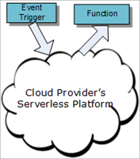

Serverless 是一种新型的云计算代码开发及执行模式。在这种模式中，云平台负责管理微服务函数的启动、执行、及删除， 并自动配置调度函数执行所需的计算资源，网络资源，安全资源，HA等。函数开发者只需专注于函数本身的逻辑开发，而不需考虑如何调度函数运行时所需的虚机或容器，如何建立函数所需的网络通讯等。云平台会监控函数执行的触发事件源。当事件发生时实时启动函数的执行。

函数开发者也不需要考虑或管理扩容。云平台会在并发事件情况下自动扩容、调度多个计算资源做并行函数执行。在并发事件结束时自动缩容

Serverless 以计量方式收费。只收取函数运行时计算资源的使用费。

**Serverless分类**

Serverless两种形态

Functions-as-a-Service (FaaS)，通常提供事件驱动计算。开发人员使用由事件或HTTP请求触发的function来运行和管理应用程序代码。 开发人员将代码的小型单元部署到FaaS，这些代码根据需要作为离散动作执行，无需管理服务器或任何其他底层基础设施即可进行扩展。

Backend-as-a-Service (BaaS)，它是基于API的第三方服务，可替代应用程序中的核心功能子集。因为这些API是作为可以自动扩展和透明操作的服务而提供的，所以对于开发人员表现为是Serverless。

**Serverless价值**


Serverless 的优势
- 降低启动成本
- 实现快速上线
- 系统安全性更高
- 适应微服务架构
- 自动扩展能力

**Serverless应用场景特征分析**

Serverless 主要用户场景有以下几个特点：
- 短时间任务为主
- 大部分时间请求平缓，偶然有突发流量
- 基于事件驱动
- 无状态，无会话保持…
如下是一些典型的Serverless应用场景：
- 电商
- IoT 数据分析处理
- 多媒体数据存储时的实时处理
- 移动后端
- 持续集成管道
- …

**Serverless缺点分析**

- 冷启动问题：<br>
Serverless函数在请求到来时才运行，这个方式虽然减少了闲置资源，然而也导致了另外一个问题：当函数一段时间没有执行的话，运行函数的实例都会被回收，那么下一次请求到来时，函数需要重新加载，尤其像C#等需要虚拟机的语言，启动的时间相对会长很多。
- 强依赖云厂商：<br>
选定某个云厂商的服务后，构建Serverless应用所产生的代码或者配置等都和该厂商提供的云服务强相关，特殊情况下需要使用多云的场景时，会带来很多不必要的麻烦。另外Serverless一般也需要周边的其他服务一起来实现完整应用，增加了较多学习成本；
- 不适合长时间不间断运行的应用：<br>
如果一个应用本身处于长时间不间断的运行状态，本身资源利用率就比较高，用Serverless可能会增加成本；另外因为冷启动的存在，当并发增加或减少时也会伴随着函数实例的新增和减少，某些业务的处理也会有一些额外的时间消耗；Serverless更适合业务有明显波峰波谷的场景。
- 定位问题难：<br>
用Serverless部署的线上应用出问题的情况目前只能通过查看函数日志的方式来定位，如果函数代码没有打印相关日志，定位问题会比较不方便；尤其是高频调用场景，不容易很快早点偶现的、概率低的错误。
- 构建完整应用难：<br>
Serverless应用粒度比较细，每个函数的代码可能会变得很简单，但从整个应用程序的角度来看是变复杂了；比如一个普通应用被拆解成了10多个函数，那么怎么去管理这10多个函数也会带来额外的成本。如何把整个应用拆分成一个个的函数也是一个难点，比如怎么选择合适的函数粒度让整体的性能达到最优，让管理这些服务的成本降到最小。

4. 行业发展趋势
- 统一的Serverless标准
- 统一的事件标准
- 快速构建完整应用的能力

- 目前各个云厂商的Serverless都是基于自己的云上资源，各个云服务都有特定的接口，各个云厂商都有不同的SDK等，难以做到一次编写，随处运行；
- 目前各个云厂商的Serverless提供的事件存在各种各样的差异，未来存在标准的事件接口，不同的事件源都可以发布事件，做到事件的标准化，将会使得整个云的联系更加紧密；
- 针对这一块有两个构想：一个是函数应用市场，用户通过在函数应用市场中选择应用，自动创建好所有函数以及周边的依赖的所有资源，用户只需要提供配置项和配置文件即可完成一个完整的Serverless应用；另一个是积木化构建应用，通过良好的封装和丰富的模板，用户只需要在界面上像搭积木一样组装应用，即可做出各种定制的应用。

### 1.2 华为云Serverless方案

#### 1.2.1. 华为云Serverless方案 - FunctionGraph


函数工作流（FunctionGraph）是华为云提供的一款无服务器（Serverless）计算服务。
- SMN触发器，消息通知服务。为函数创建好SMN触发器，只要往对应的SMN主题发送消息，这个函数就会自动执行起来
- OBS触发器可以设置各种事件类型，如PUT、POST上传对象，删除对象等，和可以设置对象的前缀和后缀，给函数创建好OBS触发器后，只要对应的操作发生，如往桶里面某个目录上传文件后对应函数就可以立即执行起来
用户给函数配置好API触发器后，只要访问对应的API URL，就可以执行对应的函数
- TIMER触发器就是定时触发器，使用非常简单，可以配置按照固定的时间间隔或者是cron表达式来定时执行函数
- DMS（分布式消息服务）、DIS（数据接入服务）、LTS（云日志服务）、DDS（文档数据库）触发器功能类似，都是检测对应的触发源是否有新消息或者数据，有新消息的话会触发函数执行
- CTS触发器，CTS华为云安全解决方案中专业的日志审计服务。CTS服务本身提供了对各种云资源操作记录的收集、存储和查询功能，各种云资源的操作产生的各种事件可以通过CTS触发器来触发对应的函数执行
- 再往外的一圈是和函数联系紧密的一些其他云服务，可以利用这些服务都提供的开放的API或者SDK来构建各类功能负载的应用。FunctionGraph提供了挂载文件系统的功能，可以挂载用户在弹性文件服务（SFS）上购买的文件系统，或者是ECS上的共享文件夹，这个功能可以让用户摆脱云函数本身存储能力的限制，可以做永久大容量存储；给函数配置了文件系统后，函数弹性扩容的产生实例也能访问到相同的存储资源，可以很方便地用来做一些机器学习的建模或者需要共享存储的并发任务。

#### 1.2.2. 应用场景

1. FunctionGraph + EI 场景

用户在云上定义好函数，给函数配置好OBS触发器之后，只要往对应桶里面上传文件，对应的函数就会执行。本例中会上传文件后，OBS会自动触发函数执行，并调用EI的服务进行如图像处理、视频处理等功能，最终存回OBS。


2. IoT实时数据处理

用户给处理函数配置好DIS触发器之后，只要对应DIS通道采集到数据该函数就会被自动调度起来。本例中会把通道数据转存到表格存储服务中。


3. 文件内容处理

本例依然是个OBS触发器的例子，用户上传文件后再函数中进行一系列处理然后存入OBS中。针对业务峰值不可预知的场景，使用函数非常适合。


4. 网站 / 移动App后端应用

本例中用户给函数配置了APIG触发器，用户可以通过API的方式去访问这个函数。配合使用OBS的静态网站托管功能，界面上可以通过调用API的方式刷新页面的动态内容。


#### 1.2.3 FunctionGraph使用流程

1. FunctionGraph使用流程


能力：
- 多语言（Java, Python, Node.js, Go, PHP, C#等）
- 毫秒级极致弹性
- 多触发器集成（SMN，OBS，APIG，TIMER，LTS，DIS等）

2. FunctionGraph快速实践

第一步， 登录华为云控制台后，从服务列表选择函数工作流FunctionGraph


第二步，点击右上角的创建函数按钮，输入函数名后（名称可以随意起），选择语言为Python2.7，代码上传方式选择上传zip文件方式，然后把附件中的代码包上传上去。

hcip-cloud-service.obs.cn-north-1.myhuaweicloud.com

第三步， 在服务列表中找到对象存储服务OBS，点击右上角的创建桶，设置好桶名后，直接按照默认配置创建即可


第四步， 返回函数页面，修改index.py文件第11行的defaultBucket为在OBS创建的桶名，如果桶区域不是北京一的话，需要把第10行的obsServer中的cn-north-1替换成对应的区域ID，如北京四为cn-north-4，上海二为cn-east-2


第五步， 在函数详情页的代码页签依赖代码包处点击添加按钮，在公共依赖包下找到如图所示的三个依赖包，勾选后添加。


第六步， 点击代码旁的配置页签，设置超时时间为30s（可能需要较长处理时间），点击创建委托，进入委托页面


第七步， 点击右上角的创建委托页面，选择委托类型为云服务，并选择FunctionGraph，并填好委托名称

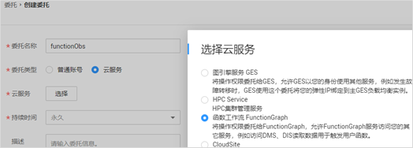

第八步， 从权限列表中点击全局服务对象存储服务旁边的修改，选择基本下的 Tenant Administrator权限


第九步， 回到函数配置页面，将委托设置为刚创建的委托并保存


第十步， 点击函数配置页签旁的触发器页签，点击创建触发器，选择APIG触发器，将后端超时设置为50000毫秒，


第十一步， 进入刚刚在OBS服务创建的桶，上传几张gif图片（为保证较好的效果，请尽量使用小的gif图片）


第十二步， 触发器创建完成之后，可以看到一个url链接，复制这个URL打开后可以看到类似下图的效果


最后， 可以直接点击左边链接查看示例效果


本节实践中的代码也可以支持OBS触发方式，给函数配置好OBS触发器之后，只要往对应桶里面传GIF图片，函数会自动将图片按帧切割成png图片，保存到桶的output目录下。

注意，如果配置OBS触发器的话请务必设置后缀为.gif，否则函数切割完图片上传相同桶的话也会触发当前函数执行。

GIF在线转化PNG
https://d237af6bc4214cc383b5f2b40a3af234.apigw.cn-north-1.huaweicloud.com/Jinja2Test

### 1.2.4 计费模式

函数工作流FunctionGraph采用按需付费方式，无最低费用，分别对请求次数、执行时间和节点转换次数进行收费。

即总费用 =请求次数费用 + 执行时间费用 + 节点转换次数费用
- 请求次数费用<br>
在您使用函数的过程中会产生请求次数费用，请求次数是所有函数的请求总数。
- 执行时间费用<br>
在您使用函数的过程中会产生执行时间费用，执行时间是从函数代码开始执行的时间算起到其返回或终止的时间为止，计量的粒度是100毫秒，不足100毫秒按100毫秒计费，例如函数执行了1005毫秒，会按照1100毫秒计费。
- 节点转换次数费用<br>
在您使用工作流的过程中会产生节点转换次数费用，节点转换次数是工作流步骤之间状态转换的总次数。

### 1.3 典型客户案例分析

1. 租户应用架构简介


- 客户最开始并没有在业务中使用函数，是直接在华为云上购买弹性云服务器（ECS）和分布式数据库（RDS）、分布式缓存Redis等资源按照传统的方式搭建服务。
- 而且因为定时任务处理过程消耗资源较多，只要定时任务运行起来也会给其他业务带来影响。客户创建了一个单独的服务器用来做定时任务。

2. 租户应用架构优化

整个业务切割成了多个不同的功能函数，部署升级更加方便


3. 成本对比

定时任务部分
- 改造前：2U4G的ECS ，每月大概需要16x+元
- 改造后：使用3G内存函数，每月去除免费额度需要4x元
- 成本仅需之前的1/4
APP并发请求部分
- 改造前：8U16G的ECS，每月大概62x+元
- 改造后：128m内存函数，每月大概调用6000w次，需要16x元
成本约为改造前的1/4

- 按照使用频率每一分钟一次，每次6s来算，每次会产生3G（客户最终选择的函数内存）\*6s=18GB.s的调用量，每个月是18GB.s\*24\*30\*60= 777,600GB.s，如果减去函数每月的免费额度400,000GB.s，那么定时任务每月需要计费的GB.s为377600，按照函数GB.s单价算出来是41.94元。
- 每天的调用量大概是200万次，一个月6000万次，按照调用次数需要花费60\*1.33=79.8，另外用户选择的函数内存为128M，也就是1/8GB，每月共计产生750,000GB.s，按照单价计算为83.31元，加到一起为163.11

思考题：

1. 使用华为云FunctionGraph服务，若不调用函数，则不会产生计费信息。（  ）<br>
A. 对
B. 错
2. 给函数配置了OBS触发器之后，如果用户下载了对应OBS桶里的对象，可以触发函数自动执行。（  ）<br>
A. 对
B. 错

参考答案

1. A
2. B

CNCF Serverless白皮书

https://skyao.io/learning-Serverless/introduction/cncf-whitepaper.html

## 2. 物联网简介及华为云方案

物联网（Internet of Things）简称：IoT，是新一代信息技术的重要组成部分，也是“信息化”时代的重要发展阶段。

物联网通过智能感知、识别技术与普适计算等通信感知技术，广泛应用于网络的融合中，也因此被称为继计算机、互联网之后世界信息产业发展的第三次浪潮。

### 2.1 物联网的发展和挑战

1. 物联网的发展历史


- 比尔·盖茨在1995年出版的《未来之路》一书中提及物互联。
- 1998年麻省理工学院提出了当时被称作EPC系统的物联网构想。
- 1999年，在物品编码（RFID）技术上Auto-ID公司提出了物联网的概念。
- 2005年11月17日，世界信息峰会上，国际电信联盟发布了《ITU互联网报告2005：物联网》，其中指出“物联网”时代的来临。
- 2009年8月，感知中国把我国物联网领域的研究和应用开发推向了高潮，无锡市率先建立了感知中国研究中心，中国科学院、运营商、多所大学在无锡建立了物联网研究院，无锡市江南大学还建立了全国首家实体物联网工厂学院。
- 2013年4月，德国政府在汉诺威工业博览会上，正式提出工业4.0战略，旨在提升制造业的智能化水平，其技术基础是网络实体系统及物联网。
- 2015年5月8日，《中国制造2025》签署并发布，进一步加快了大数据、云计算、物联网在工业制造领域的应用。

2. 物联网定义

通过二维码识读设备、射频识别(RFID) 装置、红外感应器、全球定位系统和激光扫描器等信息传感设备，按约定的协议，把任何物品与互联网相连接，进行信息交换和通信，以实现智能化识别、定位、跟踪、监控和管理的一种网络。
                                                                                                 ——国际电信联盟（ITU）

物联网(Internet of Things-IoT)就是物物相连的互联网。这有两层意思：其一，物联网的核心和基础仍然是互联网，是在互联网基础上的延伸和扩展的网络；其二，其用户端延伸和扩展到了任何物品与物品之间，进行信息交换和通信，也就是物物相息。
                                                                                                 ——百度百科

其他物联网含义的解读：
- 在网络通信技术的帮助下，不仅物和人可以“对话”，物和物也可以“交流”。
- 物联网本质是借助ICT技术对传统行业进行重构，将物理世界和数字世界进行融合。
- 物联网是互联网的应用拓展，与其说物联网是网络，不如说物联网是应用和业务，因此，应用创新是物联网的发展的核心，以用户体验为核心的创新2.0是物联网发展的灵魂。

3. 物联网离我们有多远


- 通过车身锁内集成了嵌入式芯片，GPS 模块和 SIM 卡，随时监控自行车在路上的具体位置，同时通过配合手机APP，用户通过手机APP可以查看附近的单车，通过地图引导找到单车，并通过扫二维码远程开锁。使用app开可以完成付费和行驶线路记录。
- 智能化住宅中的传感器检测到主人离开后，能自动通知控制器关闭水电气和门窗，并对住宅内的安全情况进行监控，实时向主人的手机发送异常情况报告
- 智慧抄表行业，例如燃气表、水表、电表，通过远程自动抄表替代人工抄表、及时故障排查，实时数据分析、科学表务管理，从而降低人共投入和运营成本，提升运营效率。
- 在智慧路灯中，通过应用远程控制路灯，远程故障管理，达到综合节能的效果。
- 智慧农业中，利用温湿度传感器、酸碱度传感器、灌溉/通风、自动收割、结合天气大数据等能力，实现自动化、精细化生产，在提高产量的同时，也减少人工投入。
- 这些不是科幻电影中的场景，随着“物联网”的逐步实现和普及，每个人的生活都将步入物联时代。

4. 智能时代的 “ 物连接 ” 红利 , 给IoT带来巨大挑战


让物说话的几种典型接入场景划分：
- 4G/5G：传输速率>10Mbps；功耗高；典型业务应用：车联网、视频监控、智能机器人。
- eMTC/GPRS：传输速率<1Mbps；成本较低，功耗较低；典型业务应用：穿戴、车辆调度、电子广告、无线ATM。
- NB-IoT/LoRa：传输速率<100Kbps；成本低，功耗低，覆盖广；典型业务应用：远程抄表、公共事业、农林渔牧。

让物说同一种话中，构筑统一的物模型，物模型（产品模型/Profile）：用于描述设备具备的能力和特性。开发者通过定义Profile，在物联网平台构建一款设备的抽象模型，使平台理解该款设备支持的服务、属性、命令等信息，如颜色、开关等。

### 2.2 华为云物联网解决方案

1. 华为云物联网全栈生态链


2. 端设备

**端 - 物联网操作系统LiteOS**

- Huawei LiteOS是华为针对物联网领域推出的轻量级物联网操作系统，是华为物联网战略的重要组成部分，具备轻量级、低功耗、互联互通、组件丰富、快速开发等关键能力。
- 基于物联网领域业务特征打造领域性技术栈，为开发者提供 “一站式” 完整软件平台，有效降低开发门槛、缩短开发周期，可广泛应用于可穿戴设备、智能家居、车联网、智能抄表等领域。

**端 - LiteOS : 1个轻量级内核 + N个框架**


Kernel内核的优势
- 高实时性，高稳定性。
- 超小内核，基础内核体积可以裁剪至6KB。
- 低功耗。
- 支持动态加载、分散加载。
- 支持功能静态裁剪。

**端 - 海思Boudica : 全球第一款NB-IoT芯片**


- Boudica 芯片是华为海思自研芯片
- SOC：System-On-a-Chip，片上系统
- BB：BaseBand，基带
- RF：radio frequency，射频
- PMU：power monitoring unit，电源监控单元
- AP/SP/CP：应用核，安全核，控制核，芯片定义的三个核。
- eFlash： Embedded flash，嵌入式闪存
- SRAM：static random access memory，静态随机存取存储器
- FOTA：firmware over the air，固件空中软件推送
- LWM2M是一种基于Client-Server的DM设备管理协议，主要用于受限设备。
- NB-IoT芯片出海思外，还有高通等其他厂商。
- Boudica适配的模组，包括移远、泰利特等。

3. 管network

**管 - NB-IoT : 低功耗广域网LPWA的代表**

NB-IoT（ Narrow Band Internet of Things ），窄带物联网，原型是2014年5月华为和沃达丰联合提出的NB M2M技术。适合对网络速率的要求不高，但对覆盖范围、功耗以及成本都有较高要求的物联网设备。


低速率，广覆盖，低功耗，低成本的应用：以智能抄表、资产跟踪、智能停车为典型应用。这块市场非常巨大，预测将占整个蜂窝物联网联接数的70%。我们通常把这块市场称为LPWA市场，即Low Power Wide Area。

NB-IoT的研究和标准化工作是3GPP标准组织进行的。
- 2014年5月，华为提出了窄带技术NB M2M；2015年5月融合NB OFDMA形成了NB-CIoT；7月份，NB-LTE跟NB-CIoT进一步融合形成NB-IoT；NB-IoT标准在2016年6月份冻结。
- 3GPP：第三代合作伙伴计划( The 3rd Generation Partnership Project)是一个成立于1998年12月的标准化机构。是领先的3G技术规范机构，是由 欧洲的ETSI， 日本的ARIB和TTC， 韩国的TTA以及 美国的T1在1998年底发起成立的，旨在研究制定并推广基于演进的GSM核心网络的3G标准，即WCDMA， TD-SCDMA，EDGE等。 中国无线通信标准组(CWTS)于1999年加入3GPP。
- 3GPP项目所标准产品包括：GSM、WCDMA、TD-CDMA、TD-SCDMA、LTE及LTE-Advanced，目前的重点项目是5G（New RAT）。
- 目前3GPP共有3个技术规格组：无线接入组（RAN），业务和系统结构组（SA），核心网和终端组（CT）。其中NB-IoT标准化工作是在无线接入组下进行的（2015年8月前是在GSM EDGE RAN组（GERAN），后来该规格组撤销合并至RAN组）。
- 截止2019年9月，我国的NB-IoT用户已超过7000万。

**管 - LoRa : 基于私有技术的独立网络**

LoRa：SEMTECH公司采用和推广的技术，基于开源的MAC层协议的低功耗广域网标准，同时基于免授权的Sub-GHz频段，使其更易以较低功耗云距离通信。

实现远距离，长电池寿命，大容量系统，进而扩展传感网络。适合对网络速率的要求不高，但对覆盖范围、功耗以及成本都有较高要求的物联网设备。

| 技术制式 | 关键对比 | 传输速率 | 典型距离 | 典型应用 |
| --- | --- | --- | --- | --- |
| NB-IoT	| 国际标准， 可与现有蜂窝网融合演进的低成本电信级高可靠、高安全性广域物联网技术	| <100kbps	| 1-20km	| 水表、停车、共享单车、垃圾桶、烟雾报警、自动售货机 |
| LoRa	| 私有技术， 需独立建网、无执照波段的高风险局域网物联技术	| 0.3-50kbps | 1-20km	| 智慧农业、智慧园区 |

- LoRa 的诞生比 NB-IoT 要早些，2013年8月，Semtech 公司向业界发布了一种新型的基于1GHz 以下的超长距低功耗数据传输技术（Long Range，简称 LoRa）的芯片。其接受灵敏度达到了惊人的 -148dbm，与业界其他先进水平的 sub-GHz 芯片相比，最高的接收灵敏度改善了20db 以上，这确保了网络连接可靠性。
- 它使用线性调频扩频调制技术，即保持了像 FSK（频移键控）调制相同的低功耗特性，又明显地增加了通信距离，同时提高了网络效率并消除了干扰，即不同扩频序列的终端即使使用相同的频率同时发送也不会相互干扰，因此在此基础上研发的集中器/网关（Concentrator/Gateway）能够并行接收并处理多个节点的数据，大大扩展了系统容量。

**CoAP协议 : 基于请求响应模型的无连接协议**

CoAP是受限制的应用协议(Constrained Application Protocol)的代名词。在当前由PC机组成的世界，信息交换是通过TCP和应用层协议HTTP实现的。但是对于小型设备（256KB Flash 32KB RAM 20MHz主频）而言，实现TCP和HTTP协议显然是一个过分的要求。为了让小设备可以接入互联网，CoAP协议被设计出来。

CoAP是一种应用层协议，它运行于UDP协议之上而不是像HTTP那样运行于TCP之上。CoAP协议非常小巧，最小的数据包仅为4字节。


应用层协议有CoAP, MQTT, XMPP,HTTP等。目前物联网主流使用CoAP协议和MQTT协议
- MQTT:Message Queuing Telemetry Transport，消息队列遥测传输，是IBM开发的一个即时通讯协议
- XMPP:Extensible Messaging and Presence Protocol ，可扩展消息处理现场协议，是基于可扩展标记语言(XML)的协议,它用于即时消息(IM)以及在线现场探测。是一种数据传输协议
- DTLS:Datagram Transport Level Security，数据报文安全传输层协议，在传输层对网络连接进行加密，DTLS在UDP传输协议之上

CoAP协议主要用于终端和物联网平台的交互。

**MQTT : 基于发布订阅模型的长连接协议**

MQTT（Message Queuing Telemetry Transport，消息队列遥测传输协议）。它构建于 TCP/IP协议上，是为硬件性能低下的远程设备以及网络状况糟糕的情况下而设计的发布/订阅型“轻量级”通讯协议。

使用发布/订阅消息模式，提供了一对多的消息分发和应用之间的解耦。

| 协议 | 模式 | 典型场景 |
| --- | --- | --- |
| MQTT	| 基于TCP/IP，	发布/订阅，	长连接	| 智能程度较高的设备，功耗高于CoAP协议设备，自由度较高，典型设备：家庭网关、工业网关、智能家居 |
| CoAP	| 基于UDP，	请求/响应，	无连接	| 对设备要求较低，功耗较低，基于NB-IoT网络的设备通常使用CoAP协议。典型设备：水表、电表、停车、共享单车、垃圾桶、烟雾传感器、路灯 |

IBM公司的安迪·斯坦福-克拉克及Arcom公司的阿兰·尼普于1999年撰写了该协议的第一个版本。

这个轻量级协议可在严重受限的设备硬件和高延迟/带宽有限的网络上实现。

它的灵活性使得为 IoT 设备和服务的多样化应用场景提供支持成为可能。

4. 边 Edge

**边 - IoT边缘服务 : 物联网边缘 ”小脑 ”**

IoT边缘，是边缘计算在物联网行业的应用。作为物联网边缘“小脑”，IoT Edge 在靠近物或数据源头的边缘侧，融合网络、计算、存储、应用核心能力的开放平台，就近提供计算和智能服务，满足行业在实时业务、应用智能、安全与隐私保护等方面的基本需求。

智能边缘平台IEF，通过纳管您的边缘节点，提供将云上应用延伸到边缘的能力，联动边缘和云端的数据，满足客户对边缘计算资源的远程管控、数据处理、分析决策、智能化的诉求，同时，在云端提供统一的设备/应用监控、日志采集等运维能力，为企业提供完整的边缘和云协同的一体化服务的边缘计算解决方案。

可以理解为IoT边缘是应用侧软件，智能边缘平台IEF是边缘平台的底层框架、容器。


企业痛点：
- 低时延：为满足低时延要求，需要在离业务现场最近的“边缘”构建解决方案，减少业务处理时延
- 海量数据： 边缘数据爆炸性增长，直接回传至云端成本高昂，数据在本地进行分析和过滤，节省网络带宽
- 隐私安全： 数据涉及企业生产和经营活动安全，在边缘处理企业保密信息、个人隐私
- 本地自治： 不依赖云端的离线处理能力、自我恢复能力

关键能力：
- 边缘联接：多设备多协议接入能力，提供设备接入框架，终结多种私有云协议和数据模型，统一定义到云平台
- 数据清洗：边缘主要负责现场/终端数据的采集，按照规则对数据进行初步处理与分析，极大降低上行数据带宽要求。
- 边缘智能：云端分析模型，规则引擎推送下行到边缘节点，边缘执行获得最大限度实时智能响应。

5. 云 Cloud

**云 - 设备接入服务 : 多样化设备快速接入**


- 终端Agent，支持Agent Lite和Agent Tiny，覆盖的语言包括C、Java、Android。Agent与海思、高通主流芯片、模组预集成，缩短TTM。
- 双向通信：物联网平台提供设备数据采集功能，例如设备业务数据、设备告警，同时支持应用服务器对设备数据的订阅。支持通过应用服务器或控制台以下发命令的方式，将命令下发到设备，达到对设备远程控制的效果。
- 应用对接：物联网平台开放了海量的API接口和SDK，帮助开发者快速孵化行业应用。
- 设备影子：设备影子是一个JSON文档，用于存储设备的状态、设备最近一次上报的设备属性、应用服务器期望下发的配置。每个设备有且只有一个设备影子，设备可以获取和设置设备影子以此来同步状态，这个同步可以是影子同步给设备，也可以是设备同步给影子。
- 规则引擎：数据转发规则是规则引擎的一种，用于将物联网平台接收的设备数据，转发到华为公有云的其它服务进行数据分析、存储等。
- 设备实时状态监控：物联网平台实时监控设备的状态，包括在线、离线、未激活，实时获取状态变更通知。
- 审计日志：控制台对所有物联网平台的使用人员的操作日志、安全日志（登录、登出、密码修改等）进行记录，便于日志分析和故障定位。

**云 - 全球SIM联接服务**


- 嵌入式SIM卡：eSIM，也称eUICC（embedded UICC），顾名思义，与传统可插拔的SIM卡不同，eSIM的概念是将SIM卡直接嵌入到设备中。eSIM的本质还是SIM卡，不过它的“卡体”是一颗直接嵌在电路板的可编程的集成电路，其大小比Nano还要小上几倍。因为其可编程特性，eSIM支持通过空中写卡方式进行远程配置，更新运营商配置文件，实现网络切换。综上所述，因为eSIM将SIM卡功能虚拟化和设备集成化，使用eSIM时的SIM卡码号的切换也将迎来全新的用户体验： 用户不必再来回插拔SIM卡，而是直接通过与终端交互，通过APP或者云端，即可在全球范围内将终端智能设备连接到所选择的当地网络，且可动态切换，使设备可以始终处于优质网速中。通过这种方式，eSIM不但增强了整体用户体验，也为设备的管理分配带来极大便利。
- vSIM卡：即virtual-SIM，虚拟SIM卡技术。可以说，vSIM就是eSIM的进一步演进，继承了eSIM的功能，并完全消灭了卡体，直接依托通信模块自身软硬件实现通信。终端设备拥有vSIM功能的通信模块，配合为vSIM特殊定制的底层软件，实现了内置加密存储数据（IMSI、KI等）。在登陆网络、鉴权、通信时，自动处理相应的逻辑，从而实现不需要实体SIM卡也能提供稳定的通信体验。
- 空中写卡：SIM卡功能和数据全部由软件实现，可以远程将SIM卡功能和数据写入设备。
- 全球SIM联接网址：https://www.huaweicloud.com/product/globalsimlink.html

**云 - 设备管理服务**

企业痛点：
- 海量设备管理困难，网络覆盖复杂且连接不稳定
- 设备之间相对孤立，对事件处理不够灵活终端现场故障定位耗时耗力
- 攻击者篡改、仿冒设备接入平台造成安全威胁

关键能力：
- 敏捷易用：设备集成框架，支持不同场景下终端设备快速接入云平台。
- 完备高效：设备管理Portal提供完备的设备管理能力，如设备状态可视化、远程配置、远程故障定位，设备固件/软件升级维护等能力
- 灵活开放：丰富的API，开放设备管理、数据和规则等能力，帮助行业应用快速孵化


- 数据持久化存储：提供设备上报数据的存储，可按照时、天等维度查看设备上报的历史数据。
- 产品模型定义：用于定义一款接入设备所具备的属性（如颜色、大小、采集的数据、可识别的指令或者设备上报的事件等信息），然后通过厂家、设备类型和设备型号，唯一标识一款设备，便于平台识别。产品模型可通过开发中心进行无码化开发。
- 设备访问授权：支持将设备的管理权限授权给其他应用，便于同一个用户管理多个应用的设备。
- 设备联动规则：设备联动规则是规则引擎的一种，通过设置一个规则的触发条件（如温度阈值、时间等），在满足触发条件时，物联网平台会触发一个指令来使设备执行一个操作（如上报信息、打开设备开关、上报告警等）。
- 告警管理：支持管理通过规则引擎里定义触发的设备告警，包括查看告警详情和恢复告警。
- 设备配置更新：支持通过应用服务器或控制台以下发命令的方式，对设备的属性值进行更新。
- 设备OTA升级：支持通过OTA（Over the Air）的方式，对终端设备进行软件、固件的升级操作，并通过软固件升级策略管理（群组、升级时间、并发数控制等），有效提升升级灵活性。
- 报表统计：在控制台上提供了丰富的报表功能，方便用户查看应用和设备的使用情况。
- 设备分组及标签：支持对设备进行群组和标签管理，通过有效分组和批量管理，减轻设备管理成本。
- 设备远程诊断：支持远程进行设备的运行日志收集、重启模组操作。

**云 - 物联网应用构建器 : 快速构建IoT Web APP**

企业痛点：
- 初期投入有限，但希望快速构建应用尝试业务创新的中小企业客户
- 中小型设备厂商软件开发人员不足，软件开发成本高，构建应用成本高，IoT业务上线困难，周期长。

关键能力：
- 快速构建： 5-10分钟快速构建IoT Web APP，提供30+可视化组件供开发者使用，自由灵活拖拽，可见即所得。
- 成本低：结合行业实践，预制行业模板；按需使用，提供免费试用
- 无运维负担：应用托管，华为提供专业运维服务

物联网应用构建器又名OceanBooster


**云 - 行业套件 : 车联网平台**


为企业实现便捷的车辆接入及管理，协助交通管理者实现道路基础设施数字化和通行状态感知，围绕车主出行场景聚合伙伴提供丰富的出行服务，助力智慧交通产业升级。

**云 - 行业套件 : 园区物联网平台**

企业痛点：
- 多厂家多终端类型，上层应用集成兼容难度高。
- 存在多个应用子系统，每个系统保存的数据格式不统一，数据孤岛，无法做到数据共享。
- 周界、消防、视频等系统无法联动，突发事件响应速度慢。

关键能力：
- 设备全连接： 内置数十种行业协议，园区人车通行、楼宇设施等常见子系统/设备快捷接入。
- 数据全融合：基于标准设备模型和开放API汇聚、共享跨系统数据，打破信息孤岛。
- 场景全联动：通过灵活设定联动场景，实现消防联动、安防联动、能耗联动等自动化运营场景。
- 云边全智能：IoT边缘服务将云端智能延展到边缘，云端分析训练，边缘推理执行 。


园区物联网平台服务是面向智慧园区业务场景的行业物联网平台，提供园区设备运营中心、园区设备模型、跨系统联动规则等增强功能，完成园区人车通行、楼宇设施、环境监测等各类设备/子系统的统一接入和管理，并通过北向开放API向园区智慧应用开放平台能力，实现跨系统数据共享及业务联动。

6. 生态 : 云上精品市场 + 高校合作 + 培训

聚焦“物”联，面向政府、企业提供丰富多样的模组、设备、开发板、网关、精品解决方案，优中选优，精中选精，实现伙伴与华为共赢。

面向开设物联网专业的全国高校，提供基础理论、行业应用、综合应用课程，培养应用实战型人才。


### 2.3 物联网应用案例

1. 泰华智慧路灯 - 点亮智慧城市
- 一灯一控，节能30%
- 跨应用流控，下行指令防拥塞
- 可视化运维，E2E故障定界，远程升级
- 一杆多用：安防、环保等多设备统一接入


智慧路灯业务挑战：在城市路灯持续建设中，经常遇到不同厂家路灯采用不同网络、方式连网，存在网络、协议适配复杂，上线慢，成本高等问题

传统传统城市照明系统的弊端也越来越显著：
- 第一，照明运营模式落后。在使用传统方式进行照明管理的地区，路灯的控制主要依靠人工控制开关电闸的方式进行开灯和关灯操作，开关灯时间误差大、统一性差，日常运行维护工作量大，且难以应对突发事件特殊照明需求。
- 第二，监控维修不到位。在使用传统方式进行照明管理的地区，日常巡检主要靠业务人员开车逐条道路、逐个灯杆检查的方式进行。存在运维方式落后、运维管理工作量大、服务质量保障困难等问题。
- 第三，按需照明、节能减排需求巨大。目前国内城市照明的监控和管理方式相对简单、粗放，服务质量和节能水平有待提高，难以满足现代化城市照明的需要，城市照明面临管理与节能双重挑战。
- 第四，信息化管理缺失。在部分使用传统方式进行照明管理的地区，仍然采用传统方式对路灯数据进行整理记录，当前实时准确的路灯类型、路灯数量和箱变数量等信息没有进行整理记录存档。信息化技术应用的不足造成管理和技术人员信息装备水平普遍较低，日常运行监控和业务管理主要依靠人工和文档类简单电子化方式，对智能化监控、计算机应用、网络知识接触较少，不利于城市照明运行和管理水平的发展。

客户其他收益：不同厂家路灯统一接入平台，屏蔽网络、协议差异化，解耦应用与终端，简化设备对接难度；路灯即可通过网关间接接入，也可通过直连方式接入，很好的兼容传统路灯，保护已有投资，可持续升级；主流厂家路灯预集成终端SDK，简化开发难度，实现设备快速接入

2. 拓宝智慧消防 - 打造无线消防报警联合解决方案


- 消防对于每个国家，每个地区，甚至每个家庭来说，都是一项十分重要的工作。它与人们的安居乐业，社会的和谐稳定发展都息息相关。
- 拓宝科技与华为云通过联合解决方案，推出了基于NB-IoT 技术的消防物联网解决方案。该方案由感知终端和消防平台组成，主要针对老旧建筑和小微场所，解决这些场所的消防改造和消防设施添加困难问题，以及火灾报警设备部署、管理与维护难题。

3. 敢为 - 智慧园区联合解决方案架构图


4. 敢为 - 智慧园区IOC运营中心


### 2.4 华为云物联网平台实验引导

1. 通过模拟器体验设备与平台的交互

通过使用设备接入服务提供的设备模拟器，带您快速体验设备接入服务的使用流程，包括注册设备，MQTT设备数据上报。

在开始实验前，请下载并安装模拟器。

下载地址： hcip-cloud-service.obs.cn-north-1.myhuaweicloud.com


2. 关键步骤说明

获取设备接入信息：
- 在设备接入服务控制台获取MQTT设备对接所需的信息。


控制台网址：https://console.huaweicloud.com/iot/?region=cn-north-4#/iotdmp/spMenu/deviceAccess

新增产品模型：
- 在设备接入服务中，新增一个MQTT设备的产品模型


注册设备：
- 在设备接入服务中，注册一个设备。


模拟器建立连接：
- 模拟器与物联网平台建立连接


模拟器上报消息：
- 模拟器向物联网平台发送数据


实验结果鉴定：
- 在物联网平台上可查看设备是否成功上报数据。


思考题：

1. （多选）关于物联网的理解正确的是？（  ）<br>
A. 物物相连的互联网<br>
B. 在网络通信技术的帮助下，不仅物和人可以“对话”，物和物也可以“交流”<br>
C. 借助ICT技术对传统行业进行重构，将物理世界和数字世界进行融合<br>
D. 把任何物品与互联网相连接，进行信息交换和通信，以实现智能化识别、定位、跟踪和管理<br>
2. （判断）海思Boudica是全球第一款NB-IoT芯片？<br>
A. 正确<br>
B. 错误<br>

参考答案1
- ABCD

参考答案2
- A

IoT开发精英实战营：一往无前

https://education.huaweicloud.com:8443/courses/course-v1:HuaweiX+CBUCNXT013+Self-paced/about?isAuth=0&cfrom=hwc

## 3. 大数据简介及华为云方案

### 3.1 华为云EI大数据服务介绍

华为云智能数据湖 - 华为云EI大数据的品牌


华为云在HUAWEI CONNECT 2019正式发布新一代全场景智能数据湖，助力企业高效管理数据，挖掘数据价值，享受AI时代智能化给企业带来的红利

华为云智能数据湖包含5大关键能力：
1. 智能数据湖运营平台DAYU：全域数据管理，一站式数据治理，加速企业敏捷创新
2. 多元计算：完全兼容开源大数据生态，内核数据加速，性能业界领先
3. 企业级数据仓库：基于GaussDB内核的云上数仓，支持HTAP，性能第一
4. +AI：数据+AI协同，全域数据处理
5. 存算分离，全栈支持鲲鹏：一份存储多元计算，0~N节点弹性伸缩

### 3.2 一站式大数据平台解决方案

1. 大数据平台典型业务场景


Hive是建立在 Hadoop上的数据仓库基础构架。它提供了一系列的工具，可以用来进行**数据提取转化加载（ETL）** ，这是一种可以存储、查询和分析存储在 Hadoop 中的大规模数据的机制。Hive定义了简单的类 SQL 查询语言，称为HiveQL，它允许熟悉SQL的用户查询数据。

使用新的执行引擎Tez代替原先的MapReduce，性能有了显著提升。Tez可以将多个有依赖的作业转换为一个作业（这样只需写一次HDFS，且中间节点较少），从而大大提升DAG作业的性能。

该场景下大数据的优势：
- 海量存储：天气数据通过CDM或Loader上传到HDFS或OBS。HDFS和OBS都是海量低成本存储，均可以作为Hive的表数据存储系统。
- 海量数据分析：利用MapReduce的并行处理能力实现TB/PB级的数据分析。如果没有MapReduce的编程能力，可能借助Hive，通过SQL语句来实现大规模数据的并行化处理。
- 可视化的导入导出工具：通过可视化导入导出工具CDM/Loader，将分析结果数据导出到DWS，完成BI分析。

2. 服务介绍 - 一站式大数据平台MRS


- MRS是构建在华为云Iaas基础设施层之上的弹性大数据服务，属于云计算的P层，以半托管的方式交付。
- MRS对所有集成的大数据组件都进行了面向可靠性、性能和安全的轻度增强，对部分组件进行了功能和性能方面的深度增强，同时也集成了部分华为完全自研的功能
- 自研特性CarbonData：使用先进的列式存储、索引、压缩和编码技术，以提高计算效率，有助于加速超过PB数量级的数据查询，可用于更快的交互查询。同时，CarbonData也是一种将数据源与Spark集成的高性能分析引擎。非常适用作为数据湖数据底座的存储格式。
- 自研特性Superior Scheduler：为满足超大规模集群的计算资源管理和调度诉求，克服Yarn社区在调度上遇到的挑战与困难，华为自主研发的Superior调度器，不仅集合了当前Capacity调度器与Fair调度器的优点，还做了增强资源共享策略、基于租户的资源预留策略、租户和资源池的用户公平共享、大集群环境下的调度性能优化、优先策略等特有的优化功能。

MRS优势：


MRS优势 - 全形态资源支持，多规格灵活配比，极致弹性能力


资源灵活配比，可以选择鲲鹏/ x86不同配比的Flavor规格，支持裸金属、虚拟机、容器化不同部署方式

单集群支持裸金属和虚拟机混合部署，峰谷任务可通过预先配置策略，按需自动弹性伸缩

3. 方案介绍**大数据平台平滑搬迁**

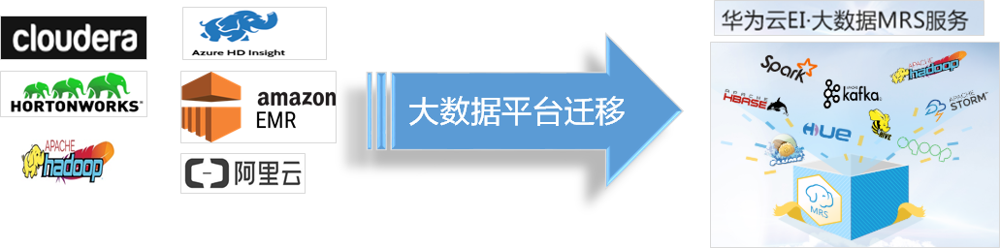

- 全栈集群一键创建：<br>
一键完成全栈大数据集群部署。并提供流式、分析及混合集群的灵活配置选择
- 开源接口完全兼容：<br>
100%兼容开源生态接口，客户业务代码“0”改动
- 资源搭配灵活选择：<br>
可以选择多种计算和存储资源进行组合，满足客户对集群的不同诉求，最优性价比
- 搬迁方案成熟简单：<br>
搬迁工具齐全，四步完成无业务中断迁移方案
- 极简运维降低成本：<br>
企业级集群管理系统，大数据平台管理简单，大幅降低运维投入

4. 数据上云方案 - 分层迁移

- 冷数据迁移 ——  数据快递服务（DES）
  - 百TB级别或以上，不更新，偶尔访问，如大量历史详单数据。通过加密的数据盒将数据快递至华为云机房。
  - 在不具备数据快递条件时（如从友商云服务进行数据迁移），也可通过专线进行迁移，成本较高。
- 热数据迁移  ——  专线传输
  - 十TB级别或以下，偶尔更新，经常访问。对数据目录打快照后通过CDM服务走专线传输上云。
  - 通常在第一次迁移完成后还需要进行多次增量数据传输。
- 实时数据迁移  ——  KafkaMirror或其它双写方案
  - 实时数据，通常产生速度在100MB/s以内，配置KafkaMirror，对线下实时数据进行镜像，迁移到线上Kafka集群。
  - 如果业务架构中没有配置Kafka服务，则可以通过业务侧配置或改造进行业务数据双写，实现实时数据迁移对接。
  - 如果以上条件都不具备，则需要规划业务停服时间窗，配合增量迭代迁移，将增量数据迁移时间缩短到时间窗内再停服进行迁移。

- 大数据分层迁移上云方案能快速将线下Hadoop大数据平台（CDH/HDP/…）迁移上云，将客户业务、数据一次性搬迁到云上大数据服务MRS中，并基于云上环境快速构建业务系统，满足客户未来业务快速增长需求。
- 分层迁移把数据分为三类：冷数据、热数据和实时数据。针对不同类型的数据分别制定了不同的迁移方法。
- 冷数据是指不再更新但需要偶尔访问的历史数据，如各类场景的历史详单数据。通常数据量级在100TB以上。对于这类数据，建议使用数据快递服务，通过加密的数据盒将数据快递至华为云机房。
- 也不是所有冷数据迁移都适用数据快递服务，如从友商云服务迁移。此时只能通过第三方拉通专线进行迁移，成本可能会达到数据快递业务的5倍。
- 热数据是指偶尔更新且经常访问的数据。对这类数据建议使用目录快照功能后通过CDM服务走专线进行迁移。通常在第一次迁移完成后还需要进行多次增量数据传输，减少与实时新增或更新数据的差异。
- 实时数据是指业务中实时产生并持续写入大数据集群的数据。通常产生速度在100MB/s以内。实时数据迁移通过配置KafkaMirror，可以实现源端Kafka数据在目的端Kafka实时同步。如果业务架构中没有配置Kafka服务，则可以通过业务侧配置或改造进行业务数据双写，实现实时数据迁移对接。如果以上条件都不具备，则需要规划业务停服时间窗，配合增量迭代迁移，将增量数据迁移时间缩短到时间窗内再停服进行迁移。

**华为云MRS对比自建大数据平台成本对比**

| 维度 | 子项 | 公有云 | 自建数据中心 |
| --- | --- | --- | --- |
| 成本	| 硬件成本	| 无需购买硬件	| 购买设备 |
| 	| 架构成本	| 基于Openstack开源架构，可扩展性好	| 可扩展性得不到保障 |
| 	| 人力成本	| 无需投入	| 自建运维团队或第三方运维 |
| 	| 资源使用	| 按需租用（或包周期），弹性灵活	| 单独使用 |
| 运维	| 基础设施运维	| 专业团队统一运维，<br>硬件扩容减容，坏件更换，物理网络维护等	| 自建运维团队或第三方运维 |
| 	| 业务系统运维	| 租户业务系统运维人员	| 业务系统运维人员|
| 	| 服务平台版本	| 由公有云服务商统一更新，版本迭代快	| 自行制定升级计划，升级周期慢，迭代慢 |
| 安全	| 数据安全	| 具备完整的安全防护体系，数据放在云提供商的数据中心。云存储级数据安全冗余	| 自建全防护体系，投入大，局限性较大|
| 	| 灾备与容灾	| 容易实现业务双活、多数据中心容灾，利用多region和多AZ	| 业务双活、容灾设备投入大，且不能两地三中心容灾|
| 生态	| 第三方接入	| 整合上下游生态资源，提供100多种增值服务	| 封闭系统，不利于构建生态|
| 	| 服务数量	| IAAS+PAAS+SAAS，大数据、AI、安全等， 服务众多	| 仅提供基础的计算、存储、网络功能|
| 技术	| 功能	| 开放架构，及时享受云计算的最新技术和服务<br>硬件预警，系统自动漂移，规避风险<br>CPU/内存/硬盘均可在线扩容，简单快捷	| 封闭系统<br>升级、扩容复杂<br>监控预警、规避风险能力一般|


5. 案例 - 某车企迁移线下大数据平台到云上

业务痛点及迁移难点：
- IDC机房运维成本高，扩容难度大，物理资源部署可靠性低
- IDC机房历史数据量大（150TB），数据结构复杂
- 大数据集群数量多，业务复杂
- 大数据集群对接在线业务，迁移过程中业务不能中断

华为云MRS分层迁移方案：
- 历史归档数据包括HFile和备份文件通过DES迁移
- 近一个月的HBase数据通过打快照，通过CDM服务走专线迁移
- 对于Kafka数据通过kafka转发到线上进行迁移

整体上云迁移表现：
- 线下系统“0”业务代码改动，快速完成业务搬迁
- 业务数据在线迁移，业务“0”中断，7天内完成上百T数据迁移
- 云上性能达到物理机能力，可靠性、稳定性也提升显著


迁移上云场景
- 快速将线下Hadoop大数据平台（CDH/HDP/…）迁移上云，将客户业务、数据一次性搬迁到云上大数据服务MRS中，并基于云上环境快速构建云下系统，满足客户未来业务快速增长需求。

迁移数据描述：
- HBASE：330TB/3=110TB  （1000+张表）
- HDFS上Backup文件（40T）

迁移方案：
- 历史归档所有数据包括Hfile和backup文件通过DES迁移
- 近一个月的HBase数据通过打快照，通过CDM服务走专线迁移
- 对于kudu和备HBase集群的汇总数据通过kafka转发到线上进行迁移
- 冷热数据分阶段搬迁，服务“0”中断
- 打通专线，有效控制迁移带宽，业务性能基本无影响

整体云上迁移表现：
- 线下系统“0”业务代码改动，快速完成业务搬迁
- 业务数据在线迁移，业务不中断，7天内完成上百T数据迁移
- 云上性能达到物理机能力，可靠性、稳定性也提升显著
- 拥有华为专业技术团队的运维保障能力

搭配服务
- CDM、DES

6. 案例 - 金融行业综合场景案例

客户痛点：
- 传统数据库无法高效完成大数据量下的风险模型分析
- 行业监管要求严格，合规建设成本高
- 集群运维难度大

方案：
- HBase为业务系统和风控系统提供实时查询能力。
- SparkSQL提供报表统计能力；
- DLF定期进行数据分析生成风控模型，为风险控制提供数据支持。

优势：
- 安全可信：专属资源部署，满足行业监管要求，保护客户敏感数据安全。
- 灵活高效：一站式满足数据存储、风险分析、报表生成
- 创建灵活：一键式灵活创建全栈大数据平台，
- 运维简单：提供企业级平台管理界面，与大云统一运维


金融场景
- 利用专属云MRS大数据的优势，满足保险业在合规、安全、可靠等方面的需求，重构传统保险企业的IT架构, 快速构建和部署保险业务系统，帮助保险企业快速实现数字化转型, 轻松实现业务创新和敏捷演进。
- 在此场景中，业务数据库中的订单数据通过OGG/Maxwell/Canal等工具写入Kafka。Spark Streaming以微批的方式实时将订单数据写入HBase。HBase为业务系统和风控系统提供实时查询能力。HBase中的数据通过DLF调度定期作业抽取成表数据文件存储到HDFS上，由SparkSQL提供报表统计能力；或由DLF调用Spark作业定期进行数据分析更新风控模型，为风险控制提供数据支持。

优势
- 安全可信：满足行业监管要求，保护客户敏感数据安全。
- 资源专属：专属MRS集群，资源独享，计算、存储物理资源隔离
- 创建灵活，全栈技术，简单运维
- 一键式灵活创建全栈式大数据平台，提供企业级平台管理界面，运维简单

- 业务数据库中的订单数据通过OGG/Maxwell/Canal等工具写入Kafka，Spark Streaming以微批的方式实时将订单数据写入HBase。HBase为业务系统和风控系统提供实时查询能力。HBase中的数据通过DLF调度定期作业抽取成表数据文件存储到HDFS上，由SparkSQL提供报表统计能力；或由DLF定期进行数据分析生成风控模型，为风险控制提供数据支持。

方案解析：搭配服务
- MRS, DLF, DCS, OBS, ES

7. 案例 - 某奶业集团从AWS EMR迁移至华为MRS

客户业务诉求：
- 广告效果监测：监测全域广告营销，评估广告可见效果，虚假异常流量在线预警，真实可见广告触达效果；
- 转化评估：量化评估渠道的转化效果，如官网等自由媒体访客行为，能够结合广告监测，精确量化评估各渠道转化表现；
- 数据管理平台：激活并精细化管理数据资产，有效整合产供销多终端，多数据源，消除数据孤岛；


技术方案优势：
- 计算存储分离，业务数据存放OBS，元数据外置RDS，计算、存储按需使用，成本更优；
- 支持补丁滚动升级，升级不中断业务
- 专业服务支持和性能调优，业务上线时间缩短30%
- 华为云大数据服务表现更稳定性，更高效，整体业务性能提升3倍；

8. 案例 - MRS助力新能源车企实现高效智能车联服务


对实时采集的车辆传感器、地理位置等海量数据进行清洗、转换、去噪之后，利用大数据分析和挖掘技术，分析车辆运行情况 、油量消耗、驾驶行为轨迹、发动机运行状态，实现对汽车实时监控与故障预测等功能。

- 数据入库HBase表压缩性能 提升20倍+
- 车辆数据实时处理任务性能 提升50%+
- 车辆汇聚表计算任务性能 平均整体提升3倍+
- 车辆数据堆积24小时后被快速消费，性能提升6倍+

8. 案例 - MRS助力电梯行业打造灵活智能梯联网系统


场景价值：
通过安装在电梯内的传感器、智能摄像头，采集物理、视频数据，在云端建立算法和模型，利用大数据技术对数据进行分析、整理、挖掘，让电梯实现“自我思考”，对可能发生的故障进行预判，实现安全预警；云梯能有效监测电梯运行数据、乘梯人的行为和电梯的运行环境，实现对电梯的实时检测，困人自动告警和智慧应急救援，并对乘梯人的不文明行为进行监督管理，从而保障大众的乘梯安全。

技术实现：
- 使用MRS Kafka组件，解决每秒数万条实时电梯监控数据的上云队列暂存。
- 使用MRS Strom组件，实时处理Kafka数据，并导入redis实现实时电梯数据监控。
- 使用MRS Hadoop组件，定期从kafka抽取数据，将海量数据入库MRS hbase。
- 借助MRS HBase极速点查及批量scan能力，配合ElasticSearch向业务层提供电梯数据极速检索查询服务。

### 3.3 数据湖探索解决方案

1. 服务介绍 - 数据湖探索DLI

数据湖探索（Data Lake Insight，简称DLI）是完全兼容Apache Spark和Apache Flink生态， 实现批流一体的Serveless大数据计算分析服务。DLI支持多模引擎，企业仅需使用SQL或程序就可轻松完成异构数据源的批处理、流处理、内存计算、机器学习等，挖掘和探索数据价值。

DLI服务能够支持的三大功能，SQL作业；兼容开源Spark接口，能够执行所有开源Spark支持的作业； Flink实时流处理能力

- 通过JDBC/ODBC/SDK/
RESTful接口运行标准ANSI SQL 2003，无需任何大数据背景知识，会用SQL就能对海量数据进行分析。
- 兼容开源Apache Spark接口，支持运行Spark Batch和Spark Streaming代码，无需关心集群的部署和运维，轻松完成PB级数据处理。
- 提供实时处理流式大数据的全栈能力, 简单易用, 即时执行Stream SQL或自定义作业。无需关心计算集群, 无需学习编程技能。

2. 数据湖探索DLI优势


DLI整体架构图，数据层能够兼容各种数据源的数据；中间引擎为Spark核心引擎；对外可以提供多种接口调用； 能够支撑各种行业的分析和计算。

- 存算分离，数据“0”搬迁：跨源联邦分析，无需额外的数据搬迁
- 企业级多租户，数据安全分享：表/列/视图级数据权限控制与授权，实现企业各部门或子公司间数据共享和变现
- +AI：内置AI引擎，数据与AI模型协同，结构化/非结构化全域数据处理
- 简单易用：全托管Serverless服务，用户无需关注物理服务器，开箱即用，按需付费

DLI关键特性

- 资源按需配比 , 跨源计算分析

企业多租户：支持资源按用户隔离，数据访问权限控制到列


数据按业务属性不同，选择多种存储，DLI通过跨源计算分析，将所有数据联通起来，实现数据流动更顺畅。


- +AI , 非结构化数据处理


举例：使用SQL进行图片识别, 快速完成非结构化数据处理

```SQL
create table cars_no(filePath string, result array<struct<number:string, type:string>>)
using ocr
options (
path "obs://bucket1/cars",
ocrApiUrl "/v1.0/ocr/plate-number",
ocrEndpoint "https://ais.cn-north-1.myhuaweicloud.com",
ocrRegion "cn-north-1")
```


3. 数据湖探索DLI典型应用

存储计算分离、跨源分析、批流一体这3个是DLI服务的几个重点特性，针对这些特性也有一些相应的案例和用户场景


4. 案例 - 游戏公司借助DLI按需计费能力降低成本


痛点:

游戏公司不同部门日常通过数据分析平台，分析每日新增日志获取所需指标，通过数据来辅助决策。
查询都是白天临时发起，无规律。如果使用一般的包周期资源，存在很多的资源浪费。

方案:
- 资源灵活配比，按需计费<br>
存储资源和计算资源灵活配比，可单独扩容。存储资源采用高性价比的对象存储；计算资源在空闲时可以释放，0成本。
- 简单易用<br>
直接使用标准SQL编写指标分析逻辑，无需关注背后复杂的分布式计算平台

效果:

游戏公司数据分析平台灵活配比存储资源和计算资源，性能提升30%的基础上，成本降低超过1倍。

5. 案例 - DLI跨源分析能力主力车企实现数字化转型


痛点

车企采集上来的不同类型数据存在不同平台中，如：关系型数据库RDS中存放车辆和车主基本信息，表格存储CloudTable中存放实时的车辆位置和健康状态信息，数据仓库DWS中存放周期性统计的指标。
车企想对这些数据进行**关联分析**，从而为车主提供更好的智联出行体验，增加车企竞争力，促进销量增长。

方案
- 多源数据分析免搬迁<br>
通过DLI跨源分析能力无需数据搬迁，就可以对多数据源进行联邦分析。
- 数据分级存储<br>
车企需要保留全量历史数据支撑审计类等业务，低频进行访问。温冷数据存放在低成本的对象存储服务OBS上，高频访问的热数据存放在数据引擎（CloudTable和DWS）中，降低整体存储成本。

效果:
- 车企通过对车主多种数据的关联分析，提供更好的智联出行体验，增加车企竞争力，促进销量增长。
- 保存全量历史数据满足审计类业务的情况下，存储成本降低50%以上。

6. 案例 - 某国家级安全平台实现语音数据分析


痛点:
- 某国家级安全平台上存放了很多当地人口的语音数据，平台需要提取语音数据内容进行分析，识别舆论信息。
- 安全平台技术人员无AI技能背景，无法直接使用主流的AI分析框架。

方案:
- AI SQL<br>
DLI将对图片、视频、语言的处理分析能力嵌入在SQL里，提供结构化与非结构化数据的融合分析能力。

效果:<br>
安全平台技术人员在无AI技能背景下，完成了当地人口的语音数据提取和分析。进一步提升了国家对于舆论信息的识别能力。

### 3.4 融合数仓场景化解决方案

1. 服务介绍 - 实时、简单、安全可信的企业级数据仓库

- 华为云DWS是基于华为自研企业级数据库GaussDB的云服务产品。
- DWS采用Shared-nothing分布式架构，支持行列混合存储，为云上客户提供海量数据的极致分析查询服务


- 高扩展：高性能、按需水平扩展
  - 无共享架构，支持4096节点/100PB规模扩展
  - TPCDS/TPCC业界领先，应用透明的Sharding能力
- 高可用：
  - 主备从架构，RPO=0，RTO<30s
- 强一致：支持分布式强一致
  - 跨节点事务ACID
  - 主备多副本复制协议，保证副本数据一致
- 易管理：易迁移，易监控，运维
  - 兼容SQL2003， 存储过程高级功能
  - Data Studio、Database Manager、OM、SQL迁移工具

2. DWS服务优势

性能： 业界领先
- 全并行极致性能的MPP DB
- 行列混存及向量化计算
- 极速并行Bulk Load工具-GDS

扩展性： PB级数据，256物理节点，4096逻辑节点
- 开放架构，按需水平扩展，容量和性能线性增长；
- 表级别在线扩容技术，保障扩容期间业务不中断、无感知；

可靠性：
- 多层级冗余实现系统无单点故障
- 计算节点多活，更高的并发度、可靠性、扩展性
- OBS备份，跨AZ容灾

易用性：
- 一站式可视化集群管理，运维便捷；
- SQL On Spark/HDFS/OBS，实现互联互通，且兼容标准SQL
- 完整的应用开发和迁移工具，如Oracle，Taradata等；全面集群监控与告警、自动增量备份

安全：满足“数据保护条例”欧盟GDPR合规要求
- 与数据库安全防护服务（DBSS）深度整合
- 通过高可用设计和数据透明加密，保证数据和系统的高可靠性

3. DWS解决方案 - 企业数仓搬迁

DWS数仓搬迁解决方案中一共两个部分：
- 数据搬迁：使用CDM服务实现数据迁移到DWS，可以是全量或者增量搬迁
- 应用迁移：客户原先在Oracle或者Teradata上开发的存储过程可以利用MigrationTool工具迁移到DWS上来

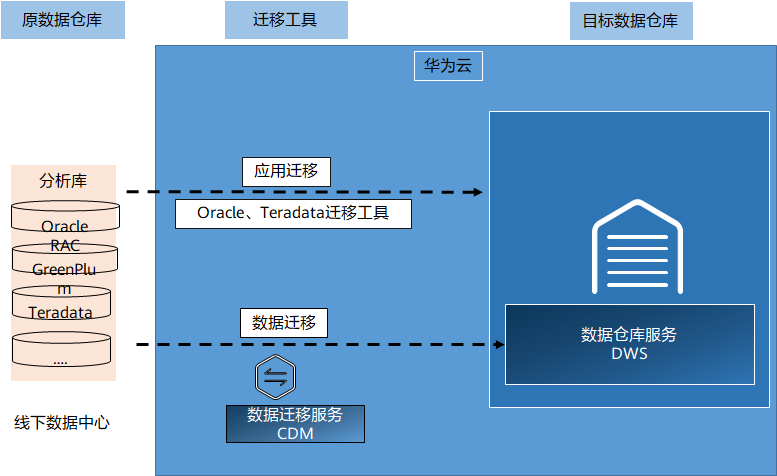

数仓迁移上云场景：

快速将线下数仓平台（Oracle，GreenPlum，Teradata）迁移上云，将客户业务、数据一次性搬迁到新一代融合数据仓库DWS中，按需扩容，满足客户未来业务快速增长需求。

优势：
- 用DWS（华为云数据仓库服务）替换Oracle分析库，使用华为自研迁移工具迁移Oracle, Teradata业务
- DWS提供完整的事务能力并支持PL/PGSQL，支持PostgreSQL协议
- 支持标准SQL，减少改写代价

4. DWS解决方案 - 新建DWS数仓 + BI

应用场景简介：

企业IT系统经过长期建设，业务系统不断增多，但系统之间没有打通，形成了很多数据孤岛。利用企业数据仓库汇集多个数据库中的数据，打破数据孤岛，使整个组织都能够对所有数据进行洞察。


解决方案优势：
- 快速部署，简单易用
- 生态丰富，兼容多种BI产品
- 兼容标准SQL 2003，应用易开发对接
- 分布式架构，数据透明切分

自建数仓解决方案主要聚焦于客户自身的业务场景，根据数据建模，例如：星型模型，或者雪花模型构建出一整套数据仓库的逻辑模型，便于进行业务处理和展示报表

一般的在数仓中，逻辑层次可以分为三层：
- ods层：贴源层，和源端业务库数据特征保持一致；
- dw层：数据仓库层，从ods层中抽取的，符合数据模型的历史分析型数据；
- dm层：数据集市层，用于指标分析，可以从dw层中的数据计算得出；

最后DWS的应用层可以无缝对接各种BI工具，实现报表的敏捷开发

补充阅读：

数仓基本概念：
- DB 是现有的数据来源(也称各个系统的元数据)，可以为mysql、SQLserver、文件日志等，为数据仓库提供数据来源的一般存在于现有的业务系统之中。
- ETL的是 Extract-Transform-Load 的缩写，用来描述将数据从来源迁移到目标的几个过程：
  - Extract，数据抽取，也就是把数据从数据源读出来。
  - Transform，数据转换，把原始数据转换成期望的格式和维度。如果用在数据仓库的场景下，Transform也包含数据清洗，清洗掉噪音数据。
  - Load 数据加载，把处理后的数据加载到目标处，比如数据仓库。
- ODS(Operational Data Store) 操作性数据，是作为数据库到数据仓库的一种过渡，ODS的数据结构一般与数据来源保持一致，便于减少ETL的工作复杂性，而且ODS的数据周期一般比较短。ODS的数据最终流入DW
- DW (Data Warehouse)数据仓库，是数据的归宿，这里保持这所有的从ODS到来的数据，并长期保存，而且这些数据不会被修改。
- DM(Data Mart) 数据集市,为了特定的应用目的或应用范围，而从数据仓库中独立出来的一部分数据，也可称为部门数据或主题数据。面向应用。

一个例子看这几层的协作关系：


5. 案例 - 某银行借助DWS打造新一代融合数仓（数仓搬迁（Teradata））

银行的痛点和挑战：
- 扩容成本高：Teradata一体机架构，价格昂贵，计算存储扩容成本高。
- 时效性差：要求XXX个业务处理时间从10降到6小时
- 易用性差：只支持两代设备兼容，无法跨代；扩容业务需停机将近一周时间

华为解决方案：
- 统一架构：任意x86服务器，设备利旧和高效水平扩容
- 统一SQL接口：通过MPPDB on Hadoop特性直接访问Hadoop上的数据
- 在线扩容：支持夸代硬件兼容，扩容不停机等特性

银行收益：
- 成本优势：软硬件解耦，基于通用X86服务器避免Lock-in，支持跨代设备共存，最大化保护硬件投资
- 融合平台： Hadoop 与 MPP 完全融合， 一套系统支持处理批量和联机查询混合负载

6. 案例 - BI构建

- 解决了广联达数据孤岛的问题，将原先各个业务库中的数据统一的存放于DWS中，根据数据建模模型，进行统一分析处理，可以获得更多更优价值的信息；

- BI构建，借助华为数仓应对海量、多源、实时数据处理的痛点与挑战


客户痛点与挑战：
- 随着业务的增长，大量查询在传统关系数据库已不能返回结果
- 原有架构包含多种数据存储，数据分散，无法有效整合，进行统一分析和管理

华为云EI提供的解决方案：
- 以DWS为核心构建统一免运维、高可靠的数据存储和分析平台
- 利用DWS汇聚各类数据（业务数据、用户行为数据、招投标数据等），实现一站式数据存储、加工、分析，BI报表、精准推荐等场景

客户收益：
- 数据统一分析、管理效果显著，节约50%数据处理时间
- 解决原有系统数据查询慢或查询不出结果的问题

7. 案例 - DWS混合负载方案助力某电商构建新一代电商交易平台


原方案的缺陷和客户痛点：
- DRDS+RDS无法保证数据的强一致性，为致命问题
- OLTP库向OLAP库同步数据时间过长，无法得到要求的时效性
- Report库中与其他库中多表关联的查询报表，跨库查询效率异常低下，无法满足客户业务需求

华为云DWS解决方案
- 完整的分布式事务，保证数据的强一致性；如果业务上出错，整体回滚，杜绝出现脏数据
- OLTP与OLAP之间的数据同步在数据库内部进行，速度快，效率高
- Report中的数据可以与其他schema中的数据关联查询，节省空间时间，效率高

客户收益：
- 一库两用，同时支持OLAP和OLTP业务
- 成功替代A云友商数据库，按期上线，无致命问题  
- 性能测试可达200万单/每小时，符合客户预期，比友商性能提升30%

### 3.5 智能数据运营解决方案

1. 服务介绍 - 智能数据湖运营平台DAYU

智能数据湖运营平台(DAYU)是针对企业数字化运营诉求提供的数据全生命周期管理、具有智能数据管理能力的一站式治理运营平台

面对多样性的业务、多样性的系统、多样性的数据带来数据价值变现的挑战，华为云基于云基础设施构筑了“智能数据湖”解决方案，

解决数据统一存储、数据融合分析、数据运营使能等关键能力，帮助客户建立统一的数据平台、提升实时数据服务能力，拥抱行业数字化。

DAYU提供企业全流程端到端的数据运营能力，包括**多种异构数据源集成，作业脚本编排开发调度，数据质量监控，数据模型开发，数据服务等核心能力**，帮助企业实现数字化转型


2. DAYU优势 - 数据治理方法论 , 全流程可视 + API开放

- 基于华为数据体系建设沉淀数据规范设计方法论
- DAYU数据治理方法论白皮书

百万级任务并发调度，同时支持维度建模+关系建模，批、流，+AI混合编排


伙伴可选的两种模式：
- 使用DAYU全流程可视界面，降低数据治理门槛
- 采用DAYU分层开放的API，完成自有产品集成

3. 智能数据湖运营平台 - 解决企业数字化转型问题


面对多样性的业务、多样性的系统、多样性的数据带来数据价值变现的挑战，华为云基于云基础设施构筑了“智能数据湖”解决方案，

解决数据统一存储、数据融合分析、数据运营使能等关键能力，帮助客户建立统一的数据平台、提升实时数据服务能力，拥抱行业数字化。

DAYU提供企业全流程端到端的数据运营能力，包括多种异构数据源集成，作业脚本编排开发调度，数据质量监控，数据模型开发，数据服务等核心能力，帮助企业实现数字化转型

4. 方案介绍 - 智能数据湖运营平台DAYU

提供一站式智能数据管理能力，数据治理方法论，帮助企业快速构建从数据接入到数据分析的端到端智能数据系统，消除数据孤岛，统一数据标准，加快数据变现，实现数字化转型。

命名：DAYU

寓意：像大禹治水一样帮助企业进行数据治理与运营，让数据变为企业创新的新能源，助力企业新增长


企业在进行数据管理时，通常会遇到下列挑战。
- 数据治理的挑战
  - 缺乏企业数据体系标准和数据规范定义的方法论，数据语言不统一；
  - 缺乏面向普通业务人员的高效、准确的数据搜索工具，数据找不到；
  - 缺乏技术元数据与业务元数据的关联，数据读不懂；
  - 缺乏数据的质量管控和评估手段，数据不可信；
- 数据运营的挑战
  - 数据运营效率低，业务环境的快速变化带来大量多样化的数据分析报表需求，因为缺乏高效的数据运营工具平台，数据开发周期长、效率低，不能满足业务运营决策人员的诉求；
  - 数据运营成本高，数据未服务化，导致数据拷贝多、数据口径不一致，同时数据重复开发，造成资源浪费；
- 数据创新的挑战
  - 企业内部存在大量数据孤岛，导致数据不共享、不流通，无法实现跨领域的数据分析与数据创新；
  - 数据的应用还停留在数据分析报表阶段，缺乏基于数据反哺业务推动业务创新的解决方案；

智能数据湖运营平台(DAYU)是为了应对上述挑战、针对企业数字化运营诉求提供的数据全生命周期管理、具有智能数据管理能力的一站式治理运营平台，包含数据集成、规范设计、数据开发、数据质量监控、数据资产管理、数据服务等功能，支持行业知识库智能化建设，支持大数据存储、大数据计算分析引擎等数据底座，帮助企业快速构建从数据接入到数据分析的端到端智能数据系统，消除数据孤岛，统一数据标准，加快数据变现，实现数字化转型。

5. 数据治理方法论 - 元数据

什么是元数据：

元数据的英文名称是“Metadata”，它是“描述数据的数据(Data about data)”。

通俗的讲元数据就是用来描述上下文的信息，帮助人们更好的理解和使用数据的一组信息。


元数据的分类：
- 业务元数据：描述业务领域相关概念、关系和规则的数据，主要包括业务术语、指标定义和业务规则等信息。
- 技术元数据：描述系统中技术领域相关概念、关系和规则的数据，主要包括对数据结构、数据处理方面的特征描述，覆盖统数据源接口、数据仓库与数据集市存储、ETL、OLAP、数据封装和前端展现等处理环节。
- 管理元数据：描述管理领域相关概念、关系和规则的数据，主要包括人员角色、岗位职责和管理流程等。


面对多样性的业务、多样性的系统、多样性的数据带来数据价值变现的挑战，华为云基于云基础设施构筑了“智能数据湖”解决方案，

解决数据统一存储、数据融合分析、数据运营使能等关键能力，帮助客户建立统一的数据平台、提升实时数据服务能力，拥抱行业数字化。

DAYU提供企业全流程端到端的**数据运营能力**，包括多种异构数据源集成，作业脚本编排开发调度，数据质量监控，数据模型开发，数据服务等核心能力，帮助企业实现数字化转型

6. 数据治理方法论 - 数据质量

质量定义：数据满足应用的可信程度


7. 案例 - 某省可再生能源数据中台


痛点：
- 统计结果问题多，数据不一致、数据冗余、数据无法增量更新；
- 界面查询、展示速度慢，后台关联查询逻辑复杂，没有提前产出数据；需要优化并提供查询、展现、报表，日报、月报、季报；

根因：
- 企业分散、设备型号多
- 各项目数据封闭
- 项目点多面广，布局分散


成果：
- 向上：与 国家可再生能源发电项目信息管理平台 对接
- 向下：实时采集全省 数百家能源企业 、 数百万台可再生能源发电设备 生产数据
- 有序开放共享，让数据随能源一起流动，激活数据价值

8. 方案介绍 - 数据架构


能源集团大数据平台，通过数据运营转型，实现
- 向上  与 国家可再生能源发电项目信息管理平台 对接
- 向下  实时采集全省 数百家能源企业 、 数百万台可再生能源发电设备 生产数据

9. 方案介绍 - 数据内容与模型梳理

成果：8个主题，20个业务对象，34个逻辑实体，300+个字段，30+个数据指标，280+个字段的加工逻辑。全公司统一数据视图

联合伙伴：数据梳理+模型设计


10. 其他行业典型应用


- 在你的生活中，是否有接触到相关的解决方案？
- 它们给你的生活带了什么改变？
- 你是否有想到一些可以使用EI的大数据服务或解决方案来解决问题的场景？

## 4. 人工智能及华为云方案

### 4.1 华为云EI全景

1. 华为云EI - 全栈使能 , 全场景覆盖


在基础计算能力之上，华为云EI将提供：
- 从基础平台服务到通用API、高级API、预集成方案，提供59个云服务（21个平台类服务，22个视觉类服务，12个语言类服务，4个决策类服务），159项功能（52项平台类功能，99项api类功能，8项预集成方案）

这些服务将覆盖：
- AI资深数据科学家、数据工程师、普通IT工程师到业务开发，各类人群各种使用场景。而且随着AI在行业的深入落地，这些能力还在快速增加

2. 华为AI解决方案全景


在2018年4月的华为分析师大会上，我们首次预告了华为全栈、全场景AI解决方案。

我们提出的全场景，是指 包括公有云、私有云、各种边缘计算、物联网行业终端以及消费类终端等部署环境。

我们说的全栈是技术功能视角，是指包括芯片、芯片使能、训练和推理框架和应用使能在内的全堆栈方案。

华为的全栈方案具体包括：
- Ascend： 基于统一、可扩展架构的系列化AI IP 和 芯片，包括Max，Mini，Lite，Tiny和Nano等五个系列。
- CANN： 芯片算子库和高度自动化算子开发工具
- MindSpore，支持端、边、云独立的和协同的统一训练和推理框架
- 应用使能：提供全流程服务（ModelArts）,分层API和预集成方案

### 4.2 平台类解决方案

#### 4.2.1 ModelArts

1. 服务介绍 - ModelArts一站式AI开发平台

这张图展示的是ModelArts功能的全景图。ModelArts的能力覆盖AI开发的各个环节，包括数据处理、模型训练、模型管理和部署。


2. 方案介绍 - 基于ModelArts的行业AI开发平台方案


3. 方案介绍 - 基于ModelArts的车辆自动识别方案

通过自动学习-车辆识别，来识别平板车和自卸车


- 应用场景：智慧停车场根据车辆类型进行无人收费
- 痛点：人工识别车辆类型效率低、成本高。
- 解决方案：基于ModelArts自动学习服务，完成数据标注和模型训练，实现平板车和自卸车的自动识别。
- 方案优势：算法准确率高，使用门槛低，服务上线周期短

4. 方案介绍 - 基于ModelArts的无人收银方案


- 应用场景：商店非标商品类别识别
- 痛点：非标商品需要人工识别种类并收银，效率低，成本高
- 解决方案：基于ModelArts自动学习服务，完成数据标注和模型训练

5. 方案介绍 - 基于ModelArts的自动驾驶方案


- 应用场景：自动驾驶开发平台
- 痛点：数据标注量大，需要高精度的自动驾驶算法。
- 解决方案：使用ModelArts智能标注进行数据标注，并使用ModelArts预置算法训练模型。
- 竞争力： ModelArts智能标注可以节省50%~70%人工；ModelArts有自动驾驶领域高精度的预置算法。

6. 方案介绍 - 基于ModelArts的安全驾乘方案


7. 方案介绍 - 基于ModelArts的雨林保护行动方案


使用声音分类，识别雨林中的各种声音，达到保护雨林的目的。

痛点：人工巡检需要大量人力，人工观察分析大自然需要生物学领域知识。

#### 4.2.2 HiLens

1. 服务介绍 - 华为HiLens

华为HiLens为端云协同AI开发应用平台，由端侧计算设备和云上平台组成，提供开发框架、开发环境、管理平台等能力，帮助用户开发多模态AI应用并下发到端侧设备，实现多场景的智能化解决方案。

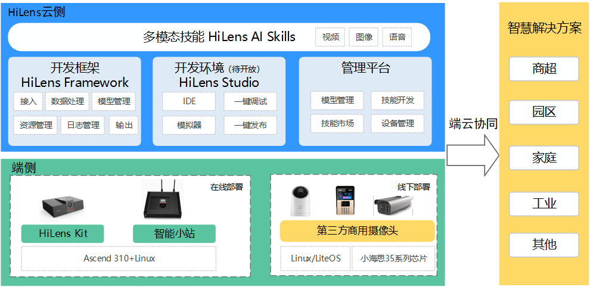

HiLens主要由两部分组成，软件方面，我们提供在线的AI应用开发平台；硬件方面，则为开发者提供了强大的开发套件。

屏幕中为大家展示的就是HiLens 云侧和端侧，大家也可以通过登录华为云官网，在EI企业智能的服务目录下找到这个服务

HiLens端侧设备介绍补充，说明使用场景，如Kit不支持室外

华为HiLens平台和MA平台全流程打通，在MA训练的模型可以一键式导入到HiLens平台，快速创建开发技能。HiLens平台目前支持介入两种硬件，都是华为自研的智能小站和HiLens Kit.  

同时华为HiLens平台也开放了相应的APIs接口用于集成到第三方业务平台。


2. 端云协同方案 – ModelArts + HiLens


3. 方案介绍 - 基于HiLens的智慧停车方案


- 背景：<br>
和昌未来科技致力于提供行业领先的城市道路智慧管理一体化的平台运营服务，解决城市道路停车管理、静态交通管理、智能安防、智慧家居等问题，打造城市智慧停车一张图，服务公众安全出行，建设先进智慧城市。
- 挑战：<br> 
“停车难，乱停车，乱收费”等城市交通难题日益凸显，现有的电子路边停车管理系统安装审批难，建设运营成本高，且受环境干扰因素打，不能全自动识别车牌，停车结束之后，无法满足驾驶员反向查车的功能；
- 严选方案价值：<br>
HiLens简单的端侧采集端部署模式，利于大面积铺设，且降低了项目的投入成本和建设周期；引入高效智能的端云协同车牌识别技术，大大降低了人工运营维护成本；识别率提升75%，人工审核降低50%，投诉率降低30%。

4. 方案介绍 - 基于HiLens的智慧门店方案

客户是谁,客户想要什么，如何提升客户体验是销售的永恒主题。
- 华为与NTT Data联合开发的智慧4S店解决方案，让数据产生价值，通过数据驱动重构线下门店销售模式。
- 基于Huawei Hilens 多模态AI开发套件可以便捷的构建智慧门店系统，分析客户在店情绪变化，通过客户的行为和表情判定客户在进店/体验/配车/洽谈和出店流程中体验情况。结合历史数据完成客户画像分析，对不同身份的潜客/车主，根据线上数据与店内行为结合判断其实际需求，通过推荐模型对不同身份用户给予特定服务指引，提升服务体验及满意.
- 严选方案： D开发者、大企业、行业isv 可以利用HiLens 的开发平台提升开发效率，同时利用HiLens Kit 或者atlas 200 DK , atlas 200 SOC 快速实现方案集成，实现低成本，快速更新算法，高效便捷管理设备，2到3周快速上线方案。


客户需求
- 低成本分析客户行为，实现门店的精确营销
- 门店数量多，上行带宽高，集中式视频分析不现实
- AI应用多样化，希望能不同摄像头能更灵活配置AI能力，后面技能可以更新

解决方案价值
- 集中端侧AI分析：依托高性能并行处理，端侧AI集中分析，云侧仅需图片识别，极大降低成本
- 极简构架：端侧采用Skill封装方式，完成场景化分析（如：不同摄像头不同算法、抠图大小、去重等），简化应用对接
- 端侧Skill按需更新：针对不同门店场景，需要算法优化后，能够实时下发，对应用端不影响

5. 方案介绍 - 基于HiLens的智慧家庭方案

- 背景：<br>
传统摄像头视频仅作为实时监控，产品附加值低。海雀希望摄像头能自动分析视频，通过为最终用户提供AI服务作为增值业务。
- 挑战：<br>
传统的视频分析架构是端侧有一个智能IPC然后把视频回传到云进行分析处理，它的主要限制是端侧的算力不足、太贵。同时云侧分析需要很高的网络带宽，时间响应慢。离线的SDK跟不上客户日益增加的需求变化。
- 严选方案价值：<br>
HiLens是一个自带摄像头的一站式AI应用开发、分发、部署的管理平台。HiLens支持云侧高效训练，可根据需求将多种AI技能下推到端侧，快速迭代优化，响应算法变化的需求，供开发者使用。HiLens通过端云协同，自动判断二次云侧识别，极大降低网络传输带宽和视频分析成本；Hilens强悍的端侧算力赋能端侧在本地处理更多技能，降低对网络带宽要求的同时提升端侧推理效率。

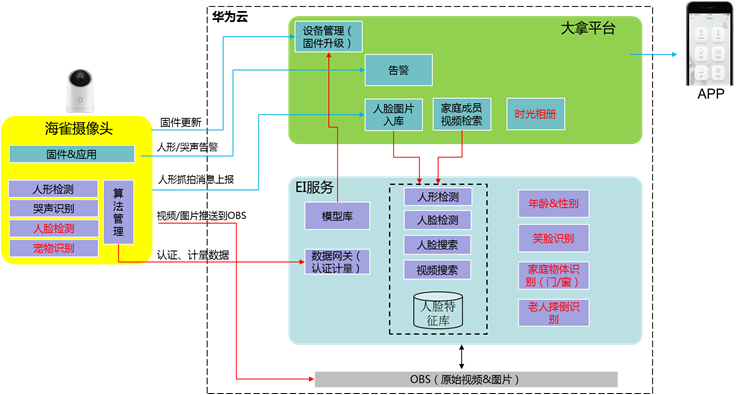

客户需求及痛点
- 传统摄像头视频仅作为实时监控，视频附加值低。希望能自动分析视频，给最终用户提供增值业务服务
- 视频上传公有云带宽要求高，集中存储困难
- 视频集中实时分析，成本高
- 识别内容多，单一算法跟不上需求变化

解决方案价值
- 业务使能：围绕家庭视频，提供人形、哭声检测，及智能视频检索服务，为最终用户提供了家庭成员检索、老人&小孩看护、陌生人监控增值服务
- 端云协同：自动判断二次云侧识别，极大降低网络传输带宽和视频分析成本
- 云侧训练：云侧可自动高效训练模式，并根据需要下推到端侧，快速响应算法变化的需求

- 准确率高，大幅领先业界，多种应用场景精准识别
- 响应快，亿万人脸，秒级定位；
- 端云协同方案：大幅降低网络带宽，同时提升精准率；
  - 端侧最懂华为“芯”,低内存，高精度；云侧采用深度学习模型，快速迭代优化
  - 端侧算法可以根据需要自动二次调用云侧，在降低带宽时，针对性提升精确率

6. 方案介绍 - 基于HiLens的智慧工地方案

- 背景：<br>
龙田数码科技致力于在安全生产方面，为电力行业，建筑行业，石化行业，煤矿行业中，避免人员违规造成伤亡，给施工企业造成不同程度的经济损失
- 挑战：<br>
传统视频分析服务，成本过高，系统搭建繁琐，不便于快速部署，对工地安全施工的复杂环境适配性太难。
- 严选方案 价值：<br>
HiLen Kit 能够支持16路摄像头的接入，进行视频分析端侧推理，一键式快速部署技能模型，做到平台在线管理，全自动安全生产管理，D开发者、大企业、行业isv能够利用边缘设备HiLens Kit快速进行方案集成和验证，在降低成品的同时能够大大提升开发效率，2周快速上线方案。


客户需求
- 分场景精准实现未带安全帽识别，同时降低误报率
- 本地端侧识别，断网下识别业务不中断
- 按需更新/加载相关技能，端侧可迁移

解决方案价值
- 可迭代技能更新，跟踪、去重、区域设定，大大降低重报、误报
- 按场景灵活部署，闸机、工地采用不同技能，提升整体识别率
- 云端统一管理，端侧可以重复利用，降低成本
- 高性能，一个区域一个硬件端可覆盖

#### 4.2.3 GES

1. 服务介绍 - 图引擎服务GES

GES( Graph Engine Service )针对以关系为基础的图结构数据，进行查询和分析的服务，采用华为自研高性能图引擎EYWA做为其内核，具备多项自主专利。在社交APP、某企业关系分析应用、物流配送、班车路径规划、企业知识图谱、风控等场景发挥重要作用。

社交关系、交易记录、交通网络等海量复杂的关联数据天然就是图数据，而我们GES（graph engine service）图引擎服务就是针对以关系为基础的图结构数据，进行存储、查询和分析的服务。在互联网推荐、知识图谱智能问答、知识图谱推理、金融风控、智慧城市中有丰富的应用场景。


华为GES图引擎服务提供了一种超大规模“图存储”，“图查询”和“图分析”的 一体化平台，能够支持大规模百亿节点千亿边数据的查询与分析，并且基于高性能分布式图计算引擎，可以实现秒级实时查询能力。

除了高性能计算内核和分布式存储框架外，GES还拥有丰富的算法库，包括能够实时查询分析的传统图分析算法，以及基于机器学习的图深度学习算法（图卷积算法、图嵌入算法）和知识图谱嵌入算法。

在使用上，GES还支持标准属性图扩展；兼容主流图计算、查询接口及业内普遍支持的Gremlin查询语言；拥有向导式的可视化界面和多种合适的结果呈现。

用户可以将自己的数据批量导入，也可以增量式的导入；用户还可以通过集成GES 图引擎提供的SDK接口轻松访问图引擎，并且也可以通过网页界面进行向导式的访问。这些使得GES具有功能强大，操作结节等特点。


2. 服务介绍 - 图引擎服务GES应用场景概览

- 应用场景：社交网络、精准营销、金融风控、信贷保险、反欺诈、知识图谱、交通网络分析等
- 功能划分：找关联（链路分析、度/邻居）、找路径、找群体( 社团类、传播类)、找特征
- 图计算算法：PageRank、最短路、K-hop、聚类系数、三角计数、Centrality、最大关联子图、Degree Correlation、K-core、标签传播、Louvain、PPR、关系预测、传播模型、Node2vec、SDNE、Graphsage等
- 图神经网络算法GNN：依托华为云ModelArts平台算力，实现基于GNN的反欺诈、营销推荐等


作为一个超大规模“图存储”、“图查询”和“图分析” 一体化平台，GES提供丰富的算法库，包括传统图计算算法和GNN，凭借丰富的算法库，高性能计算内核，分布式存储框架，可以满足各种场景下的应用需求。

基于图的天然拓扑机构，按功能划分，GES可以提供关联、路径、群体、特征等方面的挖掘能力；

例如在社交网络中进行个体价值发掘，可以采用图上PageRank算法，定义以人为核心的个体价值。 一方面，考虑数量因素，当一个用户接收到的其他用户“关注”的数量越多，用户就越重要。另一方面，基于图上的传递特性考虑质量传递因素，粉丝的质量会按一定的传递到被关注人，当被高质量 “粉丝”关注时，被关注者质量增加越大。采用这样的方法可以有效地解决传统评分方法单一性、易于作弊的问题。

还可以利用各种中心度（centrality），TrustRank相关算法寻找社交网络中的领袖人物（高价值用户）。

GES图分析算法还可以用在社交网络的好友推荐场景中。

此外，依托ModelArts强大的算力支持，GES提供丰富的图深度学习算法，包含图嵌入算法：Node2vec，SDNE等，图卷积算法：GCN,Graphsage等，知识图谱嵌入算法：TransE，ComplEx等。

图嵌入与图卷积：通过深度学习算法对图结构及图中节点上的特征进行抽取提炼，从而对图及节点进行分类和嵌入式表达，可以应用在知识图谱的知识表示中。

在金融反欺诈领域，通过 GNN 对数据进行更深层的挖掘，识别恶意用户的模式，从而进行风险控制。

在营销领域，图神经网络提供了深层次交互关联信息挖掘解决方案，能挖掘用户可能与商品更多层次的交互，以便进行营销推荐。

此次，GNN还可以用于生物的蛋白质活性检测、RNA 分类、基因预测等。

### 4.3 视觉类解决方案

#### 4.3.1 文字识别（OCR）

1. 服务介绍 - 华为云文字识别 (OCR) 服务总览


图像文字识别，也称光学字符识别，简称为OCR。从广义上讲，是指对文本资料的图像文件进行分析识别处理，获取文字及版面信息的过程。OCR技术是一种应用广泛的技术，可应用在通用类，票据类，证件类的场景的文字识别，代替人工录入，提升业务效率。 同时也是当前AI领域的热门方向。

这张图展示了华为云OCR服务的全景图，华为云OCR服务包含通用类，票据类，证件类，行业类，模板定制五大类别。华为云OCR服务包含五大场景，涵盖了广泛的通用应用场景，以及一些行业通用的识别需求，更多的定制需求即将通过智能化的在线定制能力对外开发。同时华为云已率先于国内其他服务商在海外提供OCR服务能力，如缅甸身份证、泰文身份证、国际护照等，更多的服务也在不断的孵化当中。

依托于华为云的海量底层训练和推理资源，以及底层基础AI平台能力支持，华为云OCR服务从开发到上线的速率大幅加速，在客户新业务测试中的时间更是缩短至天级。

智能分类，一图多票，自动分割识别

2. 方案介绍 - 基于OCR的发票报销全流程自动化方案


华为云的OCR服务还可应用于财务报销场景中。华为云OCR服务可自动提取票据的关键信息，帮助员工自动填写报销单，同时结合RPA自动化机器人，可以大幅提升财务报销工作效率。华为云票据OCR识别支持增值税发票、出租车发票、火车票、行程单、购物小票等票据的OCR识别，能够对图片倾斜扭曲矫正，有效去除盖章对文字识别的影响，提升识别准确率。
 
在财务报销中很常见的是一图多票的场景，在一张图片中包含多张多种票据。一般OCR服务只能针对一种票据进行识别，例如增值税发票服务只能识别单张的增值税发票。华为云OCR服务上线智能分类识别服务，包含了一图多票、一图多卡、卡票混贴、合计计费四大特点。 支持多种板式的票据、卡证分割，包括但不限于机票、火车票、医疗发票、驾驶证、银行卡、身份证、护照、营业执照等。再结合各个OCR服务，可实现图片多种不同种类票据的识别。
 
对于财务人员来说，拿到一批财务发票之后，需要手动将发票信息录入系统中。即使使用华为云OCR服务，也需要对每张财务发票进行拍照再上传到电脑或服务器上。华为云可提供批量扫描OCR识别解决方案，只需要一台扫描仪与PC机，通过扫描仪批量扫描发票，生成彩色图像，并且自动批量调用华为云OCR服务，快速完成发票信息提取过程，并且将结果可视化，直观的对比识别结果。还可将识别结果批量导出到excel表格或者财务系统中，大幅简化数据录入过程。

3. 方案介绍 - 基于OCR的智慧物流解决方案


试想下，我们寄快递的流程是怎么样的。先是快递员上门取件，此时可通过移动端（例如手机APP）对身份证进行拍摄，借助华为云身份证识别服务自动识别身份信息，完整实名认证。之后还需填写快递信息，可以上传地址截图，聊天记录等图片，通过OCR识别并自动提取姓名电话地址等信息完成快递信息的自动录入。快递运输过程中还可通过OCR提取运单信息，完成快递的自动分拣， 判断快递面单中信息是否填写完整。华为云OCR服务支持任意角度，光照不均，残缺不完整复杂图片的OCR识别，具有识别率高，稳定性好等特点，可以大幅减少人工成本，提高用户体验。

4. 方案介绍 - 基于OCR的医疗保险理赔方案


医疗保险理赔中涉及到多种医疗单据和证件、银行卡等的信息录入和审核工作，通过华为OCR服务，可以将复杂的人工录入工作自动化，加快理赔处理速度，提高用户体验，同时降低人工成本。 医疗发票相比增值税发票，打印错位问题较严重，并且发票有较复杂的底纹背景，华为OCR具有明显的技术优势，有效解决医疗单据中错行、文字相互覆盖、盖章干扰等复杂场景的文字识别
 
在医疗场景中另外一种较为场景的是医疗检验单的信息录入，医疗检验单具有种类样式繁多，无统一标准的特点。不同医院不同科室的医疗检验单样式都可能是不一样的。人工录入效率低，人工成本高。华为云医疗检验单OCR服务基于大量医院数据的迭代训练分析，深度学习模型稳定性强，覆盖场景多。支持上千家医院的识别录入，能有效处理拍照不规范、上下左右翻转、模糊变形等复杂场景。

5. 方案介绍 - 基于OCR的银行证券解决方案


在金融领域，如银行、证券、基金等业务中，存在大量的纸质数据的识别需求，如各类单据、发票的切割与分类，企业财报的自动化识别，合同的智能化比对，征信报告的识别与风险点分析，信用证业务的自动化处理，客户手写文字信息的识别，签名比对，盖章提取。通常由于数据原来的差异导致版式差异大，另外存在各种盖章干扰，褶皱，扭曲、污渍等复杂状况，导致数据处理难度大，尤其是效率低，极大的制约了业务的快速扩展，与客户需求的及时响应。 基于OCR能力，构建起金融行业内部的识别验证平台，如人证核身，双录等，便于客户快速安全的处理自身的业务；同时构建内部的影音数据管理中台，集中部署，集中处理，将结构化数据统一存储，作为核心服务能力串联到业务系统中；

不仅提升了业务效率，也降低了成本，提升业务体验与客户满意度，从而整体转换为金融科技的竞争力点。

从金融行业对安全与风险控制层面来讲，这些大量数量的快速处理与分析，将各方有效信息进行结构化识别，运用OCR+NLP，有助于大幅提升风控的能力与运营安全。

#### 4.3.2 图像分析：图像识别、图像搜索、内容审核

1. 服务介绍 - 图像识别6大功能


6大功能，实现全媒介标签和图像优化

图像识别服务基于深度学习技术，可准确识别图像中的视觉内容，提供多种物体、场景和概念标签，具备目标检测和属性识别等能力，帮助客户准确识别和理解图像内容。

图像识别服务下包括图像标签、翻拍识别、名人识别、视频标签三个功能
- 图像标签：可识别物体、场景和概念标签，便于您搜索、过滤和管理大型图库
- 翻拍识别：可识别商品标签图片是原始图片还是二次翻拍、打印翻拍等处理的翻拍图片
- 名人识别：准确识别图像中包含的影视明星及网红人物
- 视频标签：对视频进行场景分类、人物识别、语音识别、文字识别等多维度分析，形成层次化的分类标签。
- 工业智能质检：光伏、半导体等工业器件的缺陷检测

2. 方案介绍 - 基于图像识别的光伏智能质检方案


图像识别的光伏智能质检方案介绍

- 业务背景：
  - 在光伏领域， 太阳能电池板片也能会存在裂纹、黑点、虚焊等问题，因此在出厂前，所有光伏片需要进行人工检查，每个光伏片需要一名工人检查3~5秒
  - 使用人工检测面临着人力成本越来越高的问题，检测的质量也和检测员工的经验、疲劳强度等强相关，导致检测质量不稳定。

在工厂的产线中，真正有故障的比例是很小的。因此我们的优化思路是，使用AI识别，将占比极高正常的器件识别出来，AI识别疑似有故障的光伏片再让人工复审，从而降低人力的消耗

下面介绍一下我们的实现方案：首先通过检测仪对光伏片进行扫描拍照，然后将照片通过深度学习和计算机视觉等方法进行自动化AI识别，识别出有缺陷风险的器件，再将这批疑似故障器件再进行人工二次检查。

通过华为EI的质检方案落地：节省工厂质检人力80%，识别时间小于1秒，漏检率小于0.5%，高于之前人工识别的漏检率2.5%。

不仅降低了企业的人力成本，还提高了企业的产品质量和生产效率。

3. 方案介绍 - 基于图像识别的光伏智能质检方案


光伏质检可以进行边缘部署，模型训练使用云上强大的算力。

将AI质检部分放到工厂的生产环境中，工厂生产数据不上云，一方面满足客户数据不出生成环境的要求，另一方面质检系统摆脱了对公有云的强依赖，系统可靠性提升

4. 方案介绍 - 基于图像识别的无人收银方案


基于图像识别的无人收银方案

在零售店铺收银过程中。存在着很多包括包装、人力成本等问题
  - 包装问题：无包装、无条码产品多，无法使用传统的射频扫描等技术；
  - 成本高：收银人员招聘、薪酬等等成本高，人员流动性大

华为云EI无人收银方案中，客户将购买的商品放到结账设备，设备的摄像头自动扫描成像，成像后通过AI识别出具体的商品类别和数量，然后自动结算出来商品的价格。达到商店的无人收银。降低收银的人力成本

通过AI无人收银方式，大大节省了用户的收银人力投入，智能结账也提升消费者的用户体验。

5. 服务介绍 - 内容审核


内容审核服务：基于领先的图像、文本、视频检测技术，可自动检测色情、广告、暴恐、涉政等内容，帮助客户降低业务违规风险。
- 鉴黄：判断一张图片的涉黄程度，分别给出色情、性感、正常三个置信度分值
- 涉政暴恐：快速检测图片中是否包含火灾、枪支、刀具、血腥、暴恐旗帜等
- 涉政敏感人物：判断是否有政治人物等敏感信息
- 文本内容检测：检测文本内容中是否包含有色情、涉政、广告、辱骂、灌水和违禁品
- 视频审核：判断视频是否具有违规风险，从画面、声音、字幕多维度提供违规信息

6. 服务介绍 - 内容审核应用场景和亮点


内容审核服务可用于直播、短视频、论坛、游戏等场景的违规敏感信息审核，降低企业违规风险。

华为云内容审核服务具有审核场景多、速度快、时效性好、结果准确等优势
- 可以检测色情、性感、暴恐、涉政、灌水、谩骂、广告、违禁品、画中画9种场景。
- 在视频直播网站中，既有通过色情、性感内容吸引流量，也有部分用户删除暴恐涉政违禁内容。给企业带来较大的违规风险。通过华为视频、图片内容审核，可及时检测违规主播画面，规避风险。
- 在社交平台、论坛、电商网站中，应用华为云文本内容审核，可完成无意义灌水贴、辱骂他人、涉政、广告、色情等违规内容检测。
- 媒资资讯类网站，面临着越来越多的UGC内容，网站也面临着越来越大的违规风险。通过发布前进行视频、图片自动审核，可以提前发现违规风险。
- 在游戏网站可用于用户注册用户名、游戏聊天内容等检查

7. 方案介绍 - 基于内容审核的短视频方案

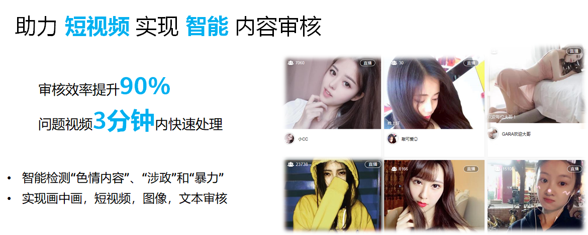

内容审核服务：基于领先的图像、文本、视频检测技术，可自动检测色情、暴恐、涉政等内容，帮助客户降低业务违规风险。
- 助力短视频实现智能内容审核。提升审核效率90%。
- 视频审核可实现画中画、短视频、图像、文本审核等功能、辅助客户审核。降低业务违规风险
- 短视频行业火爆，给行业带来了具体的用户梳理提升和黏性，但同时也隐含着色情、涉政暴恐等违规风险，人力审核无法做到海量的视频全覆盖。
- 通过AI内容审核、可使用API接口自动识别出视频中的色情、涉政、暴恐画面。降低网站违规风险。

8. 服务介绍 - 图像搜索

图像搜索（Image Search）
- 基于领先的深度学习与图像识别技术，结合不同应用业务和行业场景利用特征向量化与搜索能力
- 帮助客户从指定图库中搜索相同或相似的图片


产品优势：

- 搜索精度高<br>
基于领先的深度学习与图像识别技术，预置多种行业特征模型，其中版权查盗场景准确率达99%以上
- 海量搜索<br>
  - 大规模搜索引擎支持亿级别图像搜索，秒级响应
  - 支持大规模批量导入
- 简单高效
  - 标准化接口封装，简单易用；
  - 配套文档描述详细，方便服务快速搭建
- 可定制化
  - 提供定制化的场景搜索服务，使得搜索结果更准确

9. 服务介绍 - 图像搜索应用场景


图像搜索可用于：盗版图片查询。家具家装搜索、电商网站商品搜索、工业零件等搜索场景

10. 方案介绍 - 基于图像搜索的版权维护方案


基于图像搜索的版权维护方案介绍：
- 和中国图库联合共同创新：实现了千万级版权图片和亿级别互联网图片的盗版匹配。
解决了盗版中水印、变比例、背景、换色、裁切、虚拟、加字等图片的匹配问题。
- 每天处理百万级别的图片盗版查询。实现了亿级别的搜索

#### 4.3.3 人脸识别

1. 服务介绍 - 人脸识别


人脸识别主要提供图片人脸检测，人脸比对，人脸搜索与活体检测四个功能
- 图片人脸检测是在图像中准确识别出人脸的位置和大小，同时给出人脸的基本属性，如性别、年龄等。
- 人脸比对主要提供人脸对比功能，计算两张图片中人脸的相似度，应用系统通过给出的相似度判定是否为同一人
- 人脸搜索通过功能内部的人脸特征提取将提取到的人脸特征导入到人脸库中，以便于后续对重点人员检索。一般与人脸库管理搭配使用。
- 活体检测通过动作判断操作用户是否为真人，有效抵御照片、视频等作弊攻击。

2. 服务介绍 - 人脸识别应用场景


园区、写字楼、学校、工地等公共场所都有闸机对出入人员进行管控。传统闸机普遍通过刷卡来辨别身份，高峰时段经常会出现忘带卡证或停顿找卡的情况，导致闸机口堵塞，通行缓慢。同时传统闸机只通过卡证识别，只认卡不认人，被盗用风险高，对管理有极大的安全隐患。

人脸闸机识别方案通过人脸识别技术精确识别来访者身份，快速返回识别结果。通行者走近闸机过程中即可进行脸部图像抓取，刷脸通过，使用简便，快速通过。同时，可将人脸识别闸机与考勤系统结合，可有效防止代打卡、作弊等现象，实现园区的自动化管理。

人脸闸机的场景中会使用到人脸库管理功能和人脸搜索功能

校园安全现在是教育行业重点关注的场景。 在校园安全场景中， 对学校师生的管理是一个重要的议题：家长揪心学生的安全与健康，老师担心管理的疏漏，学校盼望提升服务与效率。

基于人脸识别服务，校区管理系统可以实现身份识别、生活轨迹、归寝管理、会议签到和学校热力图等多个智慧管理场景。

在学校师生管理场景中， 一般推荐使用人脸检测、人脸搜索、人脸库管理功能， 也可搭配人脸抓拍机或视频人脸检测算法来使用

在互联网金融行业，如何快速确认客户的身份，授权相应的操作，是非常关键的，影响着企业的业务安全和竞争力。

基于人脸识别技术，提供高准确度的身份确认，保障业务操作安全，使用户在手机上就能够放心的进行操作，提升用户体验。另外，基于人脸识别技术，可以广泛用于打车APP对网约车司机身份实时确认，保障乘客用车安全。

在这个场景中，可使用人脸搜索与人脸库管理，可以选配活体检测进行防作弊攻击

#### 4.3.4 视频分析

1. 服务介绍 - 视频分析


视频分析的算法场景主要包含人、车、物品与事件四个分析能力

人的分析能力主要包括视频人脸检测、人流统计和热力图。视频人脸检测可以快速识别视频中的人脸，用于为后续的人脸识别提供人脸图片。人流统计统计视频区域中人数，热力图统计视频区域中出现人员概率。人流统计和热力图主要用于识别出该区域的人群热度。

车的分析能力主要包括车牌识别和车属性识别。车牌识别用于识别车辆车牌号码，可支持蓝牌车牌和新能源车牌。车属性主要提供车型、颜色等信息，用于上层业务系统进行详细的车辆信息分析。

物品的分析能力主要包括物品遗留。物品遗留识别主要分析出区域内疑似箱包类物品的遗留情况，可用于在小区等场景内的物品遗失挂失等场景。

事件的分析能力主要包括烟火识别和入侵检测。烟火识别主要识别画面中的明火和烟，入侵检测可以针对过线或区域的非法侵入行为进行识别并发出告警信息，同时支持人与车的过滤，即只针对人或车的入侵进行识别告警，可以极大降低误报率

2. 方案介绍 - 基于人脸识别与视频分析的智慧园区方案

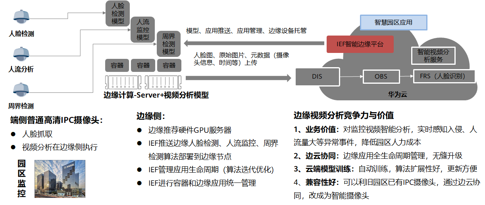

天安云谷位于深圳中部核心区坂雪岗科技城内，占地76万㎡，总面积289万㎡，聚焦“云计算、移动互联网等新一代信息技术和机器人与智能设备研发”等主导产业；同时围绕其发展相关现代服务业和生产性服务业。云谷面向主导产业的需求提供开放共享的空间与智慧的环境建设，打造企业和人才充分关联的智慧产城生态圈 。

本项目中采用边云协同的视频分析方案。 人脸检测、车辆识别、入侵检测等视频分析模型都下发至园区本地的GPU推理服务器中，在本地完成实时视频流的分析后， 可选择将分析结果上传至云上或保存至本地供上层应用系统对接使用。

通过采用边云协同的视频分析方案，园区对监控视频实现了智能分析，实时感知入侵、人流量大等异常事件，降低园区人力成本。同时可以利旧园区已有IPC摄像头，通过边云协同，改成为智能摄像头，极大地保护了用户的存量资产

3. 方案介绍 - 基于视频分析的人流统计 & 热力图方案

人流统计及热力图主要用于识别画面中的人群信息，包括人员数量信息和区域人员热度信息。可支持画面的人数统计和热度统计，支持自定义时间设置和结果发送间隔设置。主要用于客流统计、访客量统计和商业区域热度识别等场景


功能：
- 支持画面的人数统计
- 支持画面的热度统计
- 支持自定义时间设置
- 支持统计结果发送间隔可配

场景：
- 客流统计
- 访客量统计
- 商业区域热度识别

优势：
- 抗干扰性强：支持复杂场景下人流量统计，如脸遮挡，部分身形遮挡
- 高可扩展性：支持行人过线统计、区域统计、热力图统计结果同时发送
- 高易用性：接入1080p的普通监控摄像头即可

4. 方案介绍 - 基于视频分析的车辆识别方案

车辆识别主要用于识别画面中的车辆信息，包括车牌及车属性信息。可支持车型检测，包括轿车，中型车等。支持车辆颜色的识别，支持车牌的识别，包括蓝牌车牌和新能源车牌。主要用于园区车辆管理、停车场车辆管理和车辆追踪等场景


功能：
- 车型检测
- 车辆颜色识别
- 车牌识别

场景：
- 园区车辆管理
- 停车场车辆管理
- 车辆追踪

优势：
- 场景覆盖全面：支持电警、卡口等各类场景的车型、车款、车身颜色和车牌识别功能
- 高易用性：接入1080p的普通监控摄像头即可

5. 方案介绍 - 基于视频分析的入侵识别方案

入侵识别主要用于识别画面中的非法入侵行为。可支持提取摄像头视野的运动目标，当目标越过制定区域时触发告警。同时支持告警区域最少人数设置、告警触发时间设置以及算法检测周期设置。主要用于重点区域非法进入识别、危险区域非法进入识别以及登高/攀爬检测等场景


功能：
- 提取摄像头视野的运动目标，当目标越过制定区域时触发告警
- 支持告警区域最少人数设置
- 支持告警触发时间设置
- 支持算法检测周期设置

场景：
- 重点区域非法进入识别
- 危险区域非法进入识别
- 登高/攀爬检测

优势：
- 高灵活性：支持告警目标大小、类别设置
- 低误报率：支持基于人/车入侵报警，过滤其他物体干扰
- 高易用性：接入1080p的普通监控摄像头即可

6. 方案介绍 - 基于视频分析的遗留物检测方案

遗留物检测主要用于识别画面中的遗留物品出现或消失。可支持针对指定区域的监控，当识别出现物品遗留时触发告警，针对指定区域指定物品的持续监控，当物品发生遗失时会触发告警。同时支持告警触发时间设置和算法检测周期设置。主要用于非法遗留物的识别、重点物品监控等


功能：
- 支持针对指定区域的监控，当识别出现物品遗留时触发告警
- 支持针对指定区域指定物品的持续监控，当物品发生遗失时触发告警
- 支持告警触发时间设置
- 支持算法检测周期设置

场景：
- 非法遗留物识别
- 重点物品监控
- 偷窃行为识别

优势：
- 高可扩展性：支持结合人脸识别、入侵检测等实现准确识别
- 低误报率：针对指定区域指定物品进行识别，排除干扰信息
- 高易用性：接入1080p的普通监控摄像头即可

7. 方案介绍 - 基于视频分析的烟火识别方案

场景说明：

首先摄像头自动识别起火前的烟雾，并定位烟雾发生区域，并实时识别区域火焰情况，及时告警将火灾隐患扼杀于萌芽之中。


烟火识别通常用于识别画面中的明火和烟。首先摄像头自动识别起火前的烟雾，并定位烟雾发生区域，并实时识别区域火焰情况，及时告警将火灾隐患扼杀于萌芽之中。包含以下两种能力：
- 烟雾检测：通过对烟雾颜色来判断烟雾浓度(淡淡烟为半透明色，浓烟为灰黑色) ，包含扩散性判断。
- 火焰检测：通过火焰颜色与外形进行是否有火焰存在的识别。

使用烟火识别能力，可以获得如下提升：
1. 对于疑似烟、火区域，使用视频分析，有效利用烟火视觉特征，提高检测精度。
2. 无需红外热感摄像头，普通摄像头可部署，同时支持室内、室外、白天和夜晚的烟火检测，场景适应性好。
3. 具备云端调优能力，可依据现场环境需求由算法专家评估并进行算法调优，使算法适应不同环境并达到最优效果。

8. 方案介绍 - 基于视频分析的便捷通行方案


9. 方案介绍 - 基于视频分析的门禁闸机方案


10. 方案介绍 - 基于视频分析的智慧场馆方案


11. 方案介绍 - 基于视频分析的智慧园区方案


12. 方案介绍 - 基于视频分析的园区IOC系统方案


### 4.4 语音语义解决方案

#### 4.4.1 语音交互

1. 服务介绍 - ASR语音识别


语音交互服务以api的形式对外提供服务。

语音识别，解决听的问题，语音合成，解决说的问题。

一句话识别/短语音识别： 用户一次性上传数据，服务端接到完整数据后，进行转写。支持8k,16k模型。主要应用于人机交互（典型如微信语音输入），内容审核。
实时语音转写：语音以分片的形式输入，服务端流式的处理音频数据，实时转写出结果。相比于一句话识别/短语音识别，识别速度更快。主要应用场景有智能外呼，会议转写，文本录入等场景。

录音文件识别：分为任务提交和任务查询两个接口，用户通过任务提交接口提交任务，通过任务查询接口进行识别结果查询。录音文件识别转写结果中会输出情绪，角色，语速等关键信息。能够应用于客服质检，内容审核等业务场景。

热词自助调优：在语音识别领域中，如果有一些特有的词，识别效果差，可以考虑用热词进行效果调优，改善识别效果，典型如人名，地名，各种专有名词。用户首先通过热词创建接口创建热词，服务返回热词id。在调用语音识别相关接口时，传入热词id，能够优化识别结果。

所有接口均支持热词自动调优

2. 服务介绍 - TTS语音合成

语音合成：文本转换为语音，支持多种音色，支持语速，音量，音高调整


#### 4.4.2 自然语言处理

1. 服务介绍 - 自然语言处理服务 (NLP) 全景图


华为云EI自然语言处理服务主要提供自然语言处理基础、语言理解、语言生成和机器翻译四个子服务，每个子服务下提供相应的的原子能力api，如分词、文本相似度计算、 实体链接、文本分类、情感分析等；

基于这个服务可以打造智能问答、舆情分析、广告识别等应用场景

2. 方案介绍 - 基于NLP的多模态口语评测方案


- 双模识别：抗噪能力强——通过视频和音频的抓取，不易受环境干扰，识别准确率高，降低噪声环境下的打分偏差
- 双模评测：读音+口型——根据口型精确识别不标准发音，对不同口语水平的用户区分度更高
- 双模反馈：问题点视听回放——视觉回放发音过程
- 双模纠错：视听混合的发音示范——提供标准英音美音发音示范，强化学习记忆，协助发音改进

基于音频、视频多模态数据，从发音和口型多维度进行评测
- 效果更准确
- 鲁棒性更好
- 口型教学更直观
- 纠错更具针对性

3. 方案介绍 - 基于NLP的多模态口语评测方案


相较于传统的基于语音单模数据口语评测，多模态口语评测具有以下优点：
- 通过结合音频、视频多个模态的数据进行口语评测，评测更为精准；
- 口型演示，更加直观地指导学习者如何发出正确的读音
- 多种模态的信号的融合，评测的鲁棒性更优，方便在各种环境下的学习；
- 传统基于语音单模的评测，对环境安静程度要求很高，多模态口语评测抗造能力强；
- 随时随地学英语，平板、手机、电脑只要能够采集音视频的设备都可以进行口语学习


#### 4.4.3 对话机器人

1. 服务介绍 - 华为云对话机器人服务 (CBS) 概览

对话机器人服务Conversation Bot Service (CBS) 自服务介绍

| 子服务 | 简介 |
| :------------- | :------------- |
| 智能问答(CBS)	| 简称QABot，可帮助企业快速构建、发布和管理智能问答机器人系统 |
| 话务机器人对话(CBS-TaskBot)	| 简称TaskBot，能精确理解对话意图，提取关键信息，可用于智能话务，智能硬件|
| 语音助手	| 结合语音识别、语音合成与taskbot，实现语音命令解析与执行 |
| 智能质检( CBS-SA)	| 使用自然语言算法和自定义规则，分析呼叫中心场景下客服坐席人员与客户的对话，帮助企业提升坐席服务质量和客户满意度 |
| 定制对话机器人(CBS Customization)	| 可根据客户需求构建具备知识库和知识图谱问答，任务型对话，阅读理解，自动文本生成，多模态等多种能力的AI机器人，赋能不同行业客户 |

前面介绍完自然语言处理相关服务，接下来我们介绍一下对话机器人服务。

对话机器人服务主要提供了智能问答、话务机器人、智能质检及语音助手等子服务，其中，智能问答可帮助企业快速构建、发布和管理智能问答机器人系统；

话务机器人能精确理解对话意图，提取关键信息，可用于智能话务，智能硬件；
语音助手结合语音识别、语音合成与taskbot，实现语音命令解析与执行，可用于智能家居等场景；

智能质检使用自然语言算法和自定义规则，分析呼叫中心场景下客服坐席人员与客户的对话，帮助企业提升坐席服务质量和客户满意度；

同时，还提供定制对话机器人服务，可根据客户需求构建具备知识库和知识图谱问答，任务型对话，阅读理解，自动文本生成，多模态等多种能力的AI机器人，赋能不同行业客户。

2. 方案介绍 - 基于CBS和NLP的多机器人融合方案


- 多机器人智能融合，更全面<br>
多款机器人各有所长，自学习自优化，为客户推荐最优答案
- 多轮智能引导，更懂你<br>
多轮对话，交互自然，能够精准识别用户意图，理解用户潜在语义
- 知识图谱，更聪明<br>
  - 通用领域语言模型+领域知识图谱
  - 图谱内容动态更新
  - 基于图谱的机器人更智能
  - 避免问答库爆炸


应用场景：政务咨询智能客服、售前/售后智能客服、企业智能客服、助手客服、智能硬件等……

通常单一功能的机器人无法解决客户业务场景下的所有问题，通过融合多个不同功能的机器人打造一个对话机器人联合解决方案，对外呈现为一个单一服务接口，客户只用调用单一接口即可解决不同业务问题，各个机器人的功能特点如下：

智能问答机器人(IRBot)适用场景：
- 1、解决IT、电商、金融、政府等领域常见的咨询、求助等类型的问题；用户咨询或者求助频率高。
- 2、有一定的知识储备，具备一定的QA知识库、具备FAQ或者类FAQ文档、有一定的工单和客服问答数据

任务型对话机器人(TaskBot)适用场景:

有明确对话任务，可根据实际的业务场景灵活配置话术流程(多轮交互)。加载话术模板后，可与客户在对应场景下进行基于语音或文本的多轮对话，并同时理解和记录客户意愿。适用场景：
- 1) 外呼机器人：业务满意度回访，核实用户信息，招聘预约，快递派送通知，促销推广，筛选优质客户等；
- 2) 客服：酒店、机票预订、信用卡激活等；
- 3) 智能硬件：语音助手、智能家居等；

知识图谱问答机器人(KGBot)适用场景:
- 1、知识体系复杂
- 2、答案需要逻辑推理才能得到
- 3、多轮方式交互得到答案；
- 4、涉及实体属性值或者实体之间关系的事实性问题，不能通过枚举的方式把所有QA对穷举的情况；


基于知识图谱的汽车智能问答机器人，可以进行精准的知识问答，如查询某款具体车型的价格、配置等，可以根据价格、级别类型等推荐车辆；也可以进行车辆对比的问答咨询，同时答案可以包含文字、表格、图片等信息。

3. 方案介绍 - 基于CBS和SIS的智能外呼解决方案

该方案由华为云EI和伙伴联合打造，目前已上线严选解决方案，华为提供ASR、TTS、对话机器人引擎，伙伴负责整个系统的集成开发；

解决招人难（工作内容枯燥重复，需面对大量负面情绪、离职了高）、管理难（人员忠诚度低、能力参差不齐、行为过程难监控）、成本高（人工、培训、场地）、效率低（跟进容易遗漏、客户转化率低）等问题


- NLP引擎：使用领先的语义理解算法，精确理解用户回答的意图
  - 支持反问和打断机器人
  - 语义理解和语义纠错
  - 指代解析，用户没听清机器人重复问题
  - 自动生成呼叫总结报告
  - 话术灵活定制，支持加入问答对，以及意图识别多轮问答完成业务
  - 时间地点、肯定/否定、正面负面等预置语义解析模块
- 语音识别ASR：<br>
可定制实时流语音识别引擎，领域优化效果更优；TTS支持专业发音人定制
- 全栈能力支持：<br>
可提供线路，支持复用已有的网关线路，端到端接口调用，客户不用关心细节

4. 方案介绍 - 基于CBS和SIS的智能质检解决方案

如何对客服服务质量进行分析，保证客服服务能力持续提升，客户满意度不断提高？
传统质检：
- （1）由专业质检员进行抽样人工听录音分析，通常抽检率在5%左右，质检率低，工作量大；
- （2）需要培养专业质检员，人员专业度、稳定度、培养成本都是企业的痛点；

智能质检：
- （1）端到端华为云严选解决方案；
- （2）全量自动化——离线全量自动分析海量文件，快速高效，并支持人工核对；
- （3）智能分析——利用语音识别技术、NLP技术，智能分析客服对话，并生成报告；
- （4）智能规则——灵活的语音语义规则定制，支持扣分项配置，直观展现真实的客服表现；
- （5）多源数据灵活接入——支持文本、语音数据，obs数据无缝对接；


5.  方案介绍 - 基于CBS和SIS的企业级OA方案

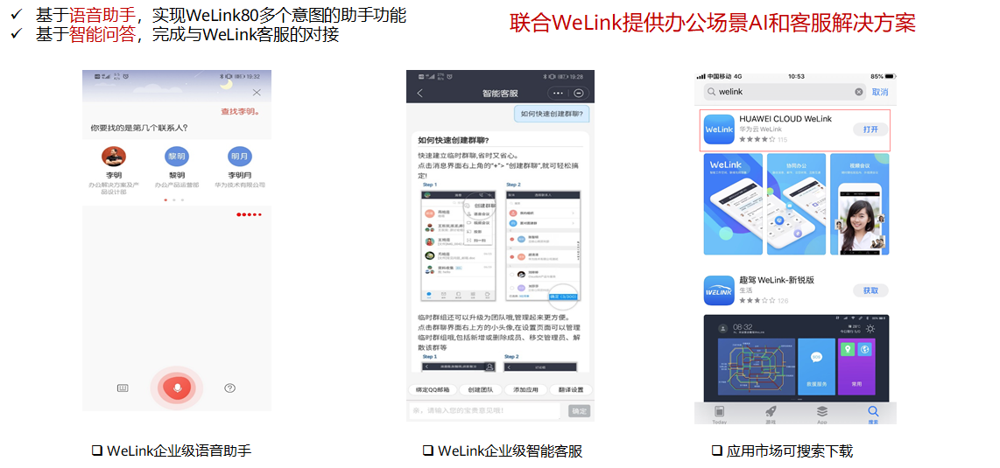

华为云welink，企业的智能工作平台，源于华为全球化的数字化办公实践，高效联接企业团队、业务、知识和设备，助力企业数字化转型。

welink集成了基于华为云EI语音识别asr、语音合成tts和对话机器人cbs服务实现的语音助手功能，可以理解用户的语音输入，帮助用户执行相关命令，如查找联系人、呼叫同时、搜索邮件等等

此外，welink也集成了基于华为云对话机器人打造的企业级智能客户，用户可以快速咨询各种问题；
- 语音助手功能广泛，可以用于智能家居，智慧城市大屏的控制，车载控制等等

方案（Qabot+taskbot）优势：
- 多轮交互：引导用户澄清问题
- 精准语义理解模型：准确识别用户意图，理解用户问题
- 完整知识闭环方案，机器人越用越智能：
- 未解决问题记录分析；
- 人工+机器快速闭环问题至知识库
- 数据标注+模型训练，持续优化模型

#### 4.4.4 知识图谱

1. 服务介绍 - 知识图谱简介


知识图谱本质是一种知识的表示形式，是结构化的语义知识库，用描述物理世界中的实体及其相互关系。由于人类的知识大部分都是以自然语言文本形式保存，图谱构建会涉及很多NLP相关技术。

本体是某个领域中抽象概念的集合，能够描述某个范围内一切事物的共有特征以及事物间的关系，比如“人”的概念以及与人相关的所有属性概念集合。本体由概念和概念间的关系组成，概念也可以理解为实体类型，概念定义了这类实体可以具有哪些属性。

实体指具有可区别性且独立存在的某种事物，比如某个人、某个地点、某个公司等。实体是概念的实例化表示，实体可以具有属性，比如一个人有年龄这一属性。

关系指实体与实体之间的语义关系，比如浙江的省会是杭州，实体“浙江”与实体“杭州”是”省会城市”关系。

知识图谱的基本知识单位是实体（Entity）-关系（Relationship）-实体/属性构成的三元组，如 浙江 – 省会城市 – 杭州， 杭州 – 人口 – 约1000万

2. 服务介绍 - 华为云知识图谱服务


图谱构建流程： 对获取到的数据进行知识抽取，包括实体和关系的抽取，接着将抽取的知识与本体进行映射，然后再对实体和关系进行一些对齐、去重、归并等操作，最终将前面处理好的数据持久化的图引擎

一站式知识图谱构建平台，提供本体设计、信息抽取、知识映射、多源融合以及增量更新等功能，所有功能提供可视化界面形式进行操作。同时，针对下游应用，提供知识图谱发布、查询、可视化等便捷的接口及服务

提供可视化本体设计工具 支持信息抽取、知识映射、多源融合的图谱构建流程，支持增量更新和全量更新 针对下游应用，提供知识图谱发布、查询、可视化等便捷的接口及服务

基于自研GES服务，存储、查询性能优 预置多个信息抽取模型，支持自定义信息抽取模型

3. 服务介绍 - 知识图谱典型应用场景


知识图谱问答系统（Knowledge-based Question Answering，简称KBQA）旨在利用机器对自然语言分析与处理能力，理解用户所提出的问题，并利用知识库中的结构化知识进行查询、推理，找到解决该问题的精准答案并反馈给用户，协助用户解决不同类型的问题。

基于知识图谱的精准搜索&智能搜索
- 知识图谱提供实体链接API，解析用户query，返回精准答案
- 知识图谱存储实体关系和属性，集成多媒体信息，支持多模态查询

知识图谱可以应用于多种应用场景。

例如，在信息推荐系统中，可以基于知识图谱中图关联信息进行信息推荐，相对于传统推荐系统存在的冷启动、数据稀疏性以及可解释性问题，知识图谱基于知识间语义关联信息进行推荐，结果具有可解释性 ，且不存在冷启动问题和稀疏性问题。

或者，在语义搜索过程中，可以基于知识图谱进行搜索，尤其是多跳搜索。传统的搜索是基于关键词匹配、概率统计的，搜索引擎给出与用户输入内容相似的网页，无法理解输入内容的意义，用户仍需自行筛选结果。基于知识图谱的搜索根据用户的搜索语句，利用自然语言处理的能力，理解用户的搜索意图，将用户输入转化为知识图谱查询，返回知识图谱中与意图匹配的知识，无需用户介入筛选。

利用机器对自然语言分析与处理能力，理解用户所提出的问题，并利用知识库中的结构化知识进行查询、推理，找到解决该问题的精准答案并反馈给用户，协助问答。

此外，基于图谱查询得到的结构化数据，结合文本生成技术，可以生成可读的自然语言文本，比如出一些报告、生成问题答案等

4. 方案介绍 - 基于知识图谱的油气认知计算方案


测井油气层识别

中国石油随着统建系统的建成和完善积累了大量的结构化数据和非结构化数据，结构化数据得到了较好的使用，但非结构化数据未得到充分应用，相关知识积累和专家经验等未能充分挖掘，数据智能化分析与应用能力不足。

具有数据容量大、种类多、价值密度低等特点。

而认知计算代表一种全新的计算模式，是人工智能发展的高级阶段。它包含信息分析、自然语言处理和机器学习领域的大量技术创新，能够助力决策者从大量非结构化数据中揭示非凡的洞察。

通过华为云知识图谱、NLP等技术，帮助中石油构建了油气行业知识图谱，并基于知识图谱构建了上层业务应用（测井油气层识别为其中一个业务场景，其他场景还包括出地震层位解释、含水量预测、工况诊断等），

最终实现了：
- （1）知识聚合：沉淀了油气行业专业知识；
- （2）降本增效：简化业务流程，缩短工作时间
- （3）增储上产：增加探明储量，保障能源安全

5. 方案介绍 - 基于知识图谱的基因检测方案

基因图谱包括了基因、变异、疾病、药物等多种类型的实体，也里面包含了基因与变异、变异与疾病、疾病与药物等等之间的各种关系，基于该图谱，可以实现：
- （1）快速查询某个实体（基因、变异、疾病、药品）的信息；
- （2）疾病辅助诊断：基于基因检测结果通过图谱推理可能的变异或产生的疾病，给出诊疗建议，推荐药物等；
- （3）基因检测报告生成：基于基因实体及其与变异、疾病等之间的关联知识这些结构化或半结构化数据，自动生成自然语言描述的可读的基因检测报告；


构建包含基因、变异、疾病、药物等的知识图谱，基于基因知识图谱提供以下能力：
- 实体查询：查询基因、疾病、变异、药物的基本信息
- 辅助病例诊断：基于基因检测信息推理可能的变异或产生的疾病，以及推荐相关药物
- 基因检测报告生成：基于基因实体及其与变异、疾病等之间的关联知识，生成基因检测报告

6. 方案介绍 - 基于知识图谱的政务方案

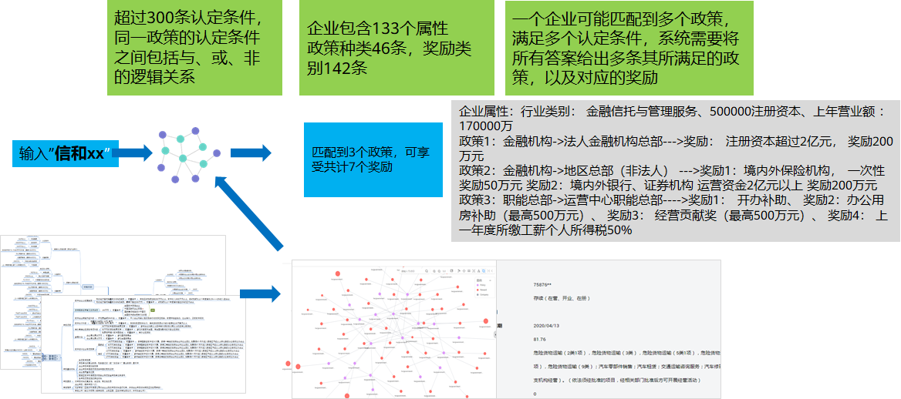

政府经常会给企业颁发一些激励政策，如一些减税返税政策，然后政策的内容通常比较专业，一般人通常很难理解清楚，需要专业人员进行解读；

政策种类、奖励类别繁多，政策对企业的认定条件超过300个，且同一政策的认定条件质检包括了与、或、非等逻辑关系，对于企业而言，如何能够快速获取自己所能享受的政策十分困难；

通过构建政策知识图谱，将政策激励与各种认定条件构建成一张大的图谱，此外构建一张企业信息的知识图谱，最后只需要输入一个企业名称，自动从企业图谱中获取到企业各项信息(认定条件)，如类型、纳税额、规模等认定条件的值，再基于这些认定条件，在政策图谱中进行逻辑推理查询，最终获取到该企业能够享受的所有政策和奖励。

思考题：

1. 在你的生活中，是否有接触到相关的解决方案？
2. 它们给你的生活带了什么改变？
3. 你是否有想到一些可以使用EI人工智能相关服务或解决方案来解决问题的场景？

## 5. 区块链及华为云方案

### 5.1 区块链技术简介

1. 区块链起源于比特币

2008年11月1日，一个自称中本聪(Satoshi Nakamoto)的人贴出比特币的白皮书。比特币系统独特能力保障从09年运行至今，没有出现重大安全事故。

“本文提出了一种完全通过点对点技术实现的电子现金系统，它使得在线支付能够直接由一方发起并支付给另外一方，中间不需要通过任何的金融机构”---《比特币白皮书》摘要

比特币诞生于2009年，是一种去中心化的点对点的电子现金系统。
- 比特币是点对点的电子现金系统(支付领域应用）
- 该系统基于区块链技术构建
- 该系统通过区块链技术，使得点对点电子交易不需要中间方验证
- 具有实验性质，目前已运行10年，未出现大问题

2. 比特币系统通俗故事


以前，账本只有一个会计记，会计就是记账的中心；现在，会计遍布全岛，这就是去中心化。

以前，账本只放在会计的家里；现在，会计到处都是，每人家里都有一本账，这就是分布式。

以前，账户基于实名，账户对应的是身份；现在，账户是一串数字，是匿名的，钥匙也是一串数字，只有数字钥匙能动用账户，这就是加密。

以前，查看账本只能去会计那里，想看其他人的账是不行的；现在，每个人随时都可以查看所有账户的来往交易，这就是公开账本。

以前，账怎么记基本上会计说了算，没啥讨论的；现在，如何获得记账权，怎么奖励，如何确认账是否有效，大家必须达成一致，这就是共识机制。

以前，会计掌握账本，他想修改交易历史，谁都管不了；现在，任何会计都只有写入权，没有修改权，因为你改了自己账没用，别人不认，这就是不可纂改。

你可能也看出来了，这套记账系统，实际上就是比特币。

3. 区块链的一个简单类比


4. 区块链是一系列现有技术的结合

“区块链是一种由多方共同维护，使用密码学保证传输和访问安全，能够实现数据一致性存储、防篡改、防抵赖的技术体系。典型的区块链是以块链结构实现数据存储。
”


5. 分布式账本


6. 密码学


- 哈希算法：一段数字内容的Hash可以用于验证数据的完整性,数字内容的微小修改都会引起Hash值的巨大变化,合格的Hash算法很容易由数字内得到Hash值，却几乎不可能通过Hash值反算出原数字内容
- 公私钥体系：公私钥体系是现在加密通讯的基石，通过加密算法随机生成公私钥对，一般私钥需要在用户手中绝对安全保存，保证只有用户才能接触到，公钥可以对外公开。可靠的加密算法可以保证任何人无法通过公钥计算出其对应的私钥

7. 区块的构成


Merkle树能够快速检验交易数据的完整性，即数据是否被篡改过。根据密码学中哈希函数的特点，如果有人对数据做过手脚，计算出的哈希值也会变得完全不一样。哪怕在这4000笔交易中，我只移动了一个小数点，你也能从Merkle树根的哈希值发现问题

8. 分布式共识

分布式共识 ~= 系统中多数独立参与者对某个交易/操作的有效性达成一致
- 包括对双花交易的验证达成一致
- 对任何交易其它合法性的验证达成一致
- 对于合法数据是否写入现有账本达成一致

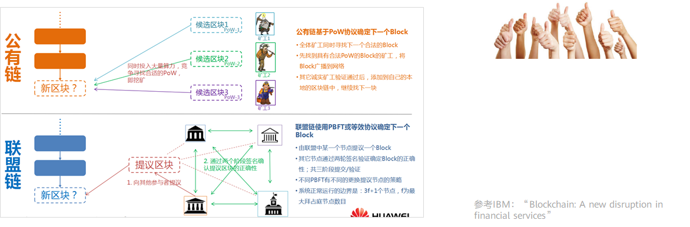

- POW：工作量证明(Proof Of Work，简称POW)，简单理解就是一份证明，用来确认你做过一定量的工作。监测工作的整个过程通常是极为低效的，而通过对工作的结果进行认证来证明完成了相应的工作量，则是一种非常高效的方式。比如现实生活中的毕业证、驾驶证等等，也是通过检验结果的方式（通过相关的考试）所取得的证明。工作量证明系统（或者说协议、函数），是一种应对拒绝服务攻击和其他服务滥用的经济对策。它要求发起者进行一定量的运算，也就意味着需要消耗计算机一定的时间。这个概念由Cynthia Dwork 和Moni Naor 1993年在学术论文中首次提出。而工作量证明（POW）这个名词，则是在1999年 Markus Jakobsson 和Ari Juels的文章中才被真正提出。
- PBFT：拜占庭容错技术（Byzantine Fault Tolerance，BFT）是一类分布式计算领域的容错技术。拜占庭假设是对现实世界的模型化，由于硬件错误、网络拥塞或中断以及遭到恶意攻击等原因，计算机和网络可能出现不可预料的行为。拜占庭容错技术被设计用来处理这些异常行为，并满足所要解决的问题的规范要求。

9. 智能合约

智能合约是运行在区块链上的，公开的代码逻辑。基于区块链特点，智能合约的运行结果是可信的，其结果是无法被伪造和篡改的。

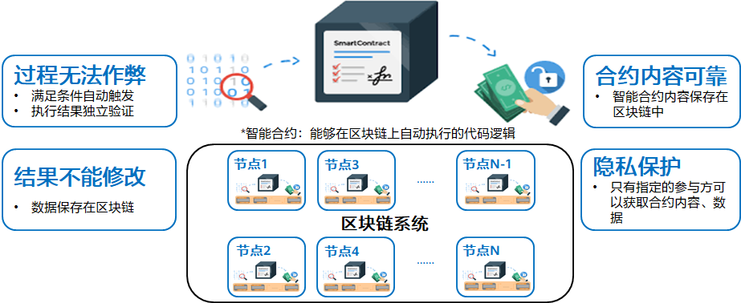

智能合约是运行在区块链上的，公开的代码逻辑。基于区块链特点，智能合约的运行结果是可信的，其结果是无法被伪造和篡改的。

10. 区块链的技术演进


- 1.0: 比特币专用系统-2009
- 2.0: 以太坊延伸至数字资产-2013
- 3.0: Hyperledger除货币外其他企业领域-2015

11. 区块链的分类


### 5.2 华为云区块链服务功能和优势

1. 华为区块链基于开源Hyperledger Fabric项目


2. 华为持续为区块链产业发展贡献力量


3. Hyperledger Fabric区块链网络


- P：Peer 节点
  - 背书功能（Endorser）：执行交易提案并背书
  - 提交功能（Committer）：交易最终检查和落盘
- O：Orderer节点
  - 排序功能：为全网收到的所有交易进行全局排序，并在Orderer节点间达成共识后生成区块

4. Hyperledger Fabric基本概念


- Peer：Peer节点，组成区块链网络的基本单位。（注：图中省略了Orderer节点）
- Ledger：共享账本，每个节点都保存有相同的账本数据。
- Channel：通道，加入同一个通道的节点共享账本。不同的通道可以用来隔离数据。
- Organization：组织，每个组织对应一个区块链的参与方。一个组织可对应N个节点。
- Application：区块链应用，同一个区块链网络的不同组织可能对应不同的应用来完成不同的功能。

5. 应用程序DApp与区块链的关系


- 应用程序
  - 区块链应用即DApp（Decentralized Application），需要连接到Peer 节点和Orderer 节点来与区块链网络通信。是交易提案的发送者
- Fabric SDK
  - 应用程序中需要集成fabric sdk来调用区块链网络

6. 交易处理过程


7. BaaS ( 区块链云服务 ) 的范围含义


8. 华为云区块链服务 - 端到端区块链服务

产品名称：
- 区块链服务  Blockchain As Service 简称BCS

降低区块链技术使用的门槛，帮助各行业实现商业互信
- 开箱即用的企业级区块链平台：帮助客户快速构建安全、稳定的企业级区块链系统，减少在区块链部署、管理、运维和开发等方面挑战
- 提供技术专业服务和行业解决方案，帮助企业业务快速上链

9. 华为云区块链平台BCS核心技术

- 易用：<br>
一键部署，数分钟完成部署，支持Fabric JDBC，像使用数据库一样使用区块链
- 可靠：<br>
深度整合华为云高性能的计算、网络、存储、云容器引擎等服务，支持多弹性伸缩、故障快速恢复、容灾等技术构建高可靠高可用平台
- 安全：<br>
国密支持，加法同态加密结合等式和范围证明，支持国密SM2/3/4
- 性能：<br>
首家Fabric支持快速拜占庭容错共识（5000+TPS），Kafka共识性能10000+TPS
- 互通：<br>
混合云部署，多云互通，华为和SAP业内首次区块链跨云互连实践

10. 易用 - 一键部署，区块链系统全生命周期管理

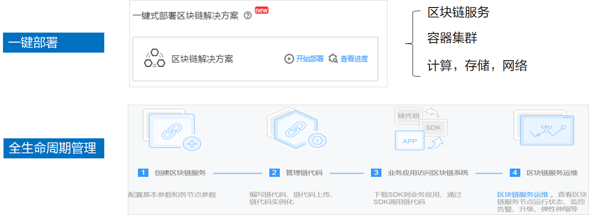

11. 易用 - 可视化智能合约生命周期管理


12. 高可用 - 节点弹性伸缩和快速故障恢复


- 构建于 Docker 和 Kubernates 之上，具备极高的可靠性和扩展性，与其他云服务完全打通，无数据膨胀和性能等问题
- 成员动态加入：通过邀请机制可快速、动态添加联盟链成员。
- 节点弹性伸缩：通过K8S实现节点弹性伸缩和快速故障恢复
- 灵活部署：同时支持私有链和联盟链部署方式，规划支持混合部署模式
- 互联互通能力：充分使用现有 IT 基础设施，并连接周边生态和业务合作伙伴

13. 高性能 - 提供多种安全、高效排序算法


14. 安全隐私 - 基于同态加密保护交易隐私

问题：A向B转账10元，需要区块链节点记账，但是不想让区块链节点知道交易金额以及最新余额


- 引入同态加密解决隐私问题
- 提出范围证明/等式证明解决金融业务可用问题，即一种范围可验证同态加密方法

15. 安全 - BCS全方位支持国密算法，满足监管要求


- SM2: 为非对称加密，基于ECC。该算法已公开。由于该算法基于ECC，故其签名速度与秘钥生成速度都快于RSA。ECC 256位（SM2采用的就是ECC 256位的一种）安全强度比RSA 2048位高，但运算速度快于RSA。
- SM3: 消息摘要。可以用MD5作为对比理解。该算法已公开。校验结果为256位。
- SM4: 无线局域网标准的分组数据算法。对称加密，密钥长度和分组长度均为128位。

16. 开放访问和全球协作网络支持


基于BCS服务的区块链应用部署灵活，包括：中心化部署、混合部署、去中心化部署等方式
- 中心化部署：所有业务部署在华为公有云，存在中心化的印象
- 混合部署：部分业务部署在华为公有云，部分业务部署在客户私有数据中心
- 去中心化部署：业务部署在客户私有数据中心

17. 区块链落地要选择合适的场景


18. 区块链应用开发过程

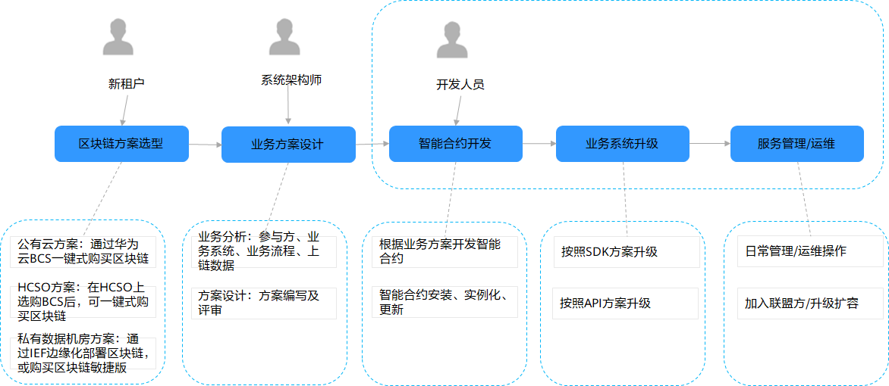

19. 区块链设计经验建议


- 呈现层<br>
与一般应用程序无差别
- 应用层<br>
需要集成区块链SDK
- 业务层<br>
将需要多方协同、共同见证的业务流程提取实现到智能合约中。其余业务保留在原业务层实现中
- 数据层<br>
将需要多方共享、共同见证的业务数据存储到区块链中。其余部分保留在传统数据库中。注意一般不建议将图片或视频等大容量数据存储在区块链中，而应将上述数据的哈希值上链来替代

### 5.3 华为云区块链应用场景和案例

1. 供应链金融领域存在的痛点

- 供应链上存在很多信息孤岛，企业间信息的不互通制约了很多融资信息的验证；
- 核心企业信用并不能有效传递，根据合同法，核心企业是跟一级供应商签订合同，但是一级供应商和二级供应商签订合同时并没有核心企业参与，并不能传递相关的核心企业的信用到多级供应商；
- 银行缺乏中小企业的可信数据。在现存的银行风控体系下，中小企业无法证实贸易关系的存在，难以获得银行资金。相对地，银行业无法渗透入供应链进行获客和放款；
- 融资难、融资贵现象突出，在目前赊销模式盛行的市场背景下，供应链上游的供应商往往存在较大资金缺口，然而没有核心企业的背书，他们难以获得银行的优质贷款；
- 结算并不能自动完成。现在很多约定结算没有自动完成，涉及多级供应商结算时，不确定性因素更多；

2. 可信供应链金融

可信供应链金融，打造高效、可信、可追溯的贸易平台


解决方案：

以“承诺函”为基础，为资金方、供应商打造高效、可信、低成本融资平台环境；以区块链为技术手段，刻画贸易背景、穿透贸易环节，打造公正、可信、风险响应及时、可追溯的贸易平台。

方案价值：
- 核心企业： 通过账期管理，有利于调节企业有息负债和现金流 供应商获得更好的融资条件，降低整个供应链成本，增强供应链的黏性和竞争力;
- 供应商： 优化现金流，提升资金周转效率，依托核心企业的信用享受低成本金融服务；
- 金融机构： 获取更多信息透明、风险可控的优质资产，提升金融服务收益 ;

产生的收益和价值：


思考题：

1. 区块链从访问和管理角度可分为以下哪几种类型？
A. 私有链 	
B. 联盟链
C. 公有链
D. 侧链
2. 以下哪些选项是区块链的价值特性？
A. 透明可信 	
B. 防篡改可追
C. 隐私保护
D. 系统高可靠


答案1
- ABC

答案2
- ABCD
