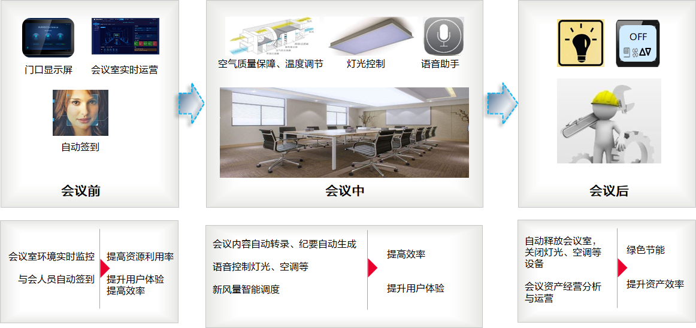
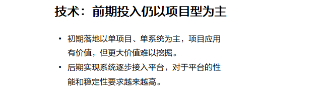
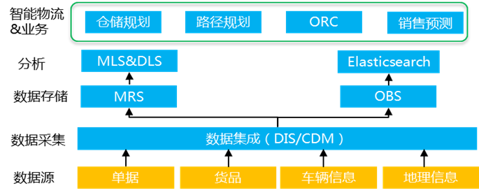

华为云解决方案

# 1. 华为云智慧园区解决方案

## 1.1 行业趋势与发展思路

1. 趋势 - 智慧园区是智能社会的重要入口和载体

园区定义的澄清：传统园区指的是产业园区，这里的园区含义更广，泛指有一定边界、有单一运营主体的区域。

2. 挑战 - 园区的低水平和同质化制约智慧园区

- 然而，当前园区的建设，跟不上技术发展，建成即落后；
- 业务系统没有统一规划，头痛医头，脚痛医脚，建设成本和运营成本都高；
- 另外建好后同质化严重，服务体验也没有得到明显改善。

3. 思路 - 数字化转型建设园区解决传统园区痛点

华为通过打造安全、开放、可持续演进的智慧园区数字化平台，融合云计算、大数据、物联网、移动互联、人工智能等新ICT技术，重新定义智慧园区。

通过横向打通园区各子系统，纵向贯穿“端、边、网、云”，实现向下全联接管理对象，向上支撑园区业务快速发展，帮助客户进行数字化转型。

接下来介绍华为建设智慧园区的几个新思路。

4. 重新定义智慧模式

重新定义智慧模式，实现园区智慧化：
- 之前是电子化，现在是数字化，
- 但现在园区存在两个问题，一个是各个子系统孤立建设，没有联动；第二个是数据孤岛，数据没有统一，数据价值也没有挖掘；
- 华为的智慧园区数字化平台，将系统之间互联，将数据融合，结合人工智能，来实现业务融合，支持业务快速发展和创新。

5. 统一的数据底座和平台架构

重新定义创新模式，基于统一的数据底座和平台架构，提升业务开发和创新效率：
- 通过这个平台，联接所有园区子系统；
- 并且将所有子系统的数据，都汇聚到这个平台中形成数据湖，构建统一的数据底座；
- 然后通过API方式向上提供服务，使应用开发更敏捷，支撑新业务快速上线。

6. 数字平台支撑园区业务能力快速复制

另外，通过这个平台，也可以支撑多园区管理和复制：
- 平台向下的联接建标准，使各个子系统快速接入，实现高效率
- 平台之上的应用建生态，支持个性化需求，来繁荣园区
- 有了这个平台，可以统一运营，统一运维，减少重复投资，从而减低成本

7. 建设目标 - 全联接 、全融合 、全智能

华为建设智慧园区的总体目标是：基于统一的数字化平台，实现全联接、全融合、全智能，支持园区业务创新。

一方面，对内做好标准化经营管理，提升运营效率，降低运营成本，包括：
- 打破业务孤岛，增强系统间联动管理能力，提高运营效率
- 积累园区管理大数据，支持对园区运营实时决策，降低运营成本

另一方面，对外提供优质服务，提升科技、安全、舒适的体验，包括：
- 提供企业员工和访客安全、舒适、随心的空间环境
- 提供有科技感、有价值、有温度的服务

## 1.2 智慧园区典型业务场景

1. 智慧园区主要应用场景

智慧园区通用的应用场景包括运营中心、综合安防、便捷通行、设施管理、环境空间、资产管理、能效管理、企业服务和数字化办公，针对具体行业会叠加行业特色的应用场景。

2. 园区智慧运营中心 - IOC

园区智慧运营中心（简称IOC）是承载园区运营管理的平台，融合物联网、大数据、云计算、人工智能、GIS等新型数字化技术，支撑和构建各类创新应用，搭建统一Portal，连接并管理园区内的各子系统，实现统一的、智慧的运营调度和管理。

智慧运营中心可实现园区状态全可视、事件全可控、业务全可管，具体体现在：
- 园区运行状态实时监控和可视，全面直观掌握园区综合态势；
- 日常设备设施管理及突发安防事件的统一调度指挥；
- 基于大数据平台进行海量信息分析，实现监测-预警-决策-行动闭环；

3. 综合安防 - 周界入侵检测

周界智能入侵检测+视频调阅确认，降低周界系统的误报率，避免不必要的人力浪费

传统周界防护使用红外线对射的方式，树叶飘落阻挡会产生告警，误报率高达99%。

综合安防的视频周界防护使用摄像头+视频分析AI算法实现周界翻越精准检测，该算法可以分辨视频流中的目标是否是人，只有目标为人且有翻越行为时才会告警，从而极大降低误报率。另外，系统自动保存摄像头告警前15秒和后15秒的视频，用于分析与取证。

4. 综合安防 - 视频巡逻

传统巡逻需要安保人员到现场巡逻处置，综合安防的视频巡逻是指在安防系统上调取巡逻路线上的监控摄像机视频，实现在线保安巡逻，大大提升了巡逻的效率，减轻了安保人员的工作量。
通过自动切换巡逻视频，一人可看护多个巡点；视频播放过程随机弹出窗口提示打卡，确定安保在岗状态；巡逻完成后，系统自动生成巡逻报告。

5. 综合安防 - 重点人员布控

1. 人员布控通过人脸识别技术，对已知犯罪对象或其他可疑对象进行摄像头布控，实现智能告警。
2. 管理人员将待布控人员的人脸照片上传到系统，创建黑名单人脸库；
3. 选择布控摄像头、布控名单组、布控时间等，输入布控原因进行布控任务创建；
4. 当各摄像头抓拍并识别到布控人员的人脸则自动告警；
5. 管理人员可以对布控告警信息进行查看确认，按照告警事件流程进行处理。

6. 综合安防 - 重点车辆布控

车辆布控跟人员布控类似，通过车牌识别技术，对已知犯罪对象或其他可疑对象的车辆进行摄像头布控，实现智能告警。

7. 综合安防 - 消防联动

消防联动是在发生消防应急事件时，系统通过消防系统、视频监控系统、门禁系统、停车道闸系统、广播通知系统的联动，实现告警视频复核和及时处置，精准通知着火区域人员，减少响应时间，极大提升安全管理水平和工作效率。

8. 便捷通行 - 人脸识别闸机代替保安岗

7*24小时人脸识别闸机和人脸门禁替代保安岗，节省人力成本；
员工、住户、访客可以无感知畅行园区，避免忘带卡、纸质化手工登记、异地办公门禁权限未及时同步等场景带来的困扰，提升园区通行体验。

9. 便捷通行 - 集成人脸识别与车牌识别应用

园区在访客接待业务上，需要访客办理登记手续。复杂的管理流程和单一的身份登记是访客体验感知差的重要因素。

访客自助接待，实现访客远程通过微信公众号或者园区APP填写访问申请，审批通过后访客到达现场，进行车牌识别、人脸识别后自助通行。

10. 便捷通行 - 无人值守 、停车引导 、移动支付

智慧停车实现APP车位实时统计，车牌识别自动放行，室内停车引导和扫码支付，让停车更便捷，管理更高效。

11. 设施管理 - 状态远程实时监视

园区设备故障以电话、前台保修，物业巡检方式发现，为响应性、计划性服务，缺少温度；
同时各设备系统自成体系管理，由多个厂家提供，各系统数据割裂，系统间缺少互通，智能联动。

智慧设施管理，以集成设施管理平台为核心构建，以开放式系统架构，向下兼容各厂家设备，打通各业务子系统，实现统一设备监控、统一故障管理。

还可以按模板配置多个设备的运行参数，一键式远程启动和调整设备的运行，管理更简单更高效。

12. 环境空间 - 自动化会议室管理

智慧会议室管理可实现运营人员查看所有会议室的实时房态，通过运营APP一键式预订会议室；
会前环境自动准备，系统提前10分钟系统打开空调和灯光；

会中远程调节会议环境（温度、风速、灯光等），减少人员干预，保障客户舒适体验；
会后资源及时释放，节省能耗。

13. 资产管理 - 资产位置实时监控

智慧资产管理采用RFID标签，对资产的出入库、库存进行管理，对在设定区域的资产进行实时状态信息侦测管理。进而达到：
- 实现物资的定位管理，实现物资在库秒级盘点。
- 实现物资入库、出库记录。
- 在授权情况下，转移或非法移动记录跟踪。
- 在未经授权情况下，转移或非法移动物资报警。

14. 资产管理 - 资产非法携出自动告警

园区门岗处安装物联网 AP，自动读取到门岗处的资产RFID标签数据，感知出门与进门。

若资产被非法携出，系统自动报警，生成安全事件，通知保安和资产owner，自动录制并保留视频。

资产管理应用还和GIS系统联动，可在线查询资产在园区的移动轨迹。

15. 能效管理 - 实现能耗可视 、可诊 、可优

智慧能效管理基于园区地图呈现园区、区域和建筑的能源（水、电、气、热等）总览数据，按照区域楼层及部门、设备系统、配电系统等逐级分层、分类分项、分重要等级全方位监控园区设备状态信息和能源动态信息，通过能效大数据分析实现用电情况预测；

能效诊断专家规则库汇聚能源管理、设备运行控制等各领域的专家知识，实时对各系统各设备的能效等级、故障状态、控制逻辑合理与否等进行诊断，并采用通俗易懂的工程语言给出对应的节能优化措施，帮助客户对各种设施进行节能分析。

16. 企业服务 - 物业线下线上一体化服务

企业服务可以给产业园的入驻企业提供线下线上一体化物业服务，包括物业报修、装修申报、访客管理、出入管理、账单查询、信息发布、物业租赁等。

17. 企业服务 - 一站式招商服务 , 只需跑一次

招商管理系统可以给产业园区运营者提供一站式全流程的招商服务，包括招商过程管理、项目合同管理、成本管理、绩效管理、投资关系管理；

支撑招商产业大数据分析，包括产业链全景分析、企业画像、产业发展监测系统。

18. 数字化办公平台 - WeLink云服务全景图

基于互联网公有云方式的数字化办公平台，让跨区域企业可以对齐目标协同办公，提高企业的异地团队作战效率。

数字化办公平台可以提供消息、统一认证、通讯录、音视频通话、云盘、智能收件箱、多媒体会议、小程序等业务中台能力，
- 向下联接各种终端，包括软终端、会议终端、打款机、打印机、充值终端，
- 向上支撑多种办公应用场景，包括移动邮件、通讯录精准找人、高清会议团队协同、待办会签、知识共享。

19. 数字化办公平台 - 构建全联接的智能工作平台

数字化办公平台构建全联接的智能工作平台，让企业无边界协同：
- 以团队为中心的联接，汇聚移动办公、远程会议等服务；
- 线上应用联接线下设备，更便捷的使用会议室、门禁、打印机、数字白板；
- 统一业务应用入口，通过开放式平台接口集成现有业务和未来更多新业务；
- 提供知识共享，满足员工搜索、订阅以及精准推荐等场景；

## 1.3 华为云智慧园区解决方案

1. 华为云依托边云协同架构 , 支撑客户数字化转型

园区信息化从单点智能向整体智慧化迈进，技术上以融合使用AI、IoT、大数据、5G、视频云、GIS等多种新ICT技术为主要特征。其方案源于华为自身业务变革及数字化转型的实践：把支持华为核心业务的数字化平台，用以实现园区智慧化，从而沉淀出智慧园区数字平台，并通过华为自身能力溢出，对外提供智慧园区业务。

目前依托华为产品组合，基于数字平台，联合生态伙伴，解决客户问题：数字平台是核心，已完成ROMA、大数据、视频云、IoT、GIS的能力封装，并在平台之上沉淀了大量园区资产，如视频分析、物模型、集成资产、主题库、边缘市场等，可以加速园区应用二次开发和集成交付能力，支持1+7场景基线应用，面向不同行业提供行业化的场景方案。

园区边云协同架构源自于华为10多年数字化转型实践，并在华为自身园区验证，平台具备1T-OT(运营技术)融合集成的能力，这是华为云平台独特优势，并且拥有成熟的边云协同架构，以及华为自有端侧芯片设备及面向toB企业的本地服务能力

2. 智慧园区业务架构应用框架

智慧园区方案目前广泛应用于十多个行业，如住宅、工地、楼宇、展馆、产业、物流、教育、企业、街区、化工、矿山、景区等领域。

智慧园区在各行业有大量园区业务相似，以华为云数字平台为依托，已构建起支持1+7场景基线应用（包括智能运营中心、综合安防、便捷通行、资产管理、设施管理、能效管理、环境空间、智慧办公），面向不同行业联合生态伙伴提供行业差异化的场景方案，帮助客户实现园区整体智慧化，使能业务创新，提升运营效率，引领至简体验。

3. 智慧园区边云协同解决方案架构

智慧园区整体采用边云协同架构，端侧是园区各类子系统与设备；边侧基于IEF提供就近边缘视频分析、边缘ROMA Site用于园区端侧应用集成，以及各类网关产品与设备对接并与云端协同；云端提供数字平台整体能力，包括5类核心平台应用集成ROMA、IoT、视频云与视频分析、数据运营平台DAYU、IEF等。在平台之上，华为云沉淀了5类园区资产（视频分析场景、集成资产、物模型、主题库、边缘市场等）用于加速园区应用的构建。

4. ROMA连接应用与设备

园区信息化建设经历了电子化、信息化、逐步向数字化、智慧化的转型，经多年发展，园区也累积了大量安防、通行、能源、资产、OA、考勤等业务子系统，这种”头痛医头，脚痛医脚“式的垂直智能子系统建设，造成园区应用系统之间的数据孤岛，应用与应用、应用与设备间数据无法有效互通，导致发展缓慢、创新困难；同时园区业态多样化，大型集团企业各类园区分布在不同地区，受地域、网络条件限制，各园区间数据隔离，无法有效统一运营管理，在园区应用、设备、云、多园区的集成方面遇到全方面的挑战。

ROMA集成平台源于华为自身业务变革及数字化转型的实践，并应用于华为自身园区业务，用以实现园区智慧化，是园区数字化转型的核心平台，华为将自身能力开放，并对外提供园区解决方案及ROMA集成平台。

ROMA提供了面向“ABCD”四个方面的集成能力，A-即应用集成、B-多园区、伙伴集成、C-多云集成、D-设备集成 。它区别于传统ESB（企业服务总线）以集中式方式部署，解决内网应用的集成，ROMA采用分布式部署架构支撑跨网混合云、多云集成，同时也可以将IT、OT技术融为一体，引领了数字化转型集成发展方向。

ROMA集成平台优势：
- 支持园区应用数据、设备、多园区、多云等集成场景，提供50+协议接入
- 预集成100+园区集成资产，屏蔽技术上的差异，方便应用集成
- 基于边云部署架构，可打通物理世界与数字世界，支撑园区向数字化、智能化转型。

5. 赋能海量园区设备连接 + 智能

物联网平台核主要解决园区物的接入，我们的物联网平台整体遵循了 “端-边-云”的架构，
- 端侧：主要是园区设备及子系统，比如停车，照明灯系统
- 边侧：是我们的智能边缘节点，主要是把云端的主要功能下沉到边缘侧，比如：设备联动，设备接入，数据管理等，后面会着重介绍一下边缘
- 云端：在云端，物联网平台主要提供了两大功能：设备接入和设备管理，在设备接入功能中，我们支持多网络，多协议的安全接入方式；在设备管理服务中，我们提供了设备的全生命周期管理功能，支持设备的状态监控，设备的批量操作，设备联动等核心功能。除此之外，我们可以通过数据转发功能，与华为云其他服务例如：DIS，OBS，视频分析服务打通。另外，北向应用伙伴可以基于我们开放的应用接口进行：综合安防，便捷同行，IOC等应用的定制开发

总结一下我们物联网平台的3大竞争力：
- 能够支撑设备小时级的接入，同时支撑园区行业100+的协议
- 满足园区跨系统联动要求
- 基于项目沉淀，提供20+的物模型，客户可以基于此模型进行二次修改

6. 全面提升园区用户的安全保障和服务体验

边云协同的视频AI方案，帮助园区实现人、车、物、行为的综合识别、自动预警、联动响应能力，实现为园区加智能。围绕园区场景当前我们构筑了面向人脸识别，人员统计，车辆检测，入侵检测，安全检测，人体识别，异常行为7大领域、40+视频智能分析场景的能力，能力还在持续的完善中，华为会联合行业园区合作伙伴基于华为云的ModelArts训练行业AI模型并发布，构建特定园区场景/行业AI能力。

7. 关键园区业务场景

园区智能视频AI通过对园区的人、车、物、行为的综合识别和分析，为园区+智能，提升园区的安全保障和服务体验。如周界防护（翻墙，危险区域），便捷通行（无感考勤，人脸闸机），安全巡更（火灾，聚集等），人员识别（黑名单，VIP），车辆识别（车牌识别，车辆拥堵）等。

园区视频分析当前提供了7大类，40多场场景，为园区提供开箱即用的智能分析能力，并可以联合伙伴提供覆盖行业视频智能分析能力。园区视频智能分析能力结合园区IOC，可提升园区整体运营效率，降低运营成本。比如中海通过园区视频智能AI的赋能，整体运营效率提升30%，实现园区运营的节能增效。

8. DAYU一站式数据运营

从业务角度来看，接入系统越来越多，数据量越来越大，如何管理好这些数据，并能够让数据指导商业决策成为挑战。从技术角度，缺少一站式、端到端的数据解决方案，从数据集成、入湖、数据建模、数据规范管理、数据开发、数据质量、数据资产管理到最终数据服务业务，整条流程较长，而且建设成本高，见效慢。

DAYU通过借鉴华为十多年数据领域的经营经验，搭建了一站式的数据运营平台，从数据集成、规范、开发、管理、服务几个方面都提供了成熟的解决方案，像古代传说中的大禹治水一般，将客户的数据梳理的井井有条，最终为企业带来巨大的价值

华为云数据运营平台DAYU，在智慧园区的整体架构中，扮演了非常重要的角色，

在园区项目的搭建中，各个子系统会搜集大量的数据，例如车行数据、人行门禁数据、人脸识别数据、设备（路灯）运行数据等，DAYU云服务作为数据底座可以将这些数据汇聚起来，打破数据孤岛，提升数据价值，DAYU平台的特点包括了 数据任务的高效开发和分析，数据智能治理，数据服务的敏捷搭建，以及用户业务的全景可视，从而帮助园区沉淀数据资产，加快园区数据共享和数字化转型，提升园区数据的价值。

9. IEF支撑园区应用、设备、视频边云协同

园区有大量安防、弱电、办公等等大量设备及应用部署在客户机房，智慧园区方案在引入云端应用集成、物联、AI、大数据等能力，会带来跨云、跨网安全访问、时延的挑战。

当前华为云智能边缘平台 （Intelligent EdgeFabric，简称IEF）通过边缘容器底座，将华为云端能力推送到边缘，以更贴近客户业务部署运行环境，满足用户对边缘AI视频分析、边缘数据存储分析、边缘应用集成、设备集成、边缘应用部署等诉求， 为用户提供完整的边缘和云端协同的一体化服务。

IEF边缘计算平台完成了在智慧访客系统、智能安防、园区智慧WIFI、智慧园区信息发布等多系统集成，构建了一个完整的、业界领先的智慧园区解决方案。解决了目前园区中场景复杂，安防事后被动响应、员工访客感知差、物业管理人员高成本，效率差等痛点。

10. WeLink支撑企业智慧办公

连接人、连接业务、连接知识、连接设备，实现企业精兵作战、团队协同和跨地域协作的整体效率提升

华为数字化办公经历了Notes办公、Web办公、移动办公、数字化办公四个发展阶段，当前服务于华为19万员工，覆盖170个国家，1023个办公点，其日均连接次数达1200万次。华为云WeLink源自华为自身数字化办公实践，为企业打造联接人、业务、知识、设备的全联接数字化工作平台，构建企业专属的安全、开放、智能的工作空间，助力企业数字化转型。
- 联接人：提供消息、邮件、群组、云空间、音视频等协作方式融合，提升个人办公与团队协同效率
- 联接业务：快速集成企业现有业务，丰富企业应用生态，缩短企业开发流程，降低IT成本
- 联接知识：基于知识图谱构建新一代企业知识社区，助力企业沉淀组织智慧
- 联接设备：人与设备、设备与设备互联互通，0学习成本，提升办公装备使用效率

11. 华为云智慧园区数字平台整体优势

最后总结一下华为云智慧园区数字平台的优势，主要体现在六个方面：
- 华为云智慧园区方案源自自身园区实践，秉承自己造的降落伞自己跳，通过自身验证成功后再推向市场，以云服务的形式开放给用户。
- 华为拥用从端、边、云的全栈集成化的解决方案，从架构合理性、性价比、性能时延等方面拥有独特的组合优势
- 园区有大量IT系统、OT设备，华为云ROMA/IoT可以很好解决IT系统与设备之间的融合，解决面临的“ABCD”各类集成问题，消除园区信息孤岛，实现园区人车物环境的全联接。
- 提供全栈视频AI能力，涵盖了从端侧摄像头、边缘视频分析、云端视步接入等能力，并支持40多种智能视频分析算法
- 提供了统一的数据接入、数据存储、数据治理、数据分析等能力
- 基于华为云在业界的实践，已积累大量园区资产，可以减少前期项目的各类复杂集成、开发工作，降低工作难度，缩短项目周期。

## 1.4 成功案例

1. 中海 - 智慧园区实践

中海作为全国著名的地产开发服务商，很早就规划了智慧园区实施计划，但在智慧园区实践过程中面临重重问题，典型的两个问题是：
- 技术上初期落地以单项目、单系统为主，缺乏统一平台支持规模化、标准化快速复制；
- 流程上仍是单项目运作，没有进行组织流程变革、减岗增效；

中海意识到，智慧园区建设需要基于一个数字平台，聚焦能快速见效益的两保一体验应用，构建中海智慧园区的核心系统；

同时建设流程小组，业务部门与技术部门紧密协同，技术方案与组织流程变革双轮驱动中海智慧园区规模落地。

2. 案例 - 共同建设智慧园区优质品牌

华为成立中海智慧园区项目专项团队，与中海从顶层设计入手，经过多轮研讨，联合输出中海智慧园区业务规划和技术方案。
- 在平台建设上：基于华为云服务，构建中海智慧园区云平台，提供物联接入、AI智能、数据运营中台等服务能力，支持园区业务快速创新。
- 在系统接入上：通过ROMA和边缘计算，建立园区子系统解耦架构，分阶段接入现有子系统，打造中海标准并向行业输出。
- 在场景应用上：优先实现车行管理、人行管理、安全管理、机房管理四类需求场景。

最终实现了以下客户价值：
- 通过精准的周界入侵检测和智能的视频巡逻，提升管理效率，降低人力成本。
- 高效人车通行，访客自助入园，提升用户体验。
- 建设智能运营中心，实现园区人、事、物全面接入，统一管理，智能联动。展示小区的综合指标情况和趋势，对小区运营数据进行分析，支撑业务决策。

思考题：

1. 以下哪个选项支持企业智慧办公？ 
A. WeLink 
B. IEF 
C. DAYU 
D. ROMA 

参考答案1
- A

# 2. 边云简介及华为云方案

## 2.1 行业趋势与发展思路

1. 行业数字化转型大势 , 带来巨大市场空间

全球数字经济发展迅猛，1000强企业，包括传统企业超过67%都在进行数字化转型，整体呈现快速增长的趋势，带来了巨大的市场空间。

为更好的支撑行业数字化转型，IT技术的演进带来了更多的挑战和创新。

2. “ 智能物联 ” 的网络边缘面临巨大挑战

3. 迎接 ” 五 ” 大挑战，边缘计算应运而生

IDC预测：
- 2020年，将有超过500亿的终端与设备联网，未来超过50%的数据需要在网络边缘侧处理、分析、存储。
- 边云协同中，边缘计算将成为云计算的有效延伸和补充。

## 2.2 边云协同典型业务场景

1. 边云协同解决方案三大应用场景

2. 场景 - 边缘AI推理

痛点与诉求：
- 时延、中心云带宽、数据私密性、效果和效率、运维压力。

方案价值：
- 通过纳管用户的边缘节点，提供将云上应用延伸到边缘的能力，联动边缘和云端的数据，同时在云端提供统一的设备/应用监控、日志采集等运维能力，为企业提供完整的边缘计算解决方案。

当前智能边缘场景主要覆盖了以下4个子场景，分别是OCR，视觉检测，人脸识别和异常行为的识别等，这几个场景有几个共同点，
- 大量的重复性的数据都在边缘侧存储和处理，在边缘侧处理解决了客户时延、以及中心云带宽的诉求，在边缘侧存储解决了客户数据私密性的诉求，
- 边缘侧的应用和算力都由云端控制和调度，减轻了客户日常的管理和运维压力
- 都需要调用云端的EI或大数据能力，提升客户的工作效率和效果。

背景：
- 典型场景包括以下三方面，后面的案例会逐一介绍。
- 在工业领域，如光伏场景，光伏电池片的质量，对于光伏电站的性能和寿命有很重要的影响，厂家对质量高度关注；产线工人1天最多看1-2万张电池片，工作强度大，易导致疲劳，从而增加误判率。利用视觉质检对光伏电池片的质量进行智能检测；可达3个9以上的检测率，极大的提升了光伏企业电池片的质量。
- 在商超领域，采用边缘计算将部分AI能力迁移到边缘节点，弥补普通摄像头没有AI能力的不足，人流过线统计，客流热力图，并将数据上报DIS到云端。进行人脸检测，实时准确识别VIP客户，分析统计门店客流、客流热力图，提升门店运营效率。
- 物流领域，如YD和菜鸟物流的矛盾日益加重，YD很担心菜鸟随时会中断三段码和地址信息推送。一旦菜鸟不给YD三段码和地址信息，YD希望OCR可以顶上。五年前已经开始构建自己的地址库。后面会通过OCR识别构建用户信息库。

3. 场景 - 边云应用集成

痛点与诉求：
- 信息孤岛，OT-IT之间的数字鸿沟，烟囱式应用，终端多异构协议，与生态伙伴系统隔离。

方案价值：
- 支持多种协议接入设备，支持设备、IT系统间集成，打通IT-OT之间的数据鸿沟，实现设备、消息、数据和API全方位的集成。

如果客户不光有设备集成的需求，还有应用集成的需求，那么就适合罗马的场景，因为罗马平台不光具备设备集成能力，还有非常强的系统集成能力，其中设备的集成能力是通过Roma link来实现的，支持多种协议接入设备，支持设备、IT系统间集成，打通IT-OT之间的数据鸿沟，实现设备、消息、数据和API全方位的集成。

4. 场景 - 边云容器协同

多云容器平台是华为云基于多年容器云领域实践经验和社区先进的集群联邦技术，提供的容器多云和混合云的解决方案，为您提供跨云的多集群统一管理、应用在多集群的统一部署和流量分发，彻底解决多云灾备问题的同时，还可以在业务流量分担、业务与数据分离、开发与生产分离、计算与业务分离等多种场景下发挥价值。

## 2.3 华为云边云协同解决方案

1. 华为云边云协同解决方案总体架构

针对边云协同解决方案的3个边缘解决方案：
- 第一个就是智能边缘容器，IEF场景，比较典型的就是边缘OCR、人脸识别等；
- 第二个就是边云应用集成，ROMA场景，它不但可以集成设备，还能集成应用；
- 第三就是线上线下容器调度，MCP场景容器线上线下协同调度。下面我们针对这几大场景逐个介绍。

背景知识：
- IEF：智能边缘平台（Intelligent EdgeFabric ）
- MCP:  混合容器调度平台
- Roma：企业集成平台

2. 智能边缘容器平台IEF，云边协同更高效

关键技术：
- 水平扩展架构支持百万级边
- 缘节点接入
- 异构硬件支持，最佳成本边缘计算硬件（X86/ARM/MIPS）， 最小可支持128M内存
- 轻量级边缘函数和容器引擎
- 支持边云一致的函数和标准的
- OCI容器应用生态
- 云边协同的实时流分析和边缘AI
- 安全可靠的云边数据通道

智能边缘容器的几大特点给大家做个介绍
- 云边一致的容器应用生态：边云一致的容器和Kubernetes生态，build once, run anywhere；基于k8s生态构建边云应用统一发放、统一治理、边云/边边容器流量互通。
- 边云协同：40+边缘AI算法、IoT、时序数据库、流计算等延伸到边缘，可与10+云服务进行连接和协同，实现边云协同。
- 离线自治：边缘网络不稳定或抖动情况下，业务本地自治。
- 集成华为高性能鲲鹏+昇腾基础设施：提供高性能、低成本的边缘AI推理算力，性价比提升30%。
- 极致轻量化：极致。

3. ROMA应用集成 , 打通云上云下集成通道

业务挑战
- 点对点集成、协议转换困难、耦合高，监控运维复杂
- 应用上云网络隔离，云上云下应用间跨网集成困难
- 主数据分散在各系统，数据难以同步，主数据不一致性
- 系统间流程分离，手工干预效率低下，人、机协同困难

场景方案
- 统一集成平台：提供API、消息、数据集成，构建统一集成平台
- 云上、云下应用集成：可公网或专线接入DMZ区，不破坏企业安全边界，实现云上云下应用、数据跨网集成
- 主数据同步：基于FDI实现异构系统间员工、组织架构、物料等主数据实时、定时集成
流程集成：打通不同系统间业务流程如订单、采购、付款、物流等业务流程，实现BPM协同集成

业务价值
- 打通云上云下集成通道，无需关注云上云下网络，可专注于业务融合创新
- 简化数据、API、消息、流程集成
- 可视化管理API资产，易于监控、运维

4. 边缘容器集群MCP

行业趋势：在TOP互联网公司标杆效应的引领下，以容器技术使用计算资源，实现业务的高效运维和快速弹性已经成为泛互联网企业的共识

## 2.4 成功案例

1. XX智慧园区

XX地产园区，打造成全感知的园区,快进快出畅行园区，传统基于人工的管理，服务效率低下，安全保障弱。给业主提供无感知的用户体验。

通过“视频监控+AI分析”实现从人防到技防，提升园区运营效率，提高园区住户体验。

2. XX超市连锁 (1)

智慧门店场景下的人脸检测，随着互联网技术的发展，实体门店面临向智能化改革的趋势，也就是我们所说的智慧门店，比如客户进店能第一时间识别客户的等级，普通客户还是VIP客户，以及客户的历史消费情况，客户的兴趣等，从而能第一时间指导现场销售员采取合适的营销手段。

3. XX超市连锁 (2)

原始驱动力：强化门店经营，分析门店经营情况，客流分析，热力图分析支撑门店运营决策。

这个方案架构中，终端是摄像头，边缘侧部署和执行由云端下发的各类应用，例如人脸识别，人流监控和热力图分析等，云端负责这些应用的推送和生命周期管理，同时负责人脸识别的模型的训练和优化迭代。

这样由于业务是本地处理的，减少了时延，能实时指导现场销售活动，同时由于云端负责边缘侧管理，方便了客户的运维，减少成本，提升效率。

4. XX光伏企业 (1)

项目背景：

光伏电池片的质量，对于光伏电站的性能和寿命影响很大，因此XX光伏企业对电池组件的质量高度关注；XX光伏企业希望通过视觉AI替代传统人工质检的方式，从而提升产品质检的效率和准确率。

客户痛点

传统人工质检需要工人时刻盯着机器屏幕，识别电池片的缺陷。产线工人1天看数千张以上的电池片，工作强度大易导致疲劳，从而增加误判率

引入AI实现质检智能化，降低人工质检误判率，要求质检模型准确率高于95%，符合工艺规则；质检模型单个电池片处理时延低于3s

如果接触工业制造客户较多的话，客户的人力投入很大一块会用在质量检测上面，也就是依靠人眼来检测，这样既耗费人力又影响效果，因此视觉质检是很多制造企业的核心诉求之一。

5. XX光伏企业 (2)

原始驱动力：通过AI视觉提升质检效率、质检准确率。替代人工质检模式。

视觉检测这个场景对边缘设备的要求会更高，因为视觉质检的执行全部是在边缘侧，云端负责模型的训练，这就包括部署前的原始模型的训练，和部署之后不断模型优化的训练，训练好的模型通过IEF平台下发到我们边缘节点执行。

这个方案有哪些竞争力呢，首先，由于模型是在本地执行的，所以，减少时延，2秒以内，同时质检的效果显著提升，另外由于边缘的算力统一调度，模型自动训练，因此节省了客户的运维成本。

思考题：

1. 以下哪些选项是华为边云协同解决方案中”边”的方案？ 
A. 智能边缘平台 IEF 
B. 华为云容器 CCE 
C. 边缘容器平台MCP 
D. 企业智能 EI 

参考答案1
- AC

# 3. 专属云和混合云全栈专属解决方案

## 3.1 华为云专属云、混合云全栈专属解决方案介绍

1. 华为专属云解决方案 - 云上“头等舱”

专属云解决方案（Dedicated Cloud）是面向企业、政府、金融等客户，提供计算、存储资源池以及网络、管控多级隔离方式的综合解决方案。租户独享自己的专属资源池，与其他公共租户物理隔离，以满足特定性能、业务应用以及安全合规的不同要求

2. 专属云、混合云全栈专属解决方案介绍

Cloud2.0，政企数字化转型首选：专属云解决方案、混合云解决方案。

专属云解决方案（Dedicated Cloud Solutions，简称DeC），包含两种子解决方案：
- 资源专属方案（Dedicated Resource Solution）
- 全栈专属方案（ Dedicated Full-Stack Solution）
- 混合云全栈专属解决方案（Hybrid Cloud Dedicated Full-Stack Solutions）

| 解决方案 | 专属云 (Dedicated Cloud Solutions, DeC) | 专属云 (Dedicated Cloud Solutions, DeC) | 混合云 (Hybrid Cloud Solutions) |
| :------------- | :------------- | :------------- | :------------- |
| 部署位置	| 华为云机房	| 华为云机房	|非华为机房 (客户机房、第三方机房) |
| 子解决方案	| 资源专属（即公有云资源分区）	| 全栈专属	| 全栈专属 |
| 子解决方案英文对照	| Dedicated Resource Solution	| Dedicated Full-Stack Solution	| Dedicated Full-Stack Solution |

## 3.2 专属云解决方案

1. 华为专属云解决方案 - 满足多场景诉求

2. 资源专属方案产品形态

方案特点：
- 资源专属云服务（Dedicated Cloud Resource Service）是华为云在公有云中为单个租户提供的物理隔离出来的专属云空间。租户在其中可以申请独占的计算服务器和存储服务器来构建专属的资源池
- 专属云用户可以在专属资源池中使用云主机、云存储、祼金属，企业级存储和对象存储，并且可在专属的管理控制台管理资源，查看资源池的使用情况，灵活使用专属云资源
- 专属云中支持发放数据库、安全、应用组件、EI等高阶服务实例。支持企业的应用和数据全生命周期运行在物理隔离的专属资源池中

3. 资源专属方案技术架构

提供的能力如下：
- DEC账户开通
- 独享专属云console
- 线上申请，线下交付
- 计算、存储资源独享
- 计算提供专属云主机和专属祼机
- 可支持公有云所有规格资源类型
- 块存储提供使用DSS分布式独享存储和DESS企业存储两种方式
- 支持计算、存储资源总量和余量的概览
- 可支持虚拟机HA
- 可支持双AZ部署调度
- 可支持与公有云VPC互通
- 可支持在DEC中使用公有云基本服务如:AS, ELB, IMS, CBR, DC, VPN

4. 资源专属方案部署架构

部署原则：
- DeC提供物理隔离的计算和存储服务器资源
- 租户独占DeC资源池，可以创建云主机、云存储，并部署业务和数据
- DeC提供专柜专锁和机柜围笼的加强监管能力，满足特殊行业核心数据隔离和监管的要求
- 租户独占VPC，可以自定义网段，划分安全域、配置安全组规则，甚至提供专网接入，方便用户构建立体式防护网络
- 管理面共享（管理面不记录资源，仅用于资源发放等调度操作）

5. 资源专属方案网络隔离方案

DeC基于华为云完整的安全防护：
- 基于科学的安全防御模型，构建全栈安全防护体系
- 全栈防护：基本防护体系包含了基础设施、运维、租户、云服务、运营安全等
- 安全合规：整个安全防护体系得到了业界安全标准组织的广泛认可
- 专业支撑：专业的安全团队（200+）支撑着整个安全体系的运作和及时响应
- 在此基础体系下，专属云提供网络逻辑隔离方案
- VRF隔离：独立转发表，独立安全策略
- VXLAN/VLAN隔离：二层网络隔离
- 保证业务流量只进入专属池

6. 全栈专属解决方案

全栈专属解决方案版本上与和混合云全栈专属解决方案解决方案相同，仅部署位置不同，技术方案介绍在混合云全栈专属解决方案中介绍

## 3.3 全栈专属解决方案

1. 全栈专属 - 政企数字化转型首选

- 全栈专属是华为公有云服务的一个小型化部署形态。
- 全栈专属与华为云一起打造统一的混合云生态系统
- 与公有云一致的用户体验、开发接口、工具等

2. 全栈专属软件系统架构

3. 全栈专属标准组网方案

方案说明：
虚框为根据业务诉求可选区域，DCI（运维专线）与SVN两者必选一种；
混合墙功能：管理&边界、VPN；
计算节点存储和业务面共TOR
除BMC组网单台部署，其他交换机堆叠部署，防火墙双机主备部署，运维通道SVN双机非主备；

4. 全栈专属方案配置模型和云服务Offering (1)

|  | 基础版 | 安全增强版 | 大型起步版 |
| :------------- | :------------- | :------------- | :------------- |
| 规模	| 标准组网4-100计算节点	| 标准组网4-100计算节点	| 大型组网101-512计算节点|
| 管理节点	| 4	| 5	| 8 |
| 网络节点	| 2	| 2	| 2 |
| L2gateway	| 2（选配）	| 2（选配）	| 2|
| LVS节点	| 2	| 2	| 2|
| 计算节点	| 4 +	| 4 +	| 4+|
| 块存储	| 4 +	| 4 +	| 4+|
| OBS对象存储	| 3+  	| 3+  | 	3 +|
| 核心交换机	| 2	| 2	| 2|
| TOR交换机	| 8+	| 8+	| 8+|
| 安全防火墙	| 2+	| 2+	| 2+|
| SVN	| 2+	| 2+	| 2+|
| BMC 交换机	| 2+	| 2+	| 2+|
| 可选云服务管理节点	| 1+	| 1+	| 1+|
| 初始机柜数量	| 2+	| 2+	| 3+|

配置示例：

- 全栈专属最低起步配置为两柜起配，包含10种必选云服务，可提供S3（4U16G）：138、51 TB块存储（普通IO）、78TB对象存储能力，同时提供运维能力，安全能力。
- 另外可根据业务需求再选配高级云服务(新增云服务需要新增管理服务器)。
- 本配置主要考虑紧凑型部署，快速开局，将硬件设备紧凑安装，单机柜最小起配功率5KW （500kg)，满配功率8.5KW（650kg）。
- 管理节点采用2288H V5服务器，标准组网可支持4+2起步。
通用计算节点采用1288H V5服务器。

2. 全栈专属方案配置模型和云服务Offering (2)

| 产品类型 | 必选服务 | 可选服务 |
| :------------- | :------------- | :------------- |
| 计算	| ECS、IMS、AS	| BMS|
| 存储	| EVS、OBS、CSBS	| SFS（支持SFS Turbo）|
| 网络	| VPC、ELB	| VPN、DC|
| 管理与部署	| IAM（基础功能）、CES	| IAM（IDP、EPS）、CTS、SMN（仅提供API）、RTS(仅提供API）|
| 应用服务 | | ServiceStage（SWR、CCE、AOM、APM、AOS、CSE）、CCE、DMS、Redis、Memcached、CPTS、BCS|
| 数据库服务	| |  	MYSQL、PostgreSQL、SQL Server 、DDM、DDS、DRS|
| 大数据服务	 	| | MRS、DWS、CSS、GES、CDM、DLF|
| 云安全服务	 	| | SC（HSS、SSA、WebScan、CBH）、DEW、DBSS、WAF、AntiDDoS、CGS|

3. 全栈专属运营方案 - 提供话单文件

4. 全栈专属运维场景：接入华为云统一运维

特点：
- 接入华为云统一运维，华为对后台提供 7*24小时系统看护，问题发现、修复快；(运维专家队伍实时在线)；
- 客户可聚焦应用层业务，后台的复杂性工作由华为负责，大幅简化客户运维团队工作复杂度和成本，业务责任华为分担；
- 华为负责后台系统安全防护职责，提供公有云最高级别安全保障，业界安全专家7*24在线看护，抵御多变攻击，有效保障业务系统安全;
- CloudScope对客户可视可见，客户可查看后台主要管理数据（监控、告警、容量);
- 支持应用服务按月快速迭代上线，实现客户业务和公有云的快速联动。

根据客户需求的特点，该场景下方案还需要继续补齐“监管”类需求(审计、API、可视/可读、分权分域(行业监管达标)等）

5. 云上云下联动 - 通过VPC EndPoint访问云服务

方案说明：

用户本地数据中心或托管区业务通过VPN或者云专线，利用建立的终端节点以内网方式访问全栈专属中云服务服务，无需经过公网，可以提高访问效率，节约使用成本：
- 场景一：专线/VPN访问公共服务区云服务
- 场景二：专线/VPN访问POD区云服务

方案优势：
- 简单快速：直连终端节点服务，无需经过公网，简单快速
- 成本低廉：不占用用户的公网资源，降低用户的使用成本

6. 全栈专属解决方案安全子方案

7. 混合云全栈专属安全责任共担模型

8. 全栈专属解决方案场景 - 政务云场景

下面介绍一下全栈专属解决方案场景。

首先是政务云场景。在政务云场景里，全栈专属主要是云计算的底座，提供基础支撑层以及采集汇聚层的服务能力，比如基础的计算，存储，网络的服务，比如大数据相关的服务能力。还有数据服务层的数据分析挖掘等应用支撑服务；对于中间的数据资源层，一般是引入ISV来提供数据共享交换平台，数据治理平台，以及数据资源池，数据资源目录等能力。

9. 全栈专属解决方案场景 - 行业云场景

在这里说明一下，行业云的定义是具备以下条件的情况：
- 指由行业部门主导进行统一规划，采用“中心+N分支”模式建设云平台；
- 由中心对各分支云平台统一进行全局运维、管控的云建设模式；
- 满足“中心+分支”相互连通的组网架构形态；
- 具体形态可以是国家+N省、集团公司+N子公司、省+N地市（受限场景）等（N>=3）。

10. 行业云 - 统一行业监管和运维中心

11. 全栈专属解决方案场景：混合云场景

12. 全栈专属解决方案场景 - 园区场景

思考题：

1. 全栈专属支持对第三方虚拟化平台的进行管理。 
A. 对 
B. 错 

2. 关于专属云（Dedicated Cloud Solutions）解决方案的描述，以下说法错误的是？ 
A. 包含两种子解决方案：资源专属方案和全栈专属方案	 
B. 部署位置在华为云机房	 
C. 客户在华为云console可以直接管理全栈专属资源	 
D. 华为统一运维，远程升级，业务数据物理隔离 

1.答案
- B
2.答案
- C

# 4. 华为云电商行业解决方案

## 4.1 华为云行业解决方案全景图

1. 华为云行业解决方案全景图  

(1)

(2)

## 4.2 华为云电商解决方案

1. 电商业务特点总览

电商一般存在如下特点：
- 短期激增的业务访问，例如双十一、打折季、促销季等。
- 业务快速上线的需求，面对不断变化的客户需求，需要快速迭代。
- 电商网站要求7*24小时在线，所有的升级维护都不能影响业务正常运行。
- 电商涉及用户数据、安全交易等，对安全有非常高的要求。

- 短期指数级业务波峰
  - 电子商务市场在商业模式上不断创新，如秒杀业务、打折季、促销季（双十一、黑色星期五），会形成短期的销售高峰
  - 黑色星期五，业务峰值有10倍以上的增长
- 业务快速上线
  - 每个月都不断推出或者下线新的服务或者特性，不断寻求新的市场机会点。
- 7X24小时在线
  - 业务中断即零销售
  - 业务中断即丢失用户
- 网络及数据安全
  - 电子商务包含用户隐私数据，必须符合当地的数据安全法规和隐私保护条例
  - 54%的攻击都是针对电子商务系统

2. 电商行业诉求 : 应对业务浪涌，系统安全稳定可靠

根据电商业务的特点，我们再来看电商的诉求，总结下来就是这五点：
- 弹性，要求能应对业务波峰指数级并发，服务弹性能力、弹性网络带宽。
- 性能，支撑大并发的访问对计算性能、网络转发性能、存储性能等提出了较高的要求。
- 稳定，业务中断会导致大量的损失和用户流程，所以稳定是电商的基石。
- 独立，独立主要是真毒安全提出来的诉求，电商对安全要求非常高，在云上需要保障好电商租户的安全性。
- 分析，电商针对自己的客户，需要做好智能推荐等，从而提升销量。

3. 电商企业不同阶段发展需求

另外，电商不同发展阶段的需求也有差异。电商发展初期要选好服务商，能够支撑未来的长期发展也很重要。

4. 方案场景1 - 电商建站  (1)

我们看来看下第一个典型的电商场景，电商建站。

基于LAMP（Linux/Apache/MySQL/PHP）架构的电商在初期可以单机或主备部署。

随着业务规模扩大，单机架构无法满足大并发的需求，需要业务逻辑处理和数据处理模块分开，业务逻辑处理做到无状态，通过负载均衡器实现负载分担，从而应对大并发的访问。

数据处理处理的主要方法是将热数据加载到分布式缓存，从而提升热数据访问效率，减少数据库访问瓶颈。

另外可以通过分布式消息队列实现各业务逻辑模块之间的异步解耦，从而提升用户体验和业务架构可靠性。随着数据库的存储容量越来越大，可通过数据库中间件实现关系型数据库水平扩展，应对大数据量的查询和处理。

5. 方案场景1 - 电商建站 (2)

这幅架构图更详细的展示了电商建站的业务分成和逻辑模块。

现在越来越多的电商将Web层和服务层改造为通过容器来承载。

公有云能很好解决电商通过高质量的公网接入，并且弹性的带宽能力及资源可快速扩展能力可以应对突发的峰值访问。

另外公有云可提供一整套完整的安全解决方案，例如边界层通过Anti-DDoS和WAF做好防护，数据库层通过数据库防火墙和审计能力做好防护。

6. 方案场景1 - 电商建站 (3)

解决业务问题
- 构建电商网站及应用，公网接入
- 第三方电商平台无法满足需求
- 应对不可预测的弹性部署需求
- 自身网站安全防护能力弱
- 数据可控、安全

7. 方案场景2 - 从容应用对大促秒杀

- 业务场景： 
突发性大流量类型的应用，如电商双11大促、热点事件消息转发激增，抢红包，一元抢购等应用场景。

接下来我们来分析下电商经常会遇到的秒杀场景，秒杀场景的特点是短时间内应对海量的用户并发。

一般电商将秒杀的业务入口与正常的业务入口分开，这样在秒杀的时候不影响正常的电商访问。

秒杀解决的是短时间内能弹出大量的实例来应对业务高峰访问，通过配套华为云ELB加上CCE容器实例基于告警弹性伸缩能力，可以很好的实现秒级的弹性能力。

另外Web层和业务应用层尽量通过华为云的分布式消息队列来集成，主要的好处是将大量的业务请求放入消息队列之后，可以返回给用户等待信息，通过消息队列实现Web与应用层的松耦合，防止被阻塞，很大程度的提升了用户体验和系统处理效率。

提前把秒杀的商品信息加载华为云分布式缓存，从而最大程度的减少对关系型数据库的冲击。

- 解决业务问题
  - 应对海量用户并发
  - 交易类业务，秒杀等带来事务处理压力激增
  - 大促过后资源浪费
  - 恶意攻击，恶意抢购

- 关键业务需求使用以下服务组合满足
  - 流量清洗
  - Web应用防火墙
  - 分布式消息服务
  - 弹性伸缩/云监控
  - 分布式数据库DDM
  - 分布式缓存

8. 方案场景3 - 电商网站静态资源加速

电商网站加速也是一个很常见的场景。

电商涉及到很多货物的静态图片和视频，这些内容如果集中放到电商网站的Web节点上的话，容易导致Web节点出现瓶颈。因此需要借助CDN讲这些数据推送到离用户最近的CDN节点，从而极大的提升网站加载速度。

另外华为云的OBS和CDN做了很好的配合，将电商网站的图片、静态网页文件、视频等通过OBS来存储，每一个对象在OBS桶中都存在唯一的URL。OBS可直接配置为CDN的源站，CDN与OBS的无缝配合，从而实现网站加速。

9. 方案场景4 - 智慧电商

随着技术的发展，智慧电商的场景化应用越来越多，包括人脸识别登录、证照文字OCR识别、电商内容审核、即时翻译等应用。

针对电商物流管理场景，可以提供从装箱到交货的端到端的智慧化。

电商智能客服的场景也越来越广泛的应用，可极大提升问题解决效率。

上述这些智能化应用和场景华为云都有提供配套的EI的能力和最佳实践。

电商物流：

电商客服：

接下来我们展开一个智慧电商的场景方案：

客户在电商运营的过程中有如下问题：
- 派车路径规化：调度车辆和送货路线时，依据经验选择订单集合和派送点集合。导致车辆轨迹在地图上十分混乱，整体成本居高不下。
- 仓储规划：物流仓库的货位零散多变，拣货员总是要去寻找，耗时耗力。
- 发票识别：靠人工发票内的明细进行勾兑和录入，繁琐耗时间。
- 销售预测：对各零售平台的数据无法准确预测，指导生产和物流。
- 大数据平台：集中平台，无法将能力较好的开放出去给其他营业部门使用。

基于华为云的应对方案如下：
- 华为云提供智能物流服务，通过高效的深度学习和华为实践的优化算法，提供派车路径规化、仓储规划、OCR单据识别服务。
- 华为云提供机器学习平台：通过Notebook可编程方式，固化销售预测模板。
- 华为云提供大数据云平台：EI大数据平台迁移线下系统，更利于全国接入提供服务。

客户反馈：
- 智能排车和配送的实现，大大的提升车辆的利用率，实现实时跟踪车辆和货物的到货时间，并通过最优配送路线，减少成本，提升效能
- 仓储规划，根据热销品种摆放，对拣货作业效率提升是显著有效，让拣货员在有限的时间内超额完成作业
- 发票识别的技术实现，大大提升采购员的业务效率，从而让采购员可以有更多的时间处理其他重要的事情
- 销售预测更有效的指导了生产，同时能实时更新预测模型
- 云上大数据平台让开发和平台能力共享更加的便捷，降低九州通自身运维

10. 方案场景5 - 智能推荐实现精准营销

业务场景：

基于对用户海量访问、交易等数据的深度挖掘分析，帮助电商企业建立精准的用户模型，针对用户做出个性化的推荐，实现精准营销

业务问题：
- 营销效果差
- 用户体验差
- 库存积压多
- 学习成本高

关键服务设计：
- MapReduce服务MRS
- 机器学习服务MLS
- 深度学习服务DLS
- 数据接入服务DIS
- 云数据迁移CDM

服务方式：
- 1、标准版推荐引擎内置推荐模板，对于中小企业的无推荐系统经验的用户，可以拿来即用，快速实现效果良好的基线版本。
- 2、定制版针对高阶用户，推荐服务引向华为公有云MLS/DLS等，实现算法选择或者自定义算法集成和发布到推荐引擎。

11. 方案场景6 - 电商全渠道中台解决方案

电商全渠道中台解决方案的主要目的是把电商常用的基础功能模块，例如商品中心、会员中心、库存中心抽象出来形成标准的解决方案，电商公司只需要针对自己用户的个性化的需求开发前台模块。

在全渠道中台解决方案中，涉及到的后台层主要是跟业务模块相关的数据库。不同模块有自己独立的数据库，便于各模块的扩展升级等。

12. 华为商城VMALL微服务化改造案例 - 改造前

痛点：
- 解耦不彻底，代码复用困难，交易、促销等逻辑以共享库形式集成在Web/APP/WAP前端界面模块中，分化出多个版本。
- 模块粒度大，逻辑复杂，响应需求速度慢。
- 模块间共享DB，联动多，维护复杂。

这是一个真实的电商案例， 华为商城VMALL在做微服务改造前面临如下三个问题：
- 1、解耦不彻底，代码复用困难，交易、促销等逻辑以共享库形式集成在Web/APP/WAP前端界面模块中，分化出多个版本。
- 2、模块粒度大，逻辑复杂，响应需求速度慢。
- 3、模块间共享DB，联动多，维护复杂。

13. 华为商城VMALL微服务化改造案例 - 改造后

华为商城按照领域模型的方法论，识别流程服务和基础服务，流程服务可灵活响应业务流程变化，基础服务提供可复用的领域基础能力。拆分后的微服务高内聚，服务间低耦合，无DB关联，便于分小团队独立开发、部署和维护。

拆分后的架构如下图所示，另外基础的服务基本都完成了从VM到容器化的技术改造适配，通过容器技术使得CI/CD在电商业务模块中更好的落地。

- 建立领域模型，识别流程服务和基础服务，流程服务可灵活响应业务流程变化，基础服务提供可复用的领域基础能力。
- 拆分后的微服务高内聚，服务间低耦合，无DB关联，便于分小团队独立开发、部署和维护。

14. 华为商城VMALL弹性伸缩的高可用技术架构

接下我们继续看VMALL商城的弹性伸缩和高可用技术架构：
- 微服务模块内尽量构筑对等集群，任何一个节点的故障对微服务本身没有影响。微服务间支持动态伸缩的服务注册和发现
- 业务通过华为云CCE云容器引擎承载，支持容器负载的兼容和自动伸缩策略配置
- 数据存在通过主从的架构，进行高可靠设计，并通过只读副本的方式实现读写分离。

我们最后来看下VMALL商城微服务改造后的业务价值：
- 订单交易系统上线后，有效支撑华为商城318、618、818、双11、双12、双旦、年货节等大型促销活动，涉及千万级订单交易，上百亿订单金额。
- 不再是业务需求的交付瓶颈，大部分需求提前交付和上线。
- 目前为止，未出现网上重大问题。
- 对购物车、下单、营销等业务主动进行梳理和优化，提升功能和用户体验N处。

思考题：

1. 以下哪些不是提升电商用户体验的方法？ (     )  
A.将静态的商品图片缓存到ELB，较少web端的压力，提升用户体验  
B.配置CDN，实现静态页面加速  
C.将静态文件存放至华为云OBS桶，通过OBS通配套华为云CDN实现静态页面加速  
D.采用站点内容动静分离，实现流畅的网站体验。 

参考答案1：
- A
