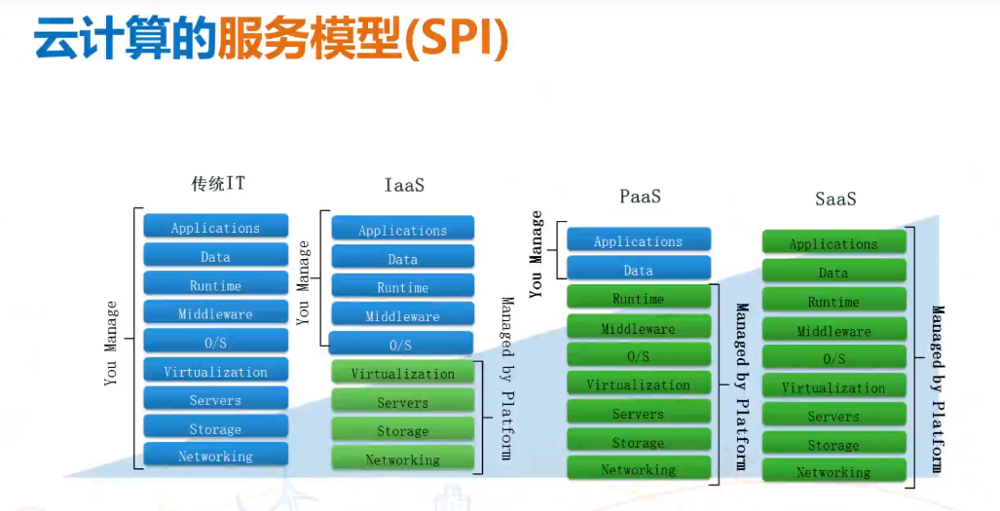
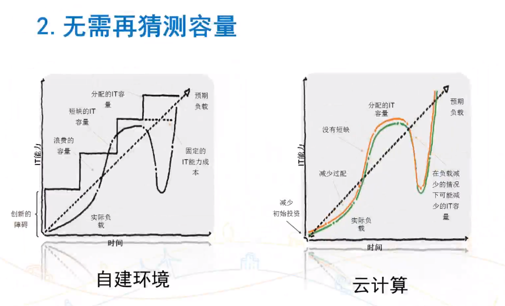
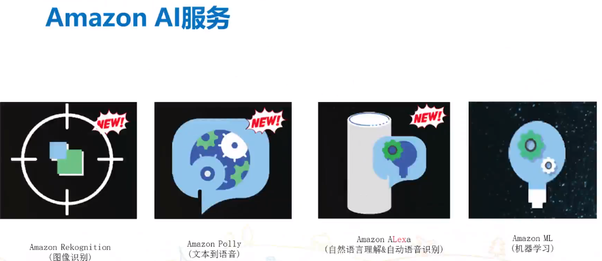
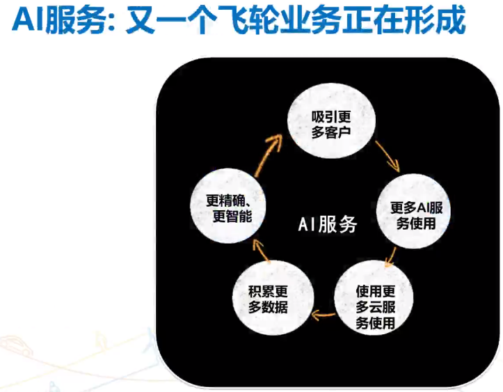

# 从AWS看云计算

## 1.	云计算产生的必然性
互联网带来的破坏性变革

Internet Map。 技术发展是指数级增长，现在大家看到的是冰山一角；

互联网的破坏性表现在：
1.	美国报纸的广告收入变化情况

互联网的广告模式，直接打击了传统的报纸广告，导致其收入出现断崖式的下降；最可能出现日子都过不下去的情况；

2.	互联网对零售的影响

在美国关闭的实体店数量变化图，越累越多的实体店大量关闭；

互联网带来的挑战

互联网业务的本质是大流量，大客户；海量数据，

Nosql越来越重要的原因是传统数据库对大量数据的处理已经不灵光了；
传统的scale up的方式对于互联网来说也搞不定。

### 1.1.1 怎么才能做到呢？

更强大的服务器？

“合久必分，分久必合”

大型机，体积大，也很贵，很多IT应用一台大机就搞定了；

小机时代，一个项目就采购一批机器；带来的问题， 是IT运维的难度增加；

现在的变化，硬件资源更加异构了；上层不仅有虚拟机的变化，还有容器的变化；
这个云平台会更加复杂；

云计算目标

1.	集中供应
2.	Pay-as-you-go

公有云有哪些不好的地方？好去分析，也要求理解

比如最开始的时候大家也不习惯把钱存到银行；互联网金融对的时候，选择货到付款的人很多；凡事都有一个接受的过程。改变传统思维。

计算模式每个十几年都会发生一次变革：

1964 IBM大型机

1981年IBM的PC机（他把最重要的两个事情外包给别人了，cpu外包给了Intel，操作系统外包给了微软，外包要小心）

### 1.1.2 云计算发展的必然性

Model T的生产线模式极大的提升了汽车的生产效率，几分钟一辆车（在此之前470小时一辆车），在此之前，老百姓是买不起车的。

什么东西容易赚钱？质量好，老百姓还要喜欢。

特斯拉的自动化生产；在规模化的基础上进一步提升了生产效率

云计算本质上就是自动化和规模化在IT行业的服务化体现。

有人规模比你大，它的成本就会比你低。

云做的好的，没有一个是做硬件的；做硬件的做不成云，根本原因是他们的软件不行，导致自动化不行。

我们做IT的人，一定要改变人肉运维的现状。人应该通过运维来控制机器，通过软件来指挥机器。

规律决定了必然性，实现取决于技术

老牌IT企业感到生存压力的转折点 – 2015年

当一个市场没有growth的时候，企业应收不能实现增长的时候，企业就会感到经营压力。

客户的支出，开销方向发生了转移，并且肯定是更有效率了；

思考： 为什么叫云计算？

互联网长什么样子？没有人见过。云计算也是，你不用知道它长什么样子？只要知道怎么使用它，消费它就可以了；

资源只有集中了之后才能按需分出去。

五大要素有什么用？可以用来判断服务是不是云服务？那这个标准去匹配。

云计算的服务模型（SPI）

其实SPI也没什么特别的，云时代的硬件是可编程的硬件，可编程的基础设施。

有了SaaS，为啥还有去玩IaaS？SPI的兼容性不同

自动化程度越高，你能做的事情越少，灵活度越低；

微软云计算犯的错误
1.	从PaaS入手，而AWS从IaaS入手
为什么？用户在接纳新技术的时候是有接受度考量的。
2.	另外再挖掘

云计算的主要部署模型：

每个云都需要自己的特点，这个很重要。

IT环境需要打通。

### 1.1.3 用户为什么要采用云计算？
1.	可以可变费用OPEX代替CAPEX，

2.	无需猜测容量（粒度小一点，根据需求变）

3.	大不读提高速度与敏捷性

4.	停止在无差异化的工作上花费精力

5.	数分钟之内完成全球化部署

6.	更低的运营成本

一个游戏厂商，挖了一个微软的人来构建自己的数据中心（1亿美金）， 两年以后就放弃了，即使规模很大；复杂度带来的成本更高了；并且不是该公司主营业务。
7.	增加创新：更快的尝试并且低成本，低风险

### 1.1.4 云对企业IT的影响：

无论你喜欢还是不喜欢，公有云还是会代替私有云。
更多的应用会基于公有云来构建。

## 1.2.  AWS的整体服务概览
如何从online Bookstore变成云服务商？

2000年以后com公司走下坡路。 B2C业务非常困难。业务需要创新。

11年的商业化服务

AWS的愿景

IaaS目标： 可编程的基础设施。

AWS云服务分类：

云服务接入方式： CLI， API， Web Console（portal）

区域与边缘： AWS的边缘站点主要是放置CDN，DNS的

区域与可用区：可用区是保证不同数据中心隔离，相邻的数据中心也可组建为可用区

AWS核心基础设施服务：

- 计算服务

- 网络服务

- 存储服务

- 数据库服务

- 大数据服务

- 应用服务

- 部署管理服务

## 1.3. AWS如何构建服务

从客户开始“反向工程”（work backward from customer）

为什么AWS服务的创新速度增长越来越快？

亚马逊的开发演变（2001-2009）

Jeff Bezos的强制命令（2002）

AWS如何构建服务（乐高的方式lego）

例子： 联络中心服务（Amazon Connect)

支持Amazon Connect的基础服务

Two Pizza团队的由来

康威定律

要产品团队不要项目团队

产品团队： You build it, you run it

打通Devops全生命周期

对DEV来说，事情会更有挑战

# 1.4. AWS是如何推广和销售云服务的

云服务能云计算客户做什么呢？

这里说的也是AWS去大市场的引导点，分别面对不同的客户群，对云计算接受程度不一样的客户群。

- 方式1： 利用云计算来做开发和测试

- 方式2：针对云构建新应用

- 方式3：通过云来扩展现有环境和应用能力

- 方式4：集成已有系统的新云计算应用

- 方式5：把已有的应用迁移到云

- 方式6：全面转向云计算（All In）

云计算的计费方式：

例子：

利用全部三种实例：

为什么公有云业务是个好业务

AWS的销售服务体系：

AWS市场活动分类

针对创业企业的推广项目

AWS应用市场-marketplace

AWS的生态系统

AWS的认证路径图：

## 1.5. 云服务的下一步发展方向和重点

- 软件服务的SaaS化

- 微服务架构

微服务化：服务接口标准化，单一模块设计独立上线；

为什么引入容器

要设计自己的key app

AWS的AI服务

容器： 对运维团队更高效的运维系统，粒度更小，弹性更好；

谷歌做云计算已经处于落后状态，它希望通过k8s把容器的生态做起来；容器对底层平台的耦合度降低了。谷歌通过搜索把web应用给你做起来了

- Serverless架构：

无服务器架构；代码只有在触发的情况下才收费；是事件驱动的机制；主要是针对IoT场景（有大量事件驱动的业务）

API Gateway是给客户用的，客户可以注册一个api，变成一个事件，可以触发后台的动作。（function）
- 边缘计算和雾计算

Amazon Echo

AWS的平台化思路

通过价格杠杆来鼓励用户使用Echo

Amazon AI服务

AI服务： 有一个飞轮业务正在形成

6. 要点回顾

