# 1. CICD测试

## 1.1 Cloud Test

随着云扩容需求激增，通常的验收测试效率已经不能满足诉求，继续打通从研发到生产环境的自动化能力共享通道，在研发区能直接部署现网自动化，利用自动化进行扩容局点的验收测试。 
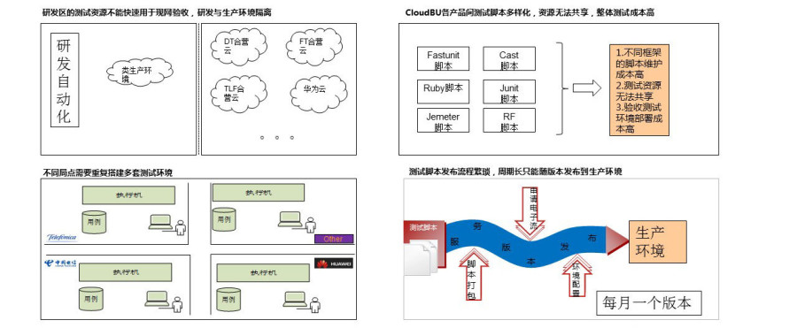
- 基于APITest，测试框架归一化、测试环境标准化，不同局点复用测试环境及脚本，实现资源最大化利用: 
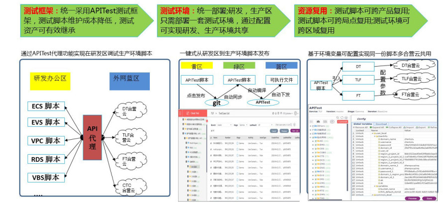
- 实践DNA2-突破内外网隔离： 
基于APITest跨区域融合测试方案，打通研发内外网测试工具协同通道，构建短平快测试能力，基于任务环境变量可配置方式实现单个用例在多个服务、多个局点零成本在线复用，已在华为云、TLF合营云验收测试使用，验收测试周期由15天缩短至7天，效率提升1倍，实现类生产与生产环境秒级切换
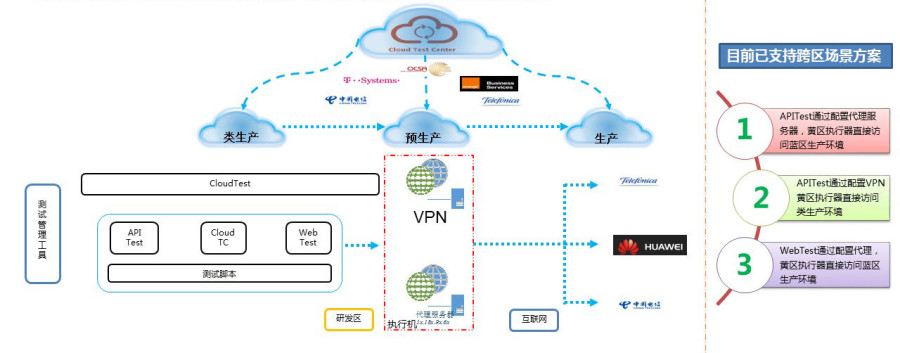
- 实践DNA3-备案网络跨区访问场景： 
复用测试脚本和执行器，需跨网络区域访问，涉及信息安全风险，通过设计具体跨网络区域访问场景，并在产品线信息安全部门进行评审备案，扫清信息安全障碍.
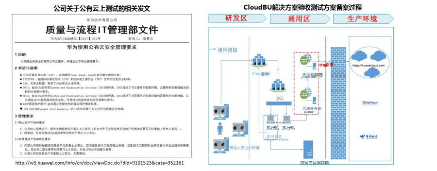
- 落地效果- 基于APITest实现验收测试框架统一化，测试环境标准化，成本降低3倍，实现25个服务325个验收测试用例自动化，在验收测试中，验收测试周期由15天缩短至7天，效率提升1倍； 
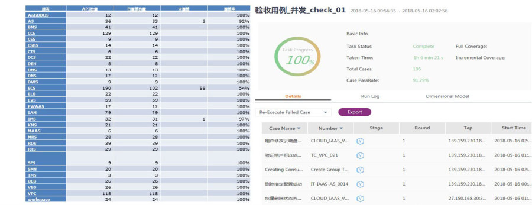
- 落地效果（优秀DNA复制）—媒体云服务基于APITest实现3个服务434个OpenAPI接口测试用例自动化，通过配置VPN方案直接对蓝区公有云类生产环境进行接口验收看护，提升验收测试效率XX倍。 
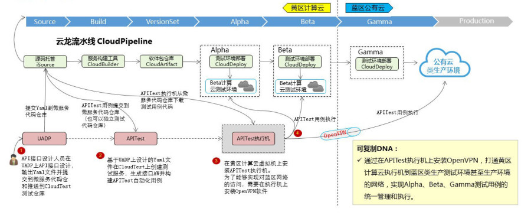

## 1.2 灰度自动化验证（基于OnTest）

### 1.2.1 背景

灰度发布是指在黑与白之间，能够平滑过渡的一种发布方式，可以保证整体系统的稳定，在初始灰度的时候发现、调整问题，以保证其影响度。简单理解是对某一产品先让小部分用户使用，观察这小部分用户使用的效果，如果效果不佳则进行版本回退，否则逐步扩大使用群体范围，最后到全网发布。

如何获知灰度发布效果，如何评估灰度时间？华为终端支付灰度时长为3天，3天的灰度覆盖了多少场景，是否覆盖了本次版本修改的逻辑，灰度3天时间是否合理， OnTester灰度测试工具可以为确定灰度时间和策略提供数据信息。

### 1.2.2 OnTester灰度测试工具作用

1. 对灰度机器的所有请求进行精准校验，帮助挖掘版本问题：OnTester灰度测试工具不同于传统监控工具统计各种错误码信息，灰度测试工具验证灰度过程中的所有请求，实时展示所有请求的验证结果，对有问题的请求立刻返回failed，帮助用户及时发现版本问题。

2.  对于异常请求结果进行实时定位，缩短问题定位时间：运行结果详情页展示用例运行详细信息、原始请求，用户通过详情信息获取用例的failed或unmatched原因。

3.统计接口的各种场景分支的覆盖请求数、占比和请求验证情况，缩短灰度时间：工具统计灰度任务的所有请求覆盖情况，用户可以从页面中获取本次灰度是否覆盖了所有重要场景，获取关注的场景分支（如本次版本代码修改影响的场景分支）的覆盖情况，根据覆盖率和验证结果决策是否可以结束灰度阶段发布现网。

### 1.2.3 OnTester灰度测试工具原理

工具共有几大服务组成：design、run、DB查询服务、入库服务、请求收集插件。

1. 请求收集：请求收集插件支持基于tomcat容器的http/https请求、基于dubbo框架rpc请求。请求收集插件收集被测服务请求，并将请求发送给请求入库服务，入库服务将请求存入mongodb。

2. 用例设计：design将用户配置收敛字段将请求收敛成多个场景，保存在场景表，将用户根据场景生成的用例保存在用例表，将用例的检查点保存在数据库的检查点表。

3. 灰度发布任务调度：run根据任务配置的接口，通过代理请求DB查询服务，获取对应接口的原始请求，将请求匹配对应用例，执行用例的检查点进行校验，并将结果保存；并实时对灰度数据进行统计分析。
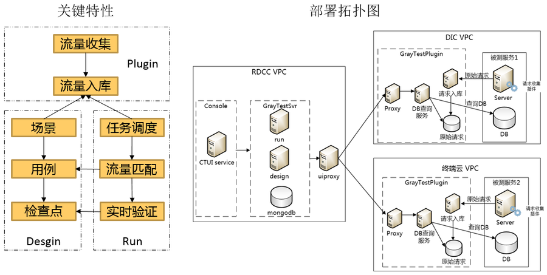

### 1.2.4 实践成效

华为支付V3.14.6.101版本应用了灰度测试工具，对首次两省级第一次灰度测试数据测试验证和统计分析。两省级灰度时长为72小时，OnTester灰度测试共覆盖11个接口521,803条原始请求。分析各接口及其测试用例，按用例出现次数加权覆盖比，灰度4小时内，6个接口100%覆盖，3个接口覆盖率>99%，2个接口覆盖率>97.9%，总覆盖比例高达99.60%。

### 1.2.5 详情

1. 在任务运行中，工具实时统计验证请求数、每个接口Passed、Failed、Unmatched次数，以及接口通过率。

2. 在任务运行中，工具统计各个接口的场景用例验证情况，及用例覆盖情况。如某接口13个用例，请求历史验证覆盖了6个场景用例，当前任务覆盖了4个场景，低于历时记录，ST错误场景明显增加。

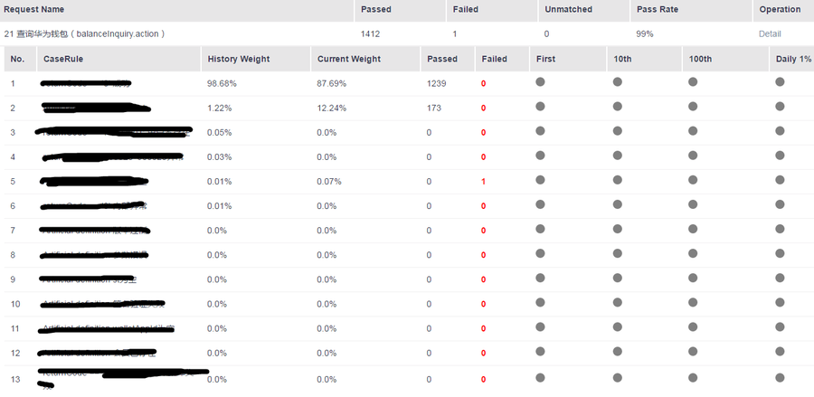

3. 在任务运行中，工具展示所有请求的验证结果，并对异常结果展示了产生原因，并展示原始请求信息，为用 户初步定位提供便捷。如该用例验证failed，failed原因是检查点配置错误。签名错误有可能是签名不对，也有可能是签名为空，但检查点只配置了签名为空的情况。

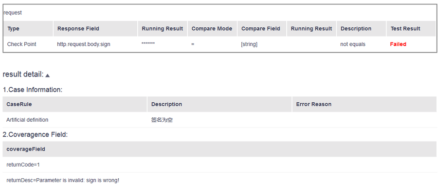

### 1.2.3 OnTest扩展阅读
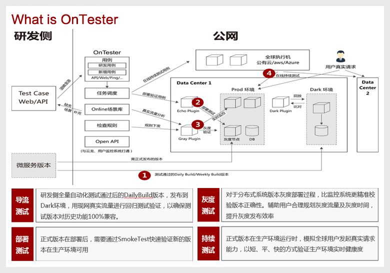
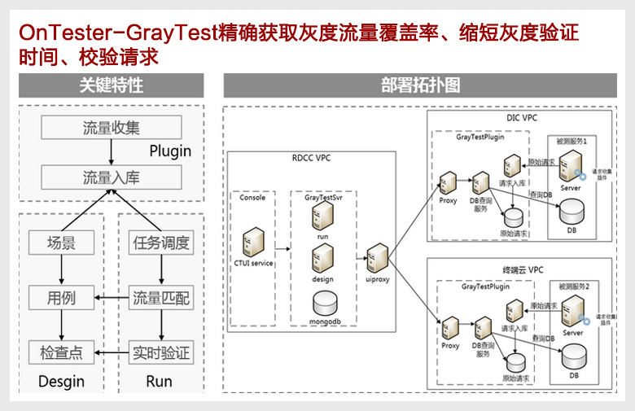
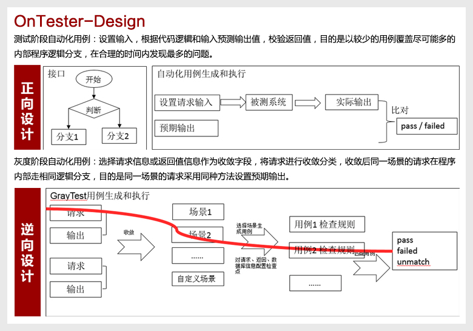
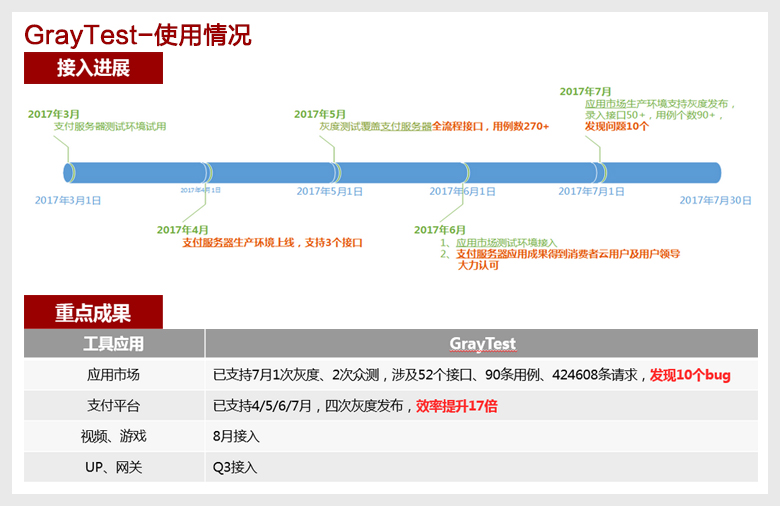
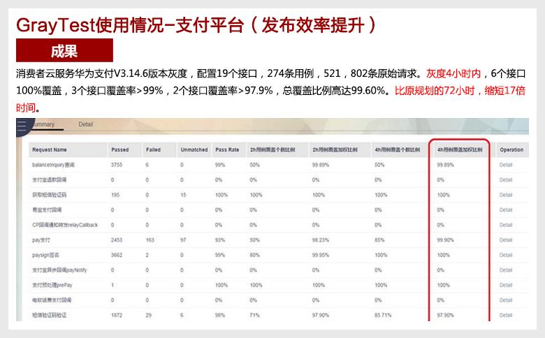
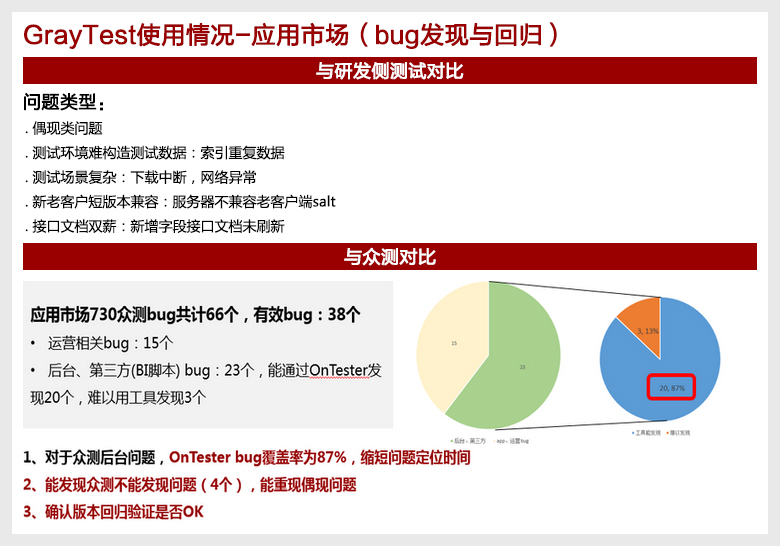
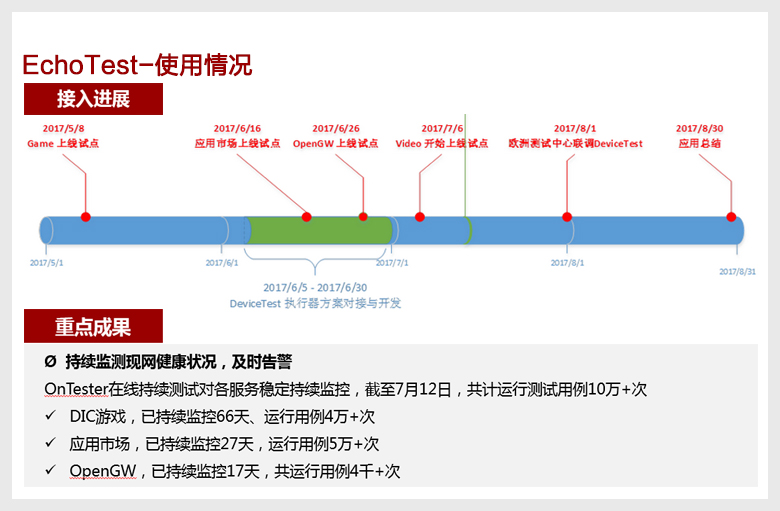
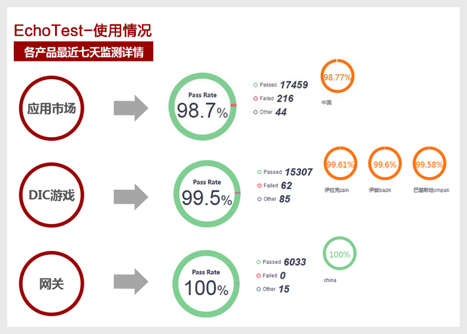

## 1.3 APItest：

### 1.3.1 特性

1. 接口用例自动生成：突破接口描述文档自动生成接口测试用例关键能力，无需手工编辑，通过内置参数自动筛选和对偶、全组合等策略算法自动生成接口测试用例。

2. AW自动生成与共享：突破接口描述文档自动生成AW关键能力，同时实现跨服务、跨测试阶段的公共AW平台级共享能力，减少重复AW开发，提高协作效率，进而支撑服务级及解决方案级用例快速写作。

3. 测试逻辑与测试数据分离，自动生成覆盖用例：通过对偶、全组合等算法，根据测试逻辑配备测试规则自动生成测试数据，进而自动生成全覆盖用例，大大缩减用例写作时间。

4. 自动化用例脚本表格化交互式开发与高效管理：通过表格化编辑用例，交互友好，入门简单，无需编码，便于快速上手；实现用例本文和脚本信息的一体化管理，为用例的后期维护和管理带来很大方便。

5. 分布式环境下的高并发用例执行：采用Docker容器技术，实现各类常见执行机镜像的分布式部署与极速启动，通过对测试用例的高并发调度执行，极大缩减了全量用例回归执行周期。

6. 用例脚本快速调试：创设Debug用例调试模式，用户可绕开传统工厂调度模式，快速调试测试用例，进而快速定位问题根源，极大提高脚本开发效率。

### 1.3.2 经验要点

 利用APITest工具，成功攻克了微服务测试的版本快速验证、质量快速反馈、过程便捷管理“三座大山”。

 一站式全流程AW/用例自动化生成与一体化管理为实现版本快速验证构建核心能力。IT公有云VBS服务的接口一般较为复杂，如果通过大量的手工编辑，AW和用例脚本的编写极易出错且测试效率很低。**将接口文档按规范编写成yaml文档，APITest即可实时将其自动转化为AW并生成自动化用例**，针对复杂场景可通过界面上的简单拖拽交互式生成自动化用例，有效降低了自动化脚本开发的门槛，极大提升了AW和用例脚本的开发效率和准确率。同时，APITest对AW、文本用例、脚本用例一体化管理，为各类AW、用例、测试套的维护和复用带来了极大的便利。
 
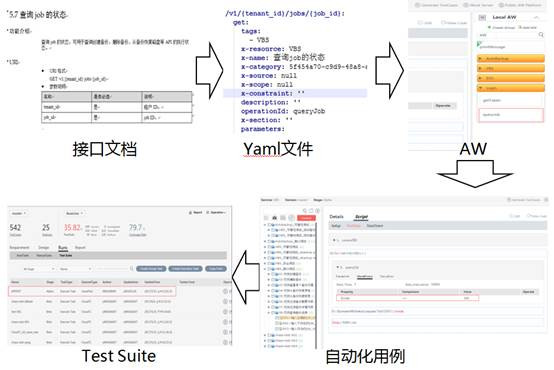
 
高效的全自动化用例执行机制为实现质量快速反馈奠定关键基础。APITest提供全自动化快速用例执行能力，VBS测试团队根据开发测试需求，挑选自动化用例形成测试任务（TestSuite），一键提交APITest后台执行，实现分钟级别的接口功能全量验证
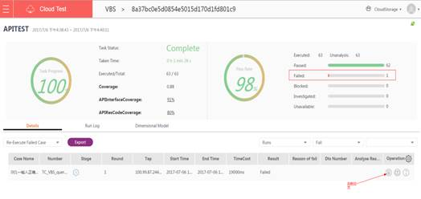
 
便捷的任务执行看板与日志管理等功能为实现过程便捷管理提供重要支撑。APITest的任务执行看板使各测试用例的执行结果、执行时间、覆盖率等关键信息一览无余；日志管理模块将测试执行日志以树形结构组织，通过展开指定树节点，可快速定位到具体接口具体步骤的问题，以便进行快速修改。
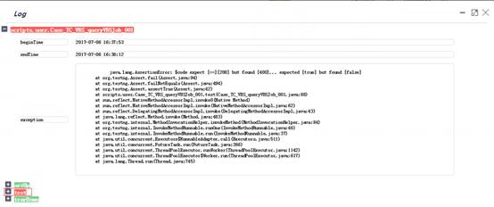
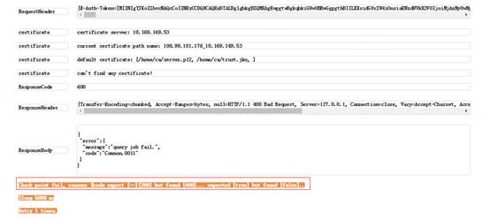

