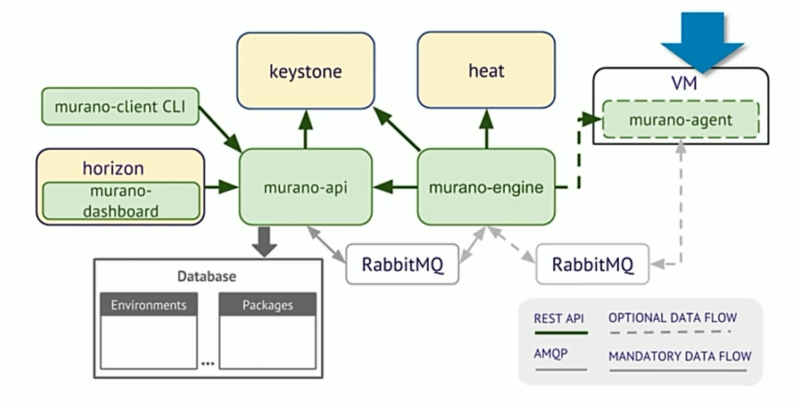
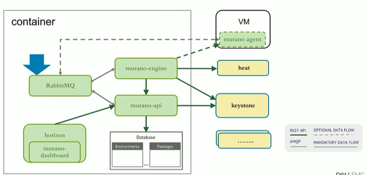
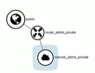
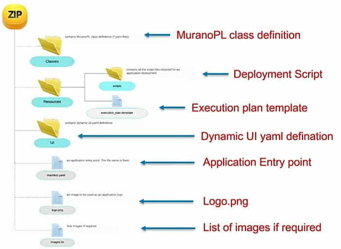
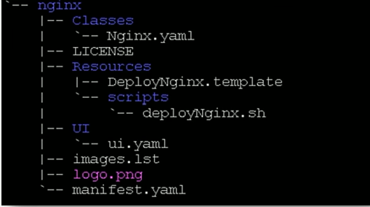
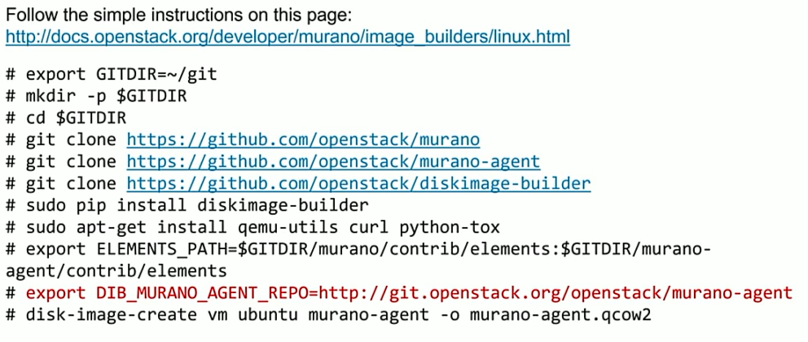
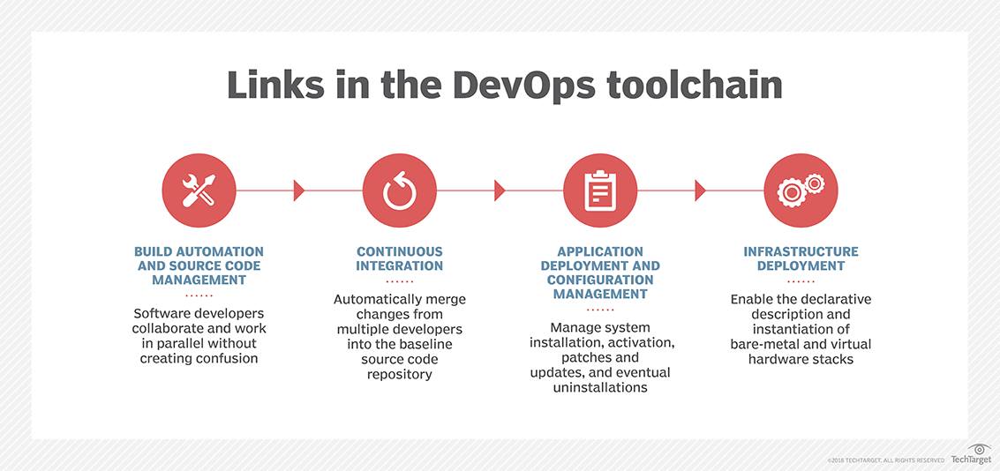

# 1. Maruno入门
## 1.1 简介及理解

Challenges：
- Many steps to follow
  - Non-trivial for those just want to explore Murano features ASAP
- Conflicting/incompatible packages
  - Native package management vs python pip
  - Modify requirements.txt to specify versions of some packages on ubunt
- Configurations can be tricky/subtle
  - Local MySQL
  - Local RabbitMQ
  - Keystone
  - Existing Openstack RabbitMQ
  - Insecure & SSL
  - Murano API, engine, service endpoint
  - Murano dashboard in Horizon

## 1.2 如何提升？
Docker是最佳选择。

Goal:
- Stand-up Murano against existing Openstack with mininal effort
- Serve as a springboard for further customization or deployment in production
Advantages with Docker images and containers
- Isolate dependencies to minimize potential conflicts between various packages
- Automate the configurations between various components
- Etched in stone a working combination of various packages

样例：

前提要求：

docker-engine
Openstack Environment
Neutron Network with internet access
User with heat_stack_owner role

样例代码获取：

https://github.com/hldnova/murano-helloworld.git

## 1.3 Murano服务目录介绍
1. 如何部署一个App
- Create Murano application package
- Import application into Openstack
- Deploy application into environment

2. Murano application package

3. Create image with murano-agent

## 1.X 附录
1. 手表的故事

A father before he died said to his son: “This is a watch your grandfather gave me, and it’s more than 200 years old. But before I give it to you, go to the watch shop on the first street, and tell him I want to sell it, and see how much he offers you.“
He went, and then came back to his father, and said, “The watchmaker offered $5 because it’s old.“ He said to him: “Go to the coffee shop.“ He went and then came back, and said: “He offered $5 father.“
“Go to the museum and show them that watch.“ He went then came back, and said to his father “They offered me $1 million for this piece.“
The father said: “I wanted to let you know that the right place values you in the right way. Don’t find yourself in the wrong place and get angry if you’re not valued. Those that know your value are those who appreciate you, don’t stay in a place where nobody sees your value.“

2. CICD每日阅读
CI/CD的本质是构建一个生产线（或者叫做管道，pipeline），连接一些列的开发和测试工具，及流程，以自动化的方式部署代码。
CI/CD comprises a pipeline connecting a sequence of development and testing tools and processes to deploy code in an automated fashion

连续的软件交付（CSD）管道允许现代软件开发团队将想法转变为软件和驱动参与与客户，供应商和员工。它依赖于互锁工具的自动化管道，这些工具可协调从阶段性环境到生产的软件的规划，设计，构建，测试和部署。   
A continuous software delivery (CSD) pipeline allows modern software teams to turn ideas into software and drive engagement with customers, suppliers and employees

它依赖于互锁工具的自动化管道，这些工具可协调从阶段性环境到生产的软件的规划，设计，构建，测试和部署。   
It relies on automated pipelines of interlocking tools that orchestrate the planning, design, build, test and deployment of software from staged environments to production.

将软件开发和部署过程分为几个阶段，可以帮助开发人员快速获得反馈。CI是管道的第一阶段， 奠定了持续交付和持续部署阶段的基础。
Breaking down the software development and deployment process into a set of stages helps developers get feedback quickly. CI is the first stage of the pipeline , laying the foundation for continuous delivery and continuous deployment stages.

成功的CI是一个分支，可帮助单个软件开发人员频繁（或每天）对应用程序进行新代码更改，并将这些更改集成到共享存储库中，而不会破坏或冲突应用程序的现有代码。
Successful CI is a branch that helps individual software developers to make new code changes frequently (or on a daily basis) to the app and integrate those changes into a shared repository without breaking or conflicting the existing code of the application,

